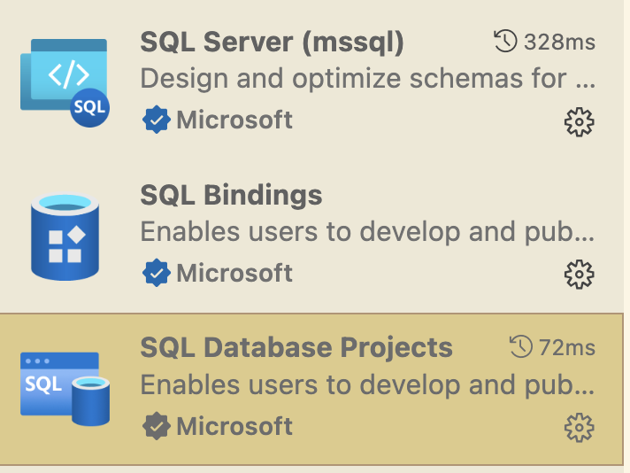
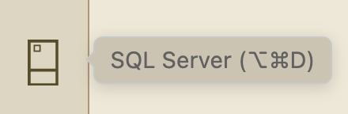
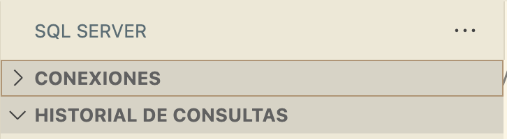
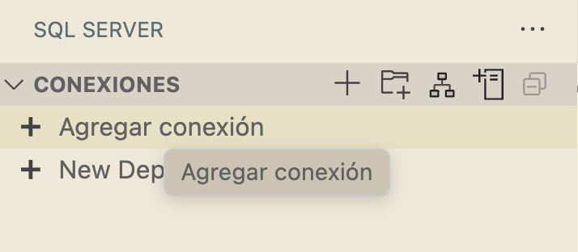
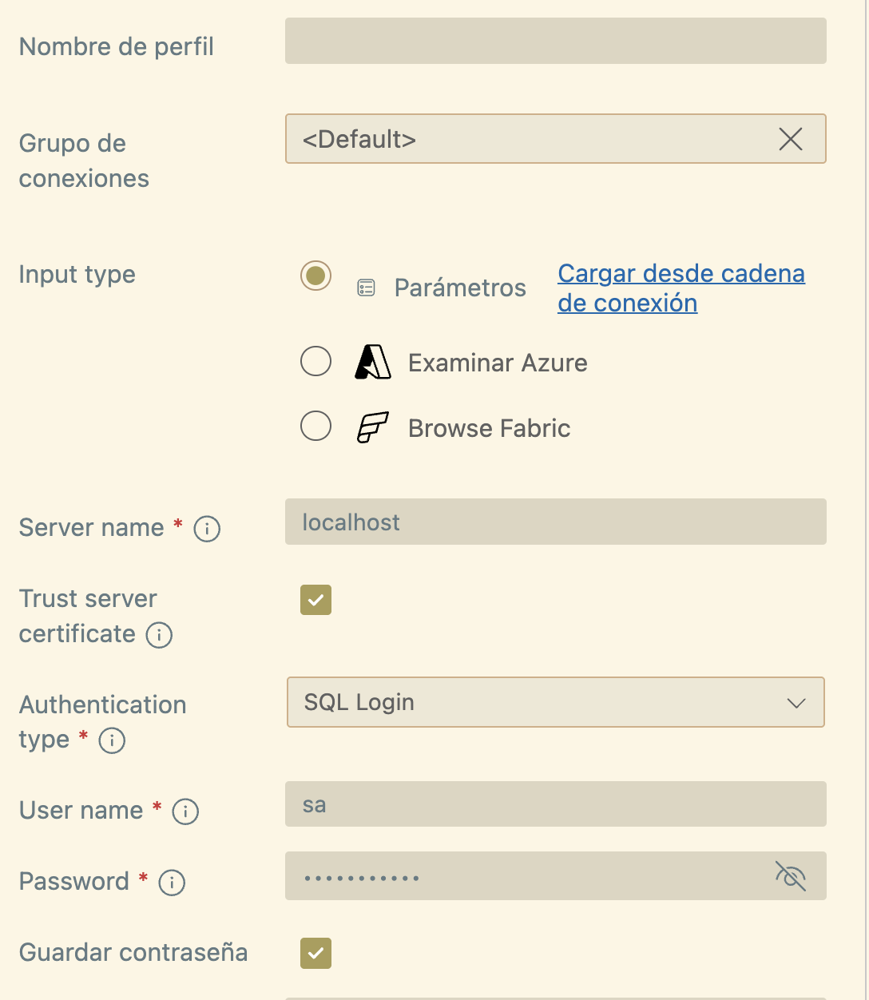
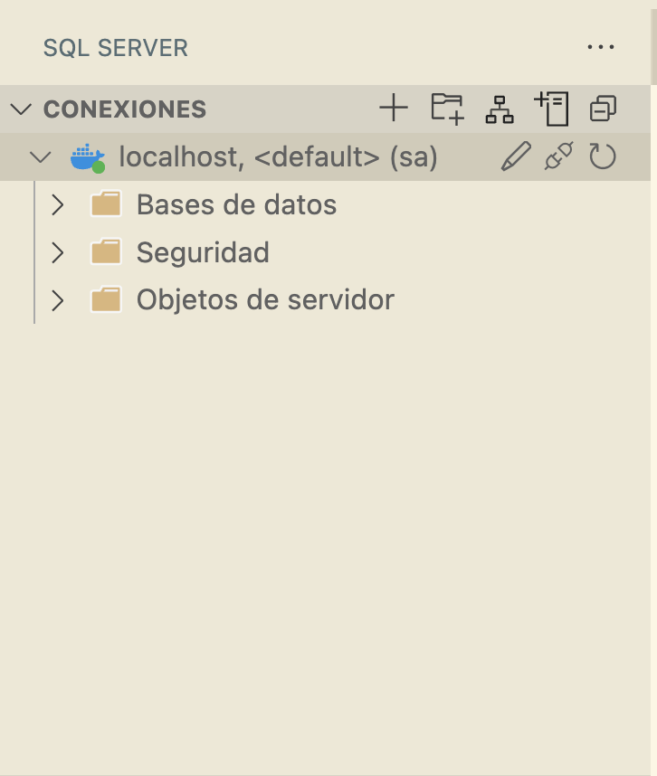
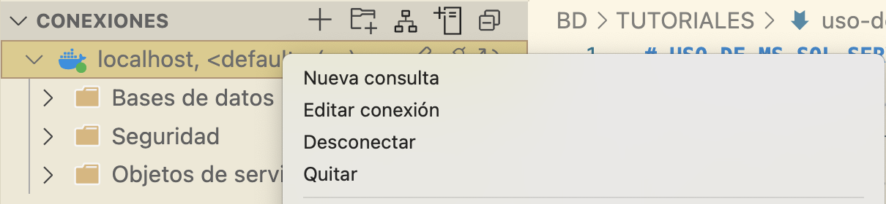
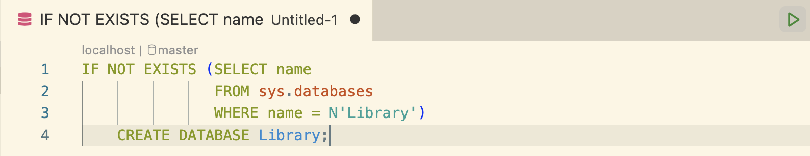
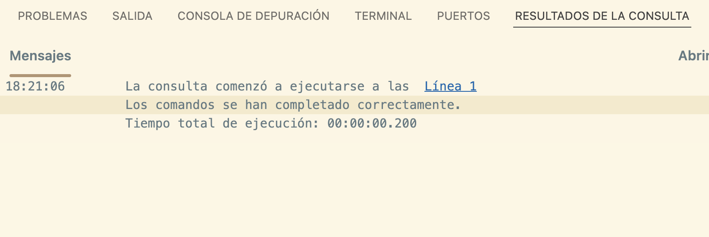
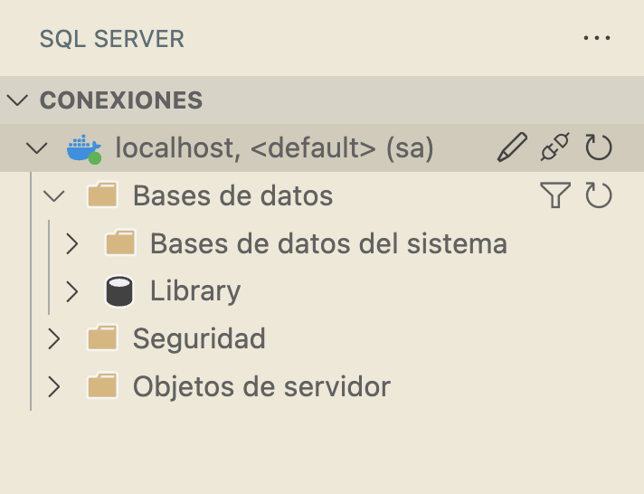

# USO DE MS SQL SERVER EN MAC A TRAVÉS DE DOCKER

## 1. Instalación de Docker

Instala Docker Desktop desde su página oficial. Docker es el software de contenerización para poder trabajar con MS SQL Server sin instalarlo y Docker Desktop la interfaz gráfica. 

Para instalar Docker Desktop, necesitas permisos de usuario y, además, tener WSL2 (el propio instalador de Docker te invita a ello). Una vez instalado, ejecútalo. Esto hará que, de fondo, esté funcionando el proceso `Docker Engine`, que nos permite ejecutar comandos Docker desde cualquier terminal (incluida, por supuesto, la que tiene Docker Desktop integrada). A continuación, [seguiremos las instrucciones de esta página web](https://www-devart-com.translate.goog/dbforge/sql/studio/install-sql-server-on-mac.html?_x_tr_sl=en&_x_tr_tl=es&_x_tr_hl=es&_x_tr_pto=tc) para configurar el entorno. Ejecuta el siguiente comando para descargar la imagen de ms sql server:
```bash
sudo docker pull mcr.microsoft.com/mssql/server:2022-latest
```
Y, una vez se haya bajado, ejecutamos la siguiente línea (técnicamente la única necesaria):
```bash
docker run -d --name SQL_Server_Docker -e 'ACCEPT_EULA=Y' -e 'SA_PASSWORD=DB_Password' -p 1433:1433 mcr.microsoft.com/mssql/server:2022-latest
```
Este comando consta de los siguientes parámetros:

- `-d` lanza su contenedor Docker en modo *detached*, lo que le permite ejecutarse en segundo plano, sin necesidad de mantener abierta la ventana de Terminal.

- `--name` especifica el nombre del contenedor Docker. En nuestro ejemplo, el nombre es `SQL_Server_Docker`.
- `-e 'ACEPTAR_CLUF=Y` confirma que acepta el EULA (Acuerdo de licencia de usuario final) de Docker.
- `-e 'SA_PASSWORD=DB_Password'` establece la contraseña de la base de datos. En nuestro ejemplo, la contraseña es DB_Password.
- `-p1433:1433` asigna su contenedor Docker al puerto local 1433. **Es el puerto que usaremos para la conexión**.
- `mcr.microsoft.com/mssql/server:2022-latest` selecciona un archivo de imagen para que Docker lo use.

Una vez hecho esto, SQL Server debería estar ejecutándose en tu Mac. Para asegurarte de ello, puedes verificar el estado de tu contenedor Docker de SQL Server con el siguiente comando.

```bash
docker ps -a
```

Además, podemos comprobar que lo tenemos en Docker Desktop.

Una vez que esté corriendo, podemos conectarnos al contenedor a través del puerto `1433` y la contraseña que hayamos definido (en el ejemplo, `DB_Password`). Podemos descargar las siguientes extensiones de VS CODE para poder realizar las conexiones y las queries desde el editor:



## 2. Conexión al contenedor de Docker a través de VS CODE

Para conectarnos a la base de datos, tenemos que lanzar el contenedor y asegurarnos de que esté corriendo. Una vez lanzado, tenemos que crear una nueva conexión o usar una que hayamos creado anteriormente. Seguiremos [las instrucciones que la propia Microsoft facilita para tal efecto en esta página web](https://learn.microsoft.com/es-es/sql/tools/visual-studio-code-extensions/mssql/connect-database-visual-studio-code?view=sql-server-ver17). Para crear una nueva conexión, empleamos la extensión SQL Server de VS CODE.




Desplegamos el apartado de conexiones y le damos a `Agregar conexión`:


El usuario que emplearemos es `sa` y el nombre del servidor es `localhost`. Completa los datos como en esta captura:



Una vez establecida la conexión, debería aparecer algo así:



Ahora, vamos a probar la conexión creando una base de datos denominada Library.

1) **Abre un nuevo editor de consultas:** presiona Ctrl+N para abrir un nuevo editor de consultas o haz clic con el botón derecho en el servidor y selecciona **Nueva consulta**


2) Crea la base de datos pegando el fragmento de código siguiente en el editor de consultas y seleccionando **Ejecutar**:

```sql
IF NOT EXISTS (SELECT name
               FROM sys.databases
               WHERE name = N'Library')
    CREATE DATABASE Library;
```




Y podemos comprobar que está en el apartado de conexiones:

