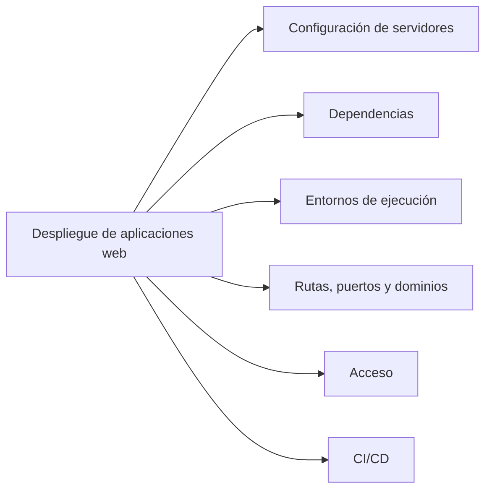
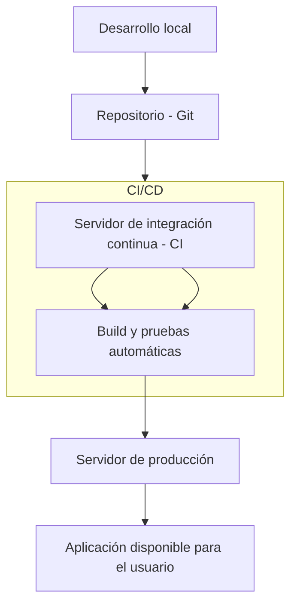

# Arquitecturas web

> **Criterios de evaluación:** 1a, 1b, 1h

## 1. Despliegue de aplicaciones web

### 1.1. Definición de "Despliegue de aplicaciones web"

El **despliegue de una aplicación web** consiste en el conjunto de tareas necesarias para que una aplicación desarrollada pueda ponerse en funcionamiento en un entorno real, accesible a través de la red (generalmente Internet o una intranet).

Consiste en preparar correctamente todos los componentes de la aplicación para que esta funcione tal y como se espera en la fase de producción. Esto incluye las siguientes tareas:

- Configuración de servidores web, de aplicaciones, de archivos y de bases de datos
- Instalación de las dependencias necesarias
- Establecimiento de los entornos de ejecución
- Configuración de rutas, puertos y dominios
- Confirmación del acceso correcto (HTTPS, firewalls, roles de usuario, etc.)
- Automatización de procesos de integración continua y despliegue continuo (CI/CD)



### 1.2 Fases comunes en un proceso de despliegue

Aunque varía según la tecnología y complejidad de la aplicación, el proceso suele incluir:

1. **Preparación del entorno de producción**

   * Elección del sistema operativo y configuración básica del servidor.
   * Instalación de software necesario (por ejemplo: Apache, Nginx, Tomcat, PHP, Java, Node.js, bases de datos).

2. **Transferencia de archivos**

   * Subida del código fuente y recursos mediante FTP/SFTP, Git o herramientas de automatización.

3. **Instalación de dependencias**

   * Uso de gestores como `composer`, `npm`, `pip`, `maven` o `gradle` para instalar librerías requeridas.

4. **Configuración del servidor**

   * Virtual hosts, puertos, certificados SSL, variables de entorno.

5. **Puesta en marcha y pruebas**

   * Lanzamiento de la aplicación.
   * Verificación del correcto funcionamiento en producción.

6. **Automatización (CI/CD)**

   * Uso de herramientas como GitHub Actions, GitLab CI, Jenkins, etc. para automatizar el despliegue tras cada cambio o versión.


## 1.3 Finalidad del despliegue

La finalidad de desplegar una aplicación web es hacerla accesible al público objetivo de la misma. Asimismo, su implementación garantiza la optimización del rendimiento, la seguridad y la eficiencia, así como el mantenimiento, la monitorización y la escalabilidad del sistema en un futuro. Es decir, el despliegue de una aplicación web convierte una aplicación en desarrollo en sistema funcional, público y operativo.

## 1.4 Pautas de despliegue en diferentes entornos

### Aplicación PHP en Apache (LAMP)

* Desarrollo local con XAMPP o MAMP.
* Subida al servidor web mediante FTP.
* Configuración de Apache (`VirtualHost`) y PHP.
* Base de datos MySQL importada desde archivo `.sql`.
* El sitio queda accesible desde un dominio o IP.

### Aplicación Java con Spring Boot en Tomcat

* Desarrollo en IntelliJ o Eclipse.
* Empaquetado como `.war` o `.jar`.
* Despliegue en un servidor Tomcat.
* Configuración de base de datos (PostgreSQL, MySQL).
* Uso de `application.properties` para definir rutas, puertos, credenciales, etc.

### Aplicación SPA (Single Page Application)

Una SPA es una aplicación web que interactúa con el usuario de forma dinámica, reescribiendo el contenido de la página con información procedente del servidor, en lugar de recargar la página completa. De esta forma, la aplicación web es más fluida y su comportamiento se asemeja más al de una aplicación de escritorio.

En una SPA, nunca se recarga la página, sino que el contenido se reescribe de forma asíncrona. Hay una gran cantidad de frameworks, como Angular o Vue.js, que tienen este enfoque.

* Frontend en React (SPA) desplegado en Netlify o Vercel.
* Backend (API REST en Node.js o Django) desplegado en un VPS o contenedor Docker.
* Comunicación entre capas mediante fetch/Axios.
* Configuración de variables de entorno y seguridad CORS.

## 1.5 Repercusión del despliegue

El proceso de despliegue no solo marca el final del desarrollo, sino el **inicio de la operación real** de una aplicación. Su correcta ejecución tiene impacto directo en:

* **La disponibilidad del servicio**
* **La experiencia de usuario (UX)**
* **La seguridad de los datos**
* **La capacidad de mantenimiento y actualización**
* **El posicionamiento del proyecto frente a usuarios o clientes**

Errores en el despliegue pueden generar fallos graves en producción, caídas del servicio, fugas de información o pérdida de usuarios.



## 2. Protocolos

### 2.1. Modelo TCP/IP

El modelo TCP/IP es un conjunto de protocolos que permiten la comunicación entre los ordenadores pertenecientes a una red. La sigla TCP/IP significa Protocolo de control de transmisión/Protocolo de Internet. Proviene de los nombres de dos protocolos importantes incluidos en el conjunto TCP/IP, es decir, del protocolo TCP y del protocolo IP.

```mermaid
flowchart TD
C1[Capa 1 de acceso al medio físico (Ethernet, dirección MAC)] --> C2[Capa 2 de Internet, enlace lógico (IP, ICMP)]
C2 --> C3[Capa 3 de transporte (TCP y UDP) ]
C3 --> C4[Capa 4 de aplicaciones (HTTP, HTTPS, FTP, etc..)]
```


#### 2.1.1. Protocolos de la Capa de Internet: IP

El protocolo **IP (Internet Protocol)** es la columna vertebral del modelo. Su función principal es el **direccionamiento** y el **enrutamiento** de los paquetes de datos. Cada dispositivo conectado a una red tiene una dirección IP única (como una dirección postal) que identifica su ubicación.

* **Direccionamiento:** El protocolo IP asigna una dirección lógica a cada dispositivo, permitiendo que los paquetes de datos sean enviados desde un origen a un destino específico.
* **Enrutamiento:** Los routers utilizan las direcciones IP para determinar la mejor ruta que debe seguir un paquete para llegar a su destino. Es un servicio "sin conexión", lo que significa que no establece una conexión persistente antes de enviar los datos; simplemente los envía y espera que lleguen.

##### Direcciones lógicas y físicas

###### Dirección lógica (Protocolo IP)

La **dirección IP** (Protocolo de Internet) es una dirección lógica utilizada para identificar de forma única a un dispositivo dentro de una red, como Internet. Es un identificador que no está fijo al hardware del dispositivo, sino que es asignado y puede cambiar. La dirección IP se utiliza para el **enrutamiento**, permitiendo que los paquetes de datos viajen a través de múltiples redes hasta llegar a su destino correcto. Los routers utilizan las direcciones IP para determinar la ruta óptima para un paquete. Un ejemplo de dirección IP es `192.168.1.1` (en IPv4) o `2001:0db8:85a3:0000:0000:8a2e:0370:7334` (en IPv6). El protocolo **ICMP** (Protocolo de mensajes de control de Internet) trabaja con IP para enviar mensajes de error y diagnóstico, como cuando un destino no puede ser alcanzado.

###### Dirección física (Protocolo Ethernet)

La **dirección MAC** (Media Access Control) es una dirección física que identifica de forma única la tarjeta de red (NIC) de un dispositivo. A diferencia de la dirección IP, la dirección MAC está grabada de fábrica en el hardware y no se puede modificar. Esta dirección se utiliza para la comunicación dentro de una **red local** (LAN), como la que se utiliza en el protocolo **Ethernet**. La dirección MAC asegura que los datos se entreguen al dispositivo correcto en una misma red. Un ejemplo de dirección MAC es `00:1A:2B:3C:4D:5E`.

###### Enlace entre dirección física y lógica a través de ARP

El protocolo **ARP** (Address Resolution Protocol) es el responsable de enlazar la dirección lógica (IP) con la dirección física (MAC). Cuando un dispositivo en una red necesita comunicarse con otro dispositivo utilizando su dirección IP, pero no conoce su dirección MAC, utiliza ARP para resolver esta información.

El proceso es el siguiente:
1.  Un dispositivo A quiere enviar un paquete a un dispositivo B con dirección IP conocida, pero desconoce su dirección MAC.
2.  El dispositivo A envía una **petición ARP** (conocida como *ARP request*) a toda la red local, preguntando: "¿Quién tiene la dirección IP `192.168.1.100`? Por favor, dime tu dirección MAC".
3.  El dispositivo B, que reconoce su dirección IP en la petición, responde con un **mensaje ARP de respuesta** (*ARP reply*), que contiene su dirección MAC.
4.  Una vez que el dispositivo A recibe esta respuesta, almacena la dirección IP y MAC en una **tabla de caché ARP** para futuras comunicaciones, evitando tener que repetir el proceso cada vez.


#### 2.1.2. Protocolos de la Capa de Transporte: TCP y UDP

Esta capa se encarga de la comunicación de extremo a extremo entre aplicaciones. Aquí se encuentran dos protocolos clave:

* **TCP (Transmission Control Protocol):** Es un protocolo **orientado a la conexión** y **confiable**. Antes de enviar los datos, TCP establece una conexión entre el origen y el destino. Garantiza que los paquetes lleguen en el orden correcto y sin errores. Si un paquete se pierde, TCP lo reenvía. Por esta razón, se utiliza para aplicaciones que requieren una alta fiabilidad, como la transferencia de archivos, el correo electrónico y las páginas web.

* **UDP (User Datagram Protocol):** Es un protocolo **sin conexión** y **no confiable**. UDP envía los paquetes de datos sin establecer una conexión previa ni verificar si llegan a su destino. Es más rápido que TCP porque no tiene la sobrecarga de la verificación y reenvío. Se usa en aplicaciones donde la velocidad es más importante que la fiabilidad, como la transmisión de video en tiempo real (streaming), los juegos en línea y las llamadas de voz sobre IP (VoIP).

* **Puertos y Sockets:** Los puertos y sockets son conceptos esenciales en esta capa.
    * Un **puerto** es un número que identifica una aplicación o un servicio específico en un dispositivo. Por ejemplo, el puerto 80 es para HTTP y el 443 para HTTPS. Esto permite que múltiples aplicaciones compartan la misma dirección IP sin que los datos se mezclen.
    * Un **socket** es una combinación de la dirección IP y el número de puerto. Es un punto de conexión único que identifica de forma precisa una aplicación en una red, facilitando la comunicación entre dos programas.

#### 2.1.3. Protocolos de la Capa de Aplicaciones: HTTP, HTTPS, FTP

Esta es la capa que interactúa directamente con el usuario y las aplicaciones. Los protocolos aquí definen las reglas para que las aplicaciones intercambien datos.

* **HTTP (Hypertext Transfer Protocol):** Es el protocolo para transferir documentos en la World Wide Web. Define la forma en que los navegadores web solicitan páginas y cómo los servidores responden. Es un protocolo sin estado, lo que significa que cada solicitud del cliente es independiente de las anteriores. Su puerto es el 80.

* **HTTPS (Hypertext Transfer Protocol Secure):** Es la versión segura de HTTP. Utiliza los protocolos **SSL/TLS** para encriptar la comunicación entre el navegador y el servidor. Esto asegura que la información (como contraseñas o datos de tarjetas de crédito) viaje de forma segura y no pueda ser interceptada o leída por terceros. Su puerto es el 443.

* **FTP (File Transfer Protocol):** Es el protocolo estándar para la transferencia de archivos entre un cliente y un servidor en una red. FTP permite a los usuarios subir, descargar, borrar y gestionar archivos en un servidor remoto. Es un protocolo antiguo pero todavía se usa en muchos escenarios de transferencia de archivos. Su puerto es el 21 para conexiones de control y el 20 para conexiones de datos.

## 3. Arquitecturas web

### 3.1. Backend, FrontEnd y FullStack

### 3.2. Aplicaciones Web

### 3.3. Aplicaciones API/REST

### 3.4. Aplicaciones monolíticas

### 3.5. Microservicios

## 4. Modelos

### 4.1. Modelo Vista Controlador - MVC

### 4.2. Arquitectura de microservicios

### 4.3. Arquitecturas limpias

