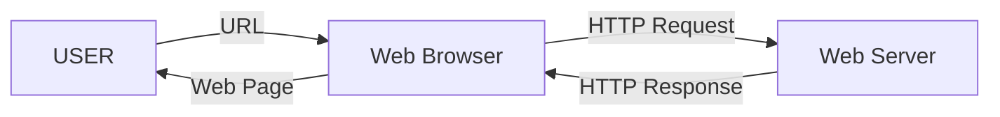
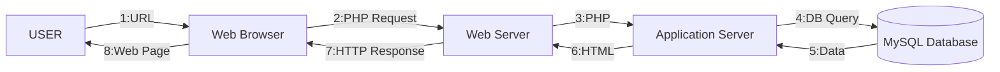

# 1-1 How a Web Application Works

## How a Web Application Works

A web application is a computer program created using web technology and runs through a browser or other devices. Web applications operate according to the so-called client-server model, where the client is a program or device that initiates communication, and the server responds to that request with the required data.

One of the most popular web servers is the [Apache HTTP Server Project](https://httpd.apache.org/) or httpd. The most commonly used communication protocol is HTTP (on port 80) or its secure version HTTPS (on port 443).

The computer acting as the server listens for requests on these ports and responds with the data. In the case of a static web application, the server responds with the web page data, which is displayed in the client’s browser. In the case of a dynamic application, the web page is generated on the server and then sent to the client.

Below is the diagram showing the behavior of a static web page:

In this case, the page returned through a URL will always be the same. On the other hand, for dynamic web pages:

As you can see, the process is more complex. The process above is known as the AMP stack (Apache, MySQL, PHP). This model is used by commercial packages such as XAMPP. However, this way of building web pages is becoming obsolete, giving way to SPAs (Single Page Applications).

In an SPA, the server does not build the page but instead retrieves the necessary data through the API (Application Programming Interface) and passes it to the client application in JSON, XML, etc. The client application then builds the view. This way of working creates a clear separation between the **Front-End** (client) role and the **Back-End** (server) role.

> **Activity**
> Create a diagram similar to the two above, but referring to SPAs (it will look very similar to the one for dynamic pages).

> **Activity**
> Create a comparative table between static pages, dynamic pages, and SPAs.

> **Activity**
> Which type of web page would you use for the following cases, and why?
>
> * A website to promote an artistic profile
> * A website to check today’s weather
> * A personal blog
> * A website for application documentation
> * A website to sell cosmetics online
