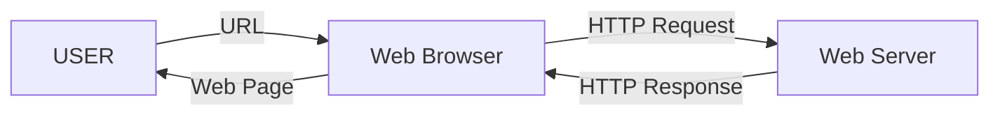
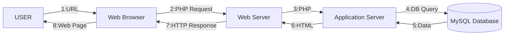

# 1-1 How a Web Application Works

## How a Web Application Works

A web application is a computer program created using web technology and runs through a browser or other devices. Web applications operate according to the so-called client-server model, where the client is a program or device that initiates communication, and the server responds to that request with the required data.

One of the most popular web servers is the [Apache HTTP Server Project](https://httpd.apache.org/) or httpd. The most commonly used communication protocol is HTTP (on port 80) or its secure version HTTPS (on port 443).

The computer acting as the server listens for requests on these ports and responds with the data. In the case of a static web application, the server responds with the web page data, which is displayed in the client’s browser. In the case of a dynamic application, the web page is generated on the server and then sent to the client.

Below is the diagram showing the behavior of a static web page:

In this case, the page returned through a URL will always be the same. On the other hand, for dynamic web pages:

As you can see, the process is more complex. The process above is known as the AMP stack (Apache, MySQL, PHP). This model is used by commercial packages such as XAMPP. However, this way of building web pages is becoming obsolete, giving way to SPAs (Single Page Applications).

In an SPA, the server does not build the page but instead retrieves the necessary data through the API (Application Programming Interface) and passes it to the client application in JSON, XML, etc. The client application then builds the view. This way of working creates a clear separation between the **Front-End** (client) role and the **Back-End** (server) role.

> **Activity**
> Create a diagram similar to the two above, but referring to SPAs (it will look very similar to the one for dynamic pages).

> **Activity**
> Create a comparative table between static pages, dynamic pages, and SPAs.

> **Activity**
> Which type of web page would you use for the following cases, and why?
>
> * A website to promote an artistic profile
> * A website to check today’s weather
> * A personal blog
> * A website for application documentation
> * A website to sell cosmetics online

## Introduction to Spring and Spring Boot

### Spring

[Spring](https://spring.io/projects/spring-framework) is an open-source framework that facilitates the creation of applications in Java, Kotlin, and Groovy, mainly for the back end. It consists of tools and utilities that generate complete applications by relieving the developer of managing internal behavior aspects and automatically generating code for standard tasks. The most important are: database access, application security management, and API (Application Programming Interface) generation.

You can learn more about Spring Framework in its [official overview](https://docs.spring.io/spring-framework/docs/3.2.x/spring-framework-reference/html/overview.html).

> **Activity:**
> Create a document listing the different modules available in Spring and explain what each of the most important ones is used for (the ones represented in the image above).

One of the most important features of Spring is **dependency injection** and **inversion of control (IoC)**. Dependency injection is a software pattern based on the idea that an external element is responsible for creating objects as they are needed by other objects. The external element performing this task is the Inversion of Control (IoC) container. In Spring, the IoC is represented by the *ApplicationContext* interface, which is responsible for configuring and instantiating all objects (called *Beans*) and managing their lifecycle.

The main drawback of Spring is its deep configuration. To make this easier, the Spring Boot module exists.

### Spring Boot

Spring Boot is a module within the Spring Framework ecosystem that simplifies configuration with minimal effort:

* Uses the **Convention over Configuration** pattern, which minimizes the number of configuration decisions a developer must make while retaining flexibility.
* Allows you to create standalone Spring applications: Your project can be a `.jar` (Java Archive) with an embedded server or a `.war` (Web Archive) to be deployed on an external server.
* Includes *starter* dependencies.
* Automatically configures libraries.
* Does not generate code or XML configuration—it is transparent to the developer.

### Stereotypes

* **@Component**
  A generic stereotype to mark a class as a **Spring-managed component**. It is the base annotation and can be used when the class doesn’t specifically fit into `@Service`, `@Controller`, or `@Repository`.

* **@Controller**
  Marks a class as a **Spring MVC controller**, handling HTTP requests and returning responses (which may be views or JSON/XML if combined with `@ResponseBody`).

* **@Service**
  Indicates that a class represents the **business logic or services of the application**. It is a specialization of `@Component`, intended to better organize code.

* **@Repository**
  Marks a class as a **data access component (DAO)**. Additionally, Spring automatically translates database-specific exceptions into generic Spring exceptions.

* **@Bean**
  Used inside a class annotated with `@Configuration` to **manually register a bean in the Spring container**.

### Scopes

* **Singleton** (default)
  A **single instance** of the bean is created in the entire Spring container and shared across all dependencies that use it.

* **Prototype**
  Each time it is requested, Spring creates a **new instance** of the bean.

* **Request** (in web applications)
  A **new instance is created per HTTP request**.

* **Session** (in web applications)
  A **new instance is created per user session** and is maintained as long as the session exists.
