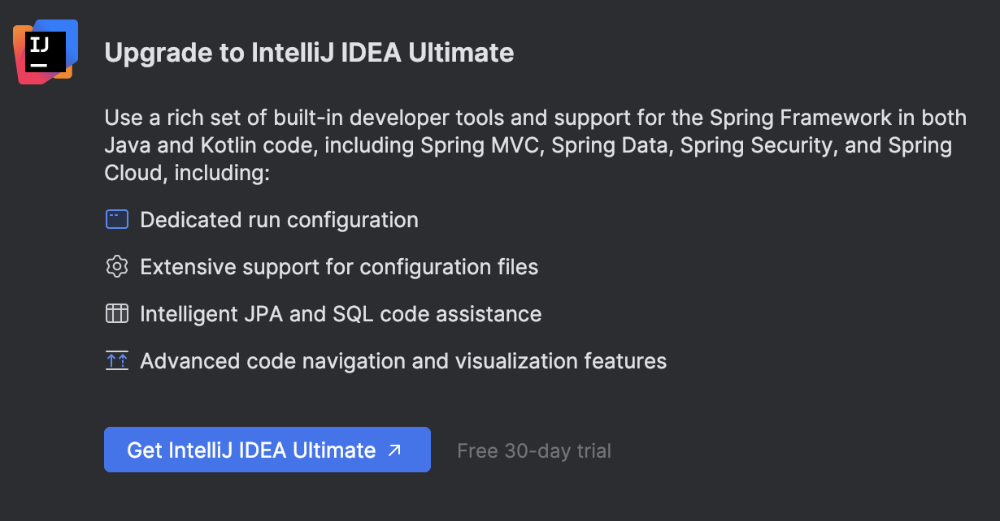
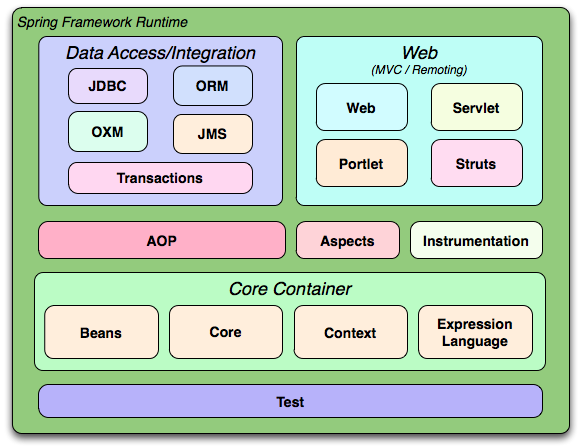
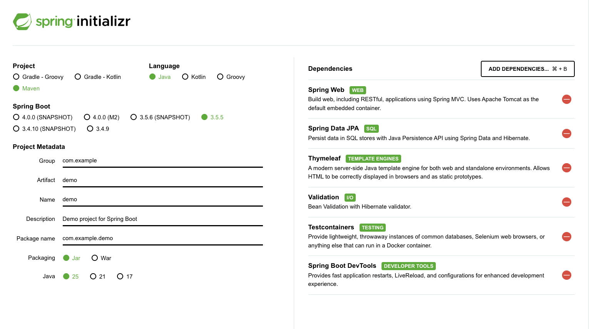
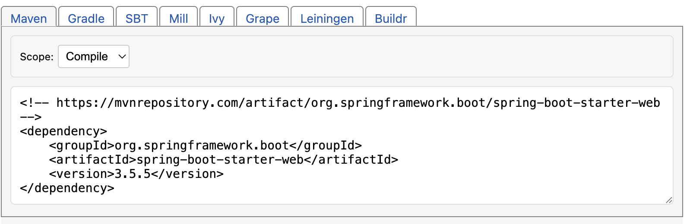
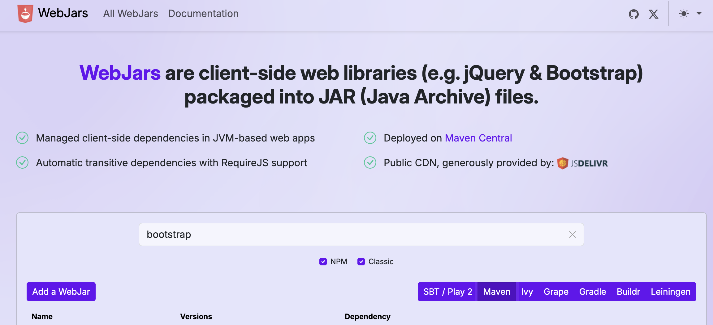
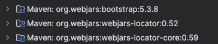

# Using Spring and Spring Boot

## Introduction to Spring and Spring Boot

To work with Spring, a web development framework in a server environment that uses the Java language, we need Java, a package manager such as Maven, and an IDE. As an IDE, we can use any that supports Java. A good option is Visual Studio Code with the relevant extensions. It is also possible to use Netbeans or Eclipse, which are open source. Finally, we have the option of JetBrains IntelliJ.

IntelliJ has two versions, a free one called Community Edition and a paid one called Ultimate, which can be accessed for free with a student license. To request a student license, you must go to [**the website enabled for the request**](https://www.jetbrains.com/es-es/academy/student-pack/) and attach a document that proves you are studying a higher-level computer science course (the enrollment form, student card, etc.).

Spring can be used in both versions of IntelliJ, but the Ultimate version has several quality-of-life advantages for developing programs.


When installing an IDE, it is important to disable text completion using machine learning, to avoid code suggestions from Visual Studio Code or IntelliJ distracting us from what we really want to write. Intellisense, on the other hand, is very useful. Intellisense is the tool that, given a letter, suggests a series of related elements in our project (Java classes, variables, etc.). It comes by default in IntelliJ, and in VSC you need to install the extension of the specific language you want to use.

> **Activity**
> Install IntelliJ and/or Visual Studio Code. Configure it to support Intellisense in Java and to avoid code completion suggestions using machine learning.
>
> * Disable inline completion in IntelliJ

### Spring

[Spring](https://spring.io/projects/spring-framework) is an open-source framework that facilitates the creation of applications in Java, Kotlin, and Groovy, mainly for the back end. It consists of tools and utilities that generate complete applications by offloading developers from managing internal behavior aspects and generating automatic code for standard tasks, the most important being: database access, application security management, and API (Application Programming Interface) generation.



You can learn more about Spring Framework in its [official overview](https://docs.spring.io/spring-framework/docs/3.2.x/spring-framework-reference/html/overview.html).

> **Activity:**
> Create a document listing the various modules available in Spring and what each of the most important ones is used for (the ones represented in the previous image).

One of the most important features of Spring is **dependency injection** and **inversion of control**. Dependency injection is a software pattern based on an external element being responsible for creating objects as they are required by other objects in our creation. The external element that performs this task is the inversion of control (IoC). In Spring, the IoC is represented by the *ApplicationContext* interface, which is responsible for configuring and instantiating all objects (called *Beans*) and managing their lifecycle. The main drawback of Spring is its heavy configuration. To make this easier, there is the Spring Boot module.

### Spring Boot

Spring Boot is a module within the Spring Framework ecosystem that simplifies configuration with minimal effort.

* Uses the **Convention over Configuration** pattern, which minimizes the decisions the developer must make regarding configuration while retaining flexibility.
* Allows you to create standalone Spring applications: Our project can be a `.jar` (Java Archive) file with an embedded server or a `.war` (Web Archive) file deployed on an external server.
* Includes *starter* dependencies.
* Automatically configures libraries.
* Does not generate code or XML configuration; it is transparent to the developer.

### Stereotypes

* **@Component**
  Generic stereotype to mark a class as a **Spring-managed component**. It is the base annotation that can be used when it doesn’t specifically fit `@Service`, `@Controller`, or `@Repository`.

* **@Controller**
  Marks a class as a **Spring MVC controller**, which handles HTTP requests and returns responses (these can be views or JSON/XML if combined with `@ResponseBody`).

* **@Service**
  Indicates that a class represents the **business logic or services of the application**. It is a specialization of `@Component` designed to better organize code.

* **@Repository**
  Marks a class as a **data access component (DAO)**. In addition, Spring automatically translates database-specific exceptions into generic Spring exceptions.

* **@Bean**
  Used inside a class annotated with `@Configuration` to **manually register a bean in the Spring container**.

### Scopes

* **Singleton** (default)
  A **single instance** of the bean is created in the entire Spring container and shared among all dependencies that use it.

* **Prototype**
  Each time it is requested, Spring creates **a new instance** of the bean.

* **Request** (in web applications)
  **One instance per HTTP request** is created.

* **Session** (in web applications)
  **One instance per user session** is created and maintained as long as the session lasts.

## Installing Java, Spring, and Maven

The Java Development Kit (JDK) is essential software for developing any type of application in Java: it includes the interpreter, Java classes, and Java development tools (JDT): compiler, debugger, documentation generator, etc. It is essential for developing applications in any Java ecosystem. Some IDEs like IntelliJ install it transparently for the user, but if we want to open `.jar` files or use it outside IntelliJ, we need to install the JDK. The version we will use in this course is Java 25, which is the latest LTS. To use Java 25, you need to have the IDE updated.

> **Activity:**
> Install Java on your operating system. Use this [link to download it.](https://www.oracle.com/es/java/technologies/downloads/#java25). For IntelliJ, Java is installed in an integrated way with the IDE. For other editors, you must use this version.

> **Activity:**
> Install the [recommended packages](https://code.visualstudio.com/docs/languages/java) to use Java in Visual Studio Code.
>
> * The "Extension Pack for Java". It includes language support, Debugger, Test Runner, Maven, Gradle, project manager, and Intellisense.
> * Also install Spring Boot Extension Pack.

> **Activity:**
> Configure the JDK. To do this, we can change the JAVA\_HOME variable (although that has a global scope) or, in VSC, go to the `settings.json` file and add the variable `java.jdt.java.home` with the path where we decompressed our JDK. Remember that JSON uses the "key" : "value" combination and that each component must be separated by commas, inside a {} section.
> `settings.json`

```json
{
    "workbench.colorTheme": "Visual Studio Light",
    "java.jdt.ls.java.home": "C\\Program Files\\Java\\jdk-25.0.0"
}
```

In addition to Java, the dependency manager we are going to use is Maven. **Maven** is a project and dependency manager widely used in Java projects. It defines the project structure and manages dependencies through an XML file called `pom.xml`. The advantages of using Maven are:

* **Standardization**: It has a standard Java project structure, which facilitates collaboration among teams.
* **Dependency automation**: You can easily add dependencies, and Maven will automatically download the necessary libraries and their transitive dependencies from centralized repositories.
* **Continuous integration**: Well supported in CI tools such as Jenkins, GitLab CI, GitHub Actions, etc.
* **Popularity and support**: There is a huge community and a lot of documentation available.

However, Maven also has some drawbacks:

* **XML**: Some developers find editing `pom.xml` files tedious and hard to read when the file grows.
* **Performance**: Compared to Gradle, Maven can be a bit slower, especially in large projects.

**Maven** is an excellent choice for working on **medium or large projects**. It is also ideal for projects with distributed teams since its standard structure and wide industry use make it easy to adopt.

### Setting up a project with Maven

1. **Create a project with Maven**:

   * When creating a new project in IntelliJ, select **Maven** as the project option.
   * IntelliJ will automatically generate a `pom.xml` file where you can add your dependencies.

2. **Add dependencies in Maven**:

   * Open the `pom.xml` file and add dependencies inside the `<dependencies>` section:

   ```xml
   <dependencies>
       <dependency>
           <groupId>junit</groupId>
           <artifactId>junit</artifactId>
           <version>4.13.1</version>
           <scope>test</scope>
       </dependency>
   </dependencies>
   ```

3. **Run Maven**:

   * You can run Maven commands directly in IntelliJ from the Maven panel (on the right sidebar).
   * Common commands include `clean`, `install`, and `package`.

> **Activity**
> Create a Java project using Maven and a program that, when executed, prints "Hello World, I live in Maven" in the console.

### Git and GitHub

Finally, it is advisable to configure both IntelliJ and VSC to support GIT. This way, we can have version control of our project, and if we link it to our GitHub account, we can also have a cloud backup.

## Projects in Spring

We can create a Spring project in three ways. The first is through the initializer in VSC or IntelliJ Ultimate. The second is through [start.spring.io](https://start.spring.io/), which is a form where we can generate an empty project with the configuration we want. The third is to copy an existing project and modify it.



In this image, we can see an example of how to use the Spring initializer. Clicking generate will create a project, and that will be the one we should open in our IDE.

In this case, we choose the project manager (Maven), the language (Java), the SpringBoot version (3.5.5), and the project metadata.

* Group: It takes the form of a reversed web address. Here we define the project domain.
* Artifact: The name of the artifact. Artifacts are files produced by a BUILD process, i.e., the resulting `.jar` or `.war` from building the project.
* Name: The project name.
* Description: A project description.
* Package name: In reversed web format. It is the main package of the project.
* Packaging: Whether we want a `.jar` or `.war`. The `.war` is to be launched on an application server, while the `.jar` has it integrated. For now, we choose `.jar`.
* Java: The Java version. The latest LTS versions are available. We choose 25 as it is the most recent.

On the right, we see the dependencies. We have added `Spring Web`, `Spring Data JPA`, `Thymeleaf`, `Validation`, `TestContainers`, `Spring Boot DevTools`. Dependencies can also be added manually from the `pom.xml` file generated by Maven. In it, we go to the `<dependencies>` section and add the `<dependency>`.

The generated `pom.xml` file is the following:

```xml
<?xml version="1.0" encoding="UTF-8"?>
<project xmlns="http://maven.apache.org/POM/4.0.0" xmlns:xsi="http://www.w3.org/2001/XMLSchema-instance"
	xsi:schemaLocation="http://maven.apache.org/POM/4.0.0 https://maven.apache.org/xsd/maven-4.0.0.xsd">
	<modelVersion>4.0.0</modelVersion>
	<parent>
		<groupId>org.springframework.boot</groupId>
		<artifactId>spring-boot-starter-parent</artifactId>
		<version>3.5.5</version>
		<relativePath/> <!-- lookup parent from repository -->
	</parent>
	<groupId>com.example</groupId>
	<artifactId>demo</artifactId>
	<version>0.0.1-SNAPSHOT</version>
	<name>demo</name>
	<description>Demo project for Spring Boot</description>
	<url/>
	<licenses>
		<license/>
	</licenses>
	<developers>
		<developer/>
	</developers>
	<scm>
		<connection/>
		<developerConnection/>
		<tag/>
		<url/>
	</scm>
	<properties>
		<java.version>25</java.version>
	</properties>
	<dependencies>
		<dependency>
			<groupId>org.springframework.boot</groupId>
			<artifactId>spring-boot-starter-data-jpa</artifactId>
		</dependency>
		<dependency>
			<groupId>org.springframework.boot</groupId>
			<artifactId>spring-boot-starter-thymeleaf</artifactId>
		</dependency>
		<dependency>
			<groupId>org.springframework.boot</groupId>
			<artifactId>spring-boot-starter-validation</artifactId>
		</dependency>
		<dependency>
			<groupId>org.springframework.boot</groupId>
			<artifactId>spring-boot-starter-web</artifactId>
		</dependency>

		<dependency>
			<groupId>org.springframework.boot</groupId>
			<artifactId>spring-boot-devtools</artifactId>
			<scope>runtime</scope>
			<optional>true</optional>
		</dependency>
		<dependency>
			<groupId>org.springframework.boot</groupId>
			<artifactId>spring-boot-starter-test</artifactId>
			<scope>test</scope>
		</dependency>
		<dependency>
			<groupId>org.springframework.boot</groupId>
			<artifactId>spring-boot-testcontainers</artifactId>
			<scope>test</scope>
		</dependency>
		<dependency>
			<groupId>org.testcontainers</groupId>
			<artifactId>junit-jupiter</artifactId>
			<scope>test</scope>
		</dependency>
	</dependencies>

	<build>
		<plugins>
			<plugin>
				<groupId>org.springframework.boot</groupId>
				<artifactId>spring-boot-maven-plugin</artifactId>
			</plugin>
		</plugins>
	</build>

</project>
```

We can add or remove dependencies, as well as modify any part of the `pom` on the fly, but after each change, we must reload the project for the changes to take effect.

On the website [mvnrepository.com](https://mvnrepository.com/), you have available all the Maven repositories you can add to your `pom.xml`. The official Spring dependencies start with "spring-boot-starter-" and the most common are:

* web
* data-jpa
* validation
* test

We search for the dependency in the search bar and click on it. Once inside, we select the version of our SpringBoot, and it will show the text we must copy into our `pom.xml` file.



## Static Content

In Spring Boot, the static content of our web application is stored in the folder *src/main/resources/static*. This is where HTML, CSS, images, etc. are stored. If we place an `index.html` file, the application will start directly using that document.

> **Activity:**
> Create a Spring project with SpringBoot (either with the IDE initializer or with the website provided earlier) with the Spring Web extension and run it. In the terminal window you will see the following:

```
  .   ____          _            __ _ _
 /\\ / ___'_ __ _ _(_)_ __  __ _ \ \ \ \
( ( )\___ | '_ | '_| | '_ \/ _` | \ \ \ \
 \\/  ___)| |_)| | | | | || (_| |  ) ) ) )
  '  |____| .__|_| |_|_| |_\__, | / / / /
 =========|_|==============|___/=/_/_/_/

 :: Spring Boot ::                (v3.5.5)

2025-09-17T10:48:55.412+02:00  INFO 35927 --- [demo2] [           main] com.example.demo2.Demo2Application       : Starting Demo2Application using Java 25 with PID 35927 (/Users/arturoalbero/Desktop/demo2/target/classes started by arturoalbero in /Users/arturoalbero/Desktop/demo2)
2025-09-17T10:48:55.414+02:00  INFO 35927 --- [demo2] [           main] com.example.demo2.Demo2Application       : No active profile set, falling back to 1 default profile: "default"
2025-09-17T10:48:55.826+02:00  INFO 35927 --- [demo2] [           main] o.s.b.w.embedded.tomcat.TomcatWebServer  : Tomcat initialized with port 8080 (http)
2025-09-17T10:48:55.834+02:00  INFO 35927 --- [demo2] [           main] o.apache.catalina.core.StandardService   : Starting service [Tomcat]
2025-09-17T10:48:55.834+02:00  INFO 35927 --- [demo2] [           main] o.apache.catalina.core.StandardEngine    : Starting Servlet engine: [Apache Tomcat/10.1.44]
2025-09-17T10:48:55.857+02:00  INFO 35927 --- [demo2] [           main] o.a.c.c.C.[Tomcat].[localhost].[/]       : Initializing Spring embedded WebApplicationContext
2025-09-17T10:48:55.858+02:00  INFO 35927 --- [demo2] [           main] w.s.c.ServletWebServerApplicationContext : Root WebApplicationContext: initialization completed in 407 ms
2025-09-17T10:48:56.000+02:00  WARN 35927 --- [demo2] [           main] ion$DefaultTemplateResolverConfiguration : Cannot find template location: classpath:/templates/ (please add some templates, check your Thymeleaf configuration, or set spring.thymeleaf.check-template-location=false)
2025-09-17T
```


10:48:56.036+02:00  INFO 35927 --- \[demo2] \[           main] o.s.b.w\.embedded.tomcat.TomcatWebServer  : Tomcat started on port 8080 (http) with context path '/'
2025-09-17T10:48:56.042+02:00  INFO 35927 --- \[demo2] \[           main] com.example.demo2.Demo2Application       : Started Demo2Application in 0.902 seconds (process running for 1.103)

```

> If we look closely, the TomcatWebServer has started on port 8080. To access our application, let’s go to localhost:8080 in our browser. The following will appear:  

```

Whitelabel Error Page
This application has no explicit mapping for /error, so you are seeing this as a fallback.

Wed Sep 17 10:50:54 CEST 2025
There was an unexpected error (type=Not Found, status=404).

````

> Now, close the project and create an `index.html` file in the /static folder.  

```html
<!DOCTYPE html>
<html lang="en">
<head>
    <meta charset="UTF-8">
    <title>Title</title>
</head>
<body>
<p>Hello World</p>

</body>
</html>
````

> Run the project again and go back to the localhost page. Your webpage will appear.

## WebJars

jQuery, Bootstrap, and other libraries are static resources frequently used. The way to incorporate them into our projects is often by including the original library URLs ([CDN, from Cloudflare](https://www.cloudflare.com/es-es/learning/cdn/what-is-a-cdn/)) or downloading them to our server and using local URLs.

Both cases have disadvantages. In the first, you depend on CDN servers and must download them every time you want to use them (so the application is slower). In the second, you must download the files and manage versions.

Spring offers a third way: **WebJars**. A WebJar allows us to work with static resources as if they were Maven dependencies, so we have the advantage of downloading it to our server, but the version is automatically managed, and everything runs through Maven, making it transparent to the developer. A WebJar is just another dependency. We can access WebJars at [webjars.org](https://www.webjars.org/).



On the website, we can choose the dependency format. We select Maven and search for one we are interested in, for example, Bootstrap5. We will also need the [webjars-locator](https://mvnrepository.com/artifact/org.webjars/webjars-locator) dependency from the official Maven repository. We copy the text into the dependencies section of our `pom.xml` and reload the project (in IntelliJ, right-click on the `pom.xml` file → Maven → Sync Project).

```xml
<dependency>
    <groupId>org.webjars</groupId>
    <artifactId>webjars-locator</artifactId>
    <version>0.52</version>
</dependency>
<dependency>
    <groupId>org.webjars</groupId>
    <artifactId>bootstrap</artifactId>
    <version>5.3.8</version>
</dependency>
```

Finally, we modify the HTML we had created as follows to include the installed libraries and run the project to see the results:

```html
<!DOCTYPE html>
<html lang="en">
<head>
    <meta charset="UTF-8">
    <title>Title</title>
    <link href="/webjars/bootstrap/css/bootstrap.min.css" rel="stylesheet">
    <script src="/webjars/bootstrap/js/bootstrap.bundle.min.js">
    </script>
</head>
<body>
<p>Hello World</p>

</body>
</html>
```

Notice that the packages installed as dependencies are found in the `External Libraries` folder:


## Changing the port of the Spring Boot Application

The default port for Spring Boot applications is 8080, but it can be changed using several methods. The most common approach is to modify the application.properties or application.yml file located in the src/main/resources directory. In application.properties, add the line `server.port=9090` to set the port to 9090.
In application.yml, use the syntax server: port: 9090 for the same result.

Alternatively, you can change the port via command-line arguments when running the JAR file using java -jar myapp.jar --server.port=9090. This method is useful for temporary changes or different environments without modifying configuration files.

> **Activity:**
> Modify your project in order to include one or more webjars, and change the default port.


