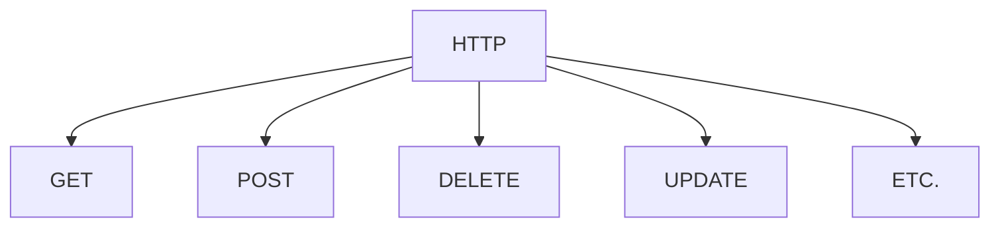

# Introduction to Controllers

## Controllers

### Definition of a Controller in Spring

The controller is the class responsible for receiving requests in our application. They will be received through the HTTP protocol in the case of web pages we create, or through other types of devices.



### Creating Controllers in Spring. Mapping.

To create a controller in Spring, we must create a simple class (`Plain Old Java Object -> POJO`) and annotate it with `@Controller`.

The next step is to create different methods in that class and associate them with the different HTTP requests (URLs) that we will receive and to which the controller will respond. The most common requests are GET, POST, PUT, and DELETE, although there are more.

So, each method in the controller must know which URL and command it should respond to. To do this, we annotate the controller with `@RequestMapping`, passing the URL and the command as parameters, or, since Spring 4.3, by using its derived annotations `@GetMapping`, `@PostMapping`, `@PutMapping`, `@DeleteMapping`, etc., where the HTTP command is implicit in the annotation, and only the URL is required.

The name we give the controller does not matter. It is usually named according to its function (MainController, FrontController, etc.). As for its location, ***it must be in the root package of the Spring Boot application or a subpackage of it***. We can group all controller classes in a single package or group them by business area.

The class must contain one method for each HTTP command or URL that requires the same handling. Inside the method, we will place the operations necessary on the server to obtain the dynamic data that will compose the response and, finally, return that response to the requester. These operations are known as the business logic. **If we structure our application in layers, these tasks will be delegated to the service layer, and the controller will simply call those services**.

The response in these first tests will simply be a web page with static content and dynamic content generated by our application. These pages will be known as views, according to the MVC pattern.

```java
@Controller                     //Controller annotation
public class HomeController{
    @GetMapping("/")            //Route responding to GET
    public String showHome(){
        return "indexView";     //Returned view
    }
}
```

In this example, we see how the `@GetMapping` annotation includes the URL parameter that will trigger the execution of this controller. In this case, the URL `/` would correspond to the root of our website, e.g., `http://localhost/`.

The name of the method associated with the *mapping* can be anything, and it does not necessarily have to receive parameters. The method can return different types of data, the simplest being a String, as in the example. That String corresponds to the webpage returned to the user (the view). By default, the `.html` extension is assumed for views. In this case, it returns the view *indexView.html*. For this to work, we need the **thymeleaf** dependency in our pom.xml.

The last step for this example to work is to create the view *indexView.html*. This view must be placed in the **templates** folder of our application (not in *static*). Below, a fully static page to test how it works.

```html
<!DOCTYPE html>
<html>
    <head></head>
    <body>
        <h1>HELLO FRIENDS</h1>
    </body>
</html>
```

### Considerations about Controllers

* The URL in the annotation is the request path, not the path of the view returned (unlike what happens with static content). The URL paths in annotations are structured in “folders” only for code clarity, but there is no real folder on the server. For example, `@PostMapping("/product/add")` does not imply that there is a `product` folder.
* In the annotation, we can include multiple routes. For example, if with the URL `http://localhost/home` we also want to show the same view as with `http://localhost/`, we modify the annotation by adding the routes inside curly braces `{}` like this: `@GetMapping({"/", "/home", ""})`. This is a major difference compared to traditional websites.
* The default view has an `.html` extension, but this can be changed to return other types of files, such as `.jsp`.
* When working with Spring Boot (to avoid configuration issues), the views must be in the templates folder or its subfolders. The folder structure must be reflected in the `return` of the controller method. For example, `return "users/deleteView"` will return the page deleteView.html from the `templates/users` folder.
* Controller methods can return other objects, such as JSON files or HTTP response objects. We will see this later.
* Regarding the structuring of *mappings*, a common practice is to define a `@RequestMapping` at the class level with the base route of that controller and then use `@GetMapping`, `@PostMapping`, etc. for each method in the class, without repeating the base path.
* In the following example, the initial `@RequestMapping` makes all routes handled by the controller refer to "/app", so `@GetMapping("/products")` would handle the URL "/app/products", and so on with the rest of the methods.

```java
@Controller
@RequestMapping("/app")
public class ProductsController{
    @GetMapping("/products")
    public String getList(){
        return "productsListView";
    }
    @GetMapping("/delete/{id}") //The resource inside {} is the parameter
    public String removeItem(@PathVariable Long id){
        return "productDeleteView";
    }
    @GetMapping("/new")
    public String addNew(){
        return "productNewView"; 
    }
}
```

In the example above, we use the `@PathVariable` annotation to indicate that the parameter defined (in this case `Long id`) is extracted from the @GetMapping (the content inside {}). The name must be the same.

> **Activity:**
> Take the previous project and develop a class of type `@Controller` that contains different @GetMapping with the routes you want to return the requested views.
> a) Do you need to change the location of the views? Why?
> b) Do you need to change the HTML code of the navigation menu of the pages?
> c) Do the GetMapping routes and the views have to have the same name?
> The index page will be served for the URLs: /index, /home, or simply /. Since routes and views do not necessarily have to share the same name, rename the views with the suffix "View" (e.g., indexView.html). This way, we can clearly distinguish from the name itself what is a view and what is a route or URL handled by the controller.

<details>
<summary>The statement of the previous project was this:</summary>

> Create a second project from [https://start.spring.io](https://start.spring.io) with the same characteristics as the previous one. In this case, it will be a static website about Frédéric Chopin.
>
> * index.html with a general biography (you may take information from [Wikipedia](https://en.wikipedia.org/wiki/Fr%C3%A9d%C3%A9ric_Chopin) and summarize it). Include information about his birth and death, as well as the places where he carried out his professional activity. Talk about his partner George Sand and his stay in Mallorca, as well as any other important or curious facts.
> * repertoire.html with a list of the composer’s most relevant pieces. Add links to selected sheet music available at [imslp.org](https://imslp.org/wiki/Category:Chopin,_Fr%C3%A9d%C3%A9ric), as well as YouTube or imslp performance videos for each.
> * gallery.html with relevant photos and paintings. You may extract them from Wikipedia.
> * external-links.html with relevant links for the website. You can add his Wikipedia page and imslp.org, as well as any articles you find online.
>
> The page content can be in Spanish, although you can use a chatbot or a translator to translate it into English.

</details>

## Thymeleaf and Dynamic Content

### Thymeleaf Basics

Thymeleaf is a template engine. Unlike JSP, it works with **pure HTML5** using special attributes (`th:*`). Therefore, instead of relying on Servlets, the HTML is processed as a template. The engine replaces `${}` expressions with data from the model you pass from the controller.

Thymeleaf clearly separates **logic** (Java/Spring in the controller) from the **view** (HTML).

```html
<h1>Hello <span th:text="${name}">User</span></h1>
```

If you open this file directly in a browser, it looks like valid HTML (with “User” by default). It is the Spring engine that changes the content. This is called "Natural Templating," meaning it does not add new tags to the template, but instead adds new attributes to existing tags. This makes it easier to work with the template statically and later add the dynamic attributes (something that cannot be done with JSP, which must always be loaded from the server).

Thymeleaf has several dialects, meaning different ways of adding expressions to our template for rendering. Although there is a default dialect, in these exercises we will use one specific to Spring: SpEL (Spring Expression Language).

By adding the dependencies spring-boot-starter-web and spring-boot-starter-thymeleaf, our project is configured to use Thymeleaf. Otherwise, we would have to write a `@Configuration` manually.

To modify Thymeleaf settings, we can do so in application.properties (just as we could change the port). A common parameter is thymeleaf.cache, which is set to true by default, but during development, we can set it to false so that when we change the template, the changes are visible by simply refreshing the browser without restarting the project. This is called hot-swapping, and it is not recommended in production because it slows things down.

In our templates, we must add an attribute to the html tag to indicate that it will be processed by Thymeleaf:

`<html xmlns:th="http://www.thymeleaf.org">`

### Passing Data to the Template

To pass data to the template, we provide the controller method with a parameter of type Model (from org.springframework.ui.Model) and, before returning the view, we add to the model the elements we want to pass.

```html
<h1 th:text="${city}">Default City</h1>
```

```java
@GetMapping("/")
public String showHome(Model model){
    String city = "Mutxamel";
    model.addAttribute("city", city);
    return "homeView";
}
```

> **Activity**
> Create a Spring Boot application that uses a single template. In it, using Thymeleaf, you must edit the text of a tag to perform mathematical operations and display them in the browser.
>
> For example, if you enter localhost/1/+/2, it should display the number 3 in the browser. In order to do so, don't forget to use the annotation `@PathVariable`.
>
> Implement the operations +, -, x, and /, and if a division by 0 is attempted, return the message "Error, division by 0".
>
> Use the property spring.thymeleaf.cache=false to test different ways of rendering the message.
> `1 + 2 = 3`, then `1 plus 2 equals 3`, etc.

