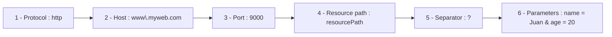

# Dynamic URLs in Thymeleaf

## Retrieving Parameters from URLs

One of the most common ways to pass data from the client to the server is through URL parameters. First, let’s look at the parts of a URL in the following diagram:

```url
http://www.myweb.com:9000/resourcePath?name=Juan&age=20
```



There are two ways to pass parameters in a URL:

* Passing parameters in the query part: after the address, after the question mark, and separated by `&` in key=value pairs, as in the example above.
* Passing parameters directly in the URL path, as we did in the calculator exercise (`http://localhost:8080/3/+/4` where the parameters were `3`, `+` and `4`).

To retrieve parameters from the query string we use `@RequestParam`, and to retrieve them from the path we use `@PathVariable`.

### @RequestParam

This annotation will be a parameter we pass to the controller method. It includes the name of the variable in the URL and, afterwards, the variable that will capture the parameter value.

For example, to capture the parameter from the URL `www.devschool.com?teacher=rdf` we would use:

```java
@GetMapping("/")
public String showHome(@RequestParam("teacher") String teacherName, Model model){}
```

> **NOTE:** Don’t forget that in order to work with the data we also need the Model.

We need one `@RequestParam` annotation per parameter in the URL. A problem we might encounter is that if the user calls the mapped URL without parameters, or with unexpected parameters, a 400 error (Bad Request) will occur. To avoid this, we can include `required = false` and optionally a `defaultValue`.

```java
@GetMapping("/")
public String showHome(@RequestParam(name = "teacher", required = false, defaultValue="X") String teacherName, Model model){}
```

If the variable name in the URL matches the variable name in the controller method, we can simplify it:

```java
@GetMapping("/")
public String showHome(@RequestParam(required = false, defaultValue="X") String teacher, Model model){}
```

Another way to handle this is by using the `Optional` class, which is a generic wrapper class designed to avoid null pointer errors, offering methods (`get()`, `isEmpty()`, `orElse(T value)` where `T` is the data type) to safely handle nulls.

```java
@GetMapping("/")
public String showHome(@RequestParam Optional<String> teacher, Model model){
    model.addAttribute("teacher", teacher.orElse("X"));
}
```

> **REMEMBER:** If the parameter name matches the variable name in the controller method, you don’t need to specify it.

> **NOTE:** `@PathVariable` has gained popularity in recent years because it is more readable, though it provides fewer options for error handling and does not allow default values. We already worked with it in the previous section.

To prevent errors when using both `@RequestParam` and `@PathVariable`, it is good practice to capture all parameter values as Strings, and then convert them inside a `try-catch` block:

```java
@GetMapping("/{num}")
public String showPage(@PathVariable String num, Model model){
   int number;
   try{
        number = Integer.parseInt(num);
    }catch(Exception e){
        //Redirect to an error page
    }
   (...)
}
```

## Controller Method Returns

Controller methods usually return a String corresponding to the view we want to return to the client (without the .html extension). However, we can also redirect to another controller. This is very common when an error occurs, for instance, so we can redirect to the method that handles error processing. To do this, we use `redirect:` followed by the controller route in the return statement:

```java
@GetMapping({"/", "mainMenu"})
public String showMenu(Model model){
    model.addAttribute("currentYear", LocalDate.now().getYear());
    return "menuView";
}

@GetMapping("/even/{num}")
public String showEven(@PathVariable Integer num, Model model){
    if(num < 1){
        return "redirect:/mainMenu";
    }
    model.addAttribute("even", num % 2);
    return "evenView";
}
```

> **NOTE:** In the past, a `ModelAndView` object was used, which contained both the view and the model in a single object returned with `return`. However, this has been replaced by simply returning a String, which is simpler and more readable.

## Building Dynamic URLs in the View

In the view’s links we define the routes handled by controllers. Some of these routes are fixed, such as the homepage or "about us" page, but others must be built dynamically. For example, imagine a view displaying a list of products, and we want each product link to point to its detail page. As we’ve seen, Thymeleaf expressions for URLs use `@{...}`, and inside the braces we can write different options depending on the type of link:

* **Absolute URLs** to other servers. These are complete routes including the protocol. If they contain no dynamic parts, there’s no need for Thymeleaf.
* **Context-relative URLs.** These are the most common, starting with `/`. That slash represents the root of the application.

When the project is packaged as a `.jar` (as we’ve done so far), it includes an embedded Tomcat server and the app sits at its root. In this case, `<a th:href="@{/about-us/}">` and `<a href="/about-us/">` are equivalent.

By contrast, when packaged as a `.war`, the app may be located in another path (e.g., under `/app`), so the first option produces `/app/about-us` while the second produces `/about-us/`.

Additionally, we have:

* **Server-relative URLs**: Relative to the global server, not the app context. Use `~` before the address: `@{~/about-us/}`.
* **Protocol-relative URLs**: For linking to external resources like CSS or scripts. Use `//` at the beginning: `@{//cdnjs.cloudflare.com/ajax/libs/Chart.js/4.4.1/chart.min.js}`.

We can use these expressions not only with `th:href` but anywhere, such as:

```html
<form th:action="@{/form/process}">
```

> **NOTE**: Keep in mind:
>
> * URL → Uniform Resource Locator
> * URI → Uniform Resource Identifier
>   A URL is a type of URI that, in addition to identifying a resource, indicates how and where to access it.

## Adding URL Parameters in the View

We can add parameters in the *query part* of a URL with `@{}`, placing the parameters in parentheses:

```html
<a th:href="@{/product(id=3)}">
```

After processing this becomes `<a href="/product?id=3">`.
For multiple parameters, we separate them with commas:
`<a th:href="@{/product(id=3, size='big')}">` → `<a href="/product?id=3&size=big">`.

> **NOTE:** Some characters are reserved when constructing URLs, such as `/`, `&`, etc. Research which ones so you don’t include them in addresses or parameters you create.

We can also pass parameters in the path (note: multiple parameters must be separated by `/`):
`<a th:href="@{/product/{id}/{size}(id=3, size='big')}">` → `<a href="/product/3/big">`.

## Expressions in URLs in the View

The power of dynamic URLs lies in including variables from the model at runtime.

Suppose the URL `<a th:href="@{/product(id=3,size='big')}">`, but now we don’t know the values in advance—they come from the model:

```html
<a th:href="@{/product(id=${myId}, size=${mySize})}">
```

> **REMINDER:**
>
> * `${}` → **Variable expressions** (values from the model)
> * `@{}` → **Link expressions** (URLs processed by Thymeleaf)
> * `~{}` → **Fragment expressions** (to reference reusable template fragments)

We can also use conditional operators:
`<a th:href="@{/product(id=${myId}, size=${mySize>100} ? 'big' : 'small')}">`.

We can pass parameters in the path the same way:
`<a th:href="@{/product/{id}/{size}(id=${myId}, size=${mySize})}">`.

As always, using `th` doesn’t stop us from mixing in regular HTML, so the full example would be:

```html
<a th:href="@{/product(id=${myId})}">Product link <span th:text="${myId}">*</span></a>
```

What Thymeleaf does is process the expression into a text string. Since Thymeleaf supports string concatenation with `+`, we could also write:

```html
<a th:href="@{'/product?id=' + ${myId} + '&size=' + ${mySize}}">link</a>
```

The same works with the path. Whether it’s worth doing it this way is another matter...

## Static Content vs. Dynamic Content

In **Spring Boot with Thymeleaf** we must clearly separate **templates** from **static resources**:

* In `src/main/resources/templates/` → only **Thymeleaf views** (`.html`), processed on the server before being sent to the browser.
* In `src/main/resources/static/` → **static resources** (CSS, JS, images, fonts, etc.). These are **not processed by Thymeleaf**, but served directly by Spring Boot.
  Example: a file in `src/main/resources/static/css/styles.css` is available at `http://localhost:8080/css/styles.css`.

> **ACTIVITY:** Return to the Frédéric Chopin activity and apply these changes:
>
> * **Create a welcome message** using parameters. If the homepage URL includes `?user=XXX`, display a personalized welcome message. Otherwise, display a generic one. Make one version without Optional and one with Optional.
> * **Add Bootstrap** using its agnostic version (defined in *pom.xml* via `webjars-locator`).
> * **Improve page styling** with Bootstrap. Add it in the header fragment.
> * **Adapt the menu** to rebuild URLs using `@{}`.
> * **Group classes into packages**, e.g., `controllers`, `services`, etc. Separate `MusicalPiece` from the `Controller`, even if there’s only one class per package.
> * **Organize static resources** correctly (inside `/static`, with subfolders for images, CSS, JS, etc.).
> * **Implement the URL `/repertoire/{instrumentation}/{piece_id}` dynamically** to access pieces individually in a dedicated view. The view should show only the selected piece with all its details and audio link. Do one version using query parameters (`?`) and another using path variables.

<details>
<summary><b>Here are the activity instructions</b></summary>

> **ACTIVITY:**
> Create a new project based on Frédéric Chopin. Pass dynamic data to Thymeleaf templates using a `Model`.
>
> * The homepage should display the current year (e.g., @2025) using `LocalDate.now()`.
> * In the repertoire page, list pieces using a class or record `MusicalPiece` with title, composer, year, and instrumentation.
> * Later, this data will be stored in a database.
>
> Adapt all views where possible.
>
> Requirements:
>
> * **Create a data model** for Musical Pieces (class, record, collection).
> * **Use fragments** for `<head>`; include at least one `<th:block>`.
> * **Use the Elvis operator** to check for null values.
> * Use at least one condition and one iteration.
>
>   * Example: apply a different CSS class if a piece is a *solo piano* work or a *piano concerto*.
>   * The simplest place to implement iteration is in the repertoire listing.
> * Configure `spring.thymeleaf.cache=false` in `application.properties` and the `xmlns` attribute in the `<html>` tag.
> * **Use `th:href` and `th:src`** instead of plain HTML `href` and `src`.
>
> You must explain how you implemented all of this in the documentation you submit along with the project.

</details>  

<details>
<summary><b>Previous activities</b></summary>

> **Activity:**
> Take the previous project and develop a `@Controller` class containing different `@GetMapping`s for the desired views.
>
> a) Do you need to change the location of the views? Why?
> b) Do you need to change the navigation menu HTML code?
> c) Do the `@GetMapping` routes need to have the same names as the views?
>
> The `index` page should be served for `/index`, `/home`, or simply `/`. Since routes and views don’t need to match, rename views with the suffix "View" (e.g., indexView.html) to clearly distinguish views from routes/URLs handled by the controller.

</details>  

<details>
<summary><b>The previous project instructions were:</b></summary>

> Create a second project using [https://start.spring.io](https://start.spring.io) with the same settings as the first one. This time, it should be a static website about Frédéric Chopin.
>
> * `index.html` with a general biography (summarized from [Wikipedia](https://en.wikipedia.org/wiki/Fr%C3%A9d%C3%A9ric_Chopin)). Include birth/death info, places of professional activity, George Sand, Mallorca, and other interesting facts.
> * `repertoire.html` with a list of his most important works. Add links to sheet music on [imslp.org](https://imslp.org/wiki/Category:Chopin,_Fr%C3%A9d%C3%A9ric) and performance videos from YouTube or IMSLP.
> * `image-gallery.html` with relevant photos and paintings (e.g., from Wikipedia).
> * `external-links.html` with relevant links, including Wikipedia, IMSLP, and articles.
>
> The content may remain in Spanish, though you can use a chatbot or translator to translate it into English.

</details>
