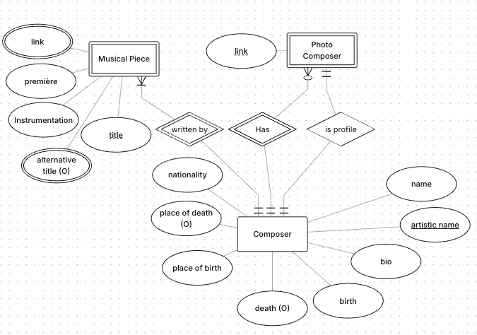

# 3.2 - Introduction to Functional Programming in Java

## 1. The Functional Paradigm

The functional programming paradigm is a declarative paradigm. This means that what we do when programming, instead of giving instructions about how the program should behave (imperative paradigm), is define a reality (in the case of the functional paradigm, through mathematical functions) and then the program, transparently to the programmer, is responsible for resolving that reality. The relational calculus used in the SQL language is also declarative.

The functional paradigm is based on the concept of anonymous functions. In reality, a function is a piece of code stored in a variable (its header), and that code is accessible to the rest. When we call a function, what we do is invoke its name and attach parameters to it. Anonymous functions are similar, but they lack a formal declaration or a specific class name. They are defined in place and are not accessed via a traditional method signature (header), making them 'nameless' or anonymous.

## 2. Anonymous Functions

In Java, to create anonymous functions you need to use objects with anonymous classes. There are a type of interfaces called “functional interfaces” which have only one method (that works as a function, that is, it returns a value). Any interface with one method is considered functional as of Java 8. They are usually annotated with `@FunctionalInterface`, but it is not required.

```java
interface Operacion {
    int calcular(int a, int b);
}
```

To rewrite the function, we use lambda calculus, with the arrow `->`, as follows:

```java
public class Main {
    public static void main(String [] args){
        Operacion suma = (a,b) -> {
            return a+b;
        };
        System.out.println(suma.calcular(8,9));
    }
}
```

This translates to *for every input (a,b), with* `a` *and* `b` *being integers, then* (`->`) *return the sum `return a+b`.* To use our operation, we have to call the `calcular` method from the interface.

If the rewritten function has only one line, as happens in many cases —like the previous one— we can simplify the syntax:

```java
public class Main {
    public static void main(String [] args){
        Operacion suma = (a,b) -> a + b;
        System.out.println(suma.calcular(8,9));
    }
}
```

What we do is omit the braces `{}`, the `return`, and all the `;` that would have gone inside the braces.

This transforms an imperative function (step by step) into a definition of reality through a function.

In Java, there are many cases where using anonymous functions is convenient, such as in comparisons and when handling data collections (both static and dynamic).

> **NOTE**: In functional interfaces, the method name is **not** relevant.

> **ACTIVITY:** Create a functional interface that operates with a method whose parameters are two Strings (s1, s2) and returns a String. Then, in main, create the following anonymous functions using lambdas:
>
> * Insert s2 at the beginning and end of s1.
> * Return "EQUAL" if s1 and s2 are equal and "DIFFERENT" otherwise.
> * Return s1 omitting as many characters from the beginning as the length of s2.
> * Return s1 but with the length of s2. If s2 is shorter than s1, truncate it. If it is longer, add as many `0`s as necessary until reaching the same number of characters.

## 3. Comparators

The `Comparator<T>` interface has only one method, `int compare(T o1, T o2)`.
Therefore, it is a functional interface and can be used through anonymous functions and lambda expressions.

Before Java 8, since lambda calculus was not yet implemented, it was common practice to define comparison criteria through an anonymous class object, as follows:

```java
Collections.sort(listaDeStrings, new Comparator<String>() {
    @Override
    public int compare(String s1, String s2) {
        return s1.compareTo(s2);
    }    
});
```

This approach is much better than having to create a separate file implementing the Comparator class where we define a compare method for each comparison we want to make. However, although it improves things, it is still somewhat verbose. As of Java 8, we can use lambda calculus as follows:

```java
Collections.sort(listaDeStrings, (s1, s2) -> s1.compareTo(s2));
```

As you can see, the reduction in code is significant. In this case, we know that the second argument of the `sort` method must be an object of type `Comparator`. The method signature is:

```java
public static <T> void sort(List<T> list, Comparator<? super T> c)
```

Therefore, we can define it on the fly as an anonymous class object. Since it is a functional interface, we can use lambda calculus to define it.

> **REMEMBER:** To use lambda calculus, we need it to replace an object that implements a functional interface.

> **ACTIVITY:** Given a list of people with Name and Age, sort them as follows:
>
> * First by age, youngest first.
> * In case of a tie, sort alphabetically by name.
>   Note that you will not use compareTo and will need to use a slightly more complex lambda function with `{}` and `return`.

### 3.1. Method References

There is an even more concise way to perform these operations than lambda calculus: method references. A method reference is a shorter way to write a lambda. It replaces those lambda expressions where the result is a method call. What we do is put the class name followed by two colons and the method we want to call.

```java
Class Persona {
    String nombre;
    int edad;
    public String getNombre(){return nombre;}
    public int getEdad(){return edad;}

    public Persona(String nombre, int edad){
        this.nombre = nombre;
        this.edad = edad;
    }

    static void main(){ 
        List<Persona> listaPersonas = List.of(
            new Persona("Pepe", 18),
            new Persona("Luisa", 15),
            new Persona("Marcelino", 32),
            new Persona("Aurelia",7),
            new Persona("Agapito",92));
        Collections.sort(listaPersonas, (p1, p2) -> p1.getNombre().compareTo(p2.getNombre())); // lambda form

        Collections.sort(listaPersonas, Comparator.comparing(p->p.getNombre())); // uses lambda with the static method comparing

        Collections.sort(listaPersonas, Comparator.comparing(Persona::getNombre)); // method reference form
    }
}
```

The static method `comparing` accepts a function and returns a `Comparator` of the appropriate type, which we can use in `Collections.sort()`. Thus, we say *for every `p` belonging to `listaPersonas`, then `->` create a comparator from the function `p.getNombre()`.*
Using method references, we reduce `p->p.getNombre` to `Persona::getNombre`. Basically, we say we create a comparator for all `Persona` elements in `listaPersonas` using the result of the `getNombre` method.

## 4. Use of Streams

In addition to comparisons, the other major use of lambda calculus and/or method references is in the manipulation of *streams*. Streams in Java were also introduced in Java 8. They consist of a sequence of elements that can be processed declaratively.

They are very similar to traditional collections, but they have some key differences. Collections store data in memory; streams do not (“they flow” over the data). Collections are mutable, while streams are immutable (they are not modified, they are replaced by others). Collections are processed immediately, whereas streams are only processed when needed (they are ***lazy***). Finally, collections are traversed, while streams are *processed*.

To process a collection as a stream and therefore be able to use lambda calculus, we first need to convert it into a stream. To do so, we use the `stream()` function for dynamic collections or the static method `Arrays.stream()` to convert static collections. Then we must perform the inverse conversion using the `collect` methods available in streams, such as `toList()`.

### 4.1. Operations with Streams

Stream operations are divided into intermediate and terminal:

**Intermediate operations (return another Stream)**

* `filter(Predicate)` → filters elements. Its argument is a predicate, i.e. a function that returns true or false.
* `map(Function)` → transforms elements. Its argument is a normal function.
* `sorted()` or `sorted(Comparator)` → sorts the elements of the stream.
* `distinct()` → removes duplicates. You must have proper `equals` and `hash` defined.
* `limit(int n)` / `skip(int n)` → limits the flow. The first shows the first `n` elements, and the second skips the first `n` elements. `n` is a positive integer.

**Terminal operations (end the flow)**

* `forEach(Consumer)` → iterates through the elements and receives as input a Consumer interface object, which consists of a method that takes a parameter and returns nothing (`void accept(T t);`)
* `collect(Collector)` → converts to a list, set, etc. We’ll explain Collector functions later.
* `count()` → Returns an integer count of the elements.
* `findFirst()` / `findAny()` → retrieves an element from the stream.
* `allMatch()`, `anyMatch()`, `noneMatch()` → Return true or false depending on whether the conditions are met.

### 4.2. Filters

One of the most common and practical operations with streams is data filtering.

```java
listaPersonas.stream().filter(p -> p.getEdad()>18);
```

In this case, what we are saying is: *for every element `p` in the stream, create a new stream that contains only those elements for which `p.getEdad()>18` holds true.*

The filter requires a parameter of type Predicate, which is a generic functional interface (accepts any data type) with one method that returns true or false.

```java
interface Predicate<T> {
    boolean test(T t);
}
```

> **REMEMBER**: Although most operations in streams are one-liners and can be written in short form, we can use as many lines as we need. Remember to enclose the function in `{}` and return a suitable value with `return` when necessary.

### 4.3. Mappings (Transformations)

The second most common operation is transforming a stream of one type into another by *mapping* its elements.

```java
listaPersonas.stream().map(p -> p.getNombre());
```

In this case, we are saying that for every `p` belonging to `listaPersonas` (that is, `p` is of type `Persona`), extract the result of the `getNombre()` function (which returns a `String`) and create a new stream with those results (therefore, a stream of `String` instead of `Persona`).

The `map` method receives an input of type `Function`, which is a functional interface with a method that, given an input of type `T`, returns a result of type `R`.

```java
@FunctionalInterface
public interface Function<T, R> {
    R apply(T t);
}
```

#### 4.3 Flat Map

Sometimes you need to map a compound collection into a List. A compound collection is one in which each element of the collection is a collection itself. For instance, a list of lists, a map in which the value parts are lists, a list of objects in which one attribute is a collection, etc.

When you transform these kind of collections into a simpler one (usually a list), what you are doing is something called **"flat mapping"**. This is because the process flattens the structure, changing a nested structure (like a List of Lists) into a single-level structure (a simple List). You are transforming a 'box of boxes' into a single large collection of items. So you will change something like this:

Into something more like this:


In order to apply flat mapping in Java, we use streams and the function flatMap.
```java
List<List<String>> listOfLists = List.of(List.of("Hola", "Mundo"), List.of("Me Duele", "La vida"));

List<String> list = listOfLists.stream().flatMap(l->l.stream()).toList();
```

In this example, we have a List of Lists of Strings and what we do is to apply the function flatMap so for each list `l` of the listOfLists, we obtain the `stream`. It is important to transform the collection into a stream to continue using the stream features. Finally, we obtain a list from the stream using `toList()`, a method we will discuse later in the collectors part.

In a more complex example, we have a class that contains a collection, like this one:

```java
class Team {
    String name;
    List<Player> players;
    public List<Player> getPlayers() { return players; }
}
```
So, if we want to get a List comprised of the players, we should use something like this:

```java
List<Team> teams = List.of( /* ... */ );
List<Player> allPlayers = teams.stream().flatMap(team -> team.getPlayers().stream()).toList();
```
So, we extract from `team` a list of all its players, we transform it into a stream and then, for each team, we apply the flat mapping, so we end up having a list of all the players in every team.


### 4.4. Collector Functions

The third most common operation is `collect`. Unlike the previous ones, it is a terminal function that does not return another stream, but rather a result. Generally, we use `collect` at the end of each stream to return a common data type (such as a list, an integer, etc.).

Unlike `filter` and `map`, `collect` functions are much more complex. Therefore, we usually use predefined `Collectors`:

* `Collectors.toList()`: Returns a `Collector` that transforms the stream into a mutable list. 
    * If you use `toList()` outside the `collect` methdo(and without the `Collectors`), you will end up having an inmutable list (one that cannot be changed). This is useful when you only need the list for reading data. There is also a `toSet()` version.
* `Collectors.joining(String separator)`: Returns a `Collector` that transforms the stream into a String via the `toString` method. It joins all elements of the stream into one, separated by the character passed as the `separator` argument.
* `Collectors.counting()`: Returns the number of elements. It can be shortened with the `count()` method.

> **IMPORTANT TIP**: if you need an inmutable list, use toList(). On the other hand, if you need to modify the list later, use Collectors.toList().
```java
List<String> listaStrings = List.of("Juan", "Pepe", "Verónica", "Laura", "Marcos");

listaStrings.stream().collect(Collectors.joining(","));

listaStrings.stream().reduce((acc, s) -> acc + "," + s).orElse("");
```

In this case, there is no initial value, and the accumulator takes the first value of the stream. Since it could be null, we need to use the `orElse(T t)` method, which returns the stored result from the Optional unless it is null, in which case it returns `t`.

> **TIP:** From the `Optional` wrapper, the most useful methods are:
>
> * `orElse(T defaultValue)`: If the value contained in the Optional wrapper is null, returns a `defaultValue` of the same type `T` (for example, `String` if we have an `Optional<String>`).
> * `isPresent()`: Returns `true` if the value inside the wrapper is not null. Do not confuse it with `ifPresent`.
>
> We use `Optional<T>` to avoid the `NullPointerException`.

The `reduce` operation is more similar to how it works in JavaScript. As a general rule, we use `reduce` when we want to return a single value and `collect` when we want to return, potentially, a collection of values.

#### 4.4.2. groupingBy Operation

`Collectors.groupingBy(Function f)`: Returns a `Map` that groups all elements of the stream based on a parameter:

```java
listaPersonas.stream().collect(Collectors.groupingBy(Persona::getEdad))
```

In this case, a map is created in which the key is the age (integer type) and the value is a list of Personas, which will be those who share that age.

#### 4.4.3. partitioningBy Operation

`Collectors.partitioningBy(Predicate p)`: Returns a `Map` with two keys, one `true` and one `false`. It takes a predicate as an argument and groups the true values under the key `true` and the false values under the key `false`.

```java
listaPersonas.stream().collect(Collectors.partitioningBy(p -> p.getEdad()>18));
```

### 4.5. reduce Operation

The `reduce` operation, although not strictly a `Collector`, is also a terminal operation that returns a value. It takes as arguments an initial value (identity), an accumulator, and an operation (we express the accumulator *inside* the operation).

It can also lack an initial value, but then the operation must return an `Optional<T>`, which is used to handle possible null values. [Check the methods of the `Optional` wrapper in the official Java documentation](https://docs.oracle.com/javase/8/docs/api/java/util/Optional.html).

The accumulator is a variable where the result of an operation is stored. What we do is pass the operation directly:

```java
List<Integer> lista = List.of(1,2,3,4);
lista.stream().reduce(0, (acc, value) -> acc + value);
```

In this case, what it does is *given an initial value* `0`, *store it in the* `accumulator` *and, for each value in the list* `value`, *perform the operation* `accumulator + value`, *storing the result in* `accumulator`.

The `reduce` operation, though somewhat confusing at first, is extremely powerful and can completely replace `Collectors` (although that’s not necessarily desirable).

### 4.6. Final Operations: find and match

The **`find`** and **`match`** operations are terminal and return a **boolean or an Optional**, depending on the operation. They are very useful for **quick queries** on the elements of a Stream.

#### 4.6.1. `findFirst()` and `findAny()`

These operations search for an **element in the Stream**.

* **`findFirst()`**: returns the **first element** in the Stream that meets the condition (useful for ordered Streams).
* **`findAny()`**: returns **any element** that meets the condition (can be more efficient than `findFirst()` when working with parallel streams, which are not covered in these notes).

Both return an `Optional<T>`, because there may be no element that meets the condition.

```java
List<String> lista = List.of("Ana", "Luis", "Bea", "Carlos");

Optional<String> first = lista.stream()
    .filter(s -> s.length() > 3)
    .findFirst();

first.ifPresent(System.out::println); // Ana
```

> **NOTE:** The method `ifPresent(Consumer)` receives a consumer-type function and executes it with the value in the wrapper if it is not null. In this case, it is almost equivalent to `System.out.println(first.get())`, although safer.

#### 4.6.2. `allMatch()`, `anyMatch()` and `noneMatch()`

These operations allow **checking if elements meet a condition**.

* **`allMatch(Predicate)`**: Returns `true` if **all elements meet the condition**.
* **`anyMatch(Predicate)`**: Returns `true` if **at least one element meets the condition**.
* **`noneMatch(Predicate)`**: Returns `true` if **no element meets the condition**.

```java
List<Integer> numeros = List.of(2, 4, 6, 8);

boolean allEven = numeros.stream().allMatch(n -> n % 2 == 0);
boolean anyGreaterThan5 = numeros.stream().anyMatch(n -> n > 5);
boolean noneNegative = numeros.stream().noneMatch(n -> n < 0);

System.out.println(allEven);       // true
System.out.println(anyGreaterThan5);  // true
System.out.println(noneNegative);  // true
```

### 4.7. foreach Operation

The final `foreach(Consumer)` operation allows iterating over each element of the stream and performing a consumer operation on it (i.e., that returns nothing). It is very common, for example, to use it with `System.out.println()`:

```java
listaPersonas().stream().forEach(p -> System.out.println(p.getNombre()));
```

Remember that we can also use method references to simplify these operations. For example, if the `Persona` class has a well-defined `toString()` method, we could do:

```java
listaPersonas().stream().forEach(p -> System.out.println(p));
```

Which can be simplified using method references as:

```java
listaPersonas().stream().forEach(System.out::println);
```

## 5. Conclusion

These are the most useful cases for using functional programming and lambda operations. Handling data this way is not necessarily more efficient than the usual way, but it has two fundamental advantages:

1. The code you create is much more compact.
   Given this list:

```java
List<String> listaStrings = List.of("Juan", "Pepe", "Verónica", "Laura", "Marcos");
```

This:

```java
Map<Boolean, List<String>> m1 = listaStrings.stream().collect(Collectors.partitioningBy(s -> s.length() > 4));
```

Is equivalent to:

```java
Map<Boolean, List<String>> m2 = new HashMap<>();
for(String s : listaStrings){
    if (s.length() > 4){
        m2.get(true).add(s);
    } else {
        m2.get(false).add(s);
    }
}
```

2. Derived from the previous point, the code is less error-prone (fewer places to fail).

With this very simple example, you can already appreciate the *magic* and *appeal* of this type of syntax. The code becomes much less verbose and requires far fewer intermediate variables. Additionally, if you are used to mathematical calculus, it is also easier and faster to read (although for someone not familiar with math, it may feel the opposite).

> **TIP:** Remember the workflow with streams.
>
> 1. Transform the collection into a Stream.
> 2. Perform intermediate operations (filters, mappings, etc.).
> 3. Perform the final operation to obtain a value or a collection of values.

---

> **ACTIVITY:** Given a list of People, use streams to achieve the following results:
>
> * A list of all people whose name starts with the letter `A`.
>
>   * Make a version that displays them on screen with `forEach()`.
> * A list of the names of all people older than 20.
>
>   * Make a version that displays them on screen with `forEach()`.
> * A map that divides people into `"Minors"` (<18), `"Working age"` (between 18 and 67), and `"Retirement age"` (>=67).
> * A String containing the initials of all people, ordered by age from youngest to oldest and then alphabetically, separated by `-`. Make one version with `collect()` and another with `reduce()`.
> * Check if there is any person whose name starts with a consonant and is of legal age. Make a version that outputs yes/no and another that returns the specific person who meets the conditions.

> **ACTIVITY:**
> Improve the practice from the previous programming unit (My Favourite Composer) as follows:
>
> * Optimize the code that handles collections using **functional programming**.
>   * User Collections.sort to sort composers and Musical Pieces by its name
>   * Use of filters, maps and Collectors to manage the collections in the views
>   * A view called **allMusicalPiecesView** in which you present each musical piece (composer - piece - links). You will obtain it using flatMap (instead of using the data in the file musicalPieces.csv, which is a better option actually, but this is just for the sake of practice).
> * Create a view called **listComposersView** which will consist of a list of links with all the composers added to the application.
> * You can improve your data distribution mimicking this ER schema made using `crow's foot notation`. This is a provisional ER which will be improved in the future.
> 
> * Try to add more composers like [Dimitri Shostakovich](https://es.wikipedia.org/wiki/Dmitri_Shostak%C3%B3vich), [Claude Debussy](https://es.wikipedia.org/wiki/Claude_Debussy), [Johann Sebastian Bach](https://es.wikipedia.org/wiki/Johann_Sebastian_Bach), [Hans Zimmer](https://es.wikipedia.org/wiki/Hans_Zimmer), [John Williams](https://es.wikipedia.org/wiki/John_Williams_(compositor)), [Alexandre Desplat](https://es.wikipedia.org/wiki/Alexandre_Desplat), [Arvo Pärt](https://es.wikipedia.org/wiki/Arvo_P%C3%A4rt), [Ludovico Einaudi](https://es.wikipedia.org/wiki/Ludovico_Einaudi), [Claudio Monteverdi](https://es.wikipedia.org/wiki/Claudio_Monteverdi), [Hildegard von Bingen](https://es.wikipedia.org/wiki/Hildegarda_de_Bingen), [Sergei Prokofiev](https://es.wikipedia.org/wiki/Sergu%C3%A9i_Prok%C3%B3fiev), [Manuel de Falla](https://es.wikipedia.org/wiki/Manuel_de_Falla), [Isaac Albéniz](https://es.wikipedia.org/wiki/Isaac_Alb%C3%A9niz), [Vicente Martín y Soler](https://es.wikipedia.org/wiki/Vicente_Mart%C3%ADn_y_Soler), [Joaquín Rodrigo](https://es.wikipedia.org/wiki/Joaqu%C3%ADn_Rodrigo) or [Ludwig van Beethoven](https://es.wikipedia.org/wiki/Ludwig_van_Beethoven). 
