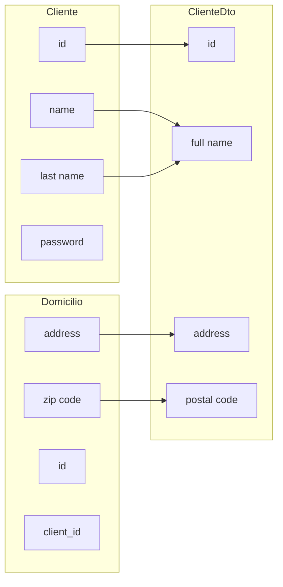

# 6.4 DTO

## 1. Data Transfer Objects

A recurring problem when we develop applications is the design of the way information must travel from the controller layer to the views or other clients, since many times out of ignorance or laziness we use domain model classes to send the data. This can cause us to return more data than necessary, or to have to make several transfers, or data with a more complex structure.

The purpose of the DTO pattern is to create a plain object (POJO) with the necessary attributes to send to the client in a single operation. It is common for a DTO to contain information from multiple entities or tables and concentrate them in a single simple class.



To build a DTO we can do it in two ways: either manually, through the setters of the DTO and the getters of the source data classes (ideal for simple sets), or create them almost automatically with the *ModelMapper* class.

## 2. The ModelMapper class

*ModelMapper*, as we have just mentioned, helps us transform one or more entities of our business model into a DTO, avoiding tedious repetitive code. Internally it will follow intelligent rules so that, based on the names of the DTO attributes and relying on the source entity and its associations with other entities, it performs attribute mapping automatically and transparently for us.

All this without performing any configuration, although it would also allow us to customize its behavior more precisely. To use *ModelMapper* we must:

1. Add its dependency to the project:

```xml
<dependency>
    <groupId>org.modelmapper</groupId>
    <artifactId>modelmapper</artifactId>
    <version>3.2.0</version>
</dependency>
```

2. We must create a `@Bean` of type ModelMapper for our entire application, in order to inject an instance and invoke its methods wherever we need them. We can do this in a configuration class in a separate file:

```java
@Configuration
public class ModelMapperConfig{
    @Bean
    ModelMapper modelMapper(){return new ModelMapper();}
}
```

3. The DTO class will be a simple class with getters and setters plus the attributes we want. The name of the DTO should contain the name of the class from which we take its attributes and may include attributes from other associated classes, prefixing the class name to the attribute name:

```java
@Getter @Setter
public class EmpleadoDTO{
    private Long id;
    private String nomnre;
    private String departamentoNombre;
}
```

4. The method of this class to generate a DTO is called `map()` and the main object from which we will obtain the data and the type of class it will return are passed as parameters:

```java
@Autowired
private ModelMapper modelMapper;
EmpleadoDTO empleadoDto = modelMapper.map(empleado, EmpleadoDTO.class);
```

DTO generation can be done at various points in the application. A typical place would be the controller, or a method within the service itself, which receives the object (or set of objects) and transforms it into a DTO.

In the following example, we obtain all employees from the database and, instead of passing them to the view, we convert them to the created DTO and send the list of DTOs.

In the controller:

```java
@GetMapping({"/", "/list"})
public String showList(Model model){
    List<Empleado> listaEmpleados = EmpleadoService.obtenerTodos();
    List<EmpleadoDTO> listaDTO = empleadoService.convertirEmpleadoToDto(listaEmpleados);
    model.addAttribute("listaEmpleados", listaDTO);
    return "empleado/listView";
}
```

And in the service:

```java
@Autowired
private ModelMapper modelMapper;
public List<EmpleadoDTO> convertEmpleadoDto(List<Empleado> listaEmpleados){
    List<EmpleadoDTO> listaEmpleadoDTO = new ArrayList<>();
    for(Empleado empleado : listaEmpleados){
        listaEmpleadoDTO.add(modelMapper.map(empleado, EmpleadoDTO.class));
    }
    return listaEmpleadoDTO;
}
```

You can check the official ModelMapper page here: [https://modelmapper.org/](https://modelmapper.org/)

> **ACTIVITY:** In the My Favourite Composer project, use DTOs generated automatically with ModelMapper for all information transfers with the view (when displaying composers or pieces, when editing, etc.).
