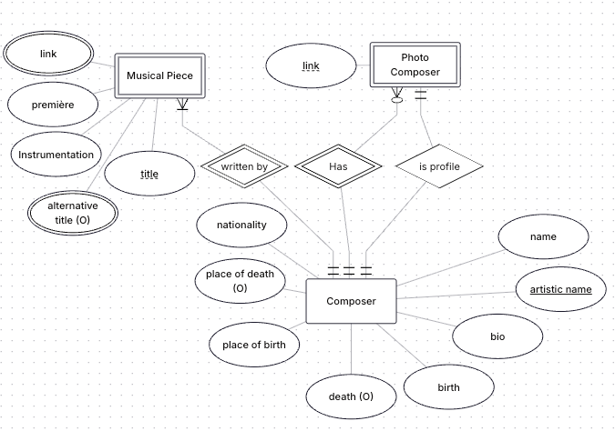

# Data Access Activity

## 6.1 Introduction to Data Access. Initial H2 Configuration in Spring

> **ACTIVITY (mini project):** Create a small application to assign tasks to students. The database has two entities, STUDENT (**id**, name) and TASK (**id**, description). Configure the application to use H2 in Spring Boot.
>
> * Configure H2 appropriately.
> * Generate a `schema.sql` file and a `data.sql` file that create the schema and insert data into H2.
>
>   * ***A student can have zero or many assigned tasks, and an assigned task can have one or many students.***
> * Check the database in the H2 console.

----

## 6.2 Entities and Repositories. Using Spring Data to Create Tables from Java Code

> **ACTIVITY 1:** Create an application using entities for relational mapping. Make a version with Lombok and another with records, but use all annotations possible. Use the H2 database.
>
> * We want a database where students (id, name, email, birth date, address, phone numbers), teachers (same attributes as students plus department, category [PERMANENT, TEMPORARY]), and subjects (id, name, description) are registered.
>
>   * A student can enroll in many subjects, and a subject can have many students.
>   * A teacher can teach many subjects, but a subject can only be taught by one teacher.
>     Note that this is not a realistic scenario; it is a simplified practice for class. Insert data using data.sql and verify that everything runs correctly in the H2 console.
>
> **IMPORTANT:** Relationships will be defined in the next section. Here we work manually as if they exist but without defining them explicitly. This is not usual, and once we see relationship mapping, we will stop doing it this way, but it serves for practice.

---

> **ACTIVITY 2:** Create the repositories for the database above. Remember to structure the project into `domain` (or `entities`), `controllers`, `repositories`, and `services`. Repositories should be injected into services or controllers using `@Autowired`.
>
> Create the following views with their respective controllers. Use the repositories interfaces:
>
> **CREATE**
>
> * `/add/alumno`: Create a form to add a student.
> * `/add/profesor`: Create a form to add a teacher.
> * `/add/subject`: Create a form to add a subject.
>
> **READ**
>
> * `/alumnos`: Shows all students
> * `/profesores`: Shows all teachers
> * `/asignaturas`: Shows all subjects
>
> **UPDATE**
>
> * `edit/alumno/{id}`: Edit the {id} student with an edit form.
> * `edit/profesor/{id}`: Edit the {id} teacher with an edit form.
> * `edit/asignatura/{id}`: Edit the {id} subject with an edit form.
> You can leave the UPDATE URIS to later, using `@Query`
>
> **DELETE**
>
> * `delete/profesor/{id}`: Deletes the {id} teacher.
> * `delete/alumno/{id}`: Deletes the {id} student.
> * `delete/asignatura/{id}`: Deletes the {id} subject.

---

> **ACTIVITY 3:** Create the following views with their respective controllers:
> * `/alumnos/{asignatura}`: Shows students enrolled in the {asignatura} course
> * `/asignaturas/{alumno}`: Shows subjects taken by {alumno}
> * `/alumnos/oldest/`: Shows the oldest student.
> * `/alumnos/findby/email`: Searches students by email and shows the results also in `/alumnos/findby/email/` (use the model object properly).

---

> **ACTIVITY 4:**
> Based on the students, courses, and teachers project:
> - Create the edit forms, if you have not created them yet. Include hidden attribute techniques from section 5.3 to manage IDs, and remember to annotate services with `@Transactional` if using a query for editing.
> Use @Query to create the following URIs:
> * `/alumnos/{profesor}`: Shows the students enrolled in subjects which are taught by {profesor}
> * `/alumnos/oldest/{num}`: Shows the *num* oldest students (being num an integer number greater than 0).

---

> **ACTIVITY 5:** Configure the application so the repository is persistent. Follow the instructions in the previous configuration section.

## 6.3 Association mapping

> **ACTIVITY 1:** Perform the corresponding mappings in the project from the previous section (the one with students, teachers, and subjects). Remember that the database was:
>
> * We want a database in which students (id, name, email, date of birth, address, phones), teachers (same attributes as students plus department, category [PERMANENT, TEMPORARY]) and subjects (id, name, description) are registered.
>
>   * A student can take many subjects and a subject can have many students.
>   * A teacher can teach many subjects, but a subject can only be taught by one teacher.
>     Check in the H2 console the correct functioning of the application. Use **unidirectional** mappings and a `@ManyToMany`. Rewrite the operations defined in the activities of the previous section using the already mapped entities.

---

> **ACTIVITY 2:** Create a new version of My Favourite Composer using:
>
> * Entities and relational mapping with Hibernate, using a persistent H2 database.
>
>   * Modify the classes so that the database properly manages primary keys and foreign keys.
> * Lombok to generate getters and setters.
> * Repositories using the Repository interfaces.
> * A package structure for services, controllers, entities, and repositories.
>   Also, organize the URIs to achieve the following:
>
> **CREATE:**
>
> * `add/composer`: Form to add composers.
> * `add/music-piece`: Form to add musical pieces.
>
> **READ**
>
> * `show/composer`: Shows all composers. Allows organizing them by different criteria (alphabetical, by date, etc.).
> * `show/music-piece`: Shows all musical pieces. Allows organizing them by different criteria (alphabetical, by date, etc.). Allows deleting pieces.
> * `search/composer`: Search composers by different criteria (name, nationality, etc.). Add `/result` for the result view. Similar to `show/composer`.
> * `search/music-piece/`: Search musical pieces by different criteria (name, instrumentation, etc.). Add `/result` for the result view. Similar to `show/music-piece`.
>
> **UPDATE**
>
> * `edit/composer/{id}`: Form to edit the composer with that {id}.
> * `edit/music-piece/{id}`: Form to edit the musical piece with that {id}.
>
> **DELETE**
>
> * `delete/composer/{id}`: Delete a composer. Choose whether you want musical pieces to be deleted in cascade, set the composer to *null*, or prevent deleting the composer until associated pieces are deleted.
> * `delete/music-piece/{id}`: Delete a musical piece.
>
> As you can see, these are the basic operations of a CRUD, so use repositories appropriately to make everything work correctly. Use services and keep a very clear separation between model, view, and controller (MVC) so that in the future, by changing only the controller, we can use a REST API. **[You can review MVC here](https://developer.mozilla.org/es/docs/Glossary/MVC)**. In this case, create the necessary views with **Thymeleaf** (they should be functional; you can reuse previous versions of the views if you see fit).
>
> Check that the database is generated correctly in the H2 console. Also check that insertions, updates, and deletions are performed properly. Use **bidirectional** mappings.
>
> For the database, you can follow a relational schema similar to this:
> 

## 6.4 DTO

> **ACTIVITY:** In the My Favourite Composer project, use DTOs generated automatically with ModelMapper for all information transfers with the view (when displaying composers or pieces, when editing, etc.).

## 6.5 Another Important JPA Concepts