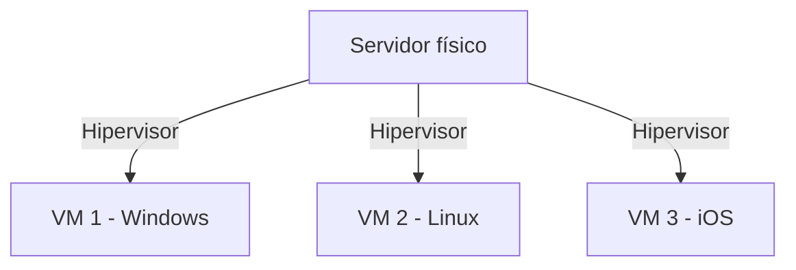
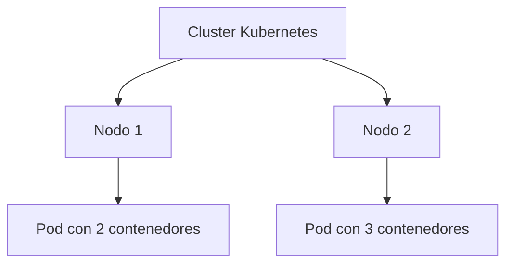

# Tecnologías de virtualización: Virtualización y Contenedores

> Información extraída de:
>
> * [AWS - ¿Qué es la virtualización?](https://aws.amazon.com/es/what-is/virtualization/)
> * [Docker - Documentación oficial](https://docs.docker.com/)
> * [Kubernetes - Documentación oficial](https://kubernetes.io/docs/home/)

## ¿Qué es la virtualización?

La virtualización es una tecnología que permite crear representaciones digitales de servidores, almacenamiento, redes y otros recursos físicos.
El software especializado (hipervisor) imita las funciones del hardware físico para que varias **máquinas virtuales** (VMs) puedan ejecutarse en paralelo dentro de un mismo servidor físico.

**Esquema básico:**



## Importancia de la virtualización

Los servidores físicos consumen electricidad, ocupan espacio, requieren refrigeración y mantenimiento. Además, suelen infrautilizarse: gran parte de su capacidad queda ociosa.
La virtualización soluciona esto permitiendo que un mismo servidor físico ejecute múltiples entornos independientes, lo que mejora la eficiencia y reduce costes.


## Ejemplo práctico

**Sin virtualización:**
Una empresa necesita tres servidores distintos para correo, aplicaciones web y aplicaciones internas. Cada uno es un servidor físico con sus propios requisitos. Resultado: gasto elevado, infrautilización de recursos y mantenimiento complejo.

**Con virtualización:**
En lugar de tres máquinas físicas, la empresa crea tres VMs en un único servidor. Cada VM tiene su propio sistema operativo y recursos configurados, pero se comparten los componentes físicos. Esto significa ahorro en hardware, energía y espacio.

---

## Máquinas virtuales y el papel del hipervisor

Una **máquina virtual** es un sistema definido por software, independiente del resto, pero alojado dentro de un servidor físico. El equipo físico se llama **host**, y las máquinas virtuales se conocen como **invitados**.

El **hipervisor** es la capa que hace posible este aislamiento y reparto de recursos.
Existen dos grandes tipos:

* **Hipervisor tipo 1 (bare metal)**: corre directamente sobre el hardware. Alta eficiencia y usado en entornos empresariales. Ejemplo: **KVM en Linux**.
* **Hipervisor tipo 2 (hosted)**: se instala sobre un sistema operativo existente. Es más sencillo y práctico para usuarios individuales o pruebas. Ejemplo: **VMware Workstation**.


## Beneficios de la virtualización

* **Uso eficiente de los recursos**: mejor aprovechamiento de CPU, memoria y almacenamiento.
* **Automatización**: despliegue de entornos repetibles con plantillas y scripts.
* **Recuperación ante desastres**: restauración rápida tras fallos o ataques, en cuestión de minutos.
* **Flexibilidad**: ejecución de distintos sistemas operativos en el mismo hardware físico.


## Tipos de virtualización

* **Servidores**: dividir un servidor físico en varios virtuales.
* **Almacenamiento**: combinar recursos de diferentes dispositivos y gestionarlos como una unidad virtual.
* **Redes**: centralizar switches, routers y firewalls en un plano virtual (ej. SDN, NFV).
* **Datos**: crear una capa que abstraiga el origen y formato de los datos para integrarlos de manera flexible.
* **Aplicaciones**: permitir que software diseñado para un sistema operativo se ejecute en otro.
* **Escritorios**: ofrecer escritorios virtuales accesibles desde dispositivos remotos, útiles para empresas con gran diversidad de usuarios.

---

## Virtualización frente a computación en la nube

La computación en la nube consiste en suministrar recursos bajo demanda a través de Internet, con pago por uso.
La nube se apoya en la virtualización, pero da un paso más: el usuario no administra directamente el hardware subyacente, sino que accede a recursos gestionados por el proveedor.

**Ejemplos con AWS**:

* **Amazon EC2**: instancias virtuales con control total sobre la configuración.
* **AWS Lambda**: ejecución de funciones sin servidores visibles para el usuario.
* **Amazon Lightsail**: entornos virtuales sencillos y de bajo coste para proyectos pequeños.

---

## Virtualización frente a contenedores

Los contenedores son otra forma de aislar y ejecutar aplicaciones, pero con un enfoque más ligero.
Mientras que las máquinas virtuales requieren un sistema operativo completo por cada instancia, los contenedores comparten el **kernel** del host y solo incluyen lo estrictamente necesario para la aplicación (código, librerías, dependencias).

**Analogía de las viviendas:**

* Una **máquina virtual** es como un **apartamento en un bloque**. Cada piso tiene paredes, instalaciones propias y aislamiento total.
* Un **contenedor** es como una **habitación dentro de una casa compartida**. Cada habitación tiene lo necesario para vivir, pero comparte instalaciones básicas como agua, electricidad y cimientos.

Esto explica por qué los contenedores consumen menos recursos y se inician más rápido que las VMs.

---

## Docker

[Docker](https://www.docker.com/) es la plataforma más extendida para crear y gestionar contenedores.
Permite empaquetar aplicaciones con todas sus dependencias, garantizando portabilidad y consistencia entre entornos de desarrollo, pruebas y producción.

**Ejemplo sencillo:**

```bash
# Ejecutar un servidor Nginx en un contenedor
docker run -d -p 8080:80 nginx
```

Ventajas principales:

* Portabilidad entre máquinas y sistemas operativos.
* Entornos reproducibles y consistentes.
* Gran ecosistema de imágenes preconstruidas en Docker Hub.

---

## Kubernetes

[Kubernetes](https://kubernetes.io/) es un sistema de **orquestación de contenedores**.
Gestiona automáticamente el despliegue, la escalabilidad y la disponibilidad de aplicaciones distribuidas en múltiples nodos.

Características destacadas:

* Automatiza el escalado según la demanda.
* Tolera fallos redistribuyendo cargas cuando un nodo falla.
* Facilita actualizaciones continuas sin interrumpir el servicio.

**Esquema simplificado:**



Un **Pod** es la unidad mínima de ejecución en Kubernetes, y puede contener uno o varios contenedores que comparten red y almacenamiento.

### Orquestación de contenedores

La **orquestación de contenedores** es el proceso de **automatizar la gestión del ciclo de vida de los contenedores** cuando se ejecutan en producción o en entornos distribuidos.

Incluye tareas como:

* **Despliegue**: lanzar contenedores en los servidores o nodos adecuados.
* **Escalado**: aumentar o reducir automáticamente el número de contenedores según la carga de trabajo.
* **Balanceo de carga**: distribuir el tráfico de red entre contenedores para evitar sobrecargas.
* **Monitorización y salud**: reiniciar contenedores fallidos y mantener la aplicación disponible.
* **Actualizaciones continuas (rolling updates)**: aplicar nuevas versiones sin interrumpir el servicio.

**Ejemplo práctico:**
Imagina que una aplicación web está compuesta por varios microservicios en contenedores (autenticación, base de datos, frontend, API). Si el tráfico aumenta, la orquestación añade automáticamente más contenedores de frontend para atender a los usuarios y, si uno falla, lo reemplaza en segundos sin intervención manual.

**Herramientas más usadas para orquestación:**

* **Kubernetes** (el estándar de facto).
* **Docker Swarm** (integrado en Docker, más sencillo).
* **Apache Mesos** (más flexible, usado en entornos grandes).
