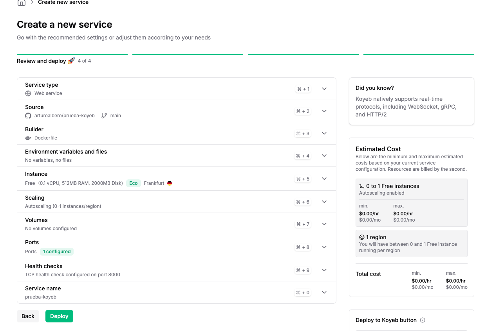
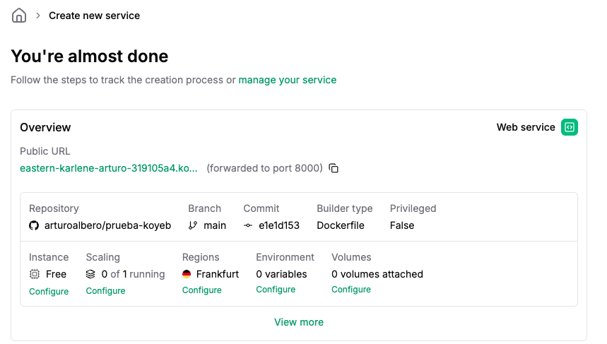
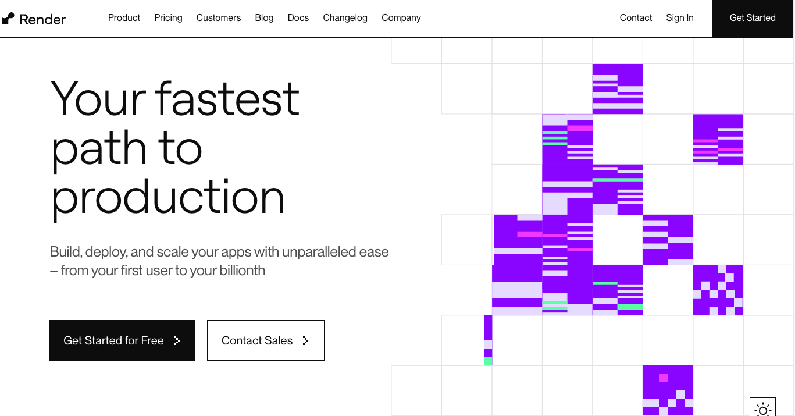
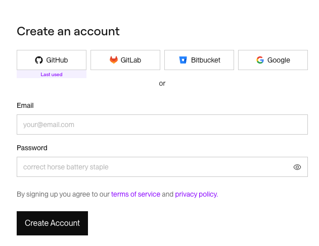
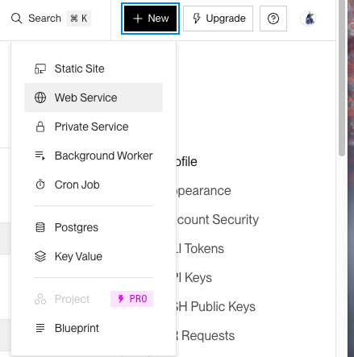
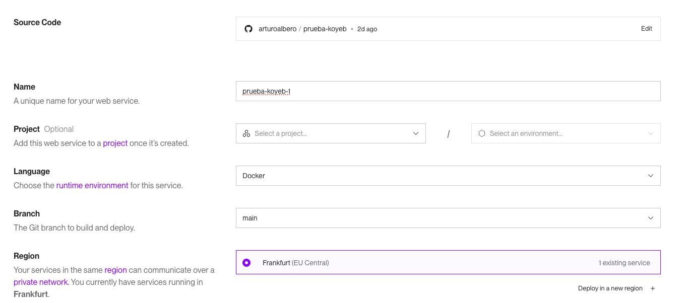
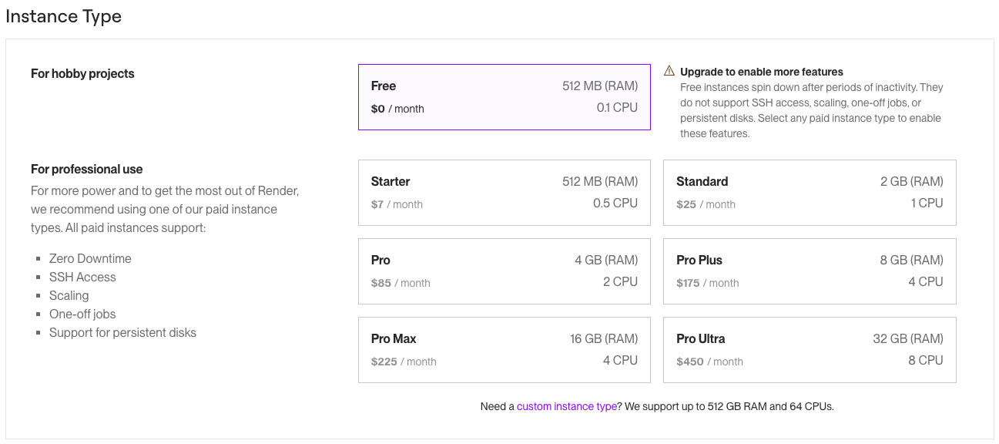
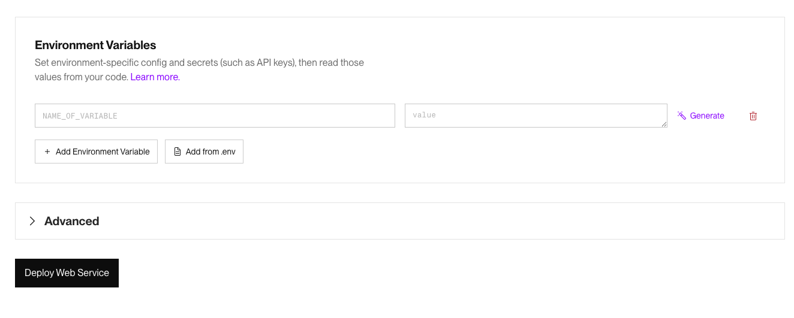
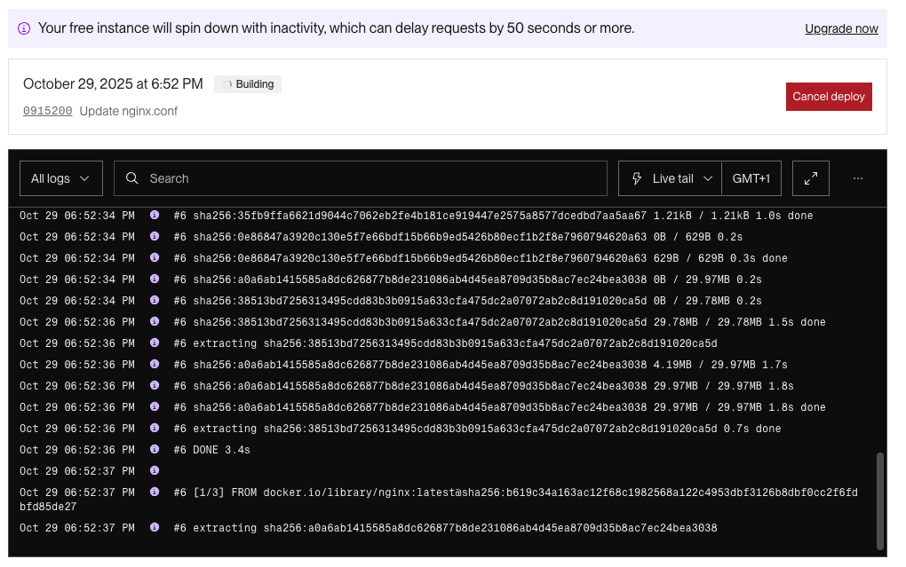

# Servidores de aplicaciones e introducción al despliegue en red

## 1. Introducción a los servidores de aplicaciones

Un servidor de aplicaciones es un software que proporciona un entorno de ejecución para aplicaciones web dinámicas. Su función principal es gestionar la lógica de negocio, actuando entre el servidor web y la base de datos. Estos servidores no solo entregan páginas HTML, sino que además ejecutan código del lado del servidor, gestionan transacciones, sesiones y conexiones y, además, proporcionan servicios comunes como seguridad, acceso a base de datos, etc. Apache Tomcat y Glassfish son ejemplos de servidores de aplicaciones Java. Los servidores web y de aplicaciones a menudo se confunden, pero no son lo mismo. A continuación una tabla para entender de forma más esquemática sus diferencias:

| Aspecto       | Servidor web          | Servidor de Aplicaciones                   |
| ------------------ | ----------------------------- | ------------------------------------ |
| **Función principal** | Sirve contenido estático (HTML, CSS, JS, imágenes). | Ejecuta aplicaciones dinámicas (Java, PHP, Python...). |
| **Procesamiento de lógica**    | No ejecuta código del lado del servidor (solo entrega archivos). | Ejecuta código (servlets, controladores, etc.).   |
| **Lenguajes**  | No tiene (entrega archivos que interpreta el navegador)   | Cada servidor usa uno o varios lenguajes (Java, Python, etc.)   |
| **Interacción con el usuario** | Responde peticiones estáticas. | Interpreta peticiones, ejecuta lógica y genera respuestas dinámicas. |
| **Ejemplos**  | NGINX, Apache HTTP Server, Caddy.  | Tomcat, WildFly, GlassFish.   |

> **ACTIVIDAD** Enumera algunos servidores de aplicaciones para Java, .NET, PHP, Ruby o Python y describe cómo funcionan. Por ejemplo, habla del caso de Django o de Ruby On Rails.

Es frecuente que los servidores web y los servidores de aplicaciones colaboren en el despliegue y funcionamiento de una aplicación web. Por ejemplo, si usamos NGINX de servidor web y Tomcat de servidor de aplicaciones, NGINX actúa como proxy inverso recibiendo las peticiones HTTP, Tomcat ejecuta la aplicación Java que genera la respuesta y NGINX entrega dicha respuesta al usuario.

El servidor de aplicaciones que usaremos en este apartado será Tomcat, concretamente la versión que viene embebida en Spring Boot y con la que ya estaréis familiarizados por el módulo Desarrollo en Entorno Servidor. Al integrar el servidor dentro del propio proyecto, se facilita mucho el despliegue. Además, es una opción ampliamente usada. Tradicionalmente, para desplegar una aplicación Java se generaba un archivo .war, se copiaba manualmente al directorio /webapps de Tomcat, se configuraba el servidor y se arrancaba. Con Spring boot, podemos incluir las dependencias `spring-boot-starter-web` (Tomcat, Spring MVC y JSON) y `spring-boot-starter-data-jpa`(conexiones de bases de datos) para facilitar el despliegue.

Sin embargo, antes de introducirnos al despliegue de aplicaciones web, vamos a ver alternativas para desplegar el trabajo de la unidad de programación anterior en la web.

> **ACTIVIDAD** Prepara alguna de tus aplicaciones de Entorno Servidor, o crea una aplicación sencilla con Spring Boot.

## 2. Introducción al despliegue en red

El objetivo final del despliegue de una aplicación web es que sea accesible para el público. Para ello, debemos pasar del entorno de pruebas que es nuestro servidor personal o docker a internet. Hay innumerables alternativas para hacerlo, y generalmente es muy sencillo una vez tienes la aplicación preparada en local. Vamos a ver cómo desplegar una aplicación web en las plataformas Koyeb y Render, a través de repositorios de Github.

### 2.1 Despliegue en la plataforma Koyeb

> **ACTIVIDAD**: Despliega la aplicación de la unidad de programación 2 en Koyeb, haciendo los cambios necesarios para que funcione. Sigue los pasos a continuación.

En este punto, vamos a trasladar todo lo que hemos hecho hasta ahora usando Docker a un servidor web real. Hay muchas opciones disponibles, pero vamos a emplear el servicio `koyeb`, que dispone de una opción gratuita. Lo primero que haremos será registrarnos en `koyeb` (podemos hacerlo con nuestra cuenta de github). Nada más comenzar, nos da acceso a un plan Pro, pero el que vamos a usar más adelante es el plan Free.

Para desplegar el proyecto en Koyeb, necesitamos crear un Dockerfile con los archivos que queramos desplegar. Dichos archivos los subiremos un repositorio de github. Antes de comenzar, debemos tener en cuenta que Koyeb por defecto escucha el puerto 8000. Deja que Koyeb gestione el HTTPS externamente. Ellos ponen su propio certificado y proxy SSL. Podemos dejar el nginx.conf así:

```nginx
events {}

http{
    include mime.types;
    server{
        listen 8000;
        root /usr/share/nginx/html;

        location /mascosas {
            alias /usr/share/nginx/html/miscosas;
        }
        # etcétera etcétera
   }
}
```

Si tenemos una estructura de carpetas así en el repositorio de github:
```bash
|- volumes-nginx/
|----|- conf/nginx/* #(TODOS LOS ARCHIVOS DE CONFIGURACIÓN)
|----|- data/nginx/html/* #(TODOS LOS ARCHIVOS HTML ESTÁTICOS)
|- dockerfile
```
El Dockerfile debe ser algo así:

```dockerfile
FROM nginx:latest

COPY volumes-nginx/conf/nginx /etc/nginx
COPY volumes-nginx/data/nginx /usr/share/nginx

```

A partir de aquí, el proceso es muy sencillo. Lo primero es crear un nuevo servicio en Koyeb e importar nuestro repositorio, copiando la dirección pública del mismo


Damos a siguiente y le indicamos que se trata de un dockerfile, para que lo monte.


Elegimos la opción gratuita.


Desplegamos el contenedor en la web. Aquí podemos configurar los puertos de la aplicación.  



Esperamos mientras se termina de desplegar. Este proceso es relativamente lento, así que deberás esperar unos minutos mientras se construye la imagen (rápido) y se despliega (más lento).



### 2.2 Despliegue en la plataforma Render

> **ACTIVIDAD** Despliega la misma aplicación que habías desplegado en Koyeb, usando el mismo repositorio y los mismos archivos, en Render.

Pasados los 7 días de prueba, Koyeb nos pedirá que o bien nos mantengamos en el plan pro pagando una mensualidad o que bajemos al plan gratuito. En el plan gratuito es necesario introducir una tarjeta de crédito válida para confirmar la identidad, por lo que puede que no nos apetezca. Una alternativa que no requiere nada de esto es [Render](https://render.com/).

De hecho, Render es más sencilla, pero nos vendrá bien tener el repositorio que usamos para desplegar la aplicación web de Koyeb. 

Lo primero, seleccionamos en la página web *get started for free*. Podemos (y debemos) iniciar sesión con nuestra cuenta de github y asociarle todos los repositorios (o, por lo menos, aquellos que queramos transformar en aplicaciones web).

Entramos con nuestra cuenta de Github.

Y seleccionamos crear un nuevo servicio web. En el menú, elegimos el repositorio que queramos desplegar.

Después, seleccionamos las opciones necesarias. En principio, la configuración por defecto funcionará a la perfección si la aplicación que compartimos ha sido desplegada previamente con Koyeb. Podemos seleccionar la región más cercana a la nuestra.

Hacemos scroll y seleccionamos el tipo de instancia, en este caso `Free`.

Bajamos y le damos a `deploy web service`.

Nos saldrá la consola del servidor con todos los `logs` donde podemos ver qué tal va el despliegue. Este proceso puede tardar unos minutos.

