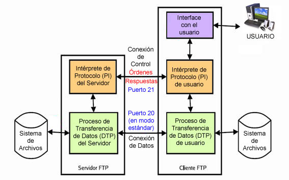
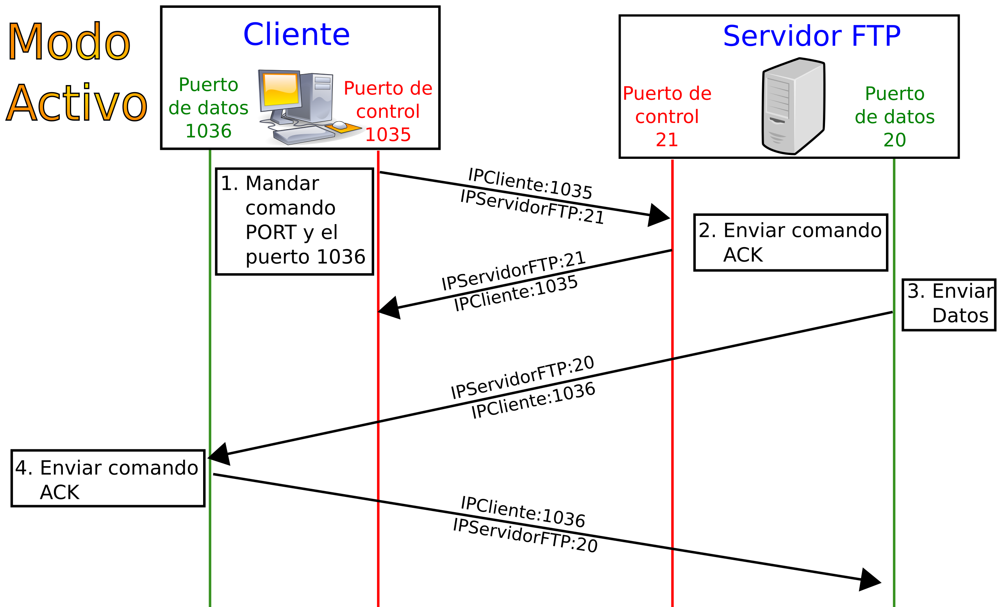
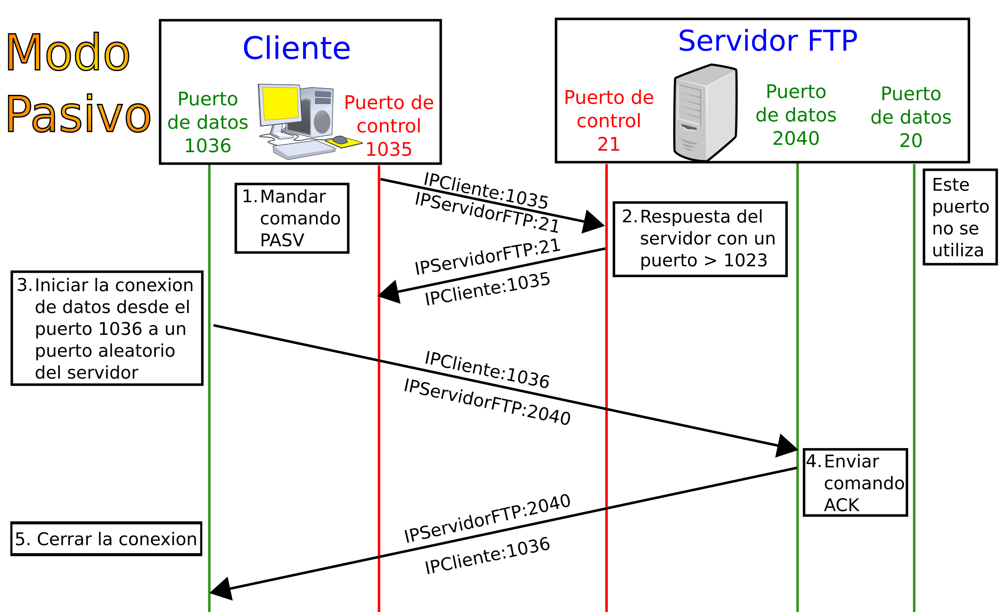
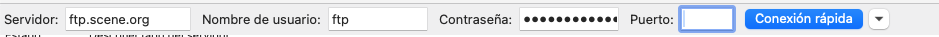

# Introducción a los servidores de transferencia de archivos

En este resultado de aprendizaje, ***"Administra servidores de transferencia de archivos, evaluando y aplicando criterios de configuración que garanticen la disponibilidad del servicio"***, vamos a aprender a instalar y configurar servidores de transferencia de archivos (FTP), crear usuarios y grupos para los accesos remotos al servidor, el modo activo y el modo pasivo, usar clientes con interfaces gráficas y en línea, conocer los protocolos seguros de transferencia de archivos (SFTP y FTPS), integrar los servidores de transferencias de archivos en el servidor web, documentarlo todo y realizarlo mediante tecnologías de virtualización como Docker.

Como cliente, emplearemos Filezilla. Como servidor emplearemos proFTPD y servidores gratuitos en la nube. Emplearemos Docker para crear una instalación de proFTP virtualizada y NGINX como servidor web.

## 1. Protocolos de transferencia de archivos

### 1.1 FTP o File Transfer Protocol

El Protocolo de transferencia de archivos (en inglés: File Transfer Protocol o FTP) es un protocolo de red para la transferencia de archivos entre sistemas conectados a una red TCP (Transmission Control Protocol), basado en la arquitectura cliente-servidor. Desde un equipo cliente se puede conectar a un servidor para descargar archivos desde él o para enviarle archivos, independientemente del sistema operativo utilizado en cada equipo.

El servicio FTP es ofrecido por la capa de aplicación del modelo de capas de red TCP/IP al usuario, utilizando normalmente el puerto de red 20 y el 21. Un problema básico de FTP es que está pensado para ofrecer la máxima velocidad en la conexión, pero no la máxima seguridad, ya que todo el intercambio de información, desde el login y password del usuario en el servidor hasta la transferencia de cualquier archivo, se realiza en texto plano sin ningún tipo de cifrado, con lo que un posible atacante puede capturar este tráfico, acceder al servidor y/o apropiarse de los archivos transferidos.


Para solucionar este problema son de gran utilidad aplicaciones como SCP y SFTP, incluidas en el paquete SSH, que permiten transferir archivos pero cifrando todo el tráfico.

> **FTP** Transferencia de ficheros, puertos 20 y 21. Prioriza velocidad por encima de la seguridad.

### 1.2 SSH o Secure Shell

SSH (o Secure SHell) es el nombre de un protocolo y del programa que lo implementa cuya principal función es **el acceso remoto a un servidor por medio de un canal seguro en el que toda la información está cifrada**. Además de la conexión a otros dispositivos, SSH permite copiar datos de forma segura (tanto archivos sueltos como simular sesiones FTP cifradas), gestionar claves RSA para no escribir contraseñas al conectar a los dispositivos y pasar los datos de cualquier otra aplicación por un canal seguro tunelizado mediante SSH y también puede redirigir el tráfico del (Sistema de Ventanas X) para poder ejecutar programas gráficos remotamente. El puerto TCP asignado es el 22.

> **SSH** Acceso remoto, similar a telnet pero cifrado. Su puerto es el 22.

### 1.3 SCP o Secure Copy Protocol

El Secure Copy Protocol (SCP), también conocido como Secure Copy, es un protocolo de sistemas informáticos que se utiliza para la transferencia de archivos de forma segura. En términos generales, este protocolo permite la transferencia de datos entre un host local y un host remoto o entre dos hosts remotos, a través del protocolo Secure Shell (SSH). Cómo característica principal de su funcionamiento, el protocolo SCP implementa un proceso de autenticación, al igual que un cifrado de transmisión para garantizar la autenticidad y seguridad.

### 1.4 SFTP o SSH File Transfer Protocol

SFTP (SSH File Transfer Protocol, «Protocolo de Transferencia de Archivos por SSH», aunque también conocido como Secure File Transfer Protocol, «Protocolo Seguro de Transferencia de Archivos») es un protocolo de red que proporciona acceso, transferencia y administración de archivos a través de cualquier flujo de datos.

Un error muy común que suele ocurrir cuando se nombra SFTP es pensar en que el protocolo SFTP se obtiene al ejecutar FTP sobre SSH, realmente estamos ante un nuevo protocolo diseñado por el grupo de trabajo IETF SECSH. Otro error generalizado es la confusión de las siglas SFTP ya que muchas veces es confundido con el Protocolo Simple de Transferencia de Archivos, un programa de línea de comando que el cliente ejecuta parte de este protocolo.

El protocolo SFTP en sí no facilita la autenticación y la seguridad, sino que espera que el protocolo subyacente proporcione esa seguridad. SFTP es utilizado frecuentemente como subsistema del protocolo SSH, al haber sido diseñadas por el mismo grupo, sin embargo, es posible ejecutarlo a través de SSH (y algunas implementaciones que lo soporten) o de otros flujos de datos. Un cliente de protocolo SFTP dispuesto a conectarse a un servidor SSH necesita conocer la ruta de acceso al binario del servidor SFTP en el lado del servidor.

### 1.5 FTPS o FTP sobre SSL

FTPS (comúnmente referido como FTP/SSL) es un nombre usado para abarcar un número de formas en las cuales el protocolo FTP puede realizar transferencias de ficheros seguras. Cada forma conlleva el uso de una capa SSL/TLS debajo del protocolo estándar FTP para cifrar los canales de control y/o datos. No debe confundirse con el protocolo seguro de transferencia de ficheros SFTP, el cual suele ser usado con SSH.

Para solucionar el problema de la confidencialidad (cifrado de los datos) en la autenticación y en la transferencia de datos, se decidió añadir una capa de seguridad SSL/TLS al propio protocolo FTP. FTPS y FTPES también se conocen como FTP over TLS/SSL, y están basados en el propio protocolo FTP.

### 1.6 Tabla comparativa

|FTP|FTP/SSL|SFTP
|--|--|--
|FTP simple|	FTP sobre TLS/SSL|	Protocolo de transferencia de archivos SSH, no tiene nada en común con el FTP original
|El protocolo de transferencia de ficheros original|A menudo llamado 'FTPS' o FTP Seguro| A menudo llamado FTP 'seguro' (aunque sea impreciso)
|Transferencia y contraseña de texto sin cifrar enviadas a través de la red| La contraseña y la transferencia están encriptadas | La contraseña y la transferencia están encriptadas
|Generalmente se ejecuta a través del puerto TCP 21|Generalmente se ejecuta a través del puerto TCP 21 o 990|Generalmente se ejecuta a través del puerto TCP 22
|Definido por RFC 959 y 1123|Definido por RFC 959 y 1123|El RFC nunca terminó
|Ampliado por RFC 3659| Ampliado por RFC 2228, 3659 y 4217

En la actualidad, SFTP es el protocolo más empleado, seguido de FTPS. FTP prácticamente no se usa más que por su utilidad didáctica.

>**RECUERDA**
> - **SFTP** = nuevo protocolo dentro de SSH (no usa FTP)
> - **FTPS** = FTP + TLS (sí usa el protocolo FTP y sus comandos: USER, PASS, PORT…)

### 1.7 Modos de conexión del cliente FTP

#### Modo activo

En modo Activo, el servidor siempre crea el canal de datos en su puerto 20, mientras que en el lado del cliente el canal de datos se asocia a un puerto aleatorio mayor que el 1024. Para ello, el cliente manda un comando PORT al servidor por el canal de control indicándole ese número de puerto, de manera que el servidor pueda abrirle una conexión de datos por donde se transferirán los archivos y los listados, en el puerto especificado.

Lo anterior tiene un grave problema de seguridad, y es que la máquina cliente debe estar dispuesta a aceptar cualquier conexión de entrada en un puerto superior al 1024, con los problemas que ello implica si tenemos el equipo conectado a una red insegura como Internet. De hecho, los cortafuegos que se instalen en el equipo para evitar ataques seguramente rechazarán esas conexiones aleatorias. Para solucionar esto se desarrolló el modo pasivo. En realidad, este enfoque presenta riesgos importantes en redes inseguras, porque obliga al cliente a aceptar conexiones entrantes en puertos altos.


#### Modo Pasivo

Cuando el cliente envía un comando PASV sobre el canal de control, el servidor FTP le indica por el canal de control, el puerto (mayor a 1024 del servidor. Ejemplo:2040) al que debe conectarse el cliente. El cliente inicia una conexión desde el puerto siguiente al puerto de control (Ejemplo: 1036) hacia el puerto del servidor especificado anteriormente (Ejemplo: 2040).

Antes de cada nueva transferencia tanto en el modo Activo como en el Pasivo, el cliente debe enviar otra vez un comando de control (PORT o PASV, según el modo en el que haya conectado), y el servidor recibirá esa conexión de datos en un nuevo puerto (aleatorio si es en modo pasivo o por el puerto 20 si es en modo activo).


### 1.8 Tabla de puertos

| Protocolo              | Control       | Datos                     | Comentario                         |
| ---------------------- | ------------- | ------------------------- | ---------------------------------- |
| FTP Activo             | 21 → servidor | 20 → cliente              | Cliente debe aceptar conexiones    |
| FTP Pasivo             | 21            | Puerto aleatorio servidor | Más seguro para cliente            |
| FTPS Explícito (FTPES) | 21            | Puerto pasivo             | TLS negociado por comando AUTH TLS |
| FTPS Implícito         | 990           | 989                       | Menos usado                        |
| SFTP                   | 22            | mismo canal               | No usa dos canales                 |

> **ACTIVIDAD 1:** Realiza el test de pruebas de AULES para comprobar que has entendido la parte teórica. Indica en la memoria las preguntas que fallaste la primera vez (fallar no resta puntuación, así que no te preocupes si no te sale muy bien). Repite el test las veces que necesites.

### 1.9 Fuentes

<details>

https://es.wikipedia.org/wiki/Protocolo_de_transferencia_de_archivos

https://www.sftp.net/sftp-vs-ftps 

https://wiki.filezilla-project.org/FileZilla_Client_Tutorial_(en)

http://www.proftpd.org/

https://es.wikipedia.org/wiki/SSH_File_Transfer_Protocol


</details>

## 2. Clientes y servidores FTP: Filezilla y ProFTPD

> **ACTIVIDAD 2:**
> Prepara el entorno de trabajo. Debe ser un repositorio de github denominado UP04 (o similar) con respaldo en tu ordenador. Puedes crearlo desde VS CODE.
> Debes tener la carpeta de la unidad abierta en VS CODE. La carpeta debe contener diferentes subcarpetas para trabajar. La primera sería 01-introduccion-a-ftp y dentro completa las actividades de este documento.

### 2.1 El cliente FTP Filezilla

Filezilla, que no tiene nada que ver con Mozilla, es una empresa que ofrece servicios gratuitos de FTP, entre ellos un cliente y un servidor. Para poder interactuar con servidores FTP, vamos a instalar un servidor FTP y conectarnos a un servidor público. Se puede instalar en el ordenador o bien usar un archivo .zip con todo lo necesario, que nos permita usarlo sin necesidad de permisos de administrador.

> **ACTIVIDAD 3:**
> Descarga Filezilla Client de esta [página web](https://filezilla-project.org/download.php?show_all=1) y elige la versión adecuada. Ejecútalo y realiza las siguientes actividades, capturando lo que sucede en los `logs` de la aplicación:
> - Conéctate a un servidor FTP público ([de esta lista](https://www.sftp.net/public-online-ftp-servers)). `ftp.scene.org` funciona (probado a 30 de noviembre de 2025).
> 
> - Descarga un archivo cualquiera, buscándolo y haciendo doble click sobre él. Documenta dónde se descarga. No lo abras.
> - Sube un archivo cualquiera, de poca importancia. Probablemente no puedas, pero documenta lo que sale por pantalla.


### 2.2 Montaje de un servidor FTP local, ProFTPD, con Docker

#### Preparación del contenedor

> **ACTIVIDAD 4:** Sigue el siguiente documento y monta un servidor FTP local a través de Docker y realiza pruebas de subida y bajada de ficheros. Documenta el proceso.

Para montar un servidor ftp en local, vamos a emplear la misma técnica que usamos para crear los certificados autofirmados. Crearemos un contenedor de Docker que use la imagen de alpine y tenga una carpeta de datos bindeada (para que podamos ver el proceso).

```bash
docker run -it --name ftp-alpine -p21:21 -p 21000-21010:21000-21010 -v ./ftp/data:/home/ftpuser -v ./ftp/conf:/etc/proftpd alpine:latest sh
```

> **NOTA**
> Muy probablemente, el puerto 21 estará ocupado, prueba a mapear un puerto distinto en tu máquina, como 2121 con `-p2121:21`. Ve probando hasta que el contenedor arranque.

Para que esto funcione, en nuestra carpeta de trabajo tenemos que tener creada la carpeta `ftp/data`, que bindearemos en el contenedor, en la carpeta del usuario que vamos a crear más adelante (`ftpuser`). También es conveniente bindear la carpeta de configuración de proftpd. 

Abrimos el puerto ftp principal, el 21, y también el rango de puertos 21000-21010 necesarios para conexiones FTP. Importante usar la imagen en modo iterativo (-it) y lanzar sh (shell).

#### Instalación de ProFTPD en el contenedor

Una vez arrancado, en la consola tenemos que instalar el servidor ftp, en este caso [proftpd](http://www.proftpd.org/). Para ello, introducimos en `shell` los siguientes comandos:

```shell
apk update
apk add proftpd
```

Alpine instalará ProFTPD en `/etc/proftpd/`. Ahora debemos crear al usuario ftpuser y apuntarnos la contraseña que le pongamos.

```bash
adduser -h /home/ftpuser -s /bin/false ftpuser
```
Una vez creado y **apuntada la contraseña** (yo le puse la misma que el usuario, aunque sea una mala práctica en realidad, es útil para no olvidarla mientras haces pruebas), debemos corregir los permisos.
```bash
chown ftpuser:ftpuser /home/ftpuser
```

#### Configuración de ProFTPD

Lo siguiente es acceder al archivo `/etc/proftpd/proftpd.conf`, que tendremos bindeado en nuestra carpeta `ftp/conf`. Copia este archivo, cambia lo que consideres. El archivo está anotado para que sepas lo que hace cada línea:

```nginx
#===
# Configuración básica de proFTPD
#===

ServerName          "Servidor FTP de pruebas"
ServerType          standalone
DefaultServer       on

# Puerto principal
Port                21

# Uso de IPv6 desactivado

UseIPv6             off

# Usuario y grupo del proceso de servidor

User                nobody
Group               nogroup

# Raíz del usuario para que estos queden enjaulados en su home
DefaultRoot         ~

# Permite que los usuarios sin shell válida se conecten (necesario porque usamos Alpine)
RequireValidShell   off

# Los puertos pasivos que necesitará Docker
PassivePorts        21000 21010

# Permisos de subida y descarga
<Limit LOGIN>
  AllowAll
</Limit>

<Limit READ WRITE>
  AllowAll
</Limit>

# Permisos por defecto de los archivos subidos
Umask                           022

# Mensajes mostrados en la conexión
AccessGrantMsg                  "Bienvenido al servidor FTP."
AccessDenyMsg                   "Acceso denegado."

```

#### Despliegue y testeo del servidor FTP

Ahora debemos lanzar el servidor ftp. Podemos lanzarlo en primer plano usando el argumento `-n`, o dejarlo en segundo plano si lo omitimos:
```shell
proftpd -n
```
No funcionará, porque alpine es una distribución minimalista y debemos añadir algunas carpetas y permisos que usa proftpd:

```bash
mkdir -p /run/proftpd # Se usa para almacenar sockets
mkdir -p /var/run/proftpd # Se usa para almacenar PIDs (procesos)
mkdir -p /var/log/proftpd # Se usa para almacenar logs
chmod 755 /run/proftpd /var/run/proftpd
```

Una vez hecho esto, le añadimos un archivo cualquiera a la carpeta `data` y vamos a empezar a conectarnos a él para hacer pruebas.

> **NOTA**
> Para no repetir todo el proceso cada vez que queramos usar el servidor de ftp, lo que debemos hacer más adelante es volver a encender el contenedor y ejecutar el shell. Para ello, podemos lanzarlo desde docker desktop o con
> ```shell
> docker start ftp-alpine
> ```
> Finalmente, debemos ejecutar en modo interactivo la aplicación shell con el siguiente comando.
> ```shell
> docker exec -it ftp-alpine sh
> ```

Para conectarnos a él, tenemos que poner en el cliente de Filezilla lo siguiente:


Poniendo el puerto que hayamos mapeado y la contraseña que hayamos escogido. Ahora ya puedes descargarte los ficheros del servidor y también subir archivos al servidor.


Más información sobre proFTPD en su [**documentación oficial**](http://www.castaglia.org/proftpd/doc/devel-guide/toc.html).

#### Creación de un Dockerfile con todo lo anterior

A continuación, vamos a aprender a crear un dockerfile con todo lo anterior, que podremos usar para posteriores despliegues combinados o dentro de un docker-compose. Partiremos del archivo de configuración que ya tenemos creado y, simplemente, haremos que la imagen se genere después de haber lanzado los comandos de shell que hacíamos manualmente.

```dockerfile
FROM alpine:latest
# Instalación de proftpd
RUN apk update
RUN apk add --no-cache proftpd
```

La opción --no-cache sirve para que no guarde la base de datos descargados en `/var/cache/apk`, por eso se utiliza en muchas de las instalaciones *dockerizadas*. Esta opción evita ocupar espacio innecesario en la imagen y reduce su tamaño final.

Continuamos con la creación del usuario. Si recuerdas, aquí teníamos que introducir la contraseña de forma manual, así que vamos a tener que hacer:

```dockerfile
# Creamos el usuario con los valores por defecto (-D), determinamos su carpeta home (-h)
# y ponemos el shell (-s) como /bin/false para que no pueda iniciar sesión en modo interactivo (así se inicia en la conexión solamente)
RUN adduser -D -h /home/ftpuser -s /bin/false ftpuser
```
En Alpine, la opción `-h` hace que el directorio home se cree automáticamente, sin necesidad de realizar un mkdir.

```dockerfile
# Enviamos la contraseña con un echo con el formato [usuario]:[contraseña].
# chpasswd recoge el mensaje y establece la contraseña para el usuario.
# Este método NO ES NADA SEGURO, porque la contraseña es visible por todos. Sirve para pruebas.
RUN echo "ftpuser:ftpuser" | chpasswd
# Damos los permisos necesarios de forma recursiva (-R)
RUN  chown -R ftpuser:ftpuser /home/ftpuser

```

Lo siguiente es crear las carpetas que necesita proftpd para funcionar en alpine y darles permisos completos:

```dockerfile
RUN mkdir -p /run/proftpd /var/run/proftpd /var/log/proftpd
RUN chmod 755 /run/proftpd /var/run/proftpd
```

Aunque aquí hayan aparecido los `RUN` por separado, lo normal es agruparlos semánticamente. Todas las instrucciones de los `RUN` se pueden combinar usando entre instrucción e instrucción el operador `&&`. Esto deja un archivo más compacto.

A continuación, de forma opcional, copiamos el archivo de configuración y exponemos los puertos. Este paso no es obligatorio ya que la apertura de puertos la haremos más adelante tanto en el run como en el docker-compose y, de la misma forma, podremos *bindear* nuestra carpeta de configuración tanto en el `run` con -v como en el `docker-compose` con `volumes:`. Eso sí, la copia de la configuración hará que no sea obligatorio *bindear* un volumen de configuración más adelante:

```dockerfile
COPY ./ftp/conf/proftpd.conf /etc/proftpd/proftpd.conf
EXPOSE 21
EXPOSE 21000-21010
```
> **RECUERDA QUE** la instrucción `EXPOSE` no abre puertos, solamente los documenta dentro de la imagen.

Finalmente, le decimos a dockerfile que la imagen, al lanzarse en un contenedor, ejecute un comando.

```dockerfile
CMD ["proftpd", "-n"]
```
La diferencia entre RUN y CMD es que RUN se ejecuta ANTES de crear la imagen, cuando se ejecuta el comando `build`, con lo cual dicha imagen ya viene con todo eso ejecutado. Sin embargo, CMD se ejecuta al instanciar la imagen en un contenedor (lo que lo convierte en el proceso principal).


> **ACTIVIDAD 5** Realiza un dockerfile para construir una imagen a partir de todo lo que hemos trabajado en la actividad anterior.

- Desde la imagen alpine
- Crea las carpetas necesarias
- Copia los archivos de configuración necesarias, aunque el bindeo será requerido
- Realiza los comandos adecuados para funcionar. Esto es complejo.

> **ACTIVIDAD 6** Crea un archivo `docker-compose.yml` que te sirva para lanzar un contenedor a partir del dockerfile creado en la actividad anterior.