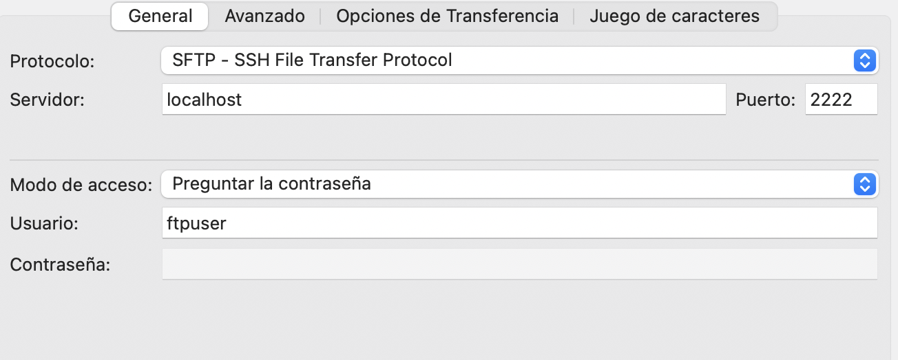

# Seguridad en los servidores de transferencia de archivos

## Módulos en ProFTPD

Para poder implementar tanto FTPS como SFTP, ProFTPD se nutre de módulos. Los módulos son programas en lenguaje C con las funcionalidades extra que queremos usar. Tenemos que tenerlos en nuestro ordenador, o dentro del contenedor que estemos usando, y activarlos en el archivo de configuración `proftpd.conf`. A continuación, veremos la implementación de ambos protocolos gracias a los módulos.

Recuerda que es necesaria la instalación de proftpd como se vio en el apartado anterior. Si reiniciamos el contenedor, las instrucciones del `shell` las tendremos que invocar mediante `docker exec [contenedor] [instrucción]`. `docker restart [contenedor]` también nos puede ser de utilidad.

Para hacer pruebas, es recomendable lanzar proftpd como demonio, es decir, simplemente ejecutando `proftpd` (sin el -n). De esta forma, seguimos teniendo acceso a la consola para poder pararlo si hay algún problema usando:

```bash
pkill proftpd
```


## Implementación de FTPS en ProFTPD

Para experimentar FTPS, vamos a crear un contenedor llamado `ftps-alpine` con una configuración muy similar a `ftp-alpine`. Para habilitar FTPS necesitamos un certificado y una clave. Genéralos como vimos en capítulos anteriores y colócalos en una carpeta de certificados. La *bindearemos* a la carpeta `/etc/proftpd/ssl/` del contenedor. Ejecutamos:

```bash
docker run -it --name ftps-alpine -p2121:21 -p21000-21010:21000-21010 -v ./ftp/data:/home/ftpuser -v ./ftp/conf:/etc/proftpd -v ./ftp/certs/:/etc/proftpd/ssl/ alpine:latest sh 
```

Y procedemos a la instalación de proftpd, como vimos en la anterior actividad.

ProFTPD permite la implementación del protocolo FTPS a través del módulo `mod_tls`. El módulo debe instalarse en el terminal con `apk add proftpd-mod_tls`. 

FTPS no es más que el FTP tradicional usando una capa de seguridad a través de un certificado TLS. En [la unidad 2, punto 5, aprendimos a generar estos certificados](ES-DESPLIEGUE-APW/02-servidores-web/05-certificados-digitales-e-introduccion-al-despliegue-en-red.md).

Existen dos tipos de FTPS, explícito e implícito. Este último se considera obsoleto y cifraba desde el principio de la conexión, usando el puerto 990. El FTPS explícito se conecta por el puerto 21 y es entonces cuando establece el cifrado mediante `AUTH TLS`.


Para activar TLS, en el archivo de configuración debemos activar el módulo. El archivo de configuración debería quedar así:

```proftpd
#===
# Configuración básica de proFTPD
#===

ServerName          "Servidor FTP de pruebas"
ServerType          standalone
DefaultServer       on

# Puerto principal
Port                21

# Uso de IPv6 desactivado

UseIPv6             off

# Desactivamos el soporte de logs wtpm

WtmpLog off

# Usuario y grupo del proceso de servidor. Este diseño es solo apto para pruebas, lo normal es definir un usuario y un grupo.

User                nobody
Group               nogroup

# Raíz del usuario para que estos queden enjaulados en su home
DefaultRoot         ~

# Permite que los usuarios sin shell válida se conecten (necesario porque usamos Alpine)
RequireValidShell   off

# Enmascaramiento de la dirección interna, necesario para Docker. Si se va a probar fuera de localhost, MasqueradeAddress debe ser la IP externa accesible.

MasqueradeAddress 127.0.0.1

# Los puertos pasivos que necesitará Docker al usar FTPS

PassivePorts        21000 21010

# Permisos de subida y descarga
<Limit LOGIN>
  AllowAll
</Limit>

<Limit READ WRITE>
  AllowAll
</Limit>

# Permisos por defecto de los archivos subidos
Umask                           022

# Mensajes mostrados en la conexión
AccessGrantMsg                  "Bienvenido al servidor FTP."
AccessDenyMsg                   "Acceso denegado."

# Uso de mod_dso para cargar mod_tls, ya que la versión de alpine así lo requiere:

<IfModule mod_dso.c>
    # If mod_tls was built as a shared/DSO module, load it (de la documentación oficial)
    LoadModule mod_tls.c
</IfModule>

<IfModule mod_tls.c>

  TLSEngine                   on
  TLSLog                      /var/log/proftpd/tls.log

  TLSRSACertificateFile       /etc/proftpd/ssl/certificate.crt
  TLSRSACertificateKeyFile    /etc/proftpd/ssl/private.key

  # Solo permitimos conexiones cifradas
  TLSRequired                 on

  # Protocolos mínimos seguros
  TLSProtocol                 TLSv1.2

 
</IfModule>
```

Activamos el módulo mediante etiquetas similares a las de un xml, como todas las directivas de ProFTPD, y dentro ponemos los parámetros necesarios para el módulos, en pares parámetro-valor.

Observamos el uso de `mod_dso`. Puedes indagar más sobre él en la [documentación oficial de proftpd](http://www.proftpd.org/docs/modules/mod_dso.html). Se trata de un módulo compilado de manera independiente que ProFTPD puede cargar dinámicamente en tiempo de ejecución, sin necesidad de recompilar el servidor. Permite añadir funcionalidades como `mod_tls` o `mod_sftp` de forma flexible.

> **NOTA:**
> Si queremos usar grupos y usuarios, debemos dar permisos a las carpetas del ssh:
> ```bash 
> chmod 600 /etc/proftpd/ssh_host_*
> chown nobody:nogroup /etc/proftpd/ssh_host_*
> ```
> En pruebas de aprendizaje no es necesario, pero en producción real sí es fundamental restringir los permisos de forma efectiva.


Para probar que todo funciona, en Filezilla debemos seleccionar:

```text
Protocolo: FTP

Cifrado: Requiere FTPS explícito (FTP sobre TLS)
```

Usa [**estas instrucciones**](https://www.snel.com/support/connect-with-ftps-using-filezilla/) para crear conexiones personalizadas. 


Si el certificado es autofirmado, el cliente pedirá confirmación.

> **ACTIVIDAD 1** Implementa un servidor FTPS explícito en Docker siguiendo los pasos anteriores. Comprueba su funcionamiento correcto en Filezilla.

Para más información, puedes consultar la documentación oficial aquí: http://www.proftpd.org/docs/howto/TLS.html 

## Implementación de SFTP en ProFTPD

SFTP es un protocolo de transferencia de ficheros totalmente distinto a FTPS que funciona en el puerto `22`. SFTP solamente usa el canal SSH. Además, a diferencia de FTPS, SFTP no necesita puertos pasivos (21000-21010), por lo que no hay que mapearlos.

Por este motivo, debemos cambiar nuestra configuración al crear el contenedor. Recuerda que si el puerto está en uso, cuando mapeamos puertos lo podemos sustituir por cualquier otro, como `2222`. Debemos ejecutar Docker Run para crear el contenedor:

```bash
docker run -it --name sftp-alpine -p2222:22 -v ./ftp/data:/home/ftpuser -v ./ftp/conf:/etc/proftpd -v ./ftp/certs/:/etc/proftpd/ssl/ alpine:latest sh
```
Realiza la configuración inicial de proftpd. Como vamos a necesitar generar claves SSH, puedes bindear en una de tus carpetas la carpeta `/etc/proftpd/` del contenedor. En esa carpeta almacenamos las claves SSH, que podemos generar con el programa `ssh-keygen`.
Instalamos open-ssh:
```bash
apk add --no-cache openssh-keygen
```
Y luego ejecutamos:

```bash
ssh-keygen -t rsa   -f /etc/proftpd/ssh_host_rsa_key    -N ""
ssh-keygen -t ecdsa -f /etc/proftpd/ssh_host_ecdsa_key -N ""
```

SFTP utiliza un solo canal cifrado sobre SSH (protocolo 22), y es normalmente más sencillo de manejar a nivel de puertos y NAT. Es importante destacar que ProFTPD no usa el SSH del sistema, sino el suyo propio.

Como sucedía con FTPS, ProFTPD no incluye SFTP por defecto: se habilita mediante el módulo mod_sftp. En Alpine, ProFTPD suele incluir el módulo. Podemos comprobarlo con el siguiente comando:

```
proftpd -l
```
Que debería devolver los módulos, entre ellos:
```
mod_sftp.c
mod_sftp_pam.c
```

Si no está instalado, lo añadimos con la línea `apk add proftpd-mod_sftp`. Si tenemos `mod_dso.c`, lo podemos añadir de forma dinámica en el archivo de configuración con:

```text
<IfModule mod_dso.c>
    LoadModule mod_sftp.c
</IfModule>
```

Finalmente, se nos queda el archivo de configuración aproximadamente así:

```proftpd
#===
# Configuración básica de ProFTPD para SFTP en Alpine
#===

ServerName          "Servidor SFTP de pruebas"
ServerType          standalone
DefaultServer       on

# Puerto principal para SFTP
Port                22

# IPv6 desactivado
UseIPv6             off

# Logs
WtmpLog             off


# Usuario y grupo del proceso
User                nobody
Group               nogroup

# Raíz del usuario (enjaulamiento)
DefaultRoot         ~

# Permitir usuarios sin shell válida (Alpine)
RequireValidShell   off

# Permisos de login
<Limit LOGIN>
  AllowAll
</Limit>

# Permisos por defecto de archivos subidos
Umask               022

# Mensajes
AccessGrantMsg      "Bienvenido al servidor SFTP."
AccessDenyMsg       "Acceso denegado."

# Carga de módulos DSO
<IfModule mod_dso.c>
  LoadModule mod_sftp.c
</IfModule>

# Configuración de SFTP
<IfModule mod_sftp.c>
    SFTPEngine on

    # Claves host SSH generadas
    SFTPHostKey /etc/proftpd/ssh_host_rsa_key
    SFTPHostKey /etc/proftpd/ssh_host_ecdsa_key

</IfModule>  
```

Como se puede observar, el archivo de configuración de SFTP es más sencillo que el de FTPS. SFTP no requiere puertos pasivos, a diferencia de FTPS.

Igual que antes, para comprobar que funciona, debemos conectarnos al servidor con Filezilla estableciendo como protocolo: `SFTP - SSH File Transfer Protocol` y como puerto el 2222 (o el hayamos abierto).



> **ACTIVIDAD 2** Implementa un servidor SFTP en Docker siguiendo los pasos anteriores. Comprueba su funcionamiento correcto en Filezilla.

Para más información, puedes consultar la documentación oficial aquí: http://www.proftpd.org/docs/contrib/mod_sftp.html 

## Combinación de ProFTPD y NGINX

La mala noticia es que, a diferencia de lo que sí podíamos hacer con tomcat en la unidad anterior, NGINX no puede hacer de proxy con ProFTPD. Esto se debe a que el protocolo es más complejo y requiere varios puertos para funcionar correctamente. 

Sin embargo, lo que sí puede hacer y se hace muy a menudo, es servir archivos desde el servidor FTP, de la misma forma que podría conectarse a una base de datos desde un servidor de bases de datos.

Básicamente, lo que tenemos que hacer es lanzar un contenedor de NGINX que sirva archivos pidiéndoselos al servidor FTP haciendo que:

- ProFTPD gestione uploads y descargas por FTP/FTPS/SFTP
- NGINX sirva esos mismos archivos por HTTP/HTTPS

Para ello, en `docker`, debemos lanzar los dos contenedores y conectarlos a través de una red.

> **ACTIVIDAD 3** Transforma los contenedores anteriores en imágenes. Puedes usar el comando `docker commit` para ello. Busca información aquí: https://docs.docker.com/reference/cli/docker/container/commit/ 
> Es algo relativamente habitual cuando creas manipulas el contenedor a través de una shell, como estamos haciendo nosotros, y quieres "imprimir" el estado actual para que otros lo usen.
> - Haz una imagen del contenedor FTP (`proftpd-ftp`), otra del FTPS(`proftpd-ftps`) y otra del contenedor SFTP(`proftpd-sftp`).

Una vez tengamos los contenedores, podemos lanzarlos:

```bash
docker run -d --name proftpd -p 21:21 -p 21000-21010:21000-21010 -v ./ftp/conf:/etc/proftpd -v ./ftp/data:/home/ftpuser proftpd-ftps
```
> **NOTA** Lo ideal es que no se llamen igual, así que prueba a ponerles los nombres de las imágenes o cualquier otro que te resulte significativo.

A continuación, lanzamos el contenedor NGINX, bindeando la configuración:

```bash
docker run -d --name nginx -p 80:80 -p 443:443 -v ./nginx/conf:/etc/nginx/conf.d -v ./ftp/data:/usr/share/nginx/html/ nginx:latest
```

Con este *bindeo* `-v ./ftp/data:/usr/share/nginx/html/` le indicamos al servidor nginx que su carpeta de html es la misma que la carpeta donde los datos de nuestro servidor de ftp se descargan.

Cuando lo tenemos todo listo y funcionando, los conectamos mediante una red:

```bash
docker network create mynet
docker network connect mynet proftpd
docker network connect mynet nginx
```
> **NOTA** No olvides hacerlo en modo detached `-d` para poder ejecutar un comando detrás de otro.

> **ACTIVIDAD 4** Haz que colaboren tus tres servidores FTP con el servidor web NGINX. Haz las siguientes pruebas con cada uno de los servidores FTP (FTP, FTPS y SFTP):
- Sube la página web por el servidor FTP usando filezilla.
- Ábrela en el navegador servida por NGINX.

> **ACTIVIDAD 5** Realiza el test de repaso de AULES para comprobar tu conocimiento. Esta vez es de la unidad al completo. Indica en la memoria las preguntas que fallaste la primera vez (fallar no resta puntuación, así que no te preocupes si no te sale muy bien). Repite el test las veces que necesites.
