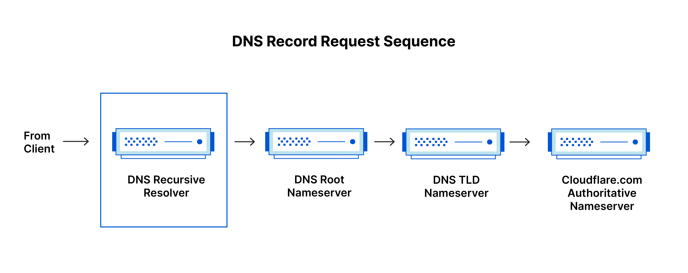
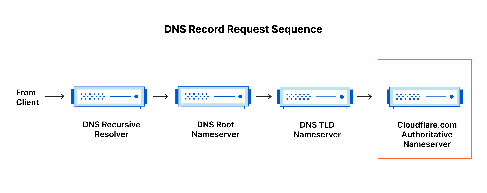
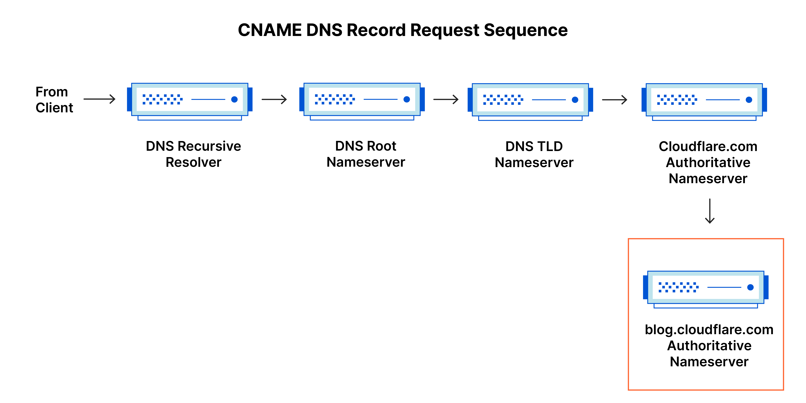
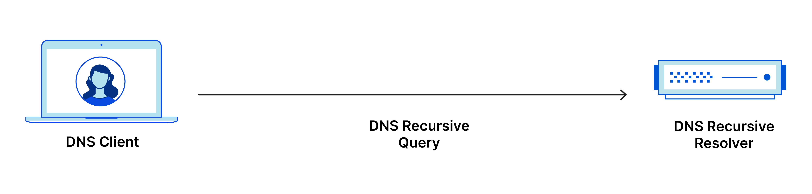

# Servicios de Nombres de Dominio (DNS)

## Sistema de Nombres de Dominio (DNS)

> **ACTIVIDAD 1:** Lee el siguiente texto extraído de cloudflare y completa las preguntas de tipo test incluidas en AULES. Anota los errores o cosas que te resulten llamativas en la memoria.

[Fuente.](https://www.cloudflare.com/es-es/learning/dns/what-is-dns/)

El Sistema de Nombres de Dominio (DNS) es un sistema jerárquico y distribuido que permite traducir nombres de dominio legibles por humanos en direcciones IP. Cada dispositivo conectado a Internet tiene una dirección IP única que otros equipos pueden usar para encontrarlo. Los servidores DNS suprimen la necesidad de que los humanos memoricen direcciones IP tales como 192.168.1.1 (en IPv4) o nuevas direcciones IP alfanuméricas más complejas, tales como 2400:cb00:2048:1::c629:d7a2 (en IPv6).

Las aplicaciones web dependen del DNS para resolver el nombre del servidor web, localizar servicios (web, LDAP, correo, etc.) o garantizar la accesibilidad y coherencia del despliegue. El proceso de solución de DNS supone convertir un nombre de servidor (como www.example.com) en una dirección IP compatible con el ordenador (como 192.168.1.1). 

Se da una dirección IP a cada dispositivo en Internet, y esa dirección será necesaria para encontrar el dispositivo apropiado de Internet, al igual que se usa la dirección de una calle para encontrar una casa concreta. Cuando un usuario quiere cargar una página, se debe traducir lo que el usuario escribe en su navegador web (example.com) a una dirección que el ordenador pueda entender para poder localizar la página web de example.com.

## Los servidores DNS implicados en la carga de un sitio web

- **Recursor de DNS:** es como un bibliotecario al que se le pide que busque un libro determinado en la biblioteca. El recursor DNS es un servidor diseñado para recibir consultas desde equipos cliente mediante aplicaciones como navegadores web. Normalmente, el recursor será el responsable de hacer solicitudes adicionales para satisfacer la consulta de DNS del cliente.
- **Servidor de nombres raíz:** el servidor de raíz constituye el primer paso para traducir (resolver) los nombres de servidor legibles en direcciones IP. Se puede comparar a un índice en una biblioteca que apunta a diferentes estanterías de libros. Generalmente sirve como referencia de otras ubicaciones más específicas.
- **Servidor de nombres TLD:** el servidor de dominio de nivel superior (TLD) se puede comparar con una estantería de libros en una biblioteca. Es el paso siguiente en la búsqueda de una dirección IP específica y aloja la última parte de un nombre de servidor (en example.com, el servidor TLD es "com").
- **Servidor de nombres autoritativo:** se puede interpretar como un diccionario en una estantería de libros, en el que se puede consultar la definición de un nombre específico. El servidor de nombres autoritativo es la última parada en la consulta del servidor de nombres. Si cuenta con acceso al registro solicitado, devolverá la dirección IP del nombre del servidor solicitado al recursor de DNS (el bibliotecario) que hizo la solicitud inicial.

## Diferencias entre un servidor de DNS autoritativo y un solucionador de DNS recursivo

Ambos conceptos se refieren a servidores (grupos de servidores) que son fundamentales para la infraestructura de DNS, pero cada uno desempeña un papel diferente y se encuentra en diferentes ubicaciones dentro del trayecto de una consulta de DNS. Una forma de entender la diferencia es que el solucionador recursivo está al inicio de la consulta DNS y el servidor de nombres autoritativo al final.

### Solucionador de DNS recursivo

El solucionador recursivo es el equipo que responde a una solicitud recursiva del cliente y dedica tiempo a detectar el registro DNS. Lo hace mediante una serie de solicitudes hasta que alcanza al servidor de nombres DNS autoritativo para el registro solicitado (o se vuelve inactivo o devuelve un error si no se encuentra ningún registro). 

Afortunadamente, los solucionadores de DNS recursivos no siempre tienen que hacer varias solicitudes para inspeccionar los registros necesarios para responder a un cliente. El almacenamiento en caché es un proceso de persistencia de datos que ayuda a saltarse las solicitudes necesarias sirviendo antes el registro del recurso solicitado en la búsqueda DNS.

### Servidor DNS autoritativo

En resumen, un servidor DNS autoritativo es un servidor que alberga realmente registros de recursos DNS y es responsable de los mismos. Este es el servidor al final de la cadena de búsqueda DNS que responderá con el registro del recurso consultado, permitiendo finalmente que el navegador web haga la solicitud para llegar a la dirección IP necesaria para acceder a un sitio web u otros recursos web. Un servidor de nombres autoritativo puede satisfacer solicitudes de sus propios datos sin necesidad de consultar a otros recursos, ya que es la fuente final de verdad para ciertos registros DNS.

Conviene mencionar que en los casos de consultas relativas a subdominios, tales como foo.example.com o blog.cloudflare.com, se añadirá un servidor de nombres adicional a la secuencia después del servidor de nombres autoritativo, que es el responsable de almacenar el registro CNAME del subdominio.

Hay una diferencia fundamental entre muchos servicios de DNS y el que proporciona Cloudflare. Diferentes proveedores de soluciones recursivas de DNS tales como Google DNS, OpenDNS y proveedores como Comcast mantienen instalaciones de centro de datos de proveedores de soluciones recursivas de DNS. Estos proveedores de soluciones permiten consultas rápidas y fáciles mediante clústeres optimizados de sistemas de equipo optimizados para DNS, pero son esencialmente diferentes de los servidores de nombres alojados por Cloudflare.

Cloudflare mantiene infraestructura de servidores de nombres que son básicos para el funcionamiento de Internet. Un ejemplo clave es la red de servidores F-root, de cuyo alojamiento es parcialmente responsable Cloudflare. F-root es uno de los componentes de la infraestructura del servidor de nombres DNS en el nivel de raíz, responsable de miles de millones de solicitudes en Internet cada día. Nuestra red Anycast nos sitúa en una posición única para gestionar grandes volúmenes de tráfico DNS sin interrupción del servicio.

## Los pasos de una búsqueda de DNS

En la mayoría de situaciones, el DNS hace referencia a un nombre de dominio que está siendo traducido a la dirección IP apropiada. Para ver más información acerca de como funciona el proceso, sirve de ayuda seguir la ruta de una búsqueda de DNS, en su viaje desde un navegador web, a través del proceso de búsqueda de DNS, y de vuelta de nuevo. Analicemos los pasos.

> **Nota:** Con frecuencia, la información de búsqueda de DNS se almacenará en la caché en local dentro del equipo que realice la consulta o en remoto en la infraestructura de DNS. Generalmente, hay 8 pasos en una búsqueda DNS. Cuando la información de DNS se almacena en caché, se omiten los pasos del proceso de búsqueda DNS, lo cual lo hace más rápido. 

El ejemplo a continuación describe los 8 pasos necesarios cuando no se ha almacenado nada en caché.

1. Un usuario escribe “example.com” en un navegador web y la consulta recorre Internet y es recibida por un solucionador de DNS recursivo.

2. El solucionador consulta a continuación un servidor de nombres raíz de DNS (.).

3. El servidor raíz responde a continuación al solucionador con la dirección de un servidor de DNS de dominio de primer nivel (TLD) (p.ej. .com o .net), que almacena la información para sus dominios. Al buscar example.com, nuestra solicitud se dirige al TLD .com.

4. El solucionador hará a continuación una solicitud al dominio de primer nivel .com.

5. El servidor TLD responderá a continuación con la dirección IP del servidor de nombres del dominio, example.com.

6. Finalmente, el solucionador recursivo envía una consulta al servidor de nombres del dominio.

7. Por ejemplo, la dirección IP se devolverá al solucionador desde el servidor de nombres.

8. El solucionador de DNS responderá a continuación al navegador web con la dirección IP del dominio solicitado inicialmente.

Una vez que los 8 pasos de la búsqueda del DNS han devuelto la dirección IP para example.com, el navegador podrá hacer la solicitud para la página web:

9. El navegador hará una solicitud de HTTP a la dirección IP.

10. El servidor en esa dirección IP devuelve la página web para que se procese en el navegador (paso 10).

## Solucionador de DNS

El solucionador de DNS es la primera parada en la búsqueda de DNS, y se encarga de tratar con el cliente que hizo la solicitud inicial. El solucionador inicia la secuencia de consultas que llevan en última instancia a que la URL se traduzca a la dirección IP necesaria.

> **Nota:** una búsqueda de DNS no almacenada en caché incluirá consultas recursivas e iterativas.

Es importante diferenciar entre una consulta de DNS recursivo y un solucionador de DNS recursivo. La consulta se refiere a la solicitud hecha a un solucionador de DNS que requiere la resolución de la consulta. Un solucionador de DNS recursivo es el ordenador que acepta una consulta recursiva y procesa la respuesta haciendo las solicitudes necesarias.

## Tipos de consulta DNS

En una búsqueda de DNS habitual se producen tres tipos de consultas. Al usar una combinación de estas consultas, un proceso optimizado para la solución de DNS puede conllevar una reducción de la distancia recorrida. En una situación ideal, los datos de registro almacenados en la memoria caché estarán disponibles, lo cual permitirá que un servidor de nombres DNS devuelva una consulta no recursiva.

1. **Consulta recursiva:** en una consulta recursiva, un cliente DNS requiere que un servidor DNS (generalmente un solucionador de DNS recursivo) responda al cliente con el registro del recurso solicitado o un mensaje de error si el solucionador no puede encontrar el registro.

2. **Consulta iterativa:** en esta situación, el cliente DNS permitirá que un servidor DNS devuelva la mejor respuesta posible. Si el servidor DNS consultado no cuenta con un nombre que corresponda con el de la consulta, devolverá una referencia a un servidor DNS autoritativo para un nivel inferior del espacio de nombres de dominio. El cliente DNS hará a continuación una consulta a la dirección de referencia. Este proceso continúa con servidores DNS adicionales que siguen en la cadena de consulta hasta que se produzca un error o se supere el tiempo de espera.

3. **Consulta no recursiva:** generalmente se produce cuando un cliente solucionador de DNS consulta a un servidor DNS por un registro al que tiene acceso porque o bien es autoritativo para el registro o el registro existe dentro de su caché. Generalmente, el servidor DNS almacenará en caché registros DNS para prevenir el consumo de ancho de banda adicional y la carga en los servidores que preceden en la cadena.

## Almacenamiento en caché de DNS

El objetivo del almacenamiento en caché es guardar datos en una ubicación temporalmente para lograr mejoras en el rendimiento y fiabilidad en las solicitudes de datos. El almacenamiento en caché de DNS guarda datos más cerca del cliente solicitante para que la consulta DNS se pueda resolver antes y las consultas adicionales que siguen en la cadena de búsqueda DNS se puedan evitar, mejorando de este modo los tiempos de carga y reduciendo el consumo de ancho de banda/CPU. 

Los datos de DNS se pueden almacenar en caché en diversas ubicaciones. Cada una de ellas guardará los registros DNS durante una cantidad de tiempo establecida, determinada por el tiempo de vida (TTL).

### Almacenamiento en caché del DNS del navegador

Los navegadores web modernos están diseñados de forma predeterminada para almacenar en la memoria caché registros DNS por una cantidad establecida de tiempo. El objetivo aquí es obvio, cuanto más cerca esté el almacenamiento en caché del DNS al navegador web, menos pasos de procesamiento se necesitarán para verificar la caché y hacer las solicitudes correctas para una dirección IP. 

Cuando se hace una solicitud para un registro DNS, la memoria caché del navegador es la primera ubicación que se comprueba para el registro solicitado.

En Chrome, puedes ver el estado de tu caché de DNS en chrome://net-internals/#dns.

### Almacenamiento en caché de DNS a nivel de sistema operativo

El solucionador de DNS de nivel del sistema operativo es la segunda y última parada local antes de que una consulta de DNS deje tu equipo. El proceso en el interior de tu sistema operativo que está diseñado para gestionar esta consulta se conoce como "solucionador stub" o cliente DNS. 
Cuando un solucionador stub recibe una solicitud de una aplicación, revisa en primer lugar su propio caché para comprobar si tiene el registro. Si no lo tiene, entonces envía una consulta DNS (con una marca recursiva establecida) fuera de la red local a un solucionador recursivo de DNS dentro del proveedor de servicios de Internet (ISP).

Cuando el solucionador recursivo dentro del ISP recibe una consulta DNS, como en todos los pasos anteriores, también verificará si la traducción solicitada de la dirección IP al servidor ya está almacenada dentro de la capa de persistencia local.

El solucionador recursivo también tiene una funcionalidad adicional según los tipos de registros que tenga en su caché:

1. Si el solucionador no tiene los registros A, pero tiene los registros NS de los servidores de nombres autoritativos, consultará a estos servidores de nombres directamente, omitiendo varios pasos en la consulta DNS. Este atajo previene las búsquedas de los servidores de nombres raíz y .com (en nuestra búsqueda para example.com) y contribuye a que la resolución de la consulta DNS sea más rápida.

2. Si el solucionador no tiene los registros NS, enviará la consulta a los servidores TLD (.com en nuestro caso), saltándose el servidor raíz.

3. En el caso improbable de que el solucionador no tenga registros que señalen los servidores TLD, consultará entonces a los servidores raíz. Esto ocurre habitualmente cuando se ha purgado una caché de DNS.
