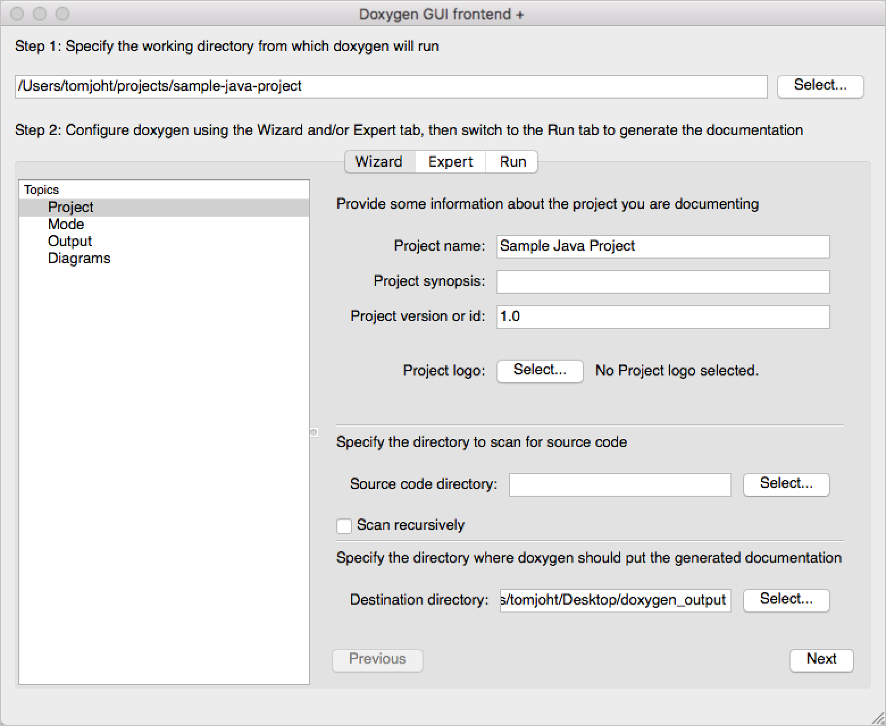
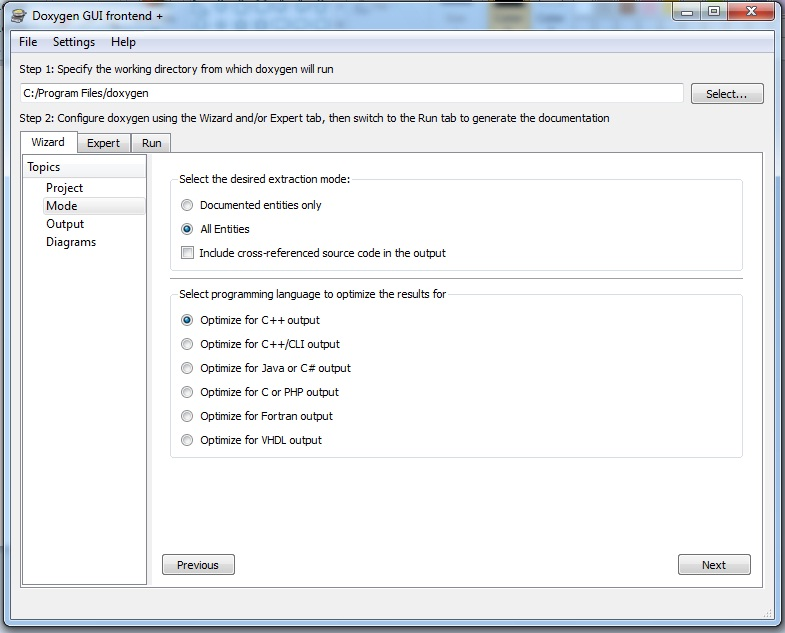
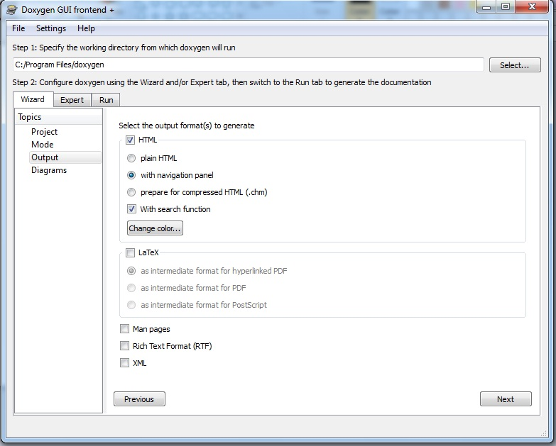
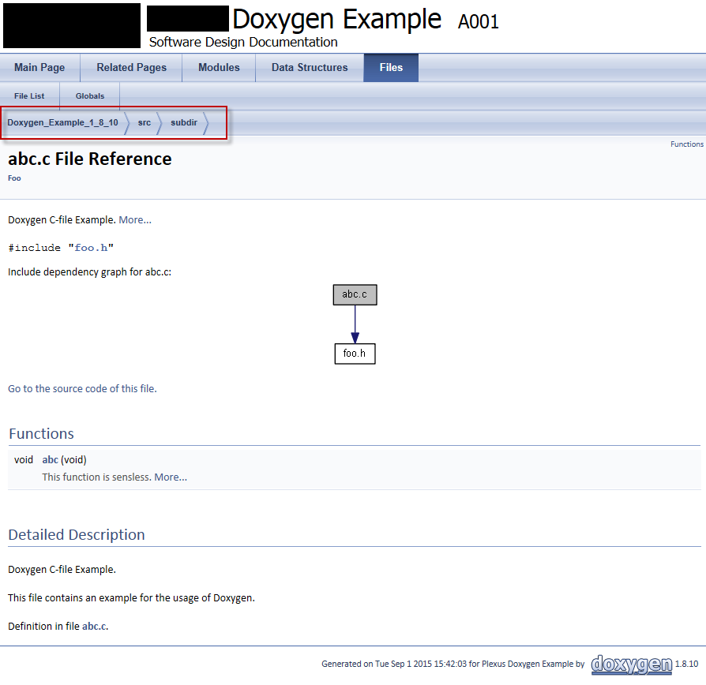

# 5.4 Documentación

<details>

<summary>

## RA6: Elabora la documentación de la aplicación web evaluando y seleccionando herramientas de generación de documentación, control de versiones y de integración continua.

</sumary>

a) Se han identificado diferentes herramientas de generación de documentación.
b) Se han documentado los componentes software utilizando los generadores específicos de las plataformas.
c) Se han utilizado diferentes formatos para la documentación.
d) Se han utilizado herramientas colaborativas para la elaboración y mantenimiento de la documentación.

</details>

## 1. Tipos de documentación

No importa cuán bueno sea el software... si la documentación no es lo suficientemente buena, la gente no lo usará. Y, si tiene que usarse, a menos que la documentación sea adecuada, no se utilizará correctamente.

Para tener una buena documentación, debemos tener en cuenta los siguientes tipos de documentación, de modo que podamos elegir la más adecuada según su propósito final.

Según el uso que se le dará a la documentación, esta puede ser:

- Tutoriales
    - Orientados al aprendizaje
    - Permiten a los usuarios comenzar a usar el software
    - Son como una lección
    - Analogía: enseñar a un niño a cocinar
- Guías prácticas (How-to guides)
    - Orientadas a resultados
    - Muestran cómo resolver un problema o necesidad concreta
    - Son una lista de pasos o etapas
    - Analogía: una receta de un libro de cocina
- Explicaciones
    - Orientadas a la comprensión
    - Explican algo y ofrecen contexto
    - Analogía: un artículo sobre la historia social de la gastronomía
- Referencia
    - Orientada a la información
    - Describe cómo se ha construido algo
    - Es exacta y completa
    - Analogía: una entrada en una enciclopedia

En lo que respecta a productos de software, los tipos más comunes de documentación son:

- **Manuales de usuario**, para enseñar al usuario final cómo utilizar la aplicación.
- **Proceso de software**, un documento que contiene todos los diagramas e informes de las etapas de análisis y diseño de la aplicación, para que se pueda ver cómo ha sido concebida.
- **Referencia de API** (Interfaz de Programación de Aplicaciones), una referencia completa con todos los componentes incluidos en la aplicación, especialmente clases, métodos públicos y elementos. Este último tipo de documentación es particularmente útil para el equipo de desarrollo, ya que facilita el mantenimiento y las futuras actualizaciones del producto.

Para crear un manual de usuario, podemos usar cualquier editor de texto disponible y redactar un documento completo que explique cómo usar cada componente de la aplicación. Alternativamente, también podemos crear un manual de usuario en línea, de modo que los usuarios puedan acceder a un sitio web y buscar el contenido que les interese.

[***fuente***](https://nachoiborraies.github.io/java/md/en/09a)

## 2. Documentación de código

### Javadoc

Javadoc es una herramienta oficial de Java que se utiliza para generar documentación API en formato HTML directamente desde el código fuente. Esta documentación se basa en comentarios especiales que se escriben en el código, justo antes de las clases, métodos y otros elementos, y proporciona una manera fácil de crear y mantener documentación legible y coherente para los desarrolladores. 

Algunos IDE, como IntelliJ, tienen su propio generador de documentación. Sin embargo, para poder compilar la documentación Javadoc en VS Code es necesaria una extensión, como [Javadoc Tools](https://marketplace.visualstudio.com/items?itemName=madhavd1.javadoc-tools).

Javadoc utiliza comentarios específicos que comienzan con `/**` y terminan con `*/`, lo que los distingue de los comentarios regulares en Java (`//` y `/*` ... `*/`). Los comentarios Javadoc incluyen etiquetas especiales:

- `@author`: Especifica quién escribió la clase.
- `@version`: Es la versión actual de la clase, útil para llevar control de cambios.
- `@since`: Indica la fecha o versión en la que la clase fue introducida o modificada.
- `@param` para describir parámetros.
- `@return` para describir el valor de retorno.
- `@throws` para excepciones (si las hay).

```java
/**
 * Clase que representa una cuenta bancaria simple con operaciones 
 * básicas como depósito, retiro y consulta de saldo.
 * 
 * Esta clase es utilizada para gestionar cuentas bancarias individuales
 * en una aplicación de banca.
 * 
 * 
 * @author Juan Pérez
 * @version 1.0
 * @since 2024-10-24
 */
public class CuentaBancaria {

    private double saldo;

    /**
     * Constructor para crear una cuenta bancaria con un saldo inicial.
     * 
     * @param saldoInicial El saldo inicial de la cuenta.
     */
    public CuentaBancaria(double saldoInicial) {
        this.saldo = saldoInicial;
    }

    /**
     * Método para depositar dinero en la cuenta bancaria.
     * 
     * @param monto El monto a depositar.
     */
    public void depositar(double monto) {
        this.saldo += monto;
    }

    /**
     * Método para retirar dinero de la cuenta bancaria.
     * 
     * @param monto El monto a retirar.
     * @throws IllegalArgumentException si el monto es mayor que el saldo.
     */
    public void retirar(double monto) {
        if (monto > saldo) {
            throw new IllegalArgumentException("Fondos insuficientes");
        }
        this.saldo -= monto;
    }

    /**
     * Método que devuelve el saldo actual de la cuenta.
     * 
     * @return El saldo actual de la cuenta.
     */
    public double consultarSaldo() {
        return this.saldo;
    }
}
```
> **ACTIVIDAD 1:** Crea documentación javadoc para el siguiente código, trabajado en la unidad de programación 4. Organiza el proyecto en paquetes para que tenga sentido.

```java
// Martillo.java
public class Martillo {
    protected float longitud;
    protected String marca;
    protected CabezaDeMartillo cabeza; // Composición: Martillo "tiene" una CabezaDeMartillo

    public Martillo() {
        this.cabeza = new CabezaDeMartillo(); // La CabezaDeMartillo se crea con el Martillo
    }

    public void martillar() {
        // Implementación del método martillar
    }
}

// MartilloElectrico.java
public class MartilloElectrico extends Martillo { // Herencia: MartilloElectrico "es un" Martillo
    private float bateria;

    public float getBateria() {
        return bateria;
    }

    public void setBateria(float bateria) {
        this.bateria = bateria;
    }

    public int tiempoRestante() {
        // Cálculo y retorno del tiempo restante de la batería
        return 0; // Placeholder
    }
}

// Trabajador.java
public class Trabajador {
    private String nombre;
    private Martillo martillo; // Agregación: Trabajador "usa un" Martillo

    public Trabajador(String nombre, Martillo martillo) { // El Martillo se pasa al constructor
        this.nombre = nombre;
        this.martillo = martillo;
    }

    public String getNombre() {
        return nombre;
    }

    public void setNombre(String nombre) {
        this.nombre = nombre;
    }

    public Martillo getMartillo() {
        return martillo;
    }

    public void setMartillo(Martillo martillo) {
        this.martillo = martillo;
    }

    public void trabajar() {
        // Implementación del método trabajar
    }
}

// CabezaDeMartillo.java
public class CabezaDeMartillo {
    private String material;

    public CabezaDeMartillo() {
        // Constructor por defecto
    }

    public CabezaDeMartillo(String material) {
        this.material = material;
    }

    public String getMaterial() {
        return material;
    }

    public void setMaterial(String material) {
        this.material = material;
    }
}
```

### Doxygen

Doxygen es una herramienta externa e independiente que permite generar documentación para diversos lenguajes de programación, como C#, Java o PHP, entre otros. Puedes descargar Doxygen desde su sitio web oficial , en la sección de Descargas . En Windows, solo necesitas ejecutar un instalador.

Luego debemos lanzar el asistente de Doxygen (también conocido como DoxyWizard ), el cual mostrará una pantalla inicial como esta:


En el campo de texto superior, debemos seleccionar la carpeta donde se instaló Doxygen (normalmente C:\Program Files\doxygen). En los campos de texto inferiores, podemos indicar la carpeta de origen para revisar los archivos (podemos marcar la opción de escaneo recursivo) y la carpeta de destino para generar la documentación.



Normalmente, elegimos incluir " Todas las entidades" y, a continuación, el lenguaje de programación que utilizamos (en nuestro caso, "Optimizar para Java" o "C# output "). Después, pasamos al siguiente paso.



Aquí debemos elegir el formato de salida. Normalmente marcamos la casilla HTML y podemos decidir si queremos mostrar un panel de navegación o una opción de búsqueda. Luego, pasamos al siguiente paso.

Los dos últimos pasos consisten en:

- Elegir si desea generar diagramas de clases con la herramienta interna (o con una herramienta externa llamada GraphViz)
- Ejecutar Doxygen

Tras ejecutar Doxygen , verá el progreso en el área de texto del registro hasta que aparezca el mensaje final de finalización de Doxygen. A continuación, puede mostrar la salida HTML de Doxygen o navegar a la carpeta de salida seleccionada.



> **ACTIVIDAD 2**: A partir de la actividad 1, emplea Doxygen para generar la documentación.

[***fuente***](https://nachoiborraies.github.io/java/md/en/09c)

## 3. Markdown y Plantuml

### 3.1\. ¿Qué es Markdown y cómo se utiliza?

**Markdown** es un lenguaje de marcado ligero que permite formatear texto de manera sencilla e intuitiva. Es muy utilizado para escribir documentación, blogs o cualquier otro tipo de texto que luego se convierte a HTML, ya que facilita mucho su legibilidad. Un documento Markdown es esencialmente texto plano que se puede leer fácilmente y que luego se puede exportar a otros formatos como HTML o PDF.

Estos apuntes están escritos combinando Markdown con plantuml y mermaidjs. Además, Markdown es el lenguaje de marcado más empleado a la hora de elaborar **documentación técnica**, y también es el lenguaje de marcado que emplean los chatbots como ChatGPT o Gemini para imprimir sus resultados.

Además, la sencillez de Markdown se puede combinar con el poder de HTML5, permitiendo intercalar etiquetas HTML en documentos Markdown para así conseguir cosas complejas, como aplicar un estilo CSS o usar `<details>` para ocultar elementos (como se hace en estos apuntes con los códigos en plantuml).

#### Sintaxis básica de Markdown

1.  **Títulos y subtítulos**
    Los títulos en Markdown se crean utilizando el símbolo de almohadilla `#`. Cuantas más almohadillas se colocan, menor es el nivel del título:

      * `# Título 1`
      * `## Título 2`
      * `### Título 3`

2.  **Texto en negrita**
    El texto se puede poner en negrita rodeándolo con dos asteriscos `**` o dos guiones bajos `__`:

      * `**Este texto está en negrita**`
      * `__Este texto también está en negrita__`

3.  **Texto en cursiva**
    Para poner el texto en cursiva, se utiliza un solo asterisco `*` o un solo guion bajo `_`:

      * `*Texto en cursiva*`
      * `_Texto en cursiva_`

4.  **Listas**
    Para crear una **lista no ordenada** (puntos), se utiliza un asterisco `*`, un signo más `+`, o un guion `-`:

      * `* Elemento 1`
      * `- Elemento 2`

    Para **listas numeradas**:

      * `1. Primer elemento`
      * `2. Segundo elemento`

5.  **Enlaces**
    Los enlaces se crean utilizando la sintaxis `[texto](url)`:

      * `[Google](https://www.google.com)`

6.  **Imágenes**
    Las imágenes se pueden insertar de manera similar a los enlaces, añadiendo un signo de exclamación al principio ``:

      * ``

7.  **Código**
    Si quieres mostrar un fragmento de código dentro de una línea de texto, puedes utilizar las comillas invertidas `` ` ``. Para **bloques de código**, se pueden usar tres comillas invertidas \`\`\`:

      * `inline code: \`echo "Hola"\`\`

      * Bloques de código:

      * Puedes especificar incluso el lenguaje de programación para que resalte la sintaxis si quieres (no funcionará en todos los entornos).

        ```bash
        echo "Esto es un bloque de código"
        ```

8.  **Citas**
    Se pueden añadir citas utilizando `>` al principio de la línea:

      * `> Esto es una cita`


### 3.2\. Utilizar Markdown en Visual Studio Code

#### Instalación de Visual Studio Code

Primero que todo y si no lo has hecho aún, es necesario instalar **VSCode**, que se puede descargar desde su [página oficial](https://code.visualstudio.com/). Una vez instalado, ya estaremos listos para personalizarlo y utilizarlo para editar Markdown.

##### Extensiones importantes

Para mejorar la experiencia trabajando con Markdown en VSCode, es necesario instalar algunas **extensiones muy útiles**:

1.  **Markdown All in One**
    Esta extensión proporciona herramientas útiles para editar Markdown, como vista previa, cierre automático de listas y otros atajos de teclado.

      * Para instalarla, ve a la sección de extensiones dentro de VSCode y busca "Markdown All in One".

2.  **Markdown PDF**
    Esta extensión permite convertir ficheros `.md` a PDF, HTML u otros formatos.

      * Busca "Markdown PDF" e instálala para poder exportar tus documentos.

3. **Markdown Enhanced Preview (RECOMENDADA)**
    Esta extensión es ideal para trabajar con Markdown, Mermaid y Plantuml. Incorpora funciones de todo lo anterior, por lo que vas a poder exportar el resultado a pdf o incluso HTML. Puedes instalar solamente esta extensión y funcionará, es una especie de sustituta de las otras dos.

4.  **Markdownlint**
    Añade un **linter** que verifica si tu Markdown sigue buenas prácticas, ayudándote a corregir errores comunes y a seguir una sintaxis pura de Markdown (cosa que no siempre te será útil)

      * Busca "Markdownlint" en la sección de extensiones.

##### Comandos útiles dentro de VSCode usando Markdown All In One

1.  **Vista previa de Markdown**
    Para ver una vista previa del fichero Markdown que estás editando, puedes abrir el fichero `.md` y hacer clic en `Ctrl+Shift+V` (Windows/Linux) o `Cmd+Shift+V` (Mac). También puedes hacer clic con el botón derecho sobre el fichero y seleccionar "Open Preview".

2.  **Exportar a HTML o PDF**
    Una vez tienes el documento editado, puedes exportarlo a HTML o PDF utilizando la extensión Markdown PDF:

      * Para exportarlo, abre la paleta de comandos (`Ctrl+Shift+P` o `Cmd+Shift+P`) y escribe "Markdown PDF: Export". Selecciona el formato deseado.
      * También puedes escribir `>` en la barra de búsqueda. Tiene el mismo efecto y puede ser más fácil de recordar.

Otra herramienta de diagramas que está ganando popularidad recientemente, en parte gracias a su compatibilidad con diferentes frameworks de aplicaciones web como `astro.build`, es d2. Puedes encontrar más información [aquí](https://d2lang.com/).

> **ACTIVIDAD 3:** Crea una memoria en la que repases paso a paso el proceso de instalación y preparación de las extensiones necesarias para poder editar plantuml y mermaid.js en VS Code. Crea un documento con capturas de pantalla de todo el proceso.

## 4. Git y Github. Herramientas para la colaboración entre desarrolladores

Git es un sistema de control de versiones distribuido (DVCS) creado por el equipo de Linux. Actualmente, se utiliza en muchos servidores de control de versiones, como GitHub, BitBucket o GitLab, para almacenar proyectos de forma remota. Pero, si queremos interactuar con estos proyectos o repositorios remotos desde nuestra máquina local, debemos instalar Git localmente y utilizar los diferentes comandos que proporciona. En este documento aprenderemos cómo instalar Git y cómo utilizar algunos de los comandos básicos.

### 4.1. Instalación y configuración de Git

La instalación de Git depende del sistema operativo en el que queremos instalarlo.

Para sistemas Linux, solo tenemos que ejecutar el comando especificado para instalar Git. Por ejemplo, en sistemas Ubuntu tenemos que ejecutar este comando:
`sudo apt-get install git`

Para Windows y Mac, tenemos que ir a la página web de Git y descargar la versión adecuada. En el caso de Mac, también se puede instalar Git a través de la instalación de XCode.

#### 4.1.1. Configuración de Git

Antes de utilizar los comandos de Git, deberíamos configurar algunas variables predeterminadas en nuestro sistema, para conectarnos fácilmente a los servidores y almacenar nuestras credenciales para conexiones posteriores. Utilizaremos el comando `git config` para almacenar estas variables, y las podemos guardar a tres niveles diferentes:

  * **Sistema**: utilizando el parámetro `--system`, la configuración se aplica a todos los usuarios del sistema.
  * **Usuario**: utilizando el parámetro `--global`, la configuración se aplica solo al usuario actual del sistema. Esta es la opción que utilizaremos en esta sección.
  * **Repositorio**: cada repositorio tendrá sus propios parámetros de configuración de Git.

Primero de todo, definimos nuestro nombre completo con este comando (sustituye "John Doe" por tu nombre real):
`git config --global user.name "John Doe"`

A continuación, especificamos el correo electrónico con el que creamos la cuenta de GitHub:
`git config --global user.email yourEmail@server.com`

Después, podemos especificar el editor predeterminado de Git. Este paso no es necesario, pero si Git necesita abrir un fichero de texto para mostrar información, este será el editor que utilizaremos. Por ejemplo, podemos utilizar el Bloc de notas en Windows de esta manera:
`git config --global core.editor notepad`

Finalmente, debemos especificar cómo Git almacenará nuestras credenciales, de manera que no tengamos que introducirlas cada vez que nos conectemos a los repositorios. El ayudante que utilizamos para guardar las credenciales depende del sistema operativo en el que estamos utilizando Git, pero el comando general es este:
`git config --global credential.helper <helper>`

donde `<helper>` depende del sistema operativo:

  * Para Windows utilizamos `wincred`
  * Para Linux utilizamos `cache`
  * Para Mac OSX utilizamos `osxkeychain`

Así que, si queremos configurar el ayudante de credenciales en Windows, por ejemplo, escribimos algo así:
`git config --global credential.helper wincred`

De esta manera, ya estamos preparados para utilizar Git, incluso desde diferentes entornos de desarrollo, como veremos en otras secciones. Podemos comprobar la configuración actual utilizando el comando `git config --list`. También podemos comprobar la versión de Git que tenemos instalada actualmente con el comando `git version`.

### 4.2. Comandos locales básicos útiles

Veamos ahora algunos comandos que podemos utilizar para trabajar con proyectos locales (sin conectarnos a ningún repositorio o servidor remoto). Estos comandos son útiles tanto para proyectos locales como para proyectos remotos que hayamos descargado previamente, si queremos trabajar localmente con ellos durante un tiempo.

#### 4.2.1. Crear un repositorio local

Si queremos inicializar o crear un nuevo repositorio local, primero debemos crear la carpeta donde se guardará este proyecto. Después, podemos inicializarla como repositorio Git con este comando (desde dentro de la carpeta del proyecto):
`git init`

Esto inicializará esta carpeta como carpeta Git, creando una subcarpeta oculta llamada `.git`, donde se almacenará la base de datos del repositorio. No nos debemos preocupar por esta subcarpeta.

Cada fichero dentro de este repositorio estará en uno de los tres estados mencionados en secciones anteriores (committed, staged o modified), y podemos cambiar el estado de cada fichero escribiendo algunos de los comandos que veremos ahora. También podemos comprobar el estado del repositorio en cualquier momento con el comando `git status` (lo debemos ejecutar desde la carpeta raíz del repositorio). Nos informará si todo está "commitado", o si hay algún fichero con cambios sin guardar.

> **ACTIVIDAD 4:**
>
> 1.  Instala Git en tu ordenador, en la máquina virtual facilitada en clase o en una máquina virtual. En este último caso, puedes descargar una imagen de Linux como por ejemplo [Lubuntu](https://lubuntu.me/) y utilizar [VirtualBox](https://www.virtualbox.org/wiki/Downloads) (o cualquier otro). Para poder utilizar una máquina virtual en tu ordenador, **debes permitirlo en la configuración de la BIOS** (permitir virtualización).
> 2.  Configura Git con tu cuenta creada en el apartado anterior.
> 3.  Crea una carpeta llamada **GitExercises** en tu sistema. Almacenaremos algunos repositorios dentro de ella. Para empezar, crea dentro de esta carpeta una subcarpeta nueva llamada **MyFirstLocalRepo**, entra dentro de esta carpeta y ejecuta el comando `git init` para inicializar esta carpeta como repositorio Git.

#### 4.2.2. Añadir o editar ficheros en el repositorio

Si añadimos algún fichero nuevo a la carpeta del repositorio (por ejemplo, un fichero llamado `file.txt`) y ejecutamos el comando `git status`, Git mostrará que hay algunos ficheros que deben ser añadidos al repositorio.
**Estos ficheros se encuentran en estado "modificado".** Si utilizamos el comando `git add`, el (los) fichero(s) se marcarán como "preparados" (staged). Si solo queremos añadir un único fichero, especificaremos este nuevo fichero como parámetro:
`git add file.txt`

No obstante, puede haber muchos cambios en nuestro repositorio. Si queremos añadirlos todos a la vez, utilizamos `.` como parámetro:
`git add .`

Después de cada nuevo cambio que hagamos en el repositorio (ya sea añadiendo, editando o eliminando ficheros), debemos repetir este comando para preparar los cambios. Una vez los cambios estén preparados, este es el resultado del comando `git status`:

Como puedes ver en la imagen anterior, podemos utilizar el comando `git rm` para desmarcar este fichero, si queremos:
`git rm --cached file.txt`

#### 4.2.3. Guardar o *commitear* cambios

Después de añadir o preparar los cambios, debemos hacer un último paso para actualizar la base de datos del repositorio. Esta operación es el "**commit**", y la podemos hacer mediante el comando `git commit`. Podemos ejecutarla después de una o varias operaciones de `git add` que hayan preparado uno o más ficheros.

Esta es la estructura general del comando `git commit`:
`git commit -m "Mi primer commit"`

El parámetro `-m` nos permite especificar un mensaje de commit. Este mensaje es obligatorio para guardar el commit, de manera que, si queremos recuperarlo más adelante, podemos identificar este mensaje en la lista de commits. Después de commitear los cambios, si ejecutamos `git status`, deberíamos ver que no hay nada por commitear:

```
On branch master
nothing to commit, working tree clean
```

Alternativamente, también podemos utilizar el parámetro `-a` para añadir o preparar automáticamente los cambios antes de commitearlos. Este comando combina un `git add .` y un comando `git commit`:
`git commit -a -m "Tu mensaje de commit"`

##### Mostrar el historial de commits

Si queremos ver el historial de commits de nuestro repositorio, podemos escribir este comando:
`git log`

Cada commit tiene una etiqueta que consiste en una secuencia de dígitos y letras. En el ejemplo anterior, nuestro commit se ha etiquetado como `08f4ed1751…`. Esta etiqueta será útil para comprobar el commit más adelante, aunque no es necesario recordar todos estos caracteres, solo el prefijo inicial.

##### Mostrar los cambios

También podemos ver los cambios entre dos versiones consecutivas del repositorio. Hay muchas maneras de hacerlo:

  * `git show`: muestra los cambios realizados en el último commit.
  * `git show cb1fd6f8`: muestra los cambios hechos en el commit etiquetado con el prefijo `cb1fd6f8` (como se puede ver, no necesitamos escribir toda la etiqueta).
  * `git diff`: muestra los cambios realizados en la última versión que todavía no se ha commiteado.
  * 

> **ACTIVIDAD 5:** Haz los siguientes cambios en el repositorio **MyFirstLocalRepo** que has creado en el ejercicio anterior:
>
> 1.  Crea un fichero nuevo llamado `file.txt` con el texto "Mi primer fichero de texto". Guarda los cambios en este fichero.
> 2.  Ejecuta el comando `git add .` para preparar este fichero.
> 3.  Ejecuta el comando `git commit` con el mensaje "Mi primer commit" para guardar los cambios a la base de datos.
> 4.  Edita el fichero `file.txt` y añade una segunda línea con tu nombre.
> 5.  Ejecuta el comando `git commit -a -m` para preparar y commitear automáticamente los cambios con el mensaje "Mi segundo commit".
> 6.  Ejecuta el comando `git log` para ver el historial de commits. Deberías ver algo similar a esto:
> 
> ```
> commit 08f4ed1751…
> Author: John Doe <john@example.com>
> Date: Wed Apr 14 15:00 2023
>     Mi primer commit
> commit cb1fd6f8…
> Author: John Doe <john@example.com>
> Date: Wed Apr 14 16:00 2023
>     Mi segundo commit
> ```
> 
> 7.  Ejecuta el comando `git show` para ver los cambios hechos en el último commit. Deberías ver algo parecido a esto:
>
> Los nuevos cambios se muestran en verde si han sido añadidos (en este caso, tu nombre al final del contenido del fichero), o en rojo si han sido eliminados.


##### Etiquetar commits

Podemos añadir manualmente etiquetas a un commit determinado, de manera que lo podemos encontrar fácilmente más adelante cuando queramos mostrar sus cambios. Utilizamos el comando `git tag` seguido del nombre de la etiqueta:
`git tag v1.0`

Esto se aplica al último commit enviado. A continuación, podemos mostrar los cambios de este commit con este comando:
`git show v1.0`

Si queremos etiquetar un commit que no es el último, entonces debemos especificar la etiqueta anterior de ese commit (o su prefijo inicial), después de la nueva etiqueta que queremos asignarle:
`git tag v1.0 cb1fd6f8`

#### 4.2.4. Deshacer cambios

¿Y si queremos volver a un commit anterior y deshacer los cambios hechos en el (los) último(s) commit(s)? Podemos utilizar el comando `git reset`. Este comando se puede utilizar de muchas maneras, pero aquí explicaremos una de ellas: debemos identificar la etiqueta del commit que queremos establecer como el actual y después escribir este comando:
`git reset --hard 0305afd`

donde `0305afd` es el prefijo de la etiqueta del commit que queremos establecer como nuestro estado actual activo.

#### 4.2.5. El fichero .gitignore

En cada repositorio Git, podemos añadir manualmente un fichero llamado `.gitignore`. Es solo un fichero de texto que contiene una lista de ficheros y carpetas que deben ser ignorados cuando subamos nuevos cambios. Por ejemplo, si estamos trabajando en un proyecto C\#, no necesitamos subir ficheros `.exe` al repositorio, ya que podemos recompilar el proyecto de nuevo. Así que podemos editar este fichero y especificarlo así:

```
*.exe
```

Esto saltará todos los ficheros `.exe` de la carpeta principal del proyecto. De la misma manera, podemos añadir tantos ficheros y carpetas como necesitemos en este fichero. Por ejemplo:

```
node_modules/
*.exe
*.tmp
```

Esto omite la carpeta `node_modules` y todos los ficheros `.exe` o `.tmp` en la carpeta raíz. Aquí puedes encontrar ficheros `.gitignore` típicos para muchos tipos diferentes de proyectos, como proyectos Node, Laravel, etc.

**NOTA**: El fichero `.gitignore` **NO** excluye ficheros que ya han sido *commiteados* previamente. Por ejemplo, si le decimos a este fichero que ignore ficheros `.exe` pero previamente hemos commiteado un fichero `.exe` al repositorio, este fichero no se eliminará del mismo.


### 4.3. Trabajando con repositorios remotos

Ahora que hemos aprendido cómo añadir y editar contenido en un repositorio local, veamos cómo conectarnos a un repositorio remoto de GitHub para descargar o subir los cambios. Primeramente, si queremos trabajar con repositorios remotos almacenados en GitHub, necesitaremos crear este repositorio remoto en GitHub.

#### 4.3.1. Clonar repositorios

Una vez tengamos nuestro repositorio creado en GitHub, necesitaremos copiarlo a nuestra máquina local. Esta operación se conoce como una operación de **clonación**, y la hacemos con el comando `git clone`, especificando la URL del repositorio, la cual se puede recuperar del botón *Clone or download* en el mismo repositorio.

**Ejemplo de página principal del repositorio:**

Si tuviéramos un repositorio en GitHub, el comando adecuado para clonarlo sería así:

```bash
git clone https://github.com/johndoe/test
```

Este comando creará una carpeta llamada **test** en el directorio desde el cual estamos ejecutando esta comando, así que asegúrate de ejecutarla dentro de la carpeta donde quieras colocar tu proyecto.

> **ACTIVIDAD 6:** Clona el repositorio donde se almacenan estos apuntes: https://github.com/arturoalbero/Material25-26 

#### 4.3.2. Actualizar los cambios remotos en local

Una vez tengamos el repositorio clonado localmente, si estamos trabajando en equipo o gestionando el mismo repositorio desde diferentes ordenadores, quizás necesitaremos descargar los últimos cambios de este repositorio para actualizar nuestra copia local. Este paso es esencial para asegurarnos que tenemos los contenidos actualizados antes de hacer nuevos cambios.

Para hacer esto, simplemente utilizamos el comando `git pull` desde la carpeta del repositorio:

```bash
git pull
```

Esto descarga automáticamente los últimos cambios y actualiza los ficheros afectados.

#### 4.3.3. Subir los cambios locales al repositorio remoto

Si tenemos nuestro repositorio local actualizado y hacemos nuevos cambios a cualquier fichero, podemos subir estos cambios al repositorio remoto. Los pasos necesarios son los siguientes:

1.  Haz cambios en el(los) fichero(s) deseado(s).
2.  Marca los ficheros como preparados con el comando `git add .` que ya hemos visto antes.
3.  Haz un **commit** de los cambios localmente con el comando `git commit` que también hemos visto antes.
4.  Sube este commit (o los últimos commits, si hay más de uno) con el comando `git push`.


```bash
git push
```

> **ACTIVIDAD 7:**
> 
> 1.  Clona el repositorio de GitHub **MyFirstRepo** que habrás creado en el documento anterior. Clónalo dentro de la misma carpeta principal donde estás creando el resto de repositorios locales de este documento. Verás una nueva carpeta llamada **MyFirstRepo** que contiene todos los elementos de tu repositorio remoto.
> 
> 2.  Aplica estos cambios:
> 
      * Añade un nuevo fichero llamado `shopping_list.txt` con una lista de artículos que quieras comprar.
>       * Sube este fichero al repositorio remoto (recuerda, primero añade los cambios, después haz el commit y finalmente haz el push).
> 
> 3.  Ve a GitHub y comprueba que el nuevo fichero se ha subido correctamente.
> 
> 4.  Ve a una carpeta diferente del ordenador y clona una copia nueva del mismo repositorio.
> 
> 5.  Desde esta segunda carpeta, añade un nuevo fichero llamado `to_do.txt` y añade algunas tareas pendientes para las próximas semanas.
> 
> 6.  Sube los cambios al repositorio remoto.
> 
> 7.  Vuelve a tu carpeta original **MyFirstRepo** y haz un comando `git pull`. Comprueba si el nuevo fichero **to\_do.txt** se ha descargado en esta copia local.

#### 4.3.4 Crear un repositorio remoto a partir de nuestro repositorio local

Para crear un repositorio a partir de nuestro repositorio local, lo que debemos hacer es conectar nuestro repositorio local a un repositorio remoto vacío (para evitar conflictos de fusión). Para ello, seguimos estos pasos:

1.  **Creamos el repositorio de Git si no lo tenemos con `git init`**

2.  **Añadimos los archivos que queramos y hacemos al menos un commit**

3.  **Creamos un Nuevo Repositorio en GitHub:**

* Ve a [GitHub.com](https://github.com/) e inicia sesión en tu cuenta.
* Haz clic en el signo **+** en la esquina superior derecha y selecciona **"New repository"** (Nuevo repositorio).
* Dale un **nombre** a tu repositorio (normalmente, es buena idea que coincida con el nombre de tu carpeta local, pero no es obligatorio).
* Puedes añadir una **descripción** si quieres.
* **¡Importante\!** No marques las opciones "Initialize this repository with a README", "Add .gitignore" ni "Choose a license". Así evitamos conflitos.
* Finalmente, haz clic en el botón **"Create repository"** (Crear repositorio).

4.  **Conecta tu Repositorio Local con el de GitHub:**

Después de crear el repositorio en GitHub, verás una página con instrucciones. Busca la sección que dice "...or push an existing repository from the command line." (o sube un repositorio existente desde la línea de comandos). Usaremos los siguientes dos comandos:

* **Añade el origen remoto:** Este comando le dice a tu Git local dónde está tu repositorio de GitHub. Asegúrate de reemplazar `TU_NOMBRE_DE_USUARIO` y `TU_NOMBRE_DEL_REPOSITORIO` con tu información real.

```bash
git remote add origin https://github.com/TU_NOMBRE_DE_USUARIO/TU_NOMBRE_DEL_REPOSITORIO.git
```

*Ejemplo:* `git remote add origin https://github.com/octocat/mi-proyecto-genial.git`

* **Verifica el remoto (Opcional):** Puedes comprobar que el remoto se añadió correctamente:

```bash
git remote -v
```

Deberías ver algo así:

```
origin  https://github.com/TU_NOMBRE_DE_USUARIO/TU_NOMBRE_DEL_REPOSITORIO.git (fetch)
origin  https://github.com/TU_NOMBRE_DE_USUARIO/TU_NOMBRE_DEL_REPOSITORIO.git (push)
```
`fetch` es recoger, `push` es subir.

5.  **Sube tu Repositorio Local a GitHub:**

* `git branch -M main`: Renombra tu rama actual a `main`. GitHub usa `main` como nombre de rama principal por defecto. Si tu rama local ya se llama `main` o prefieres mantenerla como `master`, puedes omitir este comando o ajustarlo (por ejemplo, `git push -u origin master`).
* `git push -u origin main`: Sube tu rama local `main` al repositorio remoto llamado `origin`. La opción `-u` (o `--set-upstream`) es crucial porque establece la rama remota de seguimiento, lo que significa que en el futuro, los comandos `git push` y `git pull` sabrán con qué rama remota interactuar sin que tengas que especificarla cada vez.

```bash
git branch -M main
git push -u origin main
```

### Tabla resumen de comandos básicos

| Comando | Utilidad |
| :------------------------- | :------------------------------------------------------------------ |
| `git init` | Inicializa un nuevo repositorio Git en la carpeta actual. |
| `git status` | Muestra el estado del repositorio y los ficheros modificados o no commiteados. |
| `git add <fichero>` | Añade un fichero específico al área de "stage" para el siguiente commit. |
| `git add .` | Añade todos los ficheros modificados al área de "stage". |
| `git commit -m "<mensaje>"` | Realiza un commit de los cambios con un mensaje descriptivo. |
| `git commit -a -m "<mensaje>"` | Añade y commitea automáticamente los cambios sin necesidad de `git add`. |
| `git log` | Muestra el historial de commits del repositorio. |
| `git show` | Muestra los cambios realizados en el último commit o en un commit específico. |
| `git diff` | Compara los cambios entre las versiones no commiteadas del repositorio. |
| `git rm --cached <fichero>` | Elimina un fichero del área de "stage" sin borrarlo del sistema. |
| `git reset --hard <commit>` | Restaura el estado del repositorio a un commit anterior. |
| `git tag <etiqueta>` | Añade una etiqueta a un commit específico. |
| `git clone <URL>` | Clona un repositorio remoto en la máquina local. |
| `git pull` | Actualiza la copia local con los cambios del repositorio remoto. |
| `git push` | Sube los cambios locales al repositorio remoto. |
| `git config --global user.name "<nombre>"` | Configura el nombre de usuario para los commits. |
| `git config --global user.email "<email>"` | Configura el correo electrónico para los commits. |
| `git config --list` | Muestra la configuración actual de Git. |
| `git version` | Muestra la versión de Git instalada. |

-----

## [SECCIÓN DE AMPLIACIÓN] Uso de ramas en Git

En esta segunda parte, nos centraremos en el trabajo con **ramas** (**branches**) de Git, una de las funcionalidades más poderosas de este sistema de control de versiones. Las ramas permiten trabajar en funciones o mejoras de manera independiente sin afectar la rama principal del proyecto (normalmente llamada `main` o `master`). Así, podemos desarrollar, probar y modificar nuevas funcionalidades sin interferir en la versión estable del proyecto.

### 1. ¿Qué es una rama en Git?

Una rama en Git es esencialmente una secuencia de commits que comienza a partir de un punto específico en la historia del repositorio. La rama principal del proyecto es generalmente `main` o `master`, pero podemos crear tantas ramas como necesitemos para desarrollar nuevas características o corregir errores de manera paralela.

Cuando trabajamos con ramas, podemos hacer cambios en una rama sin que afecten a las otras, y posteriormente podemos combinar las ramas para integrar esos cambios en el proyecto principal.

### 2. Crear y cambiar de ramas

#### 2.1. Crear una nueva rama

Para crear una nueva rama, utilizamos el comando `git branch`, seguido del nombre de la nueva rama. Esta nueva rama se creará a partir del estado actual del repositorio, es decir, del commit donde estamos en este momento.

```bash
git branch nombre-rama
```

Por ejemplo, si quieres crear una rama para desarrollar una nueva funcionalidad llamada "nueva-funcion", puedes hacerlo así:

```bash
git branch nueva-funcion
```

#### 2.2. Cambiar de rama

Una vez creada la nueva rama, si queremos trabajar en ella, debemos cambiar a ella. Para ello, utilizamos el comando `git checkout` seguido del nombre de la rama a la que queremos cambiar:

```bash
git checkout nueva-funcion
```

A partir de este momento, cualquier cambio que hagamos se aplicará a esta rama, sin afectar la rama principal (`main` o `master`).

**Nota:** A partir de Git 2.23, también podemos utilizar `git switch` para cambiar de rama, una alternativa más clara a `git checkout`:

```bash
git switch nueva-funcion
```

#### 2.3. Crear y cambiar de rama en un solo paso

Es posible crear una rama y cambiar a ella en un solo paso con este comando:

```bash
git checkout -b nombre-rama
```

Por ejemplo:

```bash
git checkout -b nueva-funcion
```

Este comando crea la rama `nueva-funcion` y automáticamente nos cambia a ella.

### 3. Trabajar en una rama

Una vez estemos trabajando en una nueva rama, podemos hacer modificaciones, añadir ficheros y realizar commits de la misma manera que lo haríamos en la rama principal. Estos cambios quedarán aislados dentro de la rama y no afectarán a ninguna otra rama hasta que decidamos combinarlas.

#### 3.1. Ver las ramas disponibles

Podemos ver todas las ramas existentes en nuestro repositorio utilizando este comando:

```bash
git branch
```

La rama en la que estamos trabajando actualmente estará marcada con un asterisco `*`.

### 4. Fusionar ramas (merge)

Una vez hayamos terminado el desarrollo o la corrección de errores en nuestra rama, es momento de fusionar los cambios con la rama principal. Este proceso se denomina **fusión** o **merge**.

Antes de realizar la fusión, es recomendable asegurarse de que estamos en la rama donde queremos aplicar los cambios (normalmente `main` o `master`). Para ello, cambiamos a la rama con:

```bash
git checkout main
```

Una vez estamos en la rama principal, podemos utilizar el comando `git merge` para fusionar los cambios de la rama secundaria en la que hemos estado trabajando (por ejemplo, `nueva-funcion`):

```bash
git merge nueva-funcion
```

Si no hay conflictos entre los cambios, Git combinará automáticamente las dos ramas. Si hay conflictos (por ejemplo, si se han modificado las mismas líneas de código en ambas ramas), Git nos avisará y tendremos que resolverlos manualmente.

### 5. Resolver conflictos de fusión

Cuando aparecen conflictos durante una fusión, Git marca las líneas de código en los ficheros afectados que tienen conflictos. Deberíamos revisar estas líneas manualmente, escoger qué versión queremos mantener, y después marcar los conflictos como resueltos con `git add`. Finalmente, hacemos un commit para completar la fusión:

```bash
git add <fichero>
git commit
```

### 6. Borrar ramas

Después de fusionar los cambios de una rama secundaria a la rama principal, es una buena práctica eliminar esa rama para mantener el repositorio limpio. Podemos hacerlo con el comando `git branch -d`:

```bash
git branch -d nueva-funcion
```

Si la rama no ha sido fusionada, Git no permitirá borrarla. Si estamos seguros de que queremos eliminarla aunque no haya sido fusionada, podemos forzar la eliminación con `git branch -D`:

```bash
git branch -D nueva-funcion
```

### 7. Trabajo con ramas remotas

Cuando trabajamos con repositorios remotos (como GitHub o GitLab), las ramas locales no se suben automáticamente al servidor remoto. Para subir una nueva rama, debemos utilizar el comando `git push` especificando el nombre de la rama:

```bash
git push origin nueva-funcion
```

Una vez la rama esté subida al repositorio remoto, otros colaboradores podrán acceder a ella.


> **ACTIVIDAD DE AMPLIACIÓN:** En este ejercicio, aprenderás a trabajar con ramas para desarrollar nuevas funcionalidades o hacer correcciones sin afectar el código de la rama principal. Seguirás el proceso completo de creación de ramas, fusión de cambios y resolución de conflictos, todo en un escenario práctico.
>
> **Escenario:**
>
>Añade al repositorio antes creado, MyFirstRepo, un fichero llamado `index.html` a la rama principal (`main`). Tu objetivo es añadir dos nuevas funcionalidades de manera independiente, trabajando en ramas separadas y, después, fusionarlas con la rama principal. Documenta los pasos con capturas de pantalla y comparte la memoria del ejercicio.
>Puedes emplear el siguiente código como base del fichero:
>
```html
<!DOCTYPE html>
<html lang="es">
<head>
    <meta charset="UTF-8">
    <meta name="viewport" content="width=device-width, initial-scale=1.0">
    <title>Archivo</title>
</head>
<body>

</body>
</html>
```

> **Pasos a seguir:**
>
>1.  **Clona el repositorio y sitúate en la rama principal:**

```bash
# Si aún no lo has hecho
git clone <URL_DE_TU_REPOSITORIO_MyFirstRepo>
cd MyFirstRepo
git checkout main # Asegúrate de estar en la rama main
```

> Crea el archivo `index.html` con el contenido proporcionado en la rama `main` y súbelo al repositorio remoto.
>
>2.  **Crea una nueva rama para añadir un título a la página web:**
>
>* Crea la rama `añadir-titulo` y cambia a esta rama:
>
```bash
git checkout -b añadir-titulo
```

>* Abre el fichero `index.html` y añade un título dentro de la etiqueta `<body>`:

```html
<h1>Bienvenidos a mi página web</h1>
```

>* Guarda los cambios y haz un commit:

```bash
git add index.html
git commit -m "Añadido título a la página web"
```
>
>3.  **Crea otra rama para añadir un párrafo de introducción:**

> * Cambia a la rama principal (`main`) y después crea una nueva rama `añadir-introduccion`:

```bash
git checkout main
git checkout -b añadir-introduccion
```

> * Modifica el fichero `index.html` y añade un párrafo de introducción bajo el título:

```html
<p>Esta es una página web de ejemplo creada para aprender Git.</p>
```

> * Guarda los cambios y haz un commit:

```bash
git add index.html
git commit -m "Añadido párrafo de introducción"
```
>
> 4.  **Fusiona las ramas con la rama principal:**

> * Vuelve a la rama principal:

```bash
git checkout main
```

> * Fusiona la rama `añadir-titulo` con la rama principal:

```bash
git merge añadir-titulo
```

> * A continuación, fusiona la rama `añadir-introduccion` con la rama principal:

```bash
git merge añadir-introduccion
```

> 5.  **Resuelve un conflicto de fusión (opcional):**
>
> Si hubiera conflictos durante la fusión (por ejemplo, si el título y el párrafo hubieran sido añadidos en las mismas líneas del fichero `index.html`), resuélvelos de la siguiente manera:
>
> * Abre el fichero conflictivo (`index.html`) y modifica las líneas marcadas por Git para mantener las dos funcionalidades (el título y el párrafo).
>
> * Después, marca los conflictos como resueltos:

```bash
git add index.html
```

> * Haz un commit para completar la fusión:

```bash
git commit -m "Resueltos conflictos y fusionadas ramas"
```

> 6.  **Borra las ramas:**
>
> Después de fusionar las ramas, puedes borrarlas para mantener el repositorio limpio:
>
```bash
git branch -d añadir-titulo
git branch -d añadir-introduccion
```


### Tabla resumen de comandos de ramas en Git

| Comando | Utilidad |
| :-------------------------------------- | :---------------------------------------------------------------------------------------------------------------------- |
| `git branch` | Lista todas las ramas del repositorio. |
| `git branch <nombre-rama>` | Crea una nueva rama con el nombre especificado. |
| `git checkout <nombre-rama>` | Cambia a la rama especificada. |
| `git checkout -b <nombre-rama>` | Crea una nueva rama y cambia a ella en un solo paso. |
| `git switch <nombre-rama>` | Cambia a la rama especificada (alternativa a `git checkout`). |
| `git merge <nombre-rama>` | Fusiona la rama especificada con la rama actual. |
| `git branch -d <nombre-rama>` | Borra una rama local después de fusionarla. |
| `git branch -D <nombre-rama>` | Fuerza la eliminación de una rama no fusionada. |
| `git push origin <nombre-rama>` | Sube una nueva rama al repositorio remoto. |
| `git pull origin <nombre-rama>` | Descarga e integra los cambios de una rama remota en la rama local. |
| `git stash` | Guarda los cambios no commiteados temporalmente para cambiar de rama. |
| `git stash apply` | Recupera los cambios guardados anteriormente con `git stash`. |