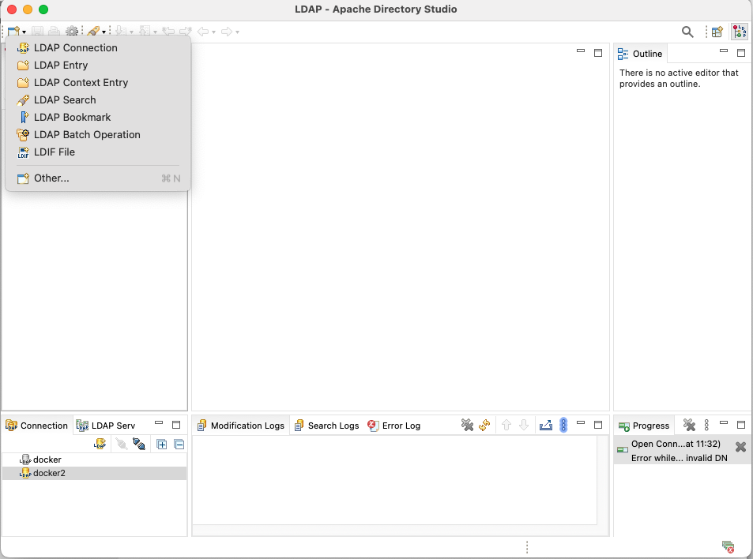
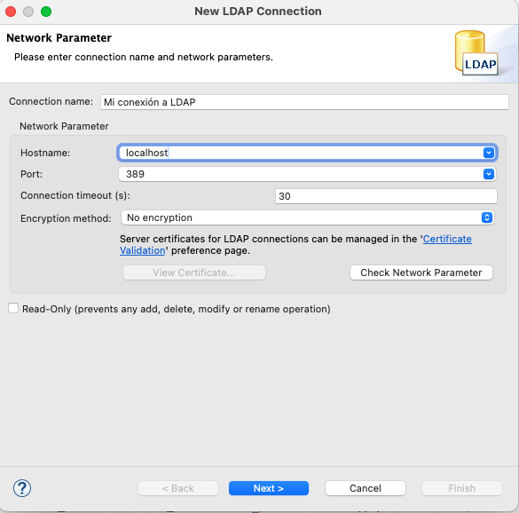
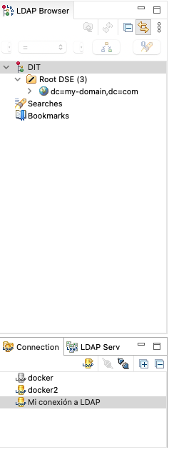

# Introducción a LDAP

## 1. LDAP - Lightweight Directory Access Protocol

LDAP es un protocolo de acceso distribuido, con una estructura ordenada, que permite establecer un servicio de directorio, con información accesible a través de la red. LDAP es un protocolo para:

* Autenticación de usuarios
* Directorios centralizados (usuarios, grupos, equipos)
* Login único (SSO)
* Integrarse con Linux, aplicaciones, correo, etc.

Como en otros casos más complejos, como Active Directory, LDAP permite la organización de datos  por ámbitos geográficos, estructurales, etc. Y suele utilizar un espacio de nombres basado en DNS. Podemos pensar en él como una base de datos jerárquica para identidades.

Las entradas del directorio pueden representar un amplio abanico de objetos, como usuarios, grupos, unidades organizativas, carpetas, archivos, impresoras, etc.

Como hemos visto en la lista de arriba, uno de los usos más interesantes que podemos darle, es el almacenamiento de la información de autenticación de los usuarios, que nos permitirá gestionarla de forma centralizada. Este es el uso que aprenderemos a hacer del protocolo LDAP.

El nombre LDAP está formado por las siglas en inglés de Lightweight Directory Access Protocol (Protocolo Ligero de Acceso a Directorios).

## 2. Instalación de Open LDAP en Alpine Linux

Para poner a prueba la configuración y uso básico de ldap, vamos a usar OpenLDAP en varios contenedores de docker. Emplearemos un contenedor que hará de servidor ldap `ldap-server` y otro que nos servirá de cliente `ldap-client`. Ambos contenedores se deben comunicar entre ellos por una red de docker `ldap-net`. 

### 2.1 Instalación de OpenLDAP en el contenedor servidor

Lo primero es crear una red de docker:
```sh
docker network create ldap-net
```
Lo siguiente es tener preparado nuestro espacio de trabajo. Creamos una carpeta `ldap` y dentro de ella una dedicada para el servidor (server) con subcarpetas para configuración y datos y otra para el cliente. El esquema podría ser algo así:
```text
-ldap/
    |-server/
        |-config/
        |-data/
    /client/
```
Después, creamos el primer contenedor, `ldap-server` y lo asociamos a la red.
```sh
docker run -it --name ldap-server --network ldap-net -p 389:389 -v ./ldap/server/config:/etc/openldap -v ./ldap/server/data:/var/lib/openldap alpine:latest sh
```
389 es el puerto predeterminado para el protocolo LDAP, así que conviene rutearlo bien. Una vez dentro del contenedor, debemos instalar las herramientas de openldap

```sh
apk update
apk add openldap openldap-backend-all openldap-clients
```
Esto instala `slapd`, que es el servidor ldap y los clientes `ldapadd` y `ldapsearh`, así como backends para almacenamiento. Una vez hecho esto, deberíamos ver aparecer los archivos en `ldap/server/config`. Además, dentro del contenedor podemos ejecutar `slapd -V` para comprobar que funciona todo correcto.

### 2.2 Configuración del servidor

Lo siguiente es crear una contraseña de administrador:
```sh
slappasswd
```
Creamos nuestra contraseña y nos guardamos el hash generado, que será algo parecido a `{SSHA}vTwYCZEynArYA1qMF1JGPRCutU0BchpX`. Lo utilizaremos para la configuración.

En la carpeta `/ldap/server/config` de nuestro host, debemos crear el archivo base.ldif y poner lo siguiente:
```text
# Entry 1: The Root Domain
dn: dc=my-domain,dc=com
objectClass: top
objectClass: dcObject
objectClass: organization
o: Example Org
dc: my-domain

# Entry 2: The Admin User (Child of the root)
dn: cn=admin,dc=my-domain,dc=com
objectClass: simpleSecurityObject
objectClass: organizationalRole
cn: admin
userPassword: {SSHA}vTwYCZEynArYA1qMF1JGPRCutU0BchpX

# Entry 3: Organizational Unit
dn: ou=users,dc=my-domain,dc=com
objectClass: top
objectClass: organizationalUnit
ou: users
description: Unidad de usuarios del sistema
```

En el campo de `userPassword`, pega el hash obtenido en el paso anterior, tal y como está hecho en el ejemplo.

---

**LDIF** (*LDAP Data Interchange Format*) es el formato estándar para importar o modificar datos en un directorio LDAP (como OpenLDAP o Active Directory).

En este archivo, se define el esquema inicial de la base de datos de directorio de la siguiente forma:

### 2.3 Estructura del Archivo

Los archivos LDIF se leen de forma jerárquica. Se trata de una estructura de árbol, donde cada bloque es una rama o una hoja. Vamos a desgranar el archivo de antes:

#### 2.3.1. La Raíz del Dominio (The Root)

```ldif
# Entry 1: The Root Domain
dn: dc=my-domain,dc=com
objectClass: top
objectClass: dcObject
objectClass: organization
o: Example Org
dc: my-domain
```

Esta entrada es la base de todo. Define que el dominio se llama `my-domain.com`. Con objectClass, se define qué tipo de objeto es (un bloque puede, y suele, tener varias clases) y con `o` definimos el nombre de la organización.

#### 2.3.2. El Administrador (The Admin User)

```ldif
dn: cn=admin,dc=my-domain,dc=com
objectClass: simpleSecurityObject
objectClass: organizationalRole
cn: admin
userPassword: {SSHA}...

```
En la siguiente entrada definimos el usuario administrador. Nota que su DN (*Distinguished Name*) indica que vive directamente "colgado" de la raíz.

Dispone de la clase `organizationalRole`, que indica que no es una persona física necesariamente, sino un rol de gestión.

Además, cuenta con el campo `userPassword`, donde le adjuntamos la contraseña cifrada (en este caso con el algoritmo SSHA). Nunca se debe colocar aquí el texto plano por seguridad.


#### 2.3.3. Unidad Organizativa (OU)

```ldif
dn: ou=users,dc=my-domain,dc=com
objectClass: organizationalUnit
ou: users
description: Unidad de usuarios del sistema

```

Una vez creados los dos primeros, puntos, podemos añadir más elementos a la base de datos. Funcionan como carpetas dentro del dominio. En este caso, se ha creado una unidad de organización (`organizationalUnit`) para organizar a los futuros usuarios que se puedan crear.


Repasemos los conceptos clave de los archivos ldif:

* **DN (Distinguished Name):** Es la "dirección completa" y única de un objeto. Se lee de derecha a izquierda (desde la raíz hasta el objeto específico).
* **objectClass:** Son las plantillas. Le dicen a LDAP: "Este objeto debe tener estas características obligatoriamente".
* **DC / OU / CN:** * `dc`: Domain Component (ej. com).
* `ou`: Organizational Unit (ej. usuarios).
* `cn`: Common Name (ej. nombre de una persona o rol).

# 2.4 Inicialización del servidor

Volvemos al contenedor e inicializamos la base de datos con los siguientes comandos:
```sh
mkdir -p /var/lib/openldap/openldap-data
mkdir -p /etc/openldap/slapd.d
```
Luego, inicializamos el directorio slapd.d:
```sh
slaptest -f /etc/openldap/slapd.conf -F /etc/openldap/slapd.d
```
Y, finalmente, añadimos la base de datos:
```sh
slapadd -n 1 -F /etc/openldap/slapd.d -l /etc/openldap/base.ldif
chown -R ldap:ldap /var/lib/openldap
```

No debería reportar ningún error, simplemente dar un mensaje de `Closing DB...`. Para comprobar que está todo bien, debemos emplear el siguiente comando:

```sh
ldapsearch -x -H ldap://localhost -b "dc=my-domain,dc=com"
```
Y nos devolverá el texto con la base de datos.

Ahora pasamos a iniciar slapd con el siguiente comando:
```sh
slapd -h "ldap://0.0.0.0:389" -d 1
```
Este comando arranca slapd, con la opción host `-h` define las interfaces de red y los puertos en los que el servidor aceptará conexiones (en este caso usamos la red comodín 0.0.0.0 y el puerto por defecto de LDAP) y, gracias al parámetro `-d` (de debug) el servidor debería quedarse funcionando y podemos pasar a realizar las pruebas con un programa externo desde el Host. De esta forma, podremos ver en el terminal todo lo que ocurre y cerrar el proceso con `CTRL+C` si queremos modificar algo.

## 3 Configuración de Apache Directory Studio para pruebas desde el host

Para probar que todo funciona, podemos descargar la versión portable de [Apache Directory Studio](https://directory.apache.org/studio/download/download-windows.html) o cualquier otra.

Una vez instalado, ejecutamos el archivo y nos metemos en el apartado workbench.

Arriba a la izquierda tenemos que elegir crear una nueva conexión LDAP:


Después, configuramos según necesario:

Y ponemos en Bind DN or user los datos del apartado `dn` que teníamos en el #Entry2 del archivo de configuración, así como la contraseña (no el hash) que habíamos elegido:

Con esto, debería funcionar y verse así:


> **ACTIVIDAD 1:** Configura el servidor ldap y Apache Directory Studio y haz las siguientes verificaciones:
> - Abre el dn (se debería ver en el browser `DIT/Root DSE  (3)/dc=my-domain,dc=com(1)/cn=admin`) y comprueba que la conexión es correcta. Observa lo que contiene cn=admin y haz una captura de pantalla.
