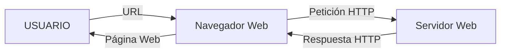
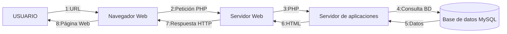
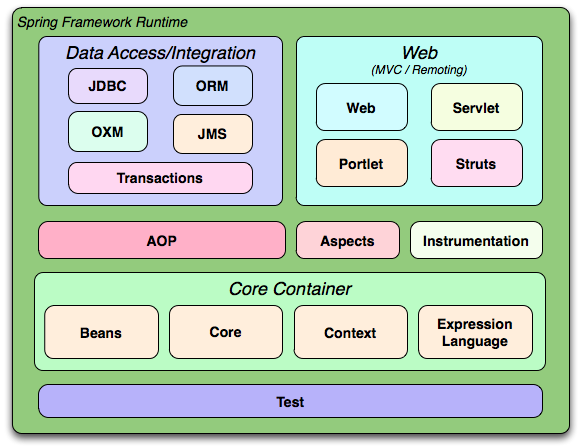

# 1-1 Funcionamiento de una aplicación web

## Funcionamiento de una aplicación web

Una aplicación web es un programa informático que se crea empleando tecnología web y funciona a través de un navegador u otros dispositivos. Las aplicaciones web funcionan siguiendo el denominado modelo entorno-servidor, siendo el cliente un programa o dispositivo que inicia una comunicación y el servidor el que responde a dicha petición con los datos solicitados.

Uno de los servidores web más populares es [Apache HTTP Server Project](https://httpd.apache.org/) o httpd. El protocolo de comunicación más empleado es HTTP (en el puerto 80), o su versión segura HTTPS (en el puerto 443).

El ordenador que actúa como servidor está a la escucha de las peticiones de dichos puertos y responde con los datos. En el caso de una aplicación web estática, el servidor responde con los datos de la página web, que se visualizan en el navegador del cliente. En el caso de una aplicación dinámica, la página web se genera en el servidor y se envía al cliente. 

A continuación el esquema del comportamiento de una página web estática.

La página devuelta a través de una URL siempre será la misma en este caso. Por otro lado, en cuanto a las páginas web estáticas:

Como se puede observar, el proceso es más complejo. El proceso anterior es conocido como pila AMP (Apache, MySQL, PHP). Este modelo es el que emplean paquetes comerciales como XAMPP. Esta forma de construir páginas web sin embargo está cayendo en desuso, en favor de las SPA (Single Page Application). En una SPA, el servidor no construye la página, sino que obtiene los datos necesarios a través de la API (application programming interface) y se los pasa a la aplicación del cliente en formato JSON, XML, etc. La aplicación cliente entonces se encarga de construir la vista. Con esta forma de trabajar, se diferencia muy claramente el perfil Front End (cliente) del perfil Back End (Servidor).

> **Actividad**
> Realiza un esquema similar al de los dos anteriores, pero referente a las SPA (se parecerá mucho al de las páginas dinámicas).

> **Actividad**
> Realiza una tabla comparativa entre páginas estáticas, páginas dinámicas y SPA.

> **Actividad**
> ¿Qué tipo de página web usarías para los siguientes casos y por qué?
> - Una página web para promocionar un perfil artístico
> - Una página web para consultar el tiempo de hoy
> - Un blog personal
> - Una página web para la documentación de una aplicación
> - Una página web para vender cosméticos online

## Introducción a Spring y Spring Boot

### Spring

[Spring](https://spring.io/projects/spring-framework) es un framework Open Source que facilita la creación de aplicaciones en Java, Kotlin y Groovy, principalmente para el Back-End. Se compone de herramientas y utilidades que generan aplicaciones completas descargando al desarrollador de la gestión de aspectos internos de comportamiento y generando código automático para tareas estándar, siendo las más importantes: el acceso a base de datos, la gestión de la seguridad de la aplicación y la generación de la API (Application Programming Interface).

Puedes ver más sobre Spring Framework en su [overview oficial](https://docs.spring.io/spring-framework/docs/3.2.x/spring-framework-reference/html/overview.html).

> **Actividad:**
> Crea un documento con una relación de los diversos módulos disponibles en Spring y para qué sirve cada uno de los más importantes  (Los que están representados en la imagen anterior).

Una de las características más importantes de Spring es la **inyección de dependencias** y el **inversor de control**. La inyección de dependencias es un patrón de software que se basa en que un elemento externo se encarga de la creación de objetos a medida que son requeridos por otros objetos en nuestra creación. El elemento externo que realiza esta tarea es el inversor de control (IoC). En Spring, el IoC está representado por la interfaz *ApplicationContext* y es la responsable de configurar e instanciar todos los objetos (llamados *Beans*) y manejar su ciclo de vida. El principal inconveniente de Spring es su profunda configuración. Para facilitar dicho trabajo, existe el módulo Spring Boot.

### Spring Boot

Spring Boot es un módulo dentro del ecosistema Spring Framework que facilita la configuración con un mínimo esfuerzo. 
- Usa el patrón **Convención sobre configuración**, que se basa en minimizar las decisiones que tiene que tomar el desarrollador en cuanto a configuración, pero sin perder flexibilidad.
- Permite crear aplicaciones Spring independientes: Nuestro proyecto puede ser un archivo .jar (Java Archive) con un servidor embebido o bien un archivo .war (Web Archive) que desplegaremos en un servidor externo.
- Incluye dependencias *starter*.
- Configura automáticamente librerías
- No genera código ni configuración XML, es transparente para el desarrollador.

### Estereotipos

* **@Component**
  Estereotipo genérico para marcar una clase como un **componente gestionado por Spring**. Es la anotación base que puede usarse cuando no encaja específicamente en `@Service`, `@Controller` o `@Repository`.

* **@Controller**
  Marca una clase como un **controlador de Spring MVC**, que maneja solicitudes HTTP y devuelve respuestas (puede ser vistas o JSON/XML si se combina con `@ResponseBody`).

* **@Service**
  Indica que una clase representa la **lógica de negocio o servicios de la aplicación**. Es un especialización de `@Component` pensada para organizar mejor el código.

* **@Repository**
  Marca una clase como un **componente de acceso a datos (DAO)**. Además, Spring traduce automáticamente las excepciones específicas de la base de datos a excepciones genéricas de Spring.

* **@Bean**
  Se usa dentro de una clase anotada con `@Configuration` para **registrar un bean manualmente en el contenedor** de Spring.

### Scopes

* **Singleton** (por defecto)
  Se crea **una sola instancia** del bean en todo el contenedor de Spring, y se comparte entre todas las dependencias que lo usen.

* **Prototype**
  Cada vez que se solicita, Spring crea **una nueva instancia** del bean.

* **Request** (en aplicaciones web)
  Se crea **una instancia por cada petición HTTP**.

* **Session** (en aplicaciones web)
  Se crea **una instancia por cada sesión de usuario** y se mantiene mientras dure la sesión.

