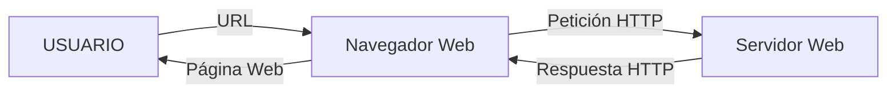
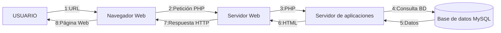

# 1-1 Funcionamiento de una aplicación web

## Funcionamiento de una aplicación web

Una aplicación web es un programa informático que se crea empleando tecnología web y funciona a través de un navegador u otros dispositivos. Las aplicaciones web funcionan siguiendo el denominado modelo entorno-servidor, siendo el cliente un programa o dispositivo que inicia una comunicación y el servidor el que responde a dicha petición con los datos solicitados.

Uno de los servidores web más populares es [Apache HTTP Server Project](https://httpd.apache.org/) o httpd. El protocolo de comunicación más empleado es HTTP (en el puerto 80), o su versión segura HTTPS (en el puerto 443).

El ordenador que actúa como servidor está a la escucha de las peticiones de dichos puertos y responde con los datos. En el caso de una aplicación web estática, el servidor responde con los datos de la página web, que se visualizan en el navegador del cliente. En el caso de una aplicación dinámica, la página web se genera en el servidor y se envía al cliente. 

A continuación el esquema del comportamiento de una página web estática.

La página devuelta a través de una URL siempre será la misma en este caso. Por otro lado, en cuanto a las páginas web estáticas:

Como se puede observar, el proceso es más complejo. El proceso anterior es conocido como pila AMP (Apache, MySQL, PHP). Este modelo es el que emplean paquetes comerciales como XAMPP. Esta forma de construir páginas web sin embargo está cayendo en desuso, en favor de las SPA (Single Page Application). En una SPA, el servidor no construye la página, sino que obtiene los datos necesarios a través de la API (application programming interface) y se los pasa a la aplicación del cliente en formato JSON, XML, etc. La aplicación cliente entonces se encarga de construir la vista. Con esta forma de trabajar, se diferencia muy claramente el perfil Front End (cliente) del perfil Back End (Servidor).

> **Actividad**
> Realiza un esquema similar al de los dos anteriores, pero referente a las SPA (se parecerá mucho al de las páginas dinámicas).

> **Actividad**
> Realiza una tabla comparativa entre páginas estáticas, páginas dinámicas y SPA.

> **Actividad**
> ¿Qué tipo de página web usarías para los siguientes casos y por qué?
> - Una página web para promocionar un perfil artístico
> - Una página web para consultar el tiempo de hoy
> - Un blog personal
> - Una página web para la documentación de una aplicación
> - Una página web para vender cosméticos online

