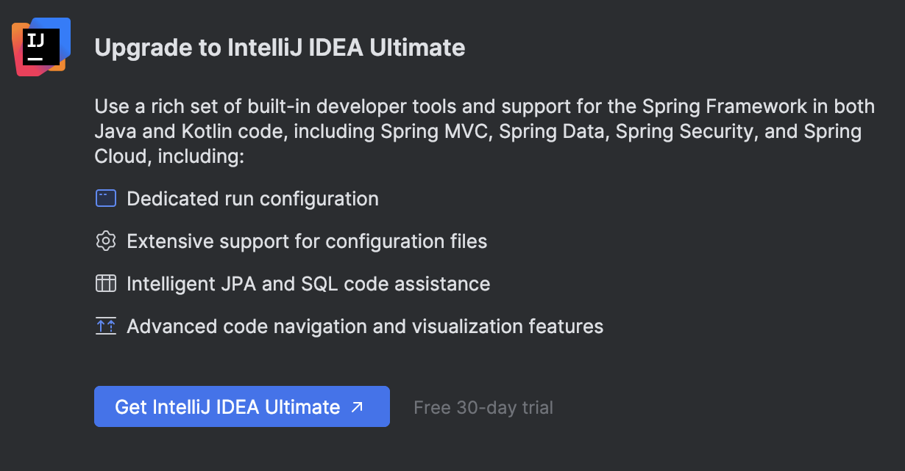
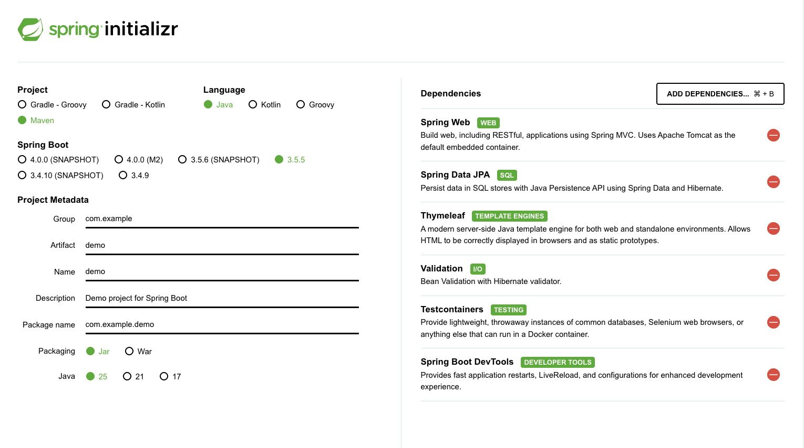

# Uso de Spring y Spring Boot

## Introducción a Spring y Spring Boot

Para trabajar con Spring, un framework de desarrollo web en entorno servidor que usa el lenguaje Java, necesitamos Java, un gestor de paquetes como Maven y un IDE. Como IDE, podemos usar cualquiera que soporte Java. Una buena opción es Visual Studio Code con las extensiones pertinentes. También es posible usar Netbeans o Eclipse, que son de código abierto. Por último, tenemos la opción de IntelliJ de Jetbrains.

IntelliJ tiene dos versiones, una gratuita llamada Community Edition y otra de pago, llamada Ultimate, a la que se puede acceder de forma gratuita con la licencia de estudiante. Para solicitar una licencia de estudiante, debes ir a [**la página web habilitada para la solicitud**](https://www.jetbrains.com/es-es/academy/student-pack/) y adjuntarles un documento que acredite que estás estudiando un ciclo superior de informática (la matrícula, el carnet de estudiante, etc.).

En ambas versiones de IntelliJ se puede usar Spring, pero la versión Ultimate tiene una serie de ventajas de calidad de vida para desarrollar los programas.


Al instalar un IDE, es importante deshabilitar la compleción de texto usando machine learning, para evitar que las sugerencias de código de Visual Studio Code o IntelliJ nos distraigan de lo que realmente queremos escribir. Intellisense, por otro lado, es muy útil. Intellisense es la herramienta que, dada una letra, nos sugiere una serie de elementos relacionados en nuestro proyecto (clases de java, variables, etc.). En IntelliJ viene por defecto y en VSC hay que instalar la extensión del lenguaje específico que queramos usar.

> **Actividad**
> Instala IntelliJ y/o Visual Studio Code. Configúralo para que soporte Intellisense en lenguaje Java y para que no haga sugerencias de compleción de código con machine learning.
> * Desactiva el inline completion en IntelliJ

### Spring

[Spring](https://spring.io/projects/spring-framework) es un framework Open Source que facilita la creación de aplicaciones en Java, Kotlin y Groovy, principalmente para el Back-End. Se compone de herramientas y utilidades que generan aplicaciones completas descargando al desarrollador de la gestión de aspectos internos de comportamiento y generando código automático para tareas estándar, siendo las más importantes: el acceso a base de datos, la gestión de la seguridad de la aplicación y la generación de la API (Application Programming Interface).


Puedes ver más sobre Spring Framework en su [overview oficial](https://docs.spring.io/spring-framework/docs/3.2.x/spring-framework-reference/html/overview.html).

> **Actividad:**
> Crea un documento con una relación de los diversos módulos disponibles en Spring y para qué sirve cada uno de los más importantes  (Los que están representados en la imagen anterior).

Una de las características más importantes de Spring es la **inyección de dependencias** y el **inversor de control**. La inyección de dependencias es un patrón de software que se basa en que un elemento externo se encarga de la creación de objetos a medida que son requeridos por otros objetos en nuestra creación. El elemento externo que realiza esta tarea es el inversor de control (IoC). En Spring, el IoC está representado por la interfaz *ApplicationContext* y es la responsable de configurar e instanciar todos los objetos (llamados *Beans*) y manejar su ciclo de vida. El principal inconveniente de Spring es su profunda configuración. Para facilitar dicho trabajo, existe el módulo Spring Boot.

### Spring Boot

Spring Boot es un módulo dentro del ecosistema Spring Framework que facilita la configuración con un mínimo esfuerzo. 
- Usa el patrón **Convención sobre configuración**, que se basa en minimizar las decisiones que tiene que tomar el desarrollador en cuanto a configuración, pero sin perder flexibilidad.
- Permite crear aplicaciones Spring independientes: Nuestro proyecto puede ser un archivo .jar (Java Archive) con un servidor embebido o bien un archivo .war (Web Archive) que desplegaremos en un servidor externo.
- Incluye dependencias *starter*.
- Configura automáticamente librerías
- No genera código ni configuración XML, es transparente para el desarrollador.

### Estereotipos

* **@Component**
  Estereotipo genérico para marcar una clase como un **componente gestionado por Spring**. Es la anotación base que puede usarse cuando no encaja específicamente en `@Service`, `@Controller` o `@Repository`.

* **@Controller**
  Marca una clase como un **controlador de Spring MVC**, que maneja solicitudes HTTP y devuelve respuestas (puede ser vistas o JSON/XML si se combina con `@ResponseBody`).

* **@Service**
  Indica que una clase representa la **lógica de negocio o servicios de la aplicación**. Es un especialización de `@Component` pensada para organizar mejor el código.

* **@Repository**
  Marca una clase como un **componente de acceso a datos (DAO)**. Además, Spring traduce automáticamente las excepciones específicas de la base de datos a excepciones genéricas de Spring.

* **@Bean**
  Se usa dentro de una clase anotada con `@Configuration` para **registrar un bean manualmente en el contenedor** de Spring.


### Scopes

* **Singleton** (por defecto)
  Se crea **una sola instancia** del bean en todo el contenedor de Spring, y se comparte entre todas las dependencias que lo usen.

* **Prototype**
  Cada vez que se solicita, Spring crea **una nueva instancia** del bean.

* **Request** (en aplicaciones web)
  Se crea **una instancia por cada petición HTTP**.

* **Session** (en aplicaciones web)
  Se crea **una instancia por cada sesión de usuario** y se mantiene mientras dure la sesión.

## Instalación de Java, Spring y Maven

Java Development Kit (JDK) es el software imprescindible para desarrollar cualquier tipo de aplicación en Java: incluye el intérprete, las clases de Java y las herramientas de desarrollo de Java (JDT): compilador, depurador, generador de documentación, etc. Es imprescindible su instalación para el desarrollo de aplicaciones en cualquier ecosistema de Java. Algunos IDE como IntelliJ lo instalan de forma transparente al usuario, pero si queremos abrir archivos .jar o usarlo fuera de IntelliJ, necesitamos instalar el JDK. La versión que vamos a usar en este curso es Java 25, que es la última LTS. Para usar Java 25 necesitas tener el IDE actualizado.

> **Actividad:**
> Instala Java en tu sistema operativo. Usa este [enlace para descargarlo.](https://www.oracle.com/es/java/technologies/downloads/#java25). Para IntelliJ, Java se instala de forma integrada con el IDE. Para otros editores, hay que usar esta versión.

> **Actividad:**
> Instala los [paquetes recomendados](https://code.visualstudio.com/docs/languages/java) para usar Java en Visual Studio Code.
> * La extensión "Extension pack for Java". Incluye soporte para el lenguaje, el Debugger, el Test Runner, Maven, Gradle, el gestor de proyectos e Intellisense.
> * Instala también Spring Boot Extension Pack.

> **Actividad:**
> Configura el JDK. Para ello, podemos cambiar la variable JAVA_HOME (aunque eso tiene un alcance global) o, en VSC, ir al archivo settings.json y añadir la variable `java.jdt.java.home` con la ruta donde hayamos descomprimido nuestro JDK. Recuerda que JSON usa la combinación "clave" : "valor" y que cada componente debe ir separado por comas, dentro de una sección {}.
`settings.json`
```json
{
    "workbench.colorTheme": "Visual Studio Light",
    "java.jdt.ls.java.home": "C\\Program Files\\Java\\jdk-25.0.0"
}
```

Además de Java, el gestor de dependencias que vamos a usar es Maven. **Maven** es un gestor de proyectos y dependencias ampliamente utilizado en proyectos Java. Define la estructura del proyecto y gestiona las dependencias a través de un archivo XML llamado `pom.xml`. Las ventajas de usar Maven son las siguientes:

- **Estandarización**: Tiene una estructura estándar de proyectos Java, lo que facilita la colaboración entre equipos.
- **Automatización de dependencias**: Puedes agregar dependencias fácilmente, y Maven descargará automáticamente las bibliotecas necesarias y sus dependencias transitorias desde repositorios centralizados.
- **Integración continua**: Está bien soportado en herramientas de integración continua (CI) como Jenkins, GitLab CI, GitHub Actions, etc.
- **Popularidad y soporte**: Hay una enorme comunidad y mucha documentación disponible.

Sin embargo, Maven no está exento de algunos inconvenientes:

- **XML**: Algunos desarrolladores consideran que editar archivos `pom.xml` es tedioso y difícil de leer cuando el archivo crece.
- **Rendimiento**: Comparado con Gradle, Maven puede ser un poco más lento, especialmente en proyectos grandes.

**Maven** es una excelente opción para trabajar en **proyectos medianos o grandes**. También es ideal para proyectos con equipos distribuidos, ya que su estructura estándar y amplio uso en la industria lo hacen fácil de adoptar.

### Configuración de un proyecto con Maven

1. **Crear un proyecto con Maven**:
   - Al crear un nuevo proyecto en IntelliJ, selecciona **Maven** como opción de proyecto.
   - IntelliJ generará automáticamente un archivo `pom.xml` donde podrás agregar tus dependencias.

2. **Agregar dependencias en Maven**:
   - Abre el archivo `pom.xml` y añade las dependencias dentro de la sección `<dependencies>`:

   ```xml
   <dependencies>
       <dependency>
           <groupId>junit</groupId>
           <artifactId>junit</artifactId>
           <version>4.13.1</version>
           <scope>test</scope>
       </dependency>
   </dependencies>
   ```

3. **Ejecutar Maven**:
   - Puedes ejecutar comandos de Maven directamente en IntelliJ desde el panel de Maven (en la barra lateral derecha).
   - Comandos comunes incluyen `clean`, `install`, y `package`.

> **Actividad**
>
>Crea un proyecto en Java usando Maven y un programa que, al ejecutarlo, escriba por consola "Hola Mundo, vivo en Maven".

### Git y Github

Por último, es conveniente configurar tanto IntelliJ como VSC para que soporten GIT, de esta manera podemos tener un control de versiones de nuestro proyecto y, si enlazamos con nuestra cuenta de GITHUB, podemos también tener un respaldo en la nube. 

## Proyectos en Spring

Podemos crear un proyecto de Spring de tres formas. La primera de ellas es a través del inicializador de VSC o de IntelliJ Ultimate. La segunda es a través de [start.spring.io](https://start.spring.io/), que es un formulario en el que podemos generar un proyecto vacío con la configuración que queramos. La tercera es copiar un proyecto ya existente y modificarlo.



En esta imagen, podemos ver un ejemplo de cómo usar el inicializador de Spring. Al darle a generar nos creará un proyecto y ese será el que deberemos abrir en nuestro IDE.

En este caso, elegimos el gestor de proyectos (Maven), el lenguaje (Java), el SpringBoot (3.5.5) y la metadata del proyecto.
* Group: Tiene forma de web invertida. En este caso, definimos el dominio del proyecto.
* Artifact: El nombre del artefacto. Los artefactos son archivos producidos por un proceso de BUILD, es decir, los .jar o .war resultantes de construir el proyecto.
* Name: El nombre del proyecto.
* Description: Una descripción del proyecto
* Package name: Tiene forma de web invertida. Se trata del paquete principal del proyecto.
* Packaging: Si queremos un .jar o un .war. El .war es para ser lanzado en un servidor de aplicaciones, mientras que el .jar lo tiene integrado. De momento, elegimos .jar.
* Java: La versión de java. Están disponibles las últimas LTS (Long Term Support). Elegimos la 25 por ser la más reciente.

Por otro lado, a la derecha vemos que están las dependencias. Hemos añadido las dependencias `Spring Web`, `Spring Data JPA`, `Thymeleaf`, `Validation`, `TestContainers`, `Spring Boot DevTools`. Las dependencias se pueden añadir de forma manual desde el archivo pom.xml que se genera en maven. En él, vamos a la sección `<dependencies>` y añadimos la `<dependency>`.

El archivo pom.xml que se genera es el siguiente:

```xml
<?xml version="1.0" encoding="UTF-8"?>
<project xmlns="http://maven.apache.org/POM/4.0.0" xmlns:xsi="http://www.w3.org/2001/XMLSchema-instance"
	xsi:schemaLocation="http://maven.apache.org/POM/4.0.0 https://maven.apache.org/xsd/maven-4.0.0.xsd">
	<modelVersion>4.0.0</modelVersion>
	<parent>
		<groupId>org.springframework.boot</groupId>
		<artifactId>spring-boot-starter-parent</artifactId>
		<version>3.5.5</version>
		<relativePath/> <!-- lookup parent from repository -->
	</parent>
	<groupId>com.example</groupId>
	<artifactId>demo</artifactId>
	<version>0.0.1-SNAPSHOT</version>
	<name>demo</name>
	<description>Demo project for Spring Boot</description>
	<url/>
	<licenses>
		<license/>
	</licenses>
	<developers>
		<developer/>
	</developers>
	<scm>
		<connection/>
		<developerConnection/>
		<tag/>
		<url/>
	</scm>
	<properties>
		<java.version>25</java.version>
	</properties>
	<dependencies>
		<dependency>
			<groupId>org.springframework.boot</groupId>
			<artifactId>spring-boot-starter-data-jpa</artifactId>
		</dependency>
		<dependency>
			<groupId>org.springframework.boot</groupId>
			<artifactId>spring-boot-starter-thymeleaf</artifactId>
		</dependency>
		<dependency>
			<groupId>org.springframework.boot</groupId>
			<artifactId>spring-boot-starter-validation</artifactId>
		</dependency>
		<dependency>
			<groupId>org.springframework.boot</groupId>
			<artifactId>spring-boot-starter-web</artifactId>
		</dependency>

		<dependency>
			<groupId>org.springframework.boot</groupId>
			<artifactId>spring-boot-devtools</artifactId>
			<scope>runtime</scope>
			<optional>true</optional>
		</dependency>
		<dependency>
			<groupId>org.springframework.boot</groupId>
			<artifactId>spring-boot-starter-test</artifactId>
			<scope>test</scope>
		</dependency>
		<dependency>
			<groupId>org.springframework.boot</groupId>
			<artifactId>spring-boot-testcontainers</artifactId>
			<scope>test</scope>
		</dependency>
		<dependency>
			<groupId>org.testcontainers</groupId>
			<artifactId>junit-jupiter</artifactId>
			<scope>test</scope>
		</dependency>
	</dependencies>

	<build>
		<plugins>
			<plugin>
				<groupId>org.springframework.boot</groupId>
				<artifactId>spring-boot-maven-plugin</artifactId>
			</plugin>
		</plugins>
	</build>

</project>
```

Podemos añadir o quitar dependencias, así como modificar cualquier parte del pom sobre la marcha, pero tras cada cambio habrá que recargar el proyecto para que los cambios sean efectivos.

En la página web [mvnrepository.com](https://mvnrepository.com/) tienes disponibles todos los repositorios de Maven que puedes añadir a tu pom xml. Las dependencias oficiales de spring empiezan por "spring-boot-starter-" y las más usuales son:
- web
- data-jpa
- validation
- test

Buscamos la dependencia en el buscador y hacemos click en ella. Una vez dentro, seleccionamos la versión de nuestro SpringBoot y nos aparecerá el texto que debemos copiar en nuestro archivo pom.xml.


## Contenido Estático

En SpringBoot, el contenido estático de nuestra aplicación web se almacena en la carpeta *src/main/resources/static*. Aquí se almacenarán los archivos HTML, CSS, las imágenes, etc. Si ponemos un archivo index.hmtl, la aplicación arrancará directamente usando ese documento.

> **Actividad:**
> Crea un proyecto con Spring con SpringBoot (ya sea con el inicializador del IDE o con la página web facilitada anteriormente) con la extensión Spring Web y ejecútalo. En la ventana terminal te aparecerá lo siguiente:

```
  .   ____          _            __ _ _
 /\\ / ___'_ __ _ _(_)_ __  __ _ \ \ \ \
( ( )\___ | '_ | '_| | '_ \/ _` | \ \ \ \
 \\/  ___)| |_)| | | | | || (_| |  ) ) ) )
  '  |____| .__|_| |_|_| |_\__, | / / / /
 =========|_|==============|___/=/_/_/_/

 :: Spring Boot ::                (v3.5.5)

2025-09-17T10:48:55.412+02:00  INFO 35927 --- [demo2] [           main] com.example.demo2.Demo2Application       : Starting Demo2Application using Java 25 with PID 35927 (/Users/arturoalbero/Desktop/demo2/target/classes started by arturoalbero in /Users/arturoalbero/Desktop/demo2)
2025-09-17T10:48:55.414+02:00  INFO 35927 --- [demo2] [           main] com.example.demo2.Demo2Application       : No active profile set, falling back to 1 default profile: "default"
2025-09-17T10:48:55.826+02:00  INFO 35927 --- [demo2] [           main] o.s.b.w.embedded.tomcat.TomcatWebServer  : Tomcat initialized with port 8080 (http)
2025-09-17T10:48:55.834+02:00  INFO 35927 --- [demo2] [           main] o.apache.catalina.core.StandardService   : Starting service [Tomcat]
2025-09-17T10:48:55.834+02:00  INFO 35927 --- [demo2] [           main] o.apache.catalina.core.StandardEngine    : Starting Servlet engine: [Apache Tomcat/10.1.44]
2025-09-17T10:48:55.857+02:00  INFO 35927 --- [demo2] [           main] o.a.c.c.C.[Tomcat].[localhost].[/]       : Initializing Spring embedded WebApplicationContext
2025-09-17T10:48:55.858+02:00  INFO 35927 --- [demo2] [           main] w.s.c.ServletWebServerApplicationContext : Root WebApplicationContext: initialization completed in 407 ms
2025-09-17T10:48:56.000+02:00  WARN 35927 --- [demo2] [           main] ion$DefaultTemplateResolverConfiguration : Cannot find template location: classpath:/templates/ (please add some templates, check your Thymeleaf configuration, or set spring.thymeleaf.check-template-location=false)
2025-09-17T10:48:56.036+02:00  INFO 35927 --- [demo2] [           main] o.s.b.w.embedded.tomcat.TomcatWebServer  : Tomcat started on port 8080 (http) with context path '/'
2025-09-17T10:48:56.042+02:00  INFO 35927 --- [demo2] [           main] com.example.demo2.Demo2Application       : Started Demo2Application in 0.902 seconds (process running for 1.103)
```

> Si nos fijamos, el TomcatWebServer se ha iniciado en el puerto 8080. Para acceder a nuestra aplicación, vayamos a localhost:8080 en nuestro navegador. Aparecerá lo siguiente:

```
Whitelabel Error Page
This application has no explicit mapping for /error, so you are seeing this as a fallback.

Wed Sep 17 10:50:54 CEST 2025
There was an unexpected error (type=Not Found, status=404).
```

> Ahora, cierra el proyecto y crea un archivo index.html en la carpeta /static. 

```html
<!DOCTYPE html>
<html lang="en">
<head>
    <meta charset="UTF-8">
    <title>Title</title>
</head>
<body>
<p>Hola Mundo</p>

</body>
</html>
```

> Vuelve a ejecutar el proyecto y vuelve a la página de localhost. Aparecerá tu página web.

## WebJars

JQuery, BootStrap y otras librerías son recursos estáticos que se emplean frecuentemente. La forma de incorporarlos a nuestros proyectos en muchos casos es incluyendo las URL originales de las librerías ([CDN, de cloudflare](https://www.cloudflare.com/es-es/learning/cdn/what-is-a-cdn/)) o descargándolas en nuestro servidor y empleando URL locales.

Ambos casos tienen desventajas. En el primero, dependes de los servidores de CDN y, además, debes descargarlas cada vez que las quieras usar (por lo que la aplicación va más lenta). En el segundo caso, debemos descargar los archivos y gestionar las versiones.

Spring ofrece una tercera forma, **WebJars**. Un WebJar nos permite trabajar con los recursos estáticos como si fueran dependencias de Maven, por lo que tenemos la ventaja de descargarlo en nuestro servidor, pero además la versión se controla de forma automática y todo se ejecuta a través de Maven, por lo que resulta transparente al desarrollador. Un WebJar es una dependencia más. Podemos acceder a los webjars a través de [webjars.org](https://www.webjars.org/).


En la web podemos elegir el formato de la dependencia. Seleccionamos Maven y buscamos una que nos interese, por ejemplo Bootstrap5.  También necesitaremos la dependencia [webjars-locator](https://mvnrepository.com/artifact/org.webjars/webjars-locator) del repositorio oficial de maven. Copiamos el texto en la sección de dependencias de nuestro pom.xml y recargamos el proyecto (en IntelliJ, click derecho sobre el archivo pom.xml, Maven->Sync Project).
```xml
<dependency>
    <groupId>org.webjars</groupId>
    <artifactId>webjars-locator</artifactId>
    <version>0.52</version>
</dependency>
<dependency>
    <groupId>org.webjars</groupId>
    <artifactId>bootstrap</artifactId>
    <version>5.3.8</version>
</dependency>
```

Por último, modificamos de la siguiente manera el HTML que habíamos creado para que incluya las librerías instaladas y ejecutamos el proyecto para ver los resultados:
```html
<!DOCTYPE html>
<html lang="en">
<head>
    <meta charset="UTF-8">
    <title>Title</title>
    <link href="/webjars/bootstrap/css/bootstrap.min.css" rel="stylesheet">
    <script src = "/webjars/bootstrap/js/bootstrap.bundle.min.js">
    </script>
</head>
<body>
<p>Hola Mundo</p>

</body>
</html>
```
Observa que los paquetes instalados en las dependencias se encuentran en la carpeta `External Libraries`:


## Changing the port of the Spring Boot Application

The default port for Spring Boot applications is 8080, but it can be changed using several methods. The most common approach is to modify the application.properties or application.yml file located in the src/main/resources directory. In application.properties, add the line `server.port=9090` to set the port to 9090.
In application.yml, use the syntax server: port: 9090 for the same result.

Alternatively, you can change the port via command-line arguments when running the JAR file using java -jar myapp.jar --server.port=9090. This method is useful for temporary changes or different environments without modifying configuration files.

> **Activity:**
> Modify your project in order to include one or more webjars, and change the default port.