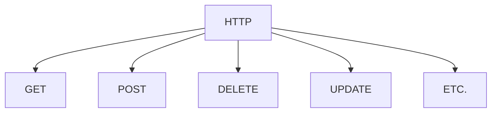

# Introducción a los controladores


## Controladores

### Definición de controlador en Spring

El controlador es la clase que se encarga de recibir las peticiones de nuestra aplicación. Serán recibidas mediante el protocolo HTTP en el caso de las páginas web creadas por nosotros mismos o a través de otro tipo de dispositivos.



### Creación de controladores en Spring. Mapeo.

Para crear en Spring un controlador debemos crear una clase simple (`Plain Old Java Object -> POJO`) y anotarla con `@Controller`. 

Lo siguiente que debemos hacer es crear en esa clase distintos métodos y asociarlos a las diferentes peticiones HTTP (URL) que vamos a recibir y a las que el controlador va a responder. Las peticiones más habituales son GET, POST, PUT y DELETE, aunque hay más.

Entonces, cada método del controlador deberá saber a qué URL y el comando que tiene que responder. Para ello, anotaremos al controlador con: `@RequestMapping` pasando como parámetro la URL y el comando, o bien, desde la versión 4.3 de Spring, anotándolo con sus derivadas @GetMapping, @PostMapping, @PutMapping, @DeleteMapping, etc. en las que el comando HTTP va implícito en la anotación y solo requieren la URL.

El nombre que le damos al controlador es indiferente. Suele nombrarse según su función (MainController, FrontController, etc.) En cuanto a su ubicación, ***debe estar en el paquete raíz de la aplicación Spring Boot o bien en un subpaquete del mismo***. Podemos agrupar todas las clases controladoras en un único paquete o bien agruparlas por área de negocio.

La clase debe contener un método para cada comando HTTP o cada URL que requiera el mismo tratamiento. El interior del método contendrá las operaciones que será necesario hacer en el servidor para obtener los datos dinámicos que compondrán la respuesta y, finalmente, devolverá al solicitante la respuesta. Estas operaciones son conocidas como la lógica de negocio. **Si estructuramos nuestra aplicación en capas, estas tareas se pasarán a la capa de servicio y el controlador simplemente llamará a estos servicios**.

La respuesta en estas primeras pruebas será simplemente una página web con contenido estático y contenido dinámico generado por nuestra aplicación. Estas páginas serán conocidas como vistas, de acuerdo al patrón MVC.

```java
@Controller                     //Anotación de controlador
public class HomeController{
    @GetMapping("/")            //Ruta a la que responde por GET
    public String showHome(){
        return "indexView";     //Vista que devuelve
    }
}
```
En este ejemplo, vemos cómo la anotación `@GetMapping` incluye como parámetro la URL que hará que se ejecute este controlador. En este caso, la URL `/` sería la correspondiente a la raíz de nuestra web, por ejemplo, `http://localhost/`.

El nombre del método asociado al *mapping* puede ser cualquiera y no tiene por qué recibir ningún parámetro obligatoriamente. El método puede devolver distintos tipos de datos, siendo el más sencillo el del ejemplo, un String. Ese String se corresponde con la página web que se devuelve al usuario (la vista). Por defecto, se sobreentiende la extensión .html para las vistas. En este caso, devuelve la vista *indexView.html*. Para que esto funcione así, debemos tener la dependencia **thymeleaf** en nuestro pom.xml.

El último paso para que este ejemplo funcione es crear la vista *indexView.html*. Esta vista deberá estar ubicada en la carpeta **templates** de nuestra aplicación (no en *static*). A continuación, una página totalmente estática para probar cómo funciona.

```html
<!DOCTYPE html>
<html>
    <head></head>
    <body>
        <h1>HOLA AMIGOS</h1>
    </body>
</html>
```

### Consideraciones sobre los controladores

* La URL que figura en la anotación es la ruta de la petición, no representa la ruta de la vista que devolverá (a diferencia de lo que sucede con el contenido estático). Las rutas URL de las anotaciones se estructuran en "carpetas" solo por claridad de código, pero no hay una carpeta real en el servidor. Por ejemplo, `@PostMapping("/producto/alta")` no implica que haya una carpeta `producto`.
* En la anotación podemos incluir varias rutas, por ejemplo, si con la URL `http://localhost/home` también queremos mostrar la misma vista que con `http:localhost\` o `http:\\localhost`, modificamos la anotación añadiendo las rutas entre llaves {} (curly) de la siguiente forma: `@GetMapping({"/", "/home", ""})`. Esto es una gran diferencia con respecto a las páginas web tradicionales.
* La vista por defecto tiene una extensión html, pero se puede cambiar esa configuración por defecto para devolver otro tipo de archivos, como por ejemplo `.jsp`.
* Trabajando con Spring Boot (para evitar complicaciones con la configuración), las vistas deberán estar en la carpeta templates o en subcarpetas. Hay que reflejar esa estructura de carpetas en el `return` del método del controlador, por ejemplo `return "usuarios/bajaView` devolverá la página bajaView.html de la carpeta `templates/usuarios`.
* Los métodos de los controladores pueden devolver otros objetos, como pueden ser archivos JSON u objetos de tipo respuesta HTTP. Se verá más adelante.
* En cuanto a la estructuración de *mappings*, una costumbre habitual es definir a nivel clase controladora un `@RequestMapping` con la ruta base de ese controlador y luego `@GetMapping`, `@PostMapping`, etc. para cada uno de los métodos de la clase, sin necesidad de repetir la ruta base.
* El siguiente ejemplo, el `@RequestMapping` inicial hace todas las rutas tratadas por el controlador se refieran a "/app", por lo que el `@GetMapping("/productos")` manejaría la URL "/app/productos" y así con el resto de métodos del controlador.

```java
@Controller
@RequestMapping("/app")
public class ProductosController{
    @GetMapping("/productos")
    public String getList(){
        return "productosListView";
    }
    @GetMapping("/eliminar/{id}") //El recurso entre {} es el parámetro
    public String removeItem(@PathVariable Long id){
        return "productoDeleteView";
    }
    @GetMapping("/nuevo"){
        return "productoNewView"; 
    }
}
```
En el ejemplo anterior, usamos la anotación `@PathVariable` para indicar que el parámetro definido a continuación (en este caso `Long id`) está sacado del @GetMapping (lo que está entre {}). El nombre ha de ser el mismo.

## Contenido estático y contenido dinámico

En **Spring Boot con Thymeleaf** hay que separar claramente **plantillas** de **recursos estáticos**:

* En `src/main/resources/templates/` van **solo las vistas Thymeleaf** (`.html`). Estas son procesadas en el servidor antes de enviarse al navegador.

* En `src/main/resources/static/` van los **recursos estáticos**: **CSS, JS, imágenes, fuentes, etc.** Estos archivos **no los procesa Thymeleaf**, sino que Spring Boot los sirve directamente al navegador. Por ejemplo, un archivo en `src/main/resources/static/css/styles.css` será accesible en el navegador en `http://localhost:8080/css/styles.css`.

> **Actividad:**
> Toma el proyecto anterior y desarrolla una clase de tipo `@Controller` que contenga diferentes @GetMapping con las rutas que quieras que devuelvan las vistas solicitadas.
> a) ¿Tienes que cambiar la ubicación de las vistas? ¿Por qué?
> b) ¿Tienes que cambiar el código HTML del menú de navegación de las páginas?
> c) ¿Tienen que llamarse igual las rutas del GetMapping y las vistas?
> La página index será servida para las URL: /index, /home o, simplemente, /. Como las rutas y las vistas no tienen por qué llamarse igual, renombra las vistas con el sufijo "View" (por ejemplo, indexView.html). Así podemos distinguir bien por el propio nombre lo que es una vista y lo que es una ruta o URL gestionada por el controlador.


<details>
<summary>El enunciado del proyecto anterior era este:</summary>

> Crea un segundo proyecto a partir de https://start.spring.io con las mismas características que el anterior. En este caso, consistirá en una web estática sobre Frédeic Chopin.
>
> - index.html con una biografía general (puedes extraer información de la [Wikipedia](https://es.wikipedia.org/wiki/Fr%C3%A9d%C3%A9ric_Chopin) y resumirla). Interesan los datos referentes a su nacimiento y fallecimiento, así como los lugares donde ejerció su actividad profesional. Habla de su mujer George Sand y de su paso por Mallorca, así de como cualquier dato que consideres importante o curioso.
>- repertorio.html con la lista de piezas más relevantes del compositor. Añade enlaces a las partituras seleccionadas que estén en [imslp.org](https://imslp.org/wiki/Category:Chopin,_Fr%C3%A9d%C3%A9ric), así como vídeos de interpretaciones en youtube o en el propio imslp para cada una.
>- galeria-imagenes.html con fotos y cuadros relevantes. Puedes extraerlas de la Wikipedia.
>- enlaces-externos.html con enlaces relevantes para la página web. Puedes añadir los de su página de Wikipedia e imslp.org, así como de algún artículo que encuentres por internet.
>
>El contenido de la página puede estar en castellano, aunque puedes usar un chatbot o un traductor para traducirlo al inglés.
</details>

## Thymeleaf y contenido dinámico

### Conceptos básicos de Thymeleaf

Thymeleaf es un motor de plantillas. A diferencia de JSP, funciona con **puro HTML5** usando atributos especiales (`th:*`). Por lo tanto, en lugar de a Servlets, se procesa el HTML como plantilla. El motor sustituye expresiones `${}` por datos del modelo que le pasas desde el controlador.

Thymeleaf separa claramente la **lógica** (Java/Spring en el controlador) de la **vista** (HTML).

```html
<h1>Hola <span th:text="${nombre}">Usuario</span></h1>
```
Si se abre este archivo directamente en un navegador, se ve como HTML válido (con “Usuario” por defecto). Es el motor de Spring el que cambia el contenido. A esto se le llama "Natural Templating", es decir, al hecho de que no agrega nuevas etiquetas a la plantilla, sino que lo que aporta son nuevos atributos a etiquetas ya existentes. Esto facilita el trabajo estático con la plantilla, añadiendo posteriormente los atributos dinámicos (cosa que con JSP no se puede hacer, hay que cargarlo desde el servidor siempre).

Thymeleaf dispone de varios dialectos, es decir, de distintas formas de añadir las expresiones a nuestra plantilla para ser renderizada. Aunque existe un dialecto por defecto, en estos ejercicios emplearemos uno propio de Spring: SpEL (Spring Expression Language).

Al añadir las dependencias spring-boot-starter-web y spring-boot-starter-thymeleaf, se configura nuestro proyecto para poder usar thymeleaf. Si no, tendríamos que escribir un `@Configuration` de forma manual.

Para modificar aspectos de thymeleaf, lo podemos hacer desde application.properties (igual que podíamos cambiar el puerto). Un parámetro típico es thymeleaf.cache, que por defecto está a true, pero en desarrollo podemos ponerlo a false para que cuando cambiemos la plantilla los cambios se vean refrescando el navegador sin necesidad de reiniciar el proyecto. A esto se le denomina hot-swapping, y conviene no hacerlo cuando el producto está ya en producción, ya que hace que sea más lento.

En nuestras plantillas, tenemos que añadir un atributo a la etiqueta html para indicarle que va a ser procesada por thymeleaf.

`<html xmlns:th="http://www.thymeleaf.org">

### Paso de datos a la plantilla

Para pasarle datos a la plantilla, al método del controlador le pasaremos como parámetro una instancia de una clase Model (de org.springframework.ui.Model) y, antes de hacer el return a la vista, le añadiremos al model los elementos que queremos pasarle.

```html
<h1 th:text="${city}">Ciudad por defecto</h1>
```

```java
@GetMapping("/")
public String showHome(Model model){
    String ciudad = "Mutxamel";
    model.addAttribute("city", ciudad);
    return "homeView";
}
```
> **Actividad**
> Crea una aplicación en Springboot que use una única plantilla. En ella, mediante thymeleaf, se tiene que editar el texto de una etiqueta para realice operaciones matemáticas y las ponga en el navegadot.
>
>De esta forma, si pongo localhost/1/+/2 debería mostrar en la web el número 3.
>
>Implementa las operaciones +, -, x y / y, si se intentara dividir entre 0, devuelve el mensaje "Error, división entre 0".
>
> Usa la propiedad spring.thymeleaf.cache=false para probar diferentes formas de renderizado del mensaje.
> `1 + 2 = 3`, después `1 más 2 es igual a 3`, etc.


