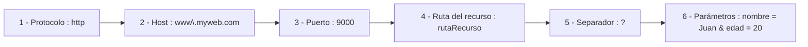

# URLs dinámicas en Thymeleaf

## Rescatar parámetros de las URL

Una de las formas más habituales del paso de datos desde el cliente al servidor es mediante parámetros en la URL. Primero, veamos las partes de una URL en el siguiente esquema:

```url
http://www.myweb.com:9000/rutaRecurso?nombre=Juan&edad=20
```

Hay dos formas de pasar parámetros en la URL:
* Pasar los parámetros en la parte de la consulta: después de la dirección, después de la interrogación y separados por & en pares variable=valor, como en el ejemplo de arriba
* Pasar los parámetros en la propia dirección de la URL, como hacíamos en el ejercicio de la calculadora (en `http://localhost:8080/3/+/4` los parámetros eran `3`, `+` y `4`).

Para rescatar los parámetros en la parte de la consulta usamos `@RequestParam` y para rescatarlos en la dirección usamos `@PathVariable`. 

### @RequestParam

Esta anotación será un parámetro que le pasaremos al método del controlador y que incluirá el nombre de la variable en la URL y, a continuación, la variable que recogerá el dato de ese parámetro de la URL. 

Por ejemplo, para recoger el parámetro de la URL `www.devschool.com?profesor=rdf` usaremos lo siguiente:

```java
@GetMapping("/")
public String showHome(@RequestParam("profesor") String nombreProfesor, Model model){}
```
> **NOTA:** No te olvides que para poder trabajar con los datos necesitamos también el Model.

Debemos emplear una anotación `@RequestParam` por cada parámetro que pasemos en la URL. Un problema que nos encontraremos es que si el usuario invoca a la URL mapeada sin parámetros, o no se ajustan a los parámetros que esperamos, se producirá un error 400 (URL mal formada). Para evitarlo, podemos incluir dentro de la anotación el parámetro `required = false` y, además, podemos añadir un `defaultValue` para tener un valor por defecto.

```java
@GetMapping("/")
public String showHome(@RequestParam(name = "profesor", required = false, defaultValue="X") String nombreProfesor, Model model){}
```

En el caso de que el nombre de la variable sea igual en la URL y el controlador, podemos simplificar de la siguiente forma:

```java
@GetMapping("/")
public String showHome(@RequestParam(required = false, defaultValue="X") String profesor, Model model){}
```

Otra manera de controlar este tipo de casuística es empleando la clase `Optional`, que se trata de una clase genérica en forma de envoltorio de otra clase cuyo objetivo es evitar errores de ejecución por valores nulos, ofreciendo métodos (`get()`, `isEmpty()`, `orElse(T value)` [siendo `T` el tipo de datos indicado entre `<>`]) para tratar esos nulos.

```java
@GetMapping("/")
public String showHome(@RequestParam Optional <String> profesor, Model model){
    model.addAttribute("profe", profesor.orElse("X"));
}
```
>**RECUERDA:** Si el nombre del parámetro coincide con el nombre de la variable en el método del controlador, no es necesario indicarlo.

> **NOTA:** `@PathVariable` está cobrando popularidad en los últimos años debido a que es más legible, aunque ofrece menos opciones de control de errores y tampoco ofrece la posibilidad de usar valores por defecto. Ya lo trabajamos en el apartado anterior.

Para prevenir errores, tanto usando `@RequestParam` como `@PathVariable`, es una buena práctica capturar todos los valores de los parámetros con el tipo de dato String, y después realizar la conversión de datos usando un bloque `try-catch`:

> ```java
>@GetMapping("\{num}")
>public String showPage(@PathVariable String num, Model model){
>   int numero;
>   try{
>        numero = Integer.parseInt(num);
>    }catch(Exception e){
>        //Redireccionamos a una página de error
>    }
>   (...)
>}
>```
>

## Retorno de los métodos del controlador

Los métodos del controlador suelen devolver un String que se corresponde con la vista que le queremos devolver al cliente (sin el .html). Sin embargo, también podemos redirigir a otro conrolador. Esto último es muy frecuente si, por ejemplo, se produce un error. De esta forma, podemos redirigir al método que se encarga del tratamiento de errores. Para ello, se utiliza `redirect:` y la ruta del controlador en la instrucción de return:
```java
@GetMapping({"/", "menuPrincipal"})
public String showMenu(Model model){
    model.addAttribute("fechaActual", LocalDate.now().getYear());
    return "menuView";
}

@getMapping("/par/{num}")
public String showPar(@PathVariable Integer num, Model model){
    if(num < 1){
        return "redirect:/menuPrincipal";
    }
    model.addAttribute("par", num % 2);
    return "parView";
}
```

> **NOTA:** Antiguamente se usaba un objeto de tipo ModelAndView, que contenía la vista y el modelo en un solo objeto, siendo ese objeto el que se devolvía con el `return`. Sin embargo, ha sido sustituido por el String, que es más sencillo y legible.

## Construcción de URL dinámicas en la vista

En los enlaces de las vistas tenemos las rutas que luego serán gestionadas por los controladores. Algunas de esas rutas son fijas en nuestra aplicación, como la página de inicio, la página de "quienes somos", etc. pero habrá otras que será necesario construir dinámicamente. Por ejemplo, imaginemos que la vista muestra una lista de productos y queremos que al clicar sobre ellos se visite la página del producto clicado. Como hemos visto, la expresión de Thymeleaf para referirse a una URL es `@{...}` y, entre las llaves {} tenemos distintas opciones dependiendo del tipo de enlace que necesitemos:

* **URL absolutas** hacia otros servidores. Se trata de rutas completas que incluyen el protocolo. En caso de no contener ninguna parte dinámica no es necesario usar Thymeleaf.
* **URL relativas al contexto**. Son las más utilizadas. Empiezan por `/`. Esa barra representa la raíz de nuestra aplicación.

Cuando el proyecto se empaqueta como .jar (como hemos hecho hasta ahora), incluye el servidor Tomcat embebido en el proyecto y la aplicación se sitúa en el raíd del mismo, por lo que no hay diferencia entre, por ejemplo, `<a th:href="@{/quienes-somos/}">` y `<a href="/quienes-somos/">`.

Por el contrario, si se empaqueta como .war (Web Archive), la aplicación puede situarse en otra ruta (por ejemplo, bajo `/app`), por lo que obtendríamos con la primera opción `/app/quienes-somos` y con la segunda `/quienes-somos/`.

Además, tenemos también las siguientes:

* **URL relativas al servidor**: Son relativas al servidor global y no al contexto. Se antepone el caracter `~`(En teclado español, `Alt gr + ñ`) a la dirección `@{~/quienes-somos/}`.
* **URL relativas al protocolo**: Sirven para enlazar con recursos externos, como hojas de estilos o scripts y se antepone una barra `/` a la dirección. Por ejemplo, `@{//cdnjs.cloudflare.com/ajax/libs/Chart.js/4.4.1/chart.min.js}"`.

Podemos usar estas expresiones no solo con th:href, sino en cualquier lugar:
```html
<form th:action="@{/formulario/procesar}">
```

> **NOTA**: Ten en cuenta las siguientes definiciones: 
> * URL -> Uniform Resource Locator
> * URI -> Uniform Resource Identificator
> Un URL es un tipo de URI que, además de identificar un recurso, indica cómo y dónde acceder a él.

## Añadir parámetros URL en la vista

Podemos añadir parámetros en *la parte consulta* de una URL con `@{}`, poniendo los parámetros entre paréntesis.
```html
<a th:href="@{/product(id=3)}">
```
Que una vex procesado quedaría como `<a href="/product?id=3">`. Si son varios parámetros, los separamos por comas `<a th:href="@{/product(id=3, size='big')}">` y se procesa para quedar `<a href="/product?id=3&size=big">`.

> **NOTA:** De aquí podemos extrapolar que existen algunos caracteres reservados a la hora de construir URL,como pueden ser `/`, `&`, etc. Investiga cuales son para no incluirlos en las direcciones o parámetros que crees.

Por otro lado, podemos hacer lo mismo con los parámetros (no se pueden añadir varios parámetros si no están separados por `/`) siendo `<a th:href="@{/product/{id}/{size}(id = 3, size = 'big')}>` procesado como `<a href="/product/3/big">`.

## Expresiones en las URL en la vista

La potencia de las URL dinámicas viene dada porque, además de lo que acabamos de ver, podemos incluir variables dinámicas, tomadas del modelo que recibe la vista, en tiempo de ejecución.

Supongamos la URL `<a th:href="@{/product/(id=3,size='big')}">` pero, ahora, la escribiremos teniendo en cuenta que los valores *id* y *size* no los conocemos previamente, sino que se obtienen en tiempo de ejecución:

```html
<a th:href="@{/product(id=${myId}, size=${mySize})}>
```
> **RECORDATORIO:**
> * `${}` **Expresiones de variable** para variables obtenidas del modelo.
> * `@{}` **Expresiones de enlace** para direcciones que procesa thymeleaf.
> * `~{}` **Expresiones de fragmento** para referenciar a fragmentos de la plantilla reutilizables.

De la misma forma, podemos usar operadores condicionales `<a th:href="@{/product(id=${myId} , size ${mySize>100} ? 'big' : 'small' )}">`.

También podemos enviar de la misma manera los parámetros en la parte path `<a th:href="@{/product/{id}/{size}(id = ${myId}, size = ${mySize})}">`.

Como sabemos, el hecho de usar una etiqueta `th` no nos impide usar otras, quedando el ejemplo del enlace anterior, de forma completa, de la siguiente manera:

```html
<a th:href="@{/product(id=${myId})}" > Enlace al producto <span th:text="${myId}">*</span></a>
```

Realmente, lo que hace thymeleaf es convertir el mensaje procesado en una cadena de texto. En Thymeleaf podemos usar el operador `+` para concatenar cadenas de texto, por lo que `<a th:href="@{/product(id=${myId}, size=${mySize})}">enlace</a>` podría haberse escrito como `<a th:href="@{'/product?id=' + '${myId}' + '&size=' + ${mySize}}>enlace</a>`. Lo mismo podríamos hacer con el path. Otra cosa diferente es que merezca la pena hacerlo así...

Otra forma de conseguir este efecto es a través de javascript:

```html
<body>
    Id:<input id="ident" type="text">
    Size:<input id="size" type="text">
    <button onclick="enviarEnlace()">Enlace</button>

    <script>
        function enviarEnlace(){
            let text1 = document.querySelector("#ident").value;
            let text2 = document.querySelector("#size").value;
            window.location.href = "/product/" + txt1 + "/" + txt2;
        }
    </script>
</body>
```

La función JavaScript `window.location.href` envía al servidor la URL asignada. En este caso, la componemos por concatenación de cadenas que pueden ser tanto literales como variables. Sería un comportamiento similar a los formularios que veremos más adelante. La diferencia entre este envío, o el envío de las etiquetas `<a>`, con respecto al de los formularios es que los primeros emplean el método GET del protocolo HTTP, mientras que en los formularios se suele emplear el método POST (técnicamente, indicamos nosotros el método a emplear).


## Contenido estático y contenido dinámico

En **Spring Boot con Thymeleaf** hay que separar claramente **plantillas** de **recursos estáticos**:

* En `src/main/resources/templates/` van **solo las vistas Thymeleaf** (`.html`). Estas son procesadas en el servidor antes de enviarse al navegador.

* En `src/main/resources/static/` van los **recursos estáticos**: **CSS, JS, imágenes, fuentes, etc.** Estos archivos **no los procesa Thymeleaf**, sino que Spring Boot los sirve directamente al navegador. Por ejemplo, un archivo en `src/main/resources/static/css/styles.css` será accesible en el navegador en `http://localhost:8080/css/styles.css`.


> **ACTIVIDAD:** Vamos a volver con la actividad de Frédéric Chopin y le vamos a realizar los siguientes cambios:
> - **Crea un mensaje de bienvenida** usando parámetros. Si en la página de inicio, en la URL, se le pasa el parámetro ?usuario=XXX mostrará el mensaje de bienvenida con un texto personalizado para ese usuario pero, si no se le pasa nada, será un mensaje genérico. Haz una primera versión sin Optional y una segunda con Optional.
> - **Añade BootStrap** en su versión agnóstica (esto es, se define la versión empleada en el *pom.xml* mediante `webjars-locator`). 
> - **Mejora los estilos de la página** usando Bootstrap. Añádelo en el fragmento de la cabecera.
> - **Adapta el menú** para hacer reconstrucciones de URL usando @{}
> - **Agrupa las diferentes clases en paquetes**, como por ejemplo `controllers`, `services`, etc. En este caso, separa `MusicalPiece` del `Controller`, aunque solo haya una clase por paquete.
> - **Agrupa los recursos estáticos** de forma correcta (dentro de `/static`, crea una carpeta para fotos, para los archivos css, para los js, etc.)
> - **Implementa la URL `/repertorio/{instrumentacion}/{id_pieza}` de forma dinámica** para acceder a las piezas por separado en una vista creada a tal efecto. En la vista aparecerá solamente la pieza seleccionada, con todos su datos y el enlace al audio. Haz una versión usando las sustituciones mediante parámetros (con `?`) y otra en la dirección (como está indicado en el ejemplo).
> - **Crea una versión alternativa usando `<input>`** y javascript para enviar los parámetros de la vista.
>
> Cada una de las versiones alternativas de los ejercicios puede ser una vista diferente. Por ejemplo, `selectPieceParameterView`, `selectPiecePathView` y `selectPieceJSView`.

<details>
<summary><b>Aquí tienes los enunciados de la actividad</b></summary>

> **ACTIVIDAD:**
> Crea un nuevo proyecto basado en Frédéric Chopin. Pasa datos dinámicos a las plantillas de Thymeleaf usando un `Model`.
>
> * La página de inicio puede mostrar el año actual (p. ej., @2025) utilizando `LocalDate.now()`.
> * En la página de repertorio, lista las piezas utilizando una clase o un record `MusicalPiece` con título, compositor, año e instrumentación.
> * Más adelante, estos datos se guardarán en una base de datos.
>
> Adapta todas las vistas siempre que sea posible.
>
> Tu ejercicio debe cumplir los siguientes requisitos:
>
> * **Crear un modelo de datos para guardar la información sobre las Piezas Musicales**. Puedes usar clases, records, arrays o algo similar. Ten en cuenta que necesitas usar una Colección basada en este tipo de datos (por lo tanto, clases o records serán más fáciles).
> * **Usar fragmentos** para el `<head>`. Utiliza al menos una vez la etiqueta `<th:block>`.
> * **Usar el operador Elvis** para comprobar si un valor es nulo o no.
> * Usar al menos una vez una condición y una iteración.
>
>   * Por ejemplo, como condición podrías aplicar una clase CSS diferente si una pieza musical es una *pieza para piano solo* o un *concierto para piano*.
>   * Por supuesto, el lugar más sencillo para implementar la iteración es al listar las piezas musicales.
> * Configurar `spring.thymeleaf.cache=false` en `application.properties` y el atributo `xmlns` en la etiqueta `<html>`.
> * **Usar `th:href` y `th:src`** en lugar de los atributos HTML `href` y `src`.
>
> Tendrás que explicar cómo has hecho todo esto en la memoria que entregarás junto con el proyecto.

<details>
<summary><b>Actividades anteriores<b></summary>

> **Actividad:**
> Toma el proyecto anterior y desarrolla una clase de tipo `@Controller` que contenga diferentes @GetMapping con las rutas que quieras que devuelvan las vistas solicitadas.
>
> a) ¿Tienes que cambiar la ubicación de las vistas? ¿Por qué?
> b) ¿Tienes que cambiar el código HTML del menú de navegación de las páginas?
> c) ¿Tienen que llamarse igual las rutas del GetMapping y las vistas?
>
> La página index será servida para las URL: /index, /home o, simplemente, /. Como las rutas y las vistas no tienen por qué llamarse igual, renombra las vistas con el sufijo "View" (por ejemplo, indexView.html). Así podemos distinguir bien por el propio nombre lo que es una vista y lo que es una ruta o URL gestionada por el controlador.


<details>
<summary>El enunciado del proyecto anterior era este:</summary>

> Crea un segundo proyecto a partir de https://start.spring.io con las mismas características que el anterior. En este caso, consistirá en una web estática sobre Frédeic Chopin.
>
> - index.html con una biografía general (puedes extraer información de la [Wikipedia](https://es.wikipedia.org/wiki/Fr%C3%A9d%C3%A9ric_Chopin) y resumirla). Interesan los datos referentes a su nacimiento y fallecimiento, así como los lugares donde ejerció su actividad profesional. Habla de su mujer George Sand y de su paso por Mallorca, así de como cualquier dato que consideres importante o curioso.
>- repertorio.html con la lista de piezas más relevantes del compositor. Añade enlaces a las partituras seleccionadas que estén en [imslp.org](https://imslp.org/wiki/Category:Chopin,_Fr%C3%A9d%C3%A9ric), así como vídeos de interpretaciones en youtube o en el propio imslp para cada una.
>- galeria-imagenes.html con fotos y cuadros relevantes. Puedes extraerlas de la Wikipedia.
>- enlaces-externos.html con enlaces relevantes para la página web. Puedes añadir los de su página de Wikipedia e imslp.org, así como de algún artículo que encuentres por internet.
>
> El contenido de la página puede estar en castellano, aunque puedes usar un chatbot o un traductor para traducirlo al inglés.
</details>
</details>
</details>


