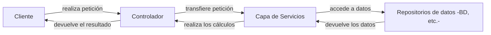

# La capa de servicio
## 1. Funciones de la capa de servicio

La capa de servicio se encarga de la lógica de negocio, de las reglas y cálculos que la aplicación debe hacer en cada caso.

Típicamente, los métodos de una clase de servicio son invocados desde un controlador y es éste último el que le pasa como parámetro al servicio los valores proporcionados por el cliente para hacer los cálculos necesarios. Es también común que el servicio necesite acceder a los repositorios de datos, para obtener información adicional para ejecutar esas reglas de negocios. Finalmente, los métodos de la capa de servicio devolverán el resultado al controlador para que lo envíe al cliente.



## 2. Implementando una clase de servicio

Las clases de servicio se anotan con  `@Service` y en vez de crear instancias en el controlador con un constructor, como hacíamos hasta ahora, Spring inyecta el servicio en el controlador mediante la anotación `@Autowired`, reduciendo así el **acoplamiento del código**.

En cuanto a la ubicación de los servicios, podemos crear un paquete llamado `services` y meterlos todos ahí, o, si hemos optado por una oganización más orientada a dominio, irán en la misma carpeta que los controladores de la misma área (*Cliente*, *Producto*, etc). Spring no pone limitaciones en cuanto a esa organización, pero deben ser subpaquetes del paquete raíz, igual que los controladores.

A continuación, un ejemplo de estructura de un controlador y un servicio que recibe en la URL dos números y devuelve una vista con su suma.
```java
@Service
public class SumaService {
    public Integer suma(Integer a, Integer b){
        return a + b;
    }
}
```
```java
@Controller
public class SumaController{

    @Autowired
    private SumaService sumaService;

    @GetMapping("/suma/{nX}/{nY}")
    public String showSuma(@PathVariable Integer nX, @PathVariable Integer nY, Model model){
        Integer result = sumaService.suma(nX, nY);
        model.addAttribute("resultado", result);
        return "resultSumaView";
    }
}
```
Podemos fijarnos que al añadir @Autowired no llamamos al constructor de servicio.

Los objetivos de la capa de servicio son:
- Separar la lógica de negocio de la vista de los datos. Cualquier cambio en la forma de recibir los datos y mostrarlos (por ejemplo, con API REST) no afectará a esta parte de la aplicación.
- Código más estructurado, métodos y clases más pequeñas.
- Facilidad para testeo unitario: podemos hacer pruebas con los diferentes servicios sin necesidad de simular todo el proceso de interacción con el usuario.

Además, usar servicios a través de Spring tiene varias ventajas sobre gestionar los datos de forma manual como hemos hecho hasta ahora. Spring se encargará de gestionar el acceso, la instanciación y la destrucción de los servicios. Esto evitará errores de acoplamiento. 

## 3. Acoplamiento y como solucionarlo

El acoplamiento es la dependencia entre clases y se soluciona mediante un enfoque de componentes.

```java
class Motor{
    int id;
    int potencia;
    Motor(int id, int potencia){
        this.id =id;
        this.potencia = potencia;
    }
}
//CLASE COCHE CON ACOPLAMIENTO
class Coche{
    String modelo;
    Motor motor;
    Coche (String modelo, int i, int p){
        this.modelo = modelo;
        this.motor = new Motor(i, p);
    }
}
//CLASE COCHE CON INYECCIÓN DE DATOS (MENOS ACOPLAMIENTO)
class Coche{
    String modelo;
    Motor motor;
    Coche (String modelo, Motor motor){
        this.modelo = modelo;
        this.motor = motor;
    }
}
```
Spring implementa **Inversión de Control (IoC)** y **Inyección de Dependencias (DI)** para reducir acoplamiento. La clase no crea sus dependencias, sino que Spring se las proporciona.

> **ACTIVIDAD**: Modifica la clase de gestión de datos para que sea un servicio.
> - Los compositores y las piezas **ya no se guardan en la memoria del programa** en listas, sino que se consultan o editan cada vez (preparamos la transición de .csv a base de datos).
> - Crea un servicio para interactuar con los CSV y hacer operaciones CRUD (Create, Read, Update, Delete). 
>   - Para los métodos, sigue un esquema como el siguiente `public void create(String compositorEnCSV, String pathDelCSV);`. 
>   - Para el Read, haz que devuelva un string (o un array de strings) y que cada una de las clases que tengas tenga un constructor que admita un array de strings (en el que cada casilla representa un campo).
> - Ajusta el funcionamiento de la práctica para que funcione de forma adecuada.

