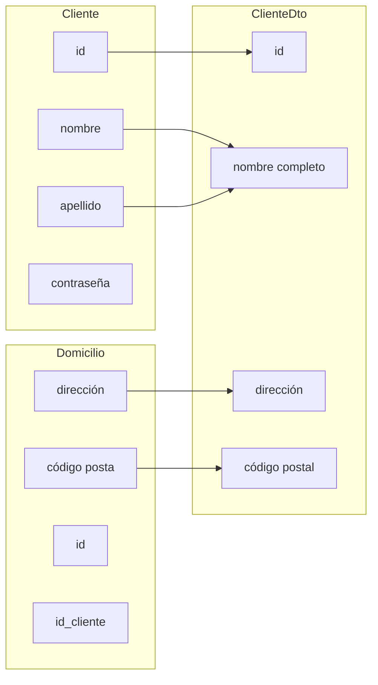

# 6.4 DTO

## 1. Data Transfer Objects

Una problemática recurrente cuando desarrollamos aplicaciones es el diseño de la forma en la que la información debe viajar desde la capa del controlador hasta las vistas u otros clientes, ya que muchas veces por desconocimiento o pereza utilizamos clases del modelo de dominio para enviar los datos. Esto puede ocasionar que retornemos más datos de los necesarios o bien que tengamos que hacer varios envíos o bien datos con una estructura más compleja.

El patrón DTO tiene como finalidad crear un objeto plano (POJO) con los atributos necesarios para enviar al cliente en una sola operación. Es frecuente que un DTO contenga información de múltiples entidades o tablas y concentrarlas en una única clase simple.



Para construir un DTO podemos hacerlo de dos formas: o bien a mano, a través de los setters del DTO y los getters de las clases de origen de los datos (ideal para conjuntos sencillos) o bien crearlos de forma casi automática con la clase *ModelMapper*.

## 2. La clase ModelMapper

*ModelMapper*, como acabamos de comentar, nos ayuda a transformar una o más entidades de nuestro modelo de negocio en un DTO, envitando tedioso código repetitivo. A nivel interno va a seguir unas reglas inteligentes de forma que, a partir de los nombres que tengan los atributos del DTO y basándose en la entidad de origen y sus asociaciones con otras entidades, haga el mapeo de atributos de forma automática y transparente para nosotros.

Esto sin realizar configuración alguna, aunque también nos permitiría personalizar su comportamiento de forma más precisa. Para emplear *ModelMapper* debemos:

1. Añadir su dependencia al proyecto:
```xml
<dependency>
    <groupId>org.modelmapper</groupId>
    <artifactId>modelmapper</artifactId>
    <version>3.2.0</version>
</dependency>
```

2. Debemos crear un `@Bean` de tipo ModelMapper para toda nuestra aplicación, para poder inyectar una instancia e invocar a sus métodos allá donde los necesitemos. Podemos hacerlo en una clase de configuración en un archivo independiente:
```java
@Configuration
public class ModelMapperConfig{
    @Bean
    ModelMapper modelMapper(){return new ModelMapper();}
}
```
3. La clase DTO será una clase sencilla con getters y setters más los atributos que queramos. El nombre del DTO debería contener el nombre de la clase de la que tomamos sus atributos y puede incluir atributos de otras clases asociadas, anteponiendo el nombre de la clase al del atributo:
```java
@Getter @Setter
public class EmpleadoDTO{
    private Long id;
    private String nomnre;
    private String departamentoNombre;
}
```
4. El método de esta clase para generar un DTO se llama `map()` y se le pasa como parámetro al objeto principal del que obtendremos los datos y el tipo de clase que devolverá:
```java
@Autowired
private ModelMapper modelMapper;
EmpleadoDTO empleadoDto = modelMapper.map(empleado, EmpleadoDTO.class);
```

La generación del DTO se puede hacer en diversos puntos de la aplicación. Un lugar típico sería el controlador, o bien un método dentro del propio servicio, que recibiese el objeto (o conjunto de objetos) y lo transformase en DTO.

En el siguiente ejemplo, obtenemos todos los empleados de la base de datos y, en vez de pasarlos a la vista, los convertimos al DTO creado y enviamos la lista de DTO.

En el controlador:
```java
@GetMapping({"/", "/list"})
public String showList(Model model){
    List<Empleado> listaEmpleados = EmpleadoService.obtenerTodos();
    List<EmpleadoDTO> listaDTO = empleadoService.convertirEmpleadoToDto(listaEmpleados);
    model.addAttribute("listaEmpleados", listaDTO);
    return "empleado/listView";
}
```
Y en el servicio:

```java
@Autowired
private ModelMapper modelMapper;
public List<EmpleadoDTO> convertEmpleadoDto(List<Empleado> listaEmpleados){
    List<EmpleadoDTO> listaEmpleadoDTO = new ArrayList<>();
    for(Empleado empleado : listaEmpleados){
        listaEmpleadoDTO.add(modelMapper.map(empleado, EmpleadoDTO.class));
    }
    return listaEmpleadoDTO;
}
```

Puedes consultar la página oficial de ModelMapper aquí: https://modelmapper.org/

> **ACTIVIDAD:** En el proyecto My Favourite Composer, usa DTO generados de forma automática con ModelMapper para todas las transferencias de información con la vista (cuando muestras los compositores o las piezas, al editar, etc).