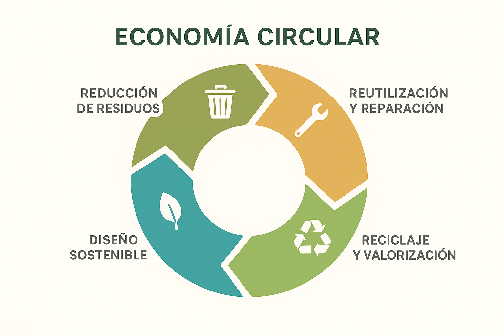

# Introducción a la sostenibilidad y marcos internacionales

## 1. Concepto de sostenibilidad

La **sostenibilidad** se entiende como la capacidad de satisfacer las necesidades del presente sin comprometer las de las futuras generaciones. Tiene **tres dimensiones** fundamentales:

* **Ambiental:** uso responsable de recursos naturales, reducción de la contaminación, protección de la biodiversidad.
* **Social:** equidad, derechos humanos, condiciones laborales dignas, inclusión.
* **Gobernanza:** ética empresarial, transparencia, rendición de cuentas, responsabilidad social.

A estas tres dimensiones a veces se las menciona por las siglas ASG.

> **Actividad – Debate breve:**
>
> *En el sector informático, ¿qué problemas ambientales, sociales o de gobernanza os vienen a la mente?*
> * Por ejemplo: consumo energético de centros de datos, condiciones laborales en la producción de dispositivos, privacidad y ética de los datos.

## 2. Desarrollo sostenible

En el **Informe Brundtland (1987)**, se define el desarrollo sostenible de la siguiente forma: *“Satisfacer las necesidades del presente sin comprometer la capacidad de las futuras generaciones de satisfacer sus propias necesidades.”*. Es decir, se relaciona con la búsqueda de un equilibrio entre crecimiento económico, cuidado ambiental y bienestar social.

Para las empresas significa implica integrar criterios de sostenibilidad en la estrategia, productos y procesos.

> **Actividad – Pregunta para debate:**
>
> * ¿Pensáis que las empresas tecnológicas buscan realmente la sostenibilidad o la utilizan como estrategia de marketing (“greenwashing”)?
> * Breve puesta en común de posturas.

## 3. Agenda 2030 y Objetivos de Desarrollo Sostenible (ODS)

En 2015, la ONU aprobó la **Agenda 2030**, un plan de acción con 17 **ODS** y 169 metas. Los ODS son un marco global para gobiernos, empresas y sociedad civil. A continuación, una lista con los 17 ODS.

1. **Fin de la pobreza**: Poner fin a la pobreza en todas sus formas en todo el mundo.
2. **Hambre cero**: Poner fin al hambre, lograr la seguridad alimentaria y la mejora de la nutrición, y promover la agricultura sostenible.
3. **Salud y bienestar**: Garantizar una vida sana y promover el bienestar en todas las edades.
4. **Educación de calidad**: Garantizar una educación inclusiva, equitativa y de calidad y promover oportunidades de aprendizaje durante toda la vida.
5. **Igualdad de género**: Lograr la igualdad entre los géneros y empoderar a todas las mujeres y niñas.
6. **Agua limpia y saneamiento**: Garantizar la disponibilidad de agua, su gestión sostenible y el saneamiento para todos.
7. **Energía asequible y no contaminante**: Garantizar el acceso a una energía asequible, segura, sostenible y moderna para todos.
8. **Trabajo decente y crecimiento económico**: Promover el crecimiento económico sostenido, inclusivo y sostenible, el empleo pleno y productivo y el trabajo decente para todos.
9. **Industria, innovación e infraestructura**: Construir infraestructuras resilientes, promover la industrialización inclusiva y sostenible y fomentar la innovación.
10. **Reducción de las desigualdades**: Reducir la desigualdad en y entre los países.
11. **Ciudades y comunidades sostenibles**: Lograr que las ciudades y los asentamientos humanos sean inclusivos, seguros, resilientes y sostenibles.
12. **Producción y consumo responsables**: Garantizar modalidades de consumo y producción sostenibles.
13. **Acción por el clima**: Adoptar medidas urgentes para combatir el cambio climático y sus efectos.
14. **Vida submarina**: Conservar y utilizar de forma sostenible los océanos, mares y recursos marinos para el desarrollo sostenible.
15. **Vida de ecosistemas terrestres**: Gestionar sosteniblemente los bosques, luchar contra la desertificación, detener e invertir la degradación de las tierras y detener la pérdida de biodiversidad.
16. **Paz, justicia e instituciones sólidas**: Promover sociedades pacíficas e inclusivas, facilitar el acceso a la justicia y crear instituciones eficaces, responsables e inclusivas a todos los niveles.
17. **Alianzas para lograr los objetivos**: Fortalecer los medios de implementación y revitalizar la alianza mundial para el desarrollo sostenible.

De estos, los que tienen mayor relevancia en el ámbito informático son los siguientes:

  * **ODS 7**: Energía asequible y no contaminante (eficiencia en centros de datos).
  * **ODS 9**: Industria, innovación e infraestructura (tecnología sostenible).
  * **ODS 12**: Producción y consumo responsables (reciclaje de dispositivos).
  * **ODS 13**: Acción por el clima (huella de carbono digital).

https://www.youtube.com/watch?v=3_J3t9AmgAY

> **Actividad – Debate en grupos pequeños:**
>
> Dados los cuatro ODS relacionados con informática, y de forma individual para cada uno: 
> * *¿Cómo puede el sector tecnológico contribuir a este ODS?*

## 4. Marcos internacionales de sostenibilidad

* Existen marcos y compromisos internacionales que orientan a las empresas:

  * **Pacto Mundial de la ONU:** iniciativa voluntaria para que las empresas adopten principios universales en derechos humanos, trabajo, medio ambiente y anticorrupción.
  * **Acuerdo de París (2015):** limitar el aumento de la temperatura global a 1,5 °C.
  * **Normativas emergentes en la UE:** Taxonomía de finanzas sostenibles, Directiva de Informes de Sostenibilidad Corporativa (CSRD).

> **Actividad – Debate guiado:**
>
> *¿Es suficiente con que las empresas se adhieran a iniciativas voluntarias como el Pacto Mundial, o debería existir una normativa obligatoria más estricta?*

## 5. Relevancia en el ámbito empresarial y digital

Las empresas del sector tecnológico influyen en los tres ámbitos de la sostenibilidad:

* Ambiental: alto consumo energético, residuos electrónicos.
* Social: condiciones laborales en la cadena de suministro, accesibilidad digital.
* Gobernanza: privacidad, ciberseguridad, ética en el uso de datos e inteligencia artificial.

Cada vez más inversores y consumidores valoran el desempeño en sostenibilidad.

> **Actividad – Debate abierto:**
>
> * Pregunta: *Si fuerais responsables de sostenibilidad en una empresa informática, ¿qué prioridad daríais: ambiental, social o gobernanza? ¿Por qué?*
> * Se contrastan diferentes argumentos entre los estudiantes.

## 6. Economía circular

https://www.youtube.com/watch?v=Lc4-2cVKxp0

La **economía circular** es un modelo económico que busca **minimizar el desperdicio y el uso de recursos naturales**, prolongando la vida útil de los productos, materiales y recursos a través de su **reutilización, reparación, reciclaje y valorización**. A diferencia del modelo económico lineal tradicional (“tomar–producir–usar–desechar”), la economía circular se basa en un **ciclo cerrado**, donde los residuos de un proceso se convierten en insumos para otro.

## Principios clave de la economía circular:

1. **Reducción de residuos:** diseñar productos y procesos para generar la menor cantidad de desperdicio posible.
2. **Reutilización y reparación:** prolongar la vida útil de los productos mediante su reparación y reutilización.
3. **Reciclaje y valorización:** convertir los materiales que ya no se usan en nuevos productos o en energía.
4. **Diseño sostenible:** crear productos pensando en su ciclo de vida completo, incluyendo desmontaje y reciclaje.
5. **Economía de servicios:** priorizar servicios frente a la propiedad de productos, fomentando modelos como el “producto como servicio”.

## Beneficios:

* Reducción del impacto ambiental.
* Optimización de recursos y eficiencia económica.
* Fomento de la innovación en diseño y procesos.
* Creación de empleo verde y nuevas oportunidades de negocio.

En el ámbito **informático**, la economía circular se aplica, por ejemplo, a través de:

* Reutilización de componentes electrónicos.
* Diseño de hardware modular y fácil de reparar.
* Reducción del consumo energético de servidores y centros de datos.
* Reciclaje de dispositivos electrónicos al final de su vida útil.

