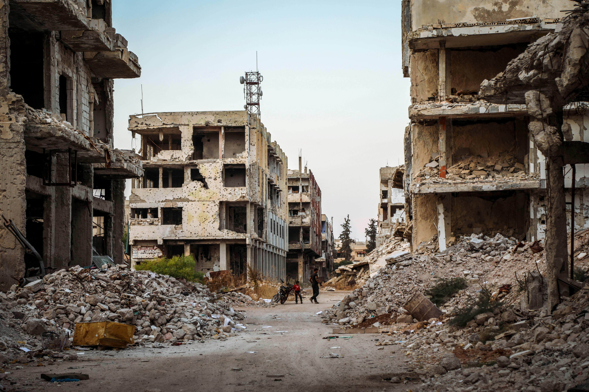

# Retos ambientales y sociales en la sociedad actual

> **Resultado de Aprendizaje 2:** Caracteriza los retos ambientales y sociales a los que se enfrenta la sociedad, describiendo los impactos sobre las personas y los sectores productivos y proponiendo acciones para minimizarlos. 

## 1. Principales retos ambientales

Los retos ambientales son los problemas que amenazan la estabilidad del planeta y el bienestar humano. Entre los más relevantes se encuentran:

* **Cambio climático:** aumento de la temperatura global, fenómenos meteorológicos extremos, subida del nivel del mar.
* **Pérdida de biodiversidad:** desaparición de especies y degradación de ecosistemas.

* **Escasez de recursos naturales:** agotamiento de materiales, minerales y fuentes de energía.
* **Generación de residuos:** especialmente los electrónicos y tóxicos, que aumentan con el consumo tecnológico.
* **Contaminación del aire, agua y suelo:** emisiones industriales, residuos plásticos, vertidos.

> **Actividad – Debate:**
>
> *¿Cuál es el reto ambiental más grave en el contexto actual?*

## 2. Principales retos sociales

Los desafíos sociales están relacionados con la equidad, la justicia y las condiciones de vida. Algunos de los más destacados son:

* **Desigualdad económica y social:** brechas entre países y dentro de las sociedades.
* **Desempleo y precariedad laboral:** especialmente en sectores en transición hacia modelos sostenibles.
* **Acceso desigual a la educación, la tecnología y la salud.**
* **Pérdida de derechos laborales en cadenas de suministro globales.**
* **Brecha digital:** diferencias en el acceso y uso de las TIC entre regiones o grupos sociales.

> **Actividad – Debate:**
>
>* *¿Cómo afecta la tecnología a la desigualdad social? ¿La reduce o la amplía? Busca ejemplos relacionados en la vida cotidiana*

En el contexto actual, además, hay varias guerras en activo que acrecentan todavía más los retos sociales. Hablamos de la invasión Rusa a Ucrania (Guerra de Ucrania), del ataque israelí contra Palestina ([Guerra de Gaza](https://www.europapress.es/internacional/noticia-dos-anos-ofensiva-israel-contra-gaza-dejan-48000-movilizaciones-propalestinas-mundo-20251007010250.html)), las innumerables guerras en África (Somalia, República democrática del Congo, Etiopía, la guerra de Sudán, [Boko Haram](https://www.europapress.es/internacional/noticia-nigeria-anuncia-muerte-alto-cargo-boko-haram-operacion-noreste-pais-20250724125618.html), etc.).

Por otro lado, algunos gobiernos como el de Estados Unidos están aprovechando [la fuerza militar para someter a sus propias ciudades gobernadas por partidos de la oposición](https://www.europapress.es/internacional/noticia-trump-moviliza-oregon-illinois-400-soldados-guardia-nacional-texas-20251006070316.html), con el pretexto -generalmente sin demostrar- de la escalada de la violencia.

## 3. Relación entre los retos ambientales y sociales y la actividad económica

La economía depende de los recursos naturales y del trabajo humano; por tanto, los impactos ambientales y sociales repercuten directamente en la producción. Las empresas deben incorporar criterios de sostenibilidad para reducir riesgos y asegurar su continuidad.

En el campo de la informática, por ejemplo, la fabricación de dispositivos electrónicos tiene impacto ambiental (consumo de minerales) y social (condiciones laborales). Por otro lado, la transición ecológica crea nuevas oportunidades: energías renovables, economía digital verde, innovación sostenible. Es decir, no es necesariamente un freno para la actividad económica, sino que puede llegar incluso a ser todo lo contrario.

> **Actividad – Debate:**
> 
> * *En base a lo investigado de la actividad del tema anterior, ¿Las empresas tecnológicas están liderando el cambio hacia la sostenibilidad o se están quedando atrás?*

## 4. Impactos sobre las personas y los sectores productivos

Los retos ambientales y sociales impactan de forma directa o indirecta sobre el mundo en el que vivimos:

* **Impactos directos:** contaminación, enfermedades, desplazamientos por desastres naturales.
* **Impactos indirectos:** pérdida de empleo en sectores contaminantes, aumento del coste de recursos.

Concretamente, en el ámbito informático podemos hablar de:
* Aumento del consumo energético de centros de datos.
* Problemas de salud por exposición a materiales tóxicos en la fabricación o reciclaje de hardware.
* Generación de residuos electrónicos.

> **Actividad – Reflexión:**
>
>* *¿Podemos hablar de un impacto social del uso excesivo de la tecnología (adicción, aislamiento, desinformación)?*

## 5. Acciones para minimizar los impactos

Para minimizar el impacto de los retos ambientales y sociales, se pueden tomar una serie de medidas como las expuestas a continuación:

* **Medidas ambientales:** uso de energías renovables, eficiencia energética, reciclaje y ecodiseño.
* **Medidas sociales:** igualdad de oportunidades, condiciones laborales justas, responsabilidad social corporativa.
Por lo tanto, la **educación y sensibilización ciudadana** es clave para el cambio de hábitos, y debe verse reforzada por **políticas públicas y alianzas internacionales**, es decir, acuerdos y legislación que impulsen la sostenibilidad.

## 6. Importancia de las alianzas y del trabajo transversal

Los retos actuales no pueden abordarse de manera aislada: requieren cooperación entre gobiernos, empresas, instituciones educativas y ciudadanía. El **ODS 17 (Alianzas para lograr los objetivos)** resume este enfoque. En el sector tecnológico, la colaboración público-privada es esencial para promover la innovación sostenible.

> **Actividad Evaluable** 
> Extraída del portal [***Gafas de FOL***](https://gafasdefol.com/ra2-sasp/).
> * Disponéis como materiales de un lienzo DAFO, un lienzo acción-reacción y un lienzo gestión-de-recursos. En grupos, debéis analizar una de las empresas que habíais escogido en la actividad del Resultado de Aprendizaje anterior y preparar una exposición sobre los aspectos relacionados con el resultado de aprendizaje 2.
> 
> Dispones de un día de preparación y un día de exposición. Puedes consultar [**el portal *Gafas de FOL***](https://gafasdefol.com/ra2-sasp/) para obtener más información sobre el resultado de aprendizaje.
>
> * [Lienzo DAFO](ES-SOS/UP02/02-lienzo-DAFOsostenibilidad.pdf)
> * [Lienzo Acción-Reacción](ES-SOS/UP02/03-lienzo-accionreaccion.pdf)
> * [Lienzo Gestión-De-Recursos](ES-SOS/UP02/04-lienzo-gestionderesiduos.pdf)

