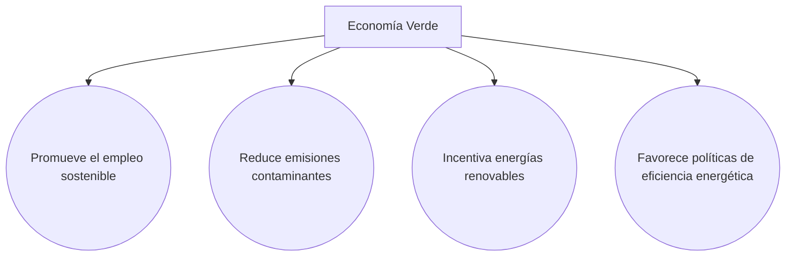
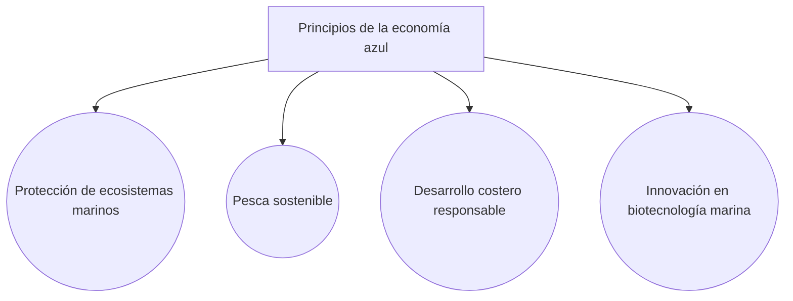
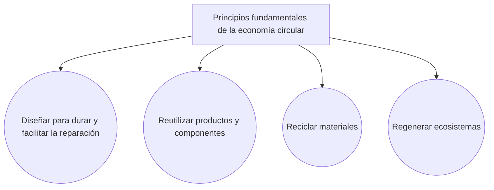
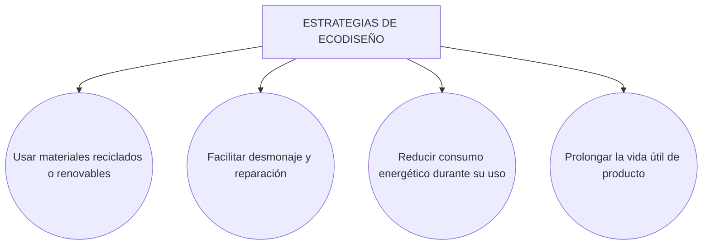
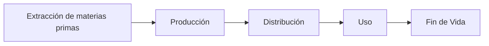

# Unidad de programación 04, Economía circular

## Preámbulo

En esta unidad de programación vamos a tratar el **resultado de aprendizaje 4:**

> ***Propón productos y servicios responsables teniendo en cuenta los principios de la economía circular.***

Este resultado de aprendizaje cuenta con los siguientes **criterios de evaluación**:

> a) Se ha caracterizado el modelo de producción y consumo actual.
>
> b) Se han identificado los principios de la economía verde y circular.
>
> c) Se han contrastado los beneficios de la economía verde y circular frente al modelo clásico de producción.
>
> d) Se han aplicado principios de ecodiseño.
>
> e) Se ha analizado el ciclo de vida del producto.
>
> f) Se han identificado los procesos de producción y los criterios de sostenibilidad aplicados.

## 1. Economía lineal, verde y circular

### 1.1. Economía lineal, el modelo clásico

La economía lineal es el modelo predominante desde la Revolución Industrial. Se basa en la secuencia:

La ONU destaca que este modelo está asociado a un consumo intensivo de recursos naturales y a la generación creciente de residuos, lo que contribuye al cambio climático, pérdida de biodiversidad y contaminación de suelos y aguas.

Según el Programa de las Naciones Unidas para el Medio Ambiente (PNUMA):

> *"Si continuamos con los patrones actuales de producción y consumo, se necesitarían los recursos equivalentes a tres planetas como la Tierra para sostener la economía global en 2050"* (PNUMA, Informe GEO-6, 2019).

### 1.2. Economía verde

La **economía verde** es un modelo económico que busca lograr el desarrollo sostenible reduciendo riesgos ambientales y la degradación ecológica, y mejorando el bienestar humano. Según la ONU:

> *“Una economía verde es aquella que resulta en un mejor bienestar humano y equidad social, mientras reduce significativamente los riesgos ambientales y las escaseces ecológicas.”* (PNUMA, 2011).

**La economía verde:**

* Promueve empleo sostenible (empleo verde).
* Reduce emisiones contaminantes.
* Incentiva energías renovables.
* Favorece políticas de eficiencia energética.

### 1.3. Economía azul

La **economía azul** se centra en el uso sostenible de los océanos y recursos hídricos. La ONU sostiene que los océanos generan bienestar económico, alimentos y energía, pero están amenazados por la contaminación y la sobreexplotación. Según la ONU ([ODS 14](https://www.pactomundial.org/ods/14-vida-submarina/)):

> *"Los océanos son esenciales para la vida en la Tierra y su gestión sostenible es clave para el desarrollo humano"* (Naciones Unidas, Agenda 2030, 2015).

Principios de la ecomonía azul:

* Protección de ecosistemas marinos.
* Pesca sostenible.
* Desarrollo costero responsable.
* Innovación en biotecnología marina.

### 1.4. Economía circular

La **economía circular** es un modelo de producción y consumo que busca mantener los recursos en uso el mayor tiempo posible, reduciendo residuos al mínimo. Según la ONU:

> *“La economía circular implica reducir los materiales y desechos, reutilizarlos y reciclarlos para crear un ciclo sostenible de producción.”* (PNUMA, 2021).

Principios fundamentales de la economía circular:

* **Diseñar para durar** y facilitar reparación.
* **Reutilizar** productos y componentes.
* **Reciclar** materiales para reintroducirlos en la producción.
* **Regenerar** ecosistemas.

A continuación, una comparación del modelo circular frente al modelo lineal:

| Modelo lineal                 | Modelo circular                             |
| ----------------------------- | ------------------------------------------- |
| Basado en consumir y desechar | Basado en mantener el valor de los recursos |
| Genera grandes residuos       | Minimiza residuos                           |
| Agota recursos naturales      | Preserva recursos y biodiversidad           |

## Ecodiseño

El **ecodiseño** consiste en incorporar criterios ambientales desde la fase de diseño del producto. Según la ONU:

> *“Hasta el 80% del impacto ambiental de un producto se determina en su fase de diseño.”* (PNUMA, Guía de Ecodiseño, 2020).

Estrategias de ecodiseño:

* Usar materiales reciclados o renovables.
* Facilitar desmontaje y reparación.
* Reducir consumo energético durante uso.
* Prolongar la vida útil del producto.

## Ciclo de vida del producto

El **análisis del ciclo de vida (ACV)** examina los impactos ambientales del producto desde la extracción de materias primas hasta su fin de vida.

1. Extracción de materias primas
2. Producción
3. Distribución
4. Uso
5. Fin de vida (reutilización, reciclaje o eliminación)

La ONU lo promueve como herramienta para tomar decisiones sostenibles en políticas y empresas.

## Criterios de sostenibilidad en los procesos de producción

Los procesos productivos sostenibles buscan reducir impactos ambientales, mejorar condiciones laborales y mantener bienestar económico. Para ello, se siguen los siguientes criterios de sostenibilidad:

* Eficiencia energética y uso de energías renovables.
* Minimización de residuos y emisiones.
* Gestión responsable del agua.
* Condiciones laborales dignas.

## Actividades del Resultado de Aprendizaje

Las actividades están pensadas para realizarse en grupo y exponerse en clase.

> **ACTIVIDAD 1** - *"La descripción de lo que nos encontramos hoy día*.
> Busca dos o tres productos **relacionados con la informática** que cumplan los principios de la economía lineal y otros dos o tres que cumplan los principios de la economía circular. 

> **ACTIVIDAD 2** - *"Rediseño de un producto cotidiano"*.
> Aplica los principios de la economía circular y el ecodiseño para rediseñar un producto cotidiano no relacionado con la informática, analizando su ciclo de vida y proponiendo mejoras sostenibles. Sigue los siguientes pasos:
> - Selecciona el producto
> - Analiza el modelo actual
> - Identifica impactos ambientales y sociales
> - Rediseña el producto bajo los principios de la economía circular
>
> Prepara una exposición del producto rediseñado. 

> **ACTIVIDAD 3** - *"Rediseño de un producto informático"*
> Repite la actividad anterior, pero rediseñando un producto relacionado con la informática.

### Referencias oficiales (ONU)

* PNUMA (2019). *Global Environment Outlook 6 (GEO-6).* [https://www.unep.org](https://www.unep.org)
* PNUMA (2011). *Towards a Green Economy.* [https://www.unep.org](https://www.unep.org)
* Naciones Unidas (2015). *Agenda 2030 y ODS.* [https://www.un.org/sustainabledevelopment](https://www.un.org/sustainabledevelopment)
* PNUMA (2021). *Circularity Gap Report.* [https://www.unep.org](https://www.unep.org)

