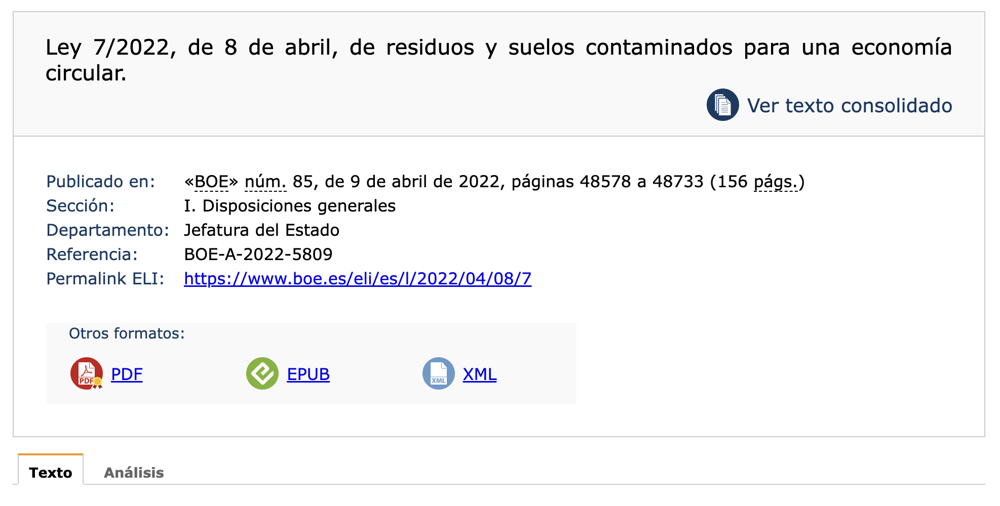
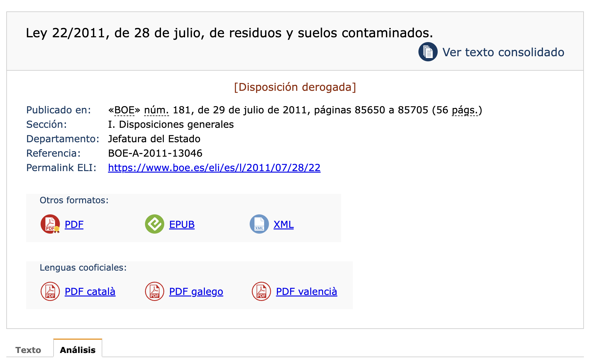
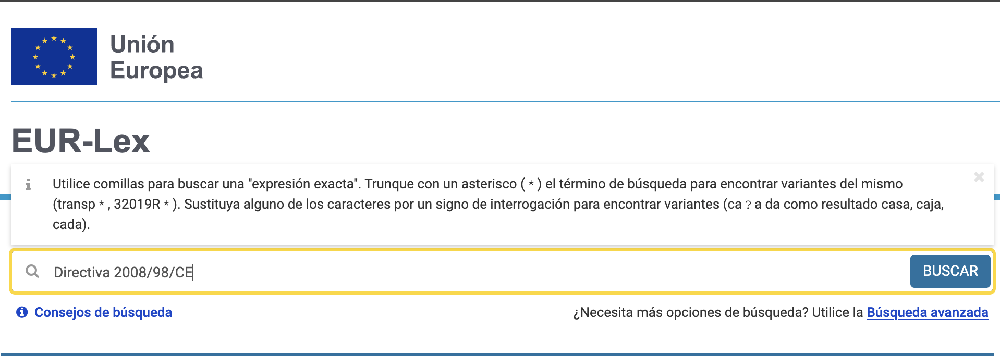
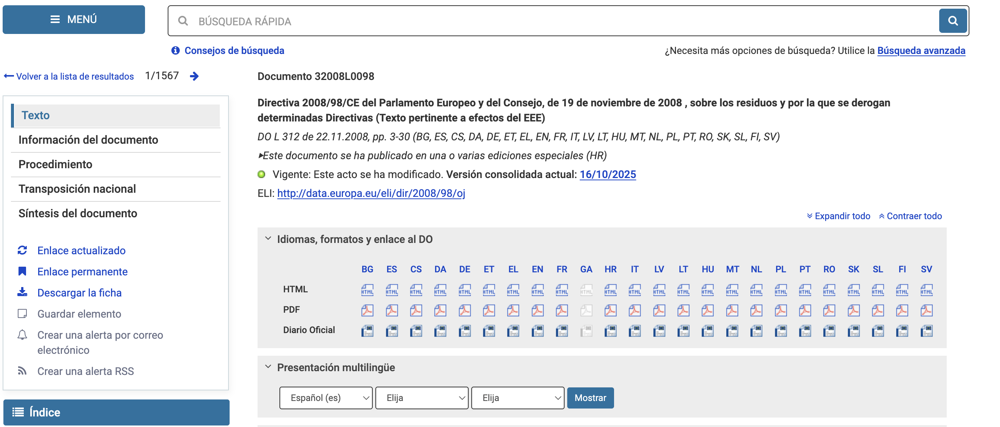
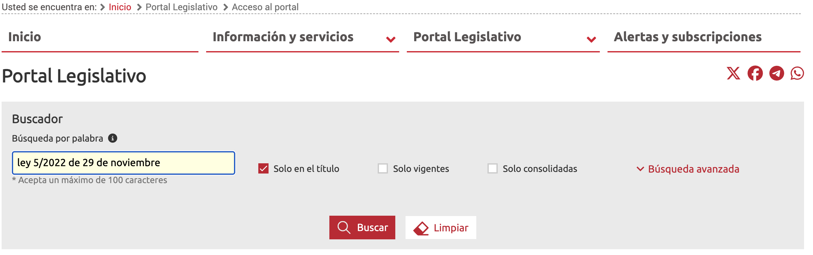
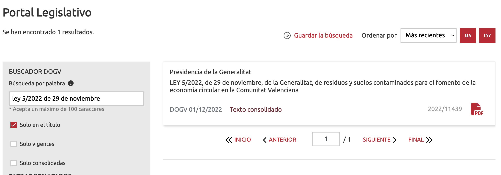
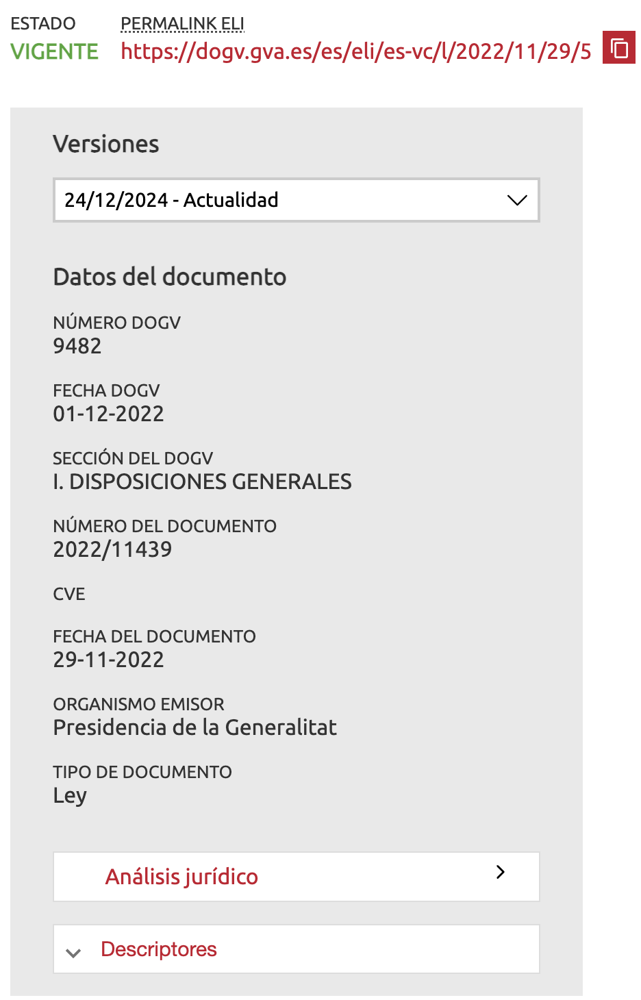

# Actividades sostenibles y normativa aplicable

## 1. Resultado de aprendizaje a tratar

En esta unidad de programación, vamos a tratar el siguiente resultado de aprendizaje:

> **5. Realiza actividades sostenibles minimizando el impacto de las mismas en el medio ambiente.**

Este resultado de aprendizaje tiene diversos criterios de evaluación, de los cuales los tres primeros ya se han tratado en la unidad anterior, ya que se encuentran redactados exactamente con las mismas palabras:

> a) Se ha caracterizado el modelo de producción y consumo actual.
>
> b) Se han identificado los principios de la economía verde y circular.
>
> c) Se han contrastado los beneficios de la economía verde y circular frente al modelo clásico de producción.
>
> e) Se han aplicado principios de ecodiseño.
>
> g) Se ha analizado el ciclo de vida del producto.
>
> h) Se han identificado los procesos de producción y los criterios de sostenibilidad aplicados.

Por lo tanto, aplicando lo aprendido en el tema anterior, vamos a centrarnos en los siguientes criterios de evaluación:

> d) Se ha evaluado el impacto de las actividades personales y profesionales.
>
> f) Se han aplicado estrategias sostenibles.
>
> i) Se ha aplicado la normativa ambiental.

## 2. Normativa ambiental

En este primer apartado, vamos a tratar la normativa referente a la sostenibilidad a tres niveles: Europeo, estatal y autonómico. Conocer el marco normativo que regula cómo deben prevenirse, gestionarse y minimizarse los impactos ambientales es clave para orientarnos a alcanzar modelos productivos responsables.

### 2.1 Búsqueda de normativa

Para buscar normativa, disponemos de dos portales clave. Por un lado, el portal del BOE, que nos permite consultar la normativa tanto a nivel estatal como a nivel europeo y, por otro, el portal del diario autonómico, en nuestro caso del DOGV, que nos permite buscar la normativa autonómica. Aparte, cada ayuntamiento tiene en su página web publicadas sus regulaciones.

#### 2.1.1 Cómo buscar leyes en el BOE

No solamente para Sostenibilidad, sino también para otras actividades necesarias en tu vida profesional y personal, es importante dominar la consulta de leyes, algo que no es complicado en sí, pero que puede resultar abrumador. Muchas veces, aquello que buscas está repartido en varias leyes o decretos y conviene citarlos todos. Vamos a ver cómo buscar en el BOE.

1. Lo primero es acceder al Boletín Oficial del Estado (BOE): [https://www.boe.es/buscar/](https://www.boe.es). En este caso, el enlace te llevará directamente al apartado de búsqueda.
2. Una vez allí, busca una de las leyes o reales decretos de este tema. Por ejemplo, la ley 7/2022. Las leyes y los decretos suelen indicarse en clave, primero con el número y después con el año. Aparte, aunque no es necesario para la identificación, se les añade el día y el mes en el que se publicaron (lo que indica su entrada en el BOE, aunque con el id y el año es suficiente para localizarlas). Hay que diferenciar entre Ley, Ley Orgánica, Real Decreto, etc.

3. Debemos seleccionar la que buscamos, en este caso, obtenemos varias entradas coincidentes. Lo que queremos es la LEY, no la LEY Orgánica ni el Real Decreto-ley:

4. Una vez dentro podemos ver el texto de la ley o el análisis, con información relevante su vigencia y sobre su relación con otras leyes:

5. También podemos consolidar el texto.
6. Si una ley está derogada (no está en vigencia), aparecerá en la portada:

#### 2.1.2 La página oficial de la Unión Europea

Aparte del BOE, también dispones de [la página oficial](https://eur-lex.europa.eu/homepage.html?locale=es) de la Unión Europea para buscar información.

1. Accede al buscador e introduce la directiva que quieras buscar, por ejemplo:

2. Aparecerán los resultados, elegimos el correcto.
3. En este caso, las opciones están en el menú de la izquierda y podemos seleccionar bastantes. Cada una modificará lo que aparece a la derecha:

#### 2.1.3 Cómo buscar leyes en el DOGV

Para las leyes autonómicas, cada comunidad dispone de su propio portal específico. En el caso de la Comunitat Valenciana, contamos con el DOGV. Para buscar leyes, debemos dirigirnos al [portal de legistación](https://dogv.gva.es/es/cerca-de-legislacio).

1. En el buscador del portal de legislación, introduce la ley que quieres buscar. Por ejemplo, la ley 5/2022 de 29 de noviembre.

2. En este caso, al haber sido más específicos con la búsqueda, solo ha aparecido un término.

3. Como puedes observar, el formato es muy diferente al del BOE. En este caso, aparece la información general a la izquierda y el texto a la derecha.

4. Si queremos, podemos acceder al análisis jurídico, que debe procesarse. El análisis nos da información relevante sobre el estado de la ley y su relación con otras leyes o disposiciones.

### 2.2 Normativa ambiental a nivel europeo

La Unión Europea es el principal impulsor legislativo en materia de sostenibilidad. Sus normas definen objetivos obligatorios para todos los Estados miembros y marcan la dirección estratégica hacia una economía climáticamente neutra, eficiente en el uso de recursos y basada en la circularidad.

El pilar normativo fundamental es la **Directiva 2008/98/CE, Marco de Residuos**, que introduce la *jerarquía de residuos* —prevenir, reutilizar, reciclar, valorizar y eliminar— y obliga a los países a desarrollar planes nacionales alineados con esta estructura. Esta directiva fue modificada de forma importante por la **Directiva (UE) 2018/851**, que endurece los objetivos de preparación para la reutilización y el reciclaje e impone la recogida separada de biorresiduos.

Otro hito legislativo clave es la **Directiva (UE) 2019/904, sobre plásticos de un solo uso**, que prohíbe productos como pajitas, platos o cubiertos de plástico y limita el consumo de otros, obligando a los Estados a adoptar medidas para reducir su uso y promover alternativas sostenibles.

Estas directivas se integran dentro del **Pacto Verde Europeo (2019)** y del **Nuevo Plan de Acción para la Economía Circular (2020)**, que establecen un marco político más amplio orientado a lograr la neutralidad climática para 2050. También deben mencionarse regulaciones como **REACH**, que controla sustancias químicas peligrosas, y las normas sobre diseño ecológico que obligan a fabricar productos más duraderos, reparables y reciclables.

### 2.3 Normativa ambiental a nivel estatal

España adapta las obligaciones europeas a su realidad territorial a través de la **Ley 7/2022, de 8 de abril, de residuos y suelos contaminados para una economía circular**, actualmente la norma más relevante en materia de gestión de residuos. Esta ley supone una actualización profunda del sistema, incorporando de forma casi literal las exigencias de las directivas europeas y respondiendo a los retos de la prevención de residuos, la responsabilidad ampliada del productor y la reducción del impacto ambiental.

Entre sus medidas destacan:

* La prohibición de varios productos de plástico de un solo uso.
* La obligatoriedad de implantar la **recogida separada de biorresiduos**.
* El **impuesto especial a los envases de plástico no reutilizables**.
* Nuevas obligaciones de los productores de residuos, especialmente en sectores con fuerte impacto ambiental.
* La regulación específica de suelos contaminados y su inventario.

Junto a esta ley, otras normas estatales completan el marco:

* **Ley 26/2007, de Responsabilidad Ambiental**, que obliga a prevenir y reparar daños ambientales.
* **Real Decreto 105/2008**, sobre gestión de residuos de construcción y demolición.
* **Real Decreto 110/2015**, sobre residuos de aparatos eléctricos y electrónicos (RAEE).
* **Plan Estatal Marco de Gestión de Residuos (PEMAR 2022–2027)**, documento estratégico que establece objetivos y orientaciones para todo el territorio nacional.

España tiene además competencias parcialmente descentralizadas en materia de medio ambiente, lo que implica que las comunidades autónomas desarrollan sus propias normas para adaptar la legislación a sus necesidades específicas.

### 2.4 Normativa ambiental a nivel autonómico

En la Comunitat Valenciana, la norma central es la **Ley 5/2022, de 29 de noviembre, de residuos y suelos contaminados para el fomento de la economía circular**. Esta ley desarrolla la normativa estatal y europea, e introduce elementos propios adaptados al territorio valenciano. Entre sus aportaciones más destacadas se encuentran:

* La regulación de la planificación autonómica, como el Plan Integral de Residuos de la Comunitat Valenciana (PIRCV).
* Requisitos específicos para municipios en materia de recogida selectiva, compostaje y puntos limpios.
* Medidas de impulso al consumo responsable, la reutilización y la prevención.
* Refuerzo del régimen sancionador autonómico.
* Regulación detallada de las autorizaciones y comunicaciones para productores y gestores de residuos.

La Comunitat Valenciana es además una de las regiones que ha impulsado proyectos piloto de compostaje comunitario y experiencias de recogida puerta a puerta, apoyadas por esta ley y por la normativa estatal.

### 2.5 Normativa ambiental a nivel local

Finalmente, los ayuntamientos desarrollan **ordenanzas municipales**, que determinan reglas concretas para la ciudadanía: separación de fracciones, horarios de depósito, funcionamiento de ecoparques, regulación de voluminosos, etc. Estas ordenanzas son de obligado cumplimiento y suelen acompañarse de campañas educativas o sanciones en caso de incumplimiento.

Cada ayuntamiento tiene su propia página, y no siempre es posible consultar las ordenanzas municipales de manera online. El ayuntamiento de Mutxamel dispone de una concejalía de sostenibilidad ambiental (2025), cuya página se puede consultar [aquí](https://ayto.mutxamel.org/area/sostenibilidad-ambiental/).

## 3. Impactos de las actividades personales y profesionales

La normativa ambiental solo tiene sentido si se comprende cómo las actividades personales y profesionales generan impactos reales sobre el entorno. Evaluarlos permite identificar puntos críticos y establecer medidas correctoras o preventivas.

**A nivel personal**, los impactos provienen principalmente del consumo energético, la movilidad, el uso del agua, la generación de residuos urbanos y la compra de productos con elevada huella ambiental. Las decisiones cotidianas —qué compramos, cómo nos desplazamos, cuánta energía consumimos— tienen consecuencias directas en materia de emisiones, contaminación y agotamiento de recursos.

**En el ámbito profesional**, los impactos suelen ser más significativos debido a la escala y a la naturaleza de los procesos productivos. Una empresa puede generar grandes cantidades de residuos, consumir energía intensivamente o manipular sustancias peligrosas. Por ello, la ley obliga a valorar estos impactos mediante prácticas como el registro de residuos, los análisis de minimización, la trazabilidad documental, la gestión segura de RAEE (residuos de aparatos eléctricos y electrónicos) o la prevención de daños ambientales, siguiendo lo establecido en la Ley 26/2007.

## 4. Estrategias sostenibles

Las estrategias sostenibles permiten reducir los impactos identificados y cumplir con los objetivos marcados por la normativa europea, estatal y autonómica. Estas estrategias se pueden aplicar en cualquier contexto y forman parte de la transformación hacia una economía circular.

Entre las más relevantes se encuentran:

* **Prevención en origen**, evitando generar residuos innecesarios.
* **Reutilización y reparación**, prolongando la vida útil de los productos.
* **Reciclaje y separación de fracciones**, cumpliendo con la jerarquía de residuos y las obligaciones legales.
* **Elección de materiales sostenibles**, evitando productos de un solo uso o de difícil reciclado.
* **Eficiencia energética y uso de energías renovables**, tanto en el hogar como en empresas.
* **Mejora de procesos productivos**, reduciendo consumos y optimizando recursos.
* **Aplicación sistemática del ecodiseño**, asegurando que los productos puedan desmontarse, reciclarse o repararse.

Estas estrategias no solo permiten cumplir con la ley; también reducen costes, mejoran la imagen de las organizaciones y contribuyen a un entorno más saludable.

> **ACTIVIDAD 1**
> Realiza en grupo un análisis de tu entorno y posible aplicación de la normativa estudiada. Para ello, ten en cuenta los siguientes puntos:
>
> 1. Elige una actividad cotidiana (personal) y una profesional del sector de la informática.
> 2. Identifica los residuos que se generan en ambas actividades.
> 3. Consulta **la normativa aplicable** en cada nivel (UE, España, Comunitat Valenciana) y, extrayendo el texto de la ley, determina:
>   * qué obligaciones legales existen.
>   * qué requisitos habría que cumplir.
>   * qué prácticas estarían prohibidas.
> 4. Propón **tres estrategias sostenibles** para cada actividad que permitan minimizar su impacto ambiental.
> 5. Presenta una breve exposición (10 minutos) donde expongas todo lo trabajado, relacionando la actividad real con la normativa y las medidas propuestas.

> **ACTIVIDAD 2** 
> Analiza las medidas que lleva a cabo el ayuntamiento de Mutxamel con respecto a la sostenibilidad ambiental. Consulta la [página web oficial](https://ayto.mutxamel.org/area/sostenibilidad-ambiental/). Cada grupo debe escoger 3 puntos (hay nueve) y comentarlos al final de su exposición (5 minutos).
> - BIODIVERSIDAD - ***(GRUPO 1)***
> - Acciones de sensibilización ambiental - ***(GRUPO 2)***
> - Paraje Natural Municipal Bec de L´Àguila - ***(GRUPO 3)***
> - EDUCACIÓN Y SENSIBILIZACIÓN AMBIENTAL - ***(GRUPO 1)***
> - PMUS - ***(GRUPO 2)***
> - AGENDA URBANA 2030 - ***(GRUPO 3)***
> - PLANES MEDIOAMBIENTALES - ***(GRUPO 1)***
> - RUTAS SENDERISMO - ***(GRUPO 2)***
> - Datos Climáticos - ***(GRUPO 3)***
