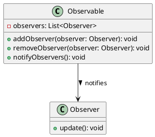

# Introducción práctica a Swing: Interfaces gráficas y concurrencia

- [Introducción práctica a Swing: Interfaces gráficas y concurrencia](#introducción-práctica-a-swing-interfaces-gráficas-y-concurrencia)
  - [1. ¿Qué es Java Swing y para qué sirve?](#1-qué-es-java-swing-y-para-qué-sirve)
  - [2. Ejemplo de introducción. Estructura básica de un programa en Java usando Swing](#2-ejemplo-de-introducción-estructura-básica-de-un-programa-en-java-usando-swing)
  - [3. El porqué de invokeLater(). Concurrencia](#3-el-porqué-de-invokelater-concurrencia)
    - [3.1 Concurrencia en programación](#31-concurrencia-en-programación)
    - [3.2 El uso de invokeLater](#32-el-uso-de-invokelater)
    - [3.4 ¿Qué pasa cuando hay varios ActionListener?](#34-qué-pasa-cuando-hay-varios-actionlistener)
  - [4. El patrón de diseño Observador (Observer Pattern)](#4-el-patrón-de-diseño-observador-observer-pattern)
    - [4.1 Componentes del Patrón Observador\*\*](#41-componentes-del-patrón-observador)
      - [**Sujeto (Observable)**](#sujeto-observable)
      - [**Observador**](#observador)
    - [4.2 Implementación en Java del patrón Observador](#42-implementación-en-java-del-patrón-observador)
      - [**Interfaz `Observador`**](#interfaz-observador)
      - [**Clase `Sujeto`**](#clase-sujeto)
    - [4.3 **Implementación con Swing del patrón Observador**](#43-implementación-con-swing-del-patrón-observador)
    - [4.4 Ventajas y Desventajas del Patrón Observador\*\*](#44-ventajas-y-desventajas-del-patrón-observador)
    - [4.5 Los métodos `revalidate()` y `repaint()`](#45-los-métodos-revalidate-y-repaint)
  - [5. Mejoras básicas para nuestra aplicación](#5-mejoras-básicas-para-nuestra-aplicación)
  - [6. Actividad 01](#6-actividad-01)
  - [7. Ejercicios de refuerzo](#7-ejercicios-de-refuerzo)
    - [7.1 Ejercicio 1](#71-ejercicio-1)
    - [7.2 Ejercicio 2](#72-ejercicio-2)
  - [7. ANEXO I: Documentación oficial](#7-anexo-i-documentación-oficial)
  - [7. ANEXO II: Herramienta integrada de IntelliJ - The UI Designer](#7-anexo-ii-herramienta-integrada-de-intellij---the-ui-designer)

## 1. ¿Qué es Java Swing y para qué sirve?

4 horas

Swing es una biblioteca integrada en Java para crear interfaces gráficas de usuario (GUI). Es parte del paquete `javax.swing` y extiende las capacidades de AWT (Abstract Window Toolkit). Actualmente, hay tres principales opciones en Java para crear GUIs:

- **AWT (Abstract Window Toolkit)**: Fue la primera librería gráfica de Java, pero tiene limitaciones importantes en cuanto a funcionalidad y diseño.
- **Swing**: Introducido como una mejora sobre AWT, ofrece componentes más modernos y personalizables. Es ideal para aplicaciones simples o medianamente complejas.
- **JavaFX**: La librería más reciente, diseñada para crear GUIs modernas y con soporte para efectos visuales avanzados. Es más adecuada para proyectos grandes o con requisitos gráficos complejos.

Swing (y awt) está integrado en el JDK de java, lo que permite crear ejecutables de forma sencilla. En cambio, al usar JavaFX debemos descargar la dependencia y agregarla tanto al proyecto como al ejecutable que generemos, lo que hace más complejo su uso.

Swing es, por lo tanto, una librería ideal para comenzar en el desarrollo de interfaces gráficas de usuario en Java, ya que nos permite trabajar los conceptos básicos sin demasiadas complicaciones, facilitando el aprendizaje posterior de JavaFX si lo necesitáramos.

JavaFX es más indicada para proyectos modernos, pero su implementación es más compleja y su distribución requiere pasos adicionales, ya que no está incluido en el JDK desde la versión 11. Además, los conceptos básicos de Swing se repiten en JavaFX, pero Swing es en general mucho más sencillo de programar. En la actualidad, se emplea JavaFX en el ámbito profesional para aplicaciones complejas que aprovechen las opciones de renderización modernas, mientras que Swing se emplea para prototipos o aplicaciones antiguas (o legacy), aunque es una herramienta muy potente para aprender a crear interfaces gráficas.

Por otro lado, es habitual que Java se emplee más para aplicaciones de *Backend* mientras que el frontal se diseñe en html, css y javascript, que son las habilidades principales del diseñador web. El framework electron (en el que están creados Visual Studio Code o Discord) se hizo muy popular en la década de 2010. No obstante, las aplicaciones gráficas de Java siguen siendo empleadas en la comunidad profesional y JavaFX recibió su última actualización (la 21) a mitad de 2024 (Este texto está escrito a finales de 2024).

En este tema vamos a introducirnos en Swing a través de un ejemplo práctico y después vamos a analizar sus componentes, además de ver la teoría subyacente en Swing, que es el patrón de diseño observador, que se repite en muchos gestores de interfaces gráficas. Finalmente, hay una serie de ejercicios para asentar los conocimientos.

## 2. Ejemplo de introducción. Estructura básica de un programa en Java usando Swing

A continuación, mostramos un código en Java que construye una GUI simple usando Swing. En comentarios, repasamos para qué sirve cada cosa. Este va a ser el esquema básico desde el que vamos a construir nuestro conocimiento en Java Swing.

```java
/* 
Las líneas a continuación son las librerías necesarias para que funcione
Swing. Con intelliJ, si usamos la función intelliSense, se añadirán de forma automática
al agregar algún componente que las use
*/
import javax.swing.*; 
import java.awt.event.*; 

/*
Para nuestro primer ejemplo, vamos a crear una ventana simple que extienda la clase JFrame.
JFrame representa las ventanas normales en Swing (a diferencia de JDialog, que representa a 
las ventanas modales - aquellas que dependen de una ventana principal-).
*/
public class VentanaSimple extends JFrame {

    // En el constructor, vamos a determinar sus características
    public VentanaSimple() {
        // Lo primero es darle un título y un tamaño a la ventana
        setTitle("Ventana Simple");
        setSize(400, 200);
        /* 
        A contiunación, especificamos qué pasa con el programa cuando cerramos la ventana
        usando el enum que nos facilita la clase JFrame.
        Determinamos también el tipo de layout que vamos a emplear para colocar los diferentes
        componentes dentro de la ventana. En este caso, ninguno (null). 
        El objeto JFrame va a actuar como contenedor. Por eso, le vamos a añadir componentes usando el método add().
        */
        setDefaultCloseOperation(EXIT_ON_CLOSE); 
        setLayout(null);

        /*
        Ahora podemos crear los componentes. El primer componente será una etiqueta. Las etiquetas sirven para almacenar texto y mostrarlo. 
        En el constructor le pasamos como parámetro el texto que queremos mostrar. Después le damos una posición y un tamaño con setBounds(posición x, posición y, tamaño x -ancho-, tamaño y -alto-). 
        Por último, utilizamos el método add de JFrame para añadir la etiqueta a la ventana simple.
        */
        JLabel etiqueta = new JLabel("Texto inicial");
        etiqueta.setBounds(50, 50, 150, 30); 
        add(etiqueta); 

        /*
        El segundo componente que vamos a añadir es un botón. La primera parte es igual que con la etiqueta.
        */
        JButton boton = new JButton("Cambiar texto");
        boton.setBounds(200, 50, 150, 30);
        add(boton);

        /*
        Sin embargo, cuando creamos un botón queremos que realice acciones al ser clickado. Para ello, le vamos a añadir un actionListener. Dentro del Listener tenemos que crear o bien una función anónima con el operador new o bien, como aquí, una función lambda. La función lambda recibe como parámetro 'event' y cambia el texto de la etiqueta antes creada.
        */ 
        boton.addActionListener(event->etiqueta.setText("¡Texto cambiado!"));
        /*
        Esto es el equivalente con funciones anónimas:
        */
        boton.addActionListener(new ActionListener() {
            @Override
            public void actionPerformed(ActionEvent event) {
                etiqueta.setText("¡Texto cambiado!"); // Cambiar el texto de la etiqueta
            }
        });
        
    }

    /*
    Para crear la ventana, necesitamos un Main.
    */
    public static void main(String[] args) {
        /*
        Podemos crear la ventana directamente o emplear la herramienta invokeLater que nos facilita SwingUtilities para ejecutar la ventana de forma concurrente y evitar así que haya problemas. De esta forma tendríamos nuestra primera ventana.
        */
        SwingUtilities.invokeLater(() -> {
            VentanaSimple ventana = new VentanaSimple();
            ventana.setVisible(true); // Mostrar la ventana
        });
    }
}
```

Al ejecutar el código, se verá una ventana con un texto inicial y un botón que, al hacer clic, cambia el texto de la etiqueta.

## 3. El porqué de invokeLater(). Concurrencia

### 3.1 Concurrencia en programación

La concurrencia es un concepto avanzado de programación y consiste en la ejecución de varios programas en paralelo. En Java, tenemos dos formas de hacerlo:

- **Procesos**: Los procesos son independientes entre sí.
- **Hilos**: Los hilos son dependientes de un proceso principal que, si se cierra, cierra todos los hilos.

Usamos la concurrencia para realizar operaciones que requieren cierto tiempo, pero que no son críticas y se pueden ejecutar en segundo plano:

- Consultar una base de datos
- Controlar una interfaz gráfica
- Descargar un archivo

Esto permite que la aplicación funcione incluso aunque esa acción no se haya completado.

En el caso de las GUI, La ejecución concurrente es vital para evitar que se bloquee la interfaz con determinadas acciones. En Swing se utiliza el `Event Dispatch Thread` (conocido también como EDT por sus siglas) para gestionar los hilos que afectan a la interfaz.

### 3.2 El uso de invokeLater

El método invokeLater() recibe como parámetro una función sin argumentos, que vamos a crear usando una función lambda. Dentro de ella, creamos una ventana simple y la hacemos visible. Básicamente, lo que hace es decirle al EDT que cree una instancia de la ventana en cuanto esté disponible. Si no se usara, podría bloquearse el programa en algunos casos (aunque con un programa tan sencillo, sería improbable).

```java
// Ejemplo sin invokeLater()
public static void main(String[] args) {
    JFrame ventana = new JFrame("Error común");
    ventana.setSize(400, 200);
    ventana.setVisible(true); // Esto puede causar problemas en GUIs más complejas
}

// Solución usando invokeLater()
public static void main(String[] args) {
    SwingUtilities.invokeLater(() -> {
        JFrame ventana = new JFrame("Uso correcto del EDT");
        ventana.setSize(400, 200);
        ventana.setVisible(true);
    });
}
```

Todas estas medidas se deben tomar debido a que Swing no es "thread-safe", lo que significa que no garantiza que sea seguro acceder o modificar sus componentes desde hilos distintos del EDT. Por eso, debemos usar invokeLater() para asegurarnos de que las actualizaciones de la GUI se realicen en el hilo correcto.

Por poner un ejemplo en lenguaje llano, cuando usamos invokeLater(), es como si dijéramos: 
>“¡Oye EDT! Aquí tienes una tarea para hacer cuando tengas tiempo libre. Pero no bloquees otras cosas importantes de la interfaz gráfica.”

Este método asegura que nuestra ventana o cualquier acción gráfica se ejecute de manera segura dentro del EDT. Sin este mecanismo, podríamos provocar problemas al actualizar la GUI desde un hilo no autorizado, lo que resultaría en errores como:

- Actualizaciones que no aparecen en pantalla.
- Congelamientos inesperados.
- Comportamientos erráticos.

Trabajaremos la concurrencia de forma más detenida más adelante.

### 3.4 ¿Qué pasa cuando hay varios ActionListener?

Cuando, como en el ejemplo del código, añadimos varios ActionListener, estos se acumulan en una pila. Como hemos visto en temas anteriores, la pila es una estructura LIFO (last in, first out), lo que quiere decir que el último listener que añadimos en la pila es el primero que se ejecuta. Esto significa que el último listener en ejecutar, que tendrá efecto sobre los anteriores, será el primero que hayamos añadido.

Saber esto nos permite, más adelante, depurar programas con facilidad. Sin embargo, lo normal es que solo utilices un listener para cada acción y por el momento no deberías hacer otra cosa.

## 4. El patrón de diseño Observador (Observer Pattern)

A nivel interno, Swing emplea el patrón de diseño Observador. El **patrón observador** es un patrón de diseño de comportamiento que define una relación uno-a-muchos entre objetos. En este patrón, un objeto (denominado *sujeto* o *observable*) notifica automáticamente a una lista de dependientes (*observadores*) cuando su estado cambia. Este patrón es particularmente útil cuando se necesita mantener consistencia entre objetos relacionados sin acoplarlos fuertemente.

El patrón observador es ampliamente utilizado en la programación orientada a eventos y es fundamental en la implementación del Modelo-Vista-Controlador (MVC), que trabajaremos más adelante.

### 4.1 Componentes del Patrón Observador**

#### **Sujeto (Observable)**

- Es el objeto que está siendo observado.
- Mantiene una lista de sus observadores (o suscriptores).
- Proporciona métodos para añadir y eliminar observadores.
- Cuando su estado cambia, notifica a todos los observadores registrados.

#### **Observador**

- Es el objeto que se registra para ser notificado de los cambios en el sujeto.
- Debe implementar un método específico para recibir actualizaciones (por ejemplo, `update()`).



### 4.2 Implementación en Java del patrón Observador

#### **Interfaz `Observador`**

Definimos la interfaz que deben implementar todos los observadores:

```java
public interface Observador {
    void update(String mensaje);
}
```

#### **Clase `Sujeto`**

El sujeto contiene la lógica para gestionar los observadores y notificarlos cuando cambia su estado:

```java
import java.util.ArrayList;
import java.util.List;

public class Sujeto {
    private List<Observador> observadores = new ArrayList<>();

    public void agregarObservador(Observador observador) {
        observadores.add(observador);
    }

    public void eliminarObservador(Observador observador) {
        observadores.remove(observador);
    }

    public void notificarObservadores(String mensaje) {
        for (Observador observador : observadores) {
            observador.update(mensaje);
        }
    }
}
```

Creamos clases que implementen la interfaz `Observador`:

```java
public class ObservadorConcreto implements Observador {
    private String nombre;

    public ObservadorConcreto(String nombre) {
        this.nombre = nombre;
    }

    @Override
    public void update(String mensaje) {
        System.out.println("Observador " + nombre + " recibió: " + mensaje);
    }
}
```

Finalmente, comprobamos su uso en una función `main`:

```java
public class Main {
    public static void main(String[] args) {
        // Crear sujeto
        Sujeto sujeto = new Sujeto();

        // Crear observadores
        Observador obs1 = new ObservadorConcreto("A");
        Observador obs2 = new ObservadorConcreto("B");

        // Registrar observadores
        sujeto.agregarObservador(obs1);
        sujeto.agregarObservador(obs2);

        // Notificar cambios
        sujeto.notificarObservadores("Estado actualizado");
        
        // Eliminar un observador
        sujeto.eliminarObservador(obs1);

        // Notificar cambios nuevamente
        sujeto.notificarObservadores("Nuevo estado disponible");
    }
}
```

La salida del programa sería la siguiente:

```shell
Observador A recibió: Estado actualizado
Observador B recibió: Estado actualizado
Observador B recibió: Nuevo estado disponible
```

### 4.3 **Implementación con Swing del patrón Observador**

Swing gestiona los eventos usando el patrón observador. Esto quiere decir que ya lo habíamos usado en el primer ejemplo sin ser conscientes de ello.

Los componentes gráficos (como botones o cuadros de texto) actúan como *sujetos*, mientras que los *observadores* son objetos que implementan interfaces de escuchadores como `ActionListener` o `ChangeListener`.

A continuación, un ejemplo simple para ilustrarlo:

```java
import javax.swing.*;
import java.awt.event.ActionEvent;
import java.awt.event.ActionListener;

public class EjemploSwing {
    public static void main(String[] args) {
        JFrame frame = new JFrame("Patrón Observador en Swing");
        JButton button = new JButton("Presióname");

        // Añadimos un observador al botón
        button.addActionListener(new ActionListener() {
            @Override
            public void actionPerformed(ActionEvent e) {
                System.out.println("¡Botón presionado!");
            }
        });

        frame.add(button);
        frame.setSize(300, 200);
        frame.setDefaultCloseOperation(JFrame.EXIT_ON_CLOSE);
        frame.setVisible(true);
    }
}
```

En este ejemplo:

- El botón actúa como *sujeto*.
- El `ActionListener` registrado es el *observador* que recibe notificaciones de los eventos del botón.

### 4.4 Ventajas y Desventajas del Patrón Observador**

**Ventajas**:

1. **Desacoplamiento**: Los observadores están desacoplados del sujeto, lo que facilita la escalabilidad y el mantenimiento.
2. **Flexibilidad**: Se pueden añadir o eliminar observadores en tiempo de ejecución.
3. **Reutilización**: Es fácil reutilizar los observadores o el sujeto en otros contextos.

**Desventajas**:

1. **Rendimiento**: Si hay demasiados observadores o notificaciones frecuentes, el rendimiento puede verse afectado.
2. **Complejidad**: Puede ser más complejo de implementar en comparación con enfoques directos.
3. **Dependencias ocultas**: La relación entre el sujeto y los observadores no es explícita en el código principal.

El patrón de diseño observador se emplea no solo en Swing, sino también en JavaFX y una gran cantidad de gestores de interfaces gráficas orientados a eventos.

### 4.5 Los métodos `revalidate()` y `repaint()`

Cuando agregamos o modificamos componentes en una interfaz gráfica de Swing después de que esta ya haya sido construida y mostrada, es necesario actualizar la disposición y el renderizado de los componentes. Para ello, debemos llamar a los métodos `revalidate()` y `repaint()` al final del proceso.

- **`revalidate()`** actualiza la disposición del contenedor para reflejar los cambios realizados en sus componentes.
- **`repaint()`** asegura que los cambios visuales se redibujen correctamente en pantalla.

Por ejemplo, si estás añadiendo nuevas etiquetas dinámicamente a un `JPanel`, es crucial que invoques estos métodos para que las líneas sean visibles:

```java
public void addLabel(String text, int x, int y, int width, int height) {
    // Crear una nueva etiqueta
    JLabel label = new JLabel(text);
    label.setBounds(x,y,width, height);
    
    // La añade al panel
    panel.add(label);
    
    // Actualizar el contenedor
    panel.revalidate(); // Actualiza la disposición
    panel.repaint();    // Redibuja el panel
}
```

Omitir estos métodos puede hacer que los cambios no se reflejen en la interfaz, dando la impresión de que el programa no está funcionando correctamente.

## 5. Mejoras básicas para nuestra aplicación

Una de las cosas que podemos hacer para mejorar nuestra aplicación es cambiar el aspecto, usando funciones como `setBackground(Color c)` para cambiar el color de fondo, `setForeGround(Color c)` para cambiar el color de la letra y `setFont(Font f)` para cambiar la fuente. También podemos usar sus respectivos `getters`. Sin embargo, No siempre va a ser posible cambiar el aspecto de nuestro programa, ya que lo que podamos cambiar y cómo lo hagamos depende directamente del `LookAndFeel`. Podemos cambiar el `LookAndFeel` de nuestra aplicación con el siguiente código:

```java
try {
    // Establece el Look and Feel de Nimbus
    UIManager.setLookAndFeel("javax.swing.plaf.nimbus.NimbusLookAndFeel");
} catch (Exception e) {
    System.out.println("No se pudo cargar el Look and Feel: " + e.getMessage());
}
```

Podemos listar todos los `LookAndFeel` disponibles en nuestro sistema con el siguiente código:

```java
UIManager.LookAndFeelInfo[] looks = UIManager.getInstalledLookAndFeels();
for (UIManager.LookAndFeelInfo look : looks) {
    System.out.println("Name: " + look.getName() + ", Class: " + look.getClassName());
}
```

Podemos añadir más usando los repositorios de maven, pero eso es algo que no cubriremos en este curso. A continuación, vamos a complementar el código del ejemplo anterior, añadiendo algunas mejoras básicas para ver cómo funcionan. Las partes que ya hemos trabajado no serán comentadas.

```java
import javax.swing.*;
import java.awt.*;
import java.awt.event.*;

public class VentanaSimplePersonalizada extends JFrame {

    public VentanaSimplePersonalizada() {
        setTitle("Ventana Personalizada");
        setSize(400, 200);
        setDefaultCloseOperation(EXIT_ON_CLOSE);
        setLayout(null);
        /*
        Cambiamos a Nimbus para asegurarnos que se puedan cambiar los aspectos visuales más adelante.
        */
        try {
            
            UIManager.setLookAndFeel("javax.swing.plaf.nimbus.NimbusLookAndFeel");
        } catch (Exception e) {
            System.out.println("No se pudo cargar el Look and Feel: " + e.getMessage());
        }

        /*
        Podemos cambiar el color de fondo del contenedor de la siguiente forma:
        Con getContentPane() obtenemos el contenedor y con la función setBackground() especificamos el fondo. En este caso, el fondo es un color creado con sus componentes RGB. En este caso, el color es azul claro.
        */
        getContentPane().setBackground(new Color(240, 240, 255));

        JLabel etiqueta = new JLabel("Texto inicial");
        etiqueta.setBounds(50, 50, 150, 30);
        /*
        Cuando creamos una etiqueta, podemos cambiar la fuente y el color de la letra con las funciones setFont y setForeground respectivamente. 
        Algunos colores vienen especificados por defecto con un enum estático dentro de la clase Color, como en este caso DARK_GRAY
        */
        etiqueta.setFont(new Font("Arial", Font.BOLD, 14));
        etiqueta.setForeground(Color.DARK_GRAY);
        add(etiqueta);

        
        JButton boton = new JButton("Cambiar texto");
        boton.setBounds(200, 50, 150, 30);
        boton.setBackground(new Color(70, 130, 180));
        boton.setFont(new Font("Verdana", Font.PLAIN, 12));
        boton.setForeground(Color.WHITE);
        /*
        A continuación, vamos a cambiar las propiedades del borde. Con setFocusPainted podemos activar el borde de foco (que se resalte cuando ponemos el ratón encima).
        Con setBorder, podemos crear bordes personalizados. En este caso, el borde lo creamos con la factoría de bordes. Vamos a usar la función createLineBorder para crear un borde azul de tamaño 2 píxeles.
        */
        boton.setFocusPainted(false); // Quitar el borde de foco
        boton.setBorder(BorderFactory.createLineBorder(Color.BLUE, 2)); // Borde azul
        add(boton);

        /*
        Este listener, además de cambiar el texto cambiará el color de la letra
        */
        boton.addActionListener(new ActionListener() {
            @Override
            public void actionPerformed(ActionEvent e) {
                etiqueta.setText("¡Texto cambiado!");
                etiqueta.setForeground(new Color(34, 139, 34));
            }
        });
    }
    public static void main(String[] args) {
        SwingUtilities.invokeLater(() -> {
            VentanaSimplePersonalizada ventana = new VentanaSimplePersonalizada();
            ventana.setVisible(true);
        });
    }
}
```

## 6. Actividad 01

> INTERFAZ para la aplicación de gestión de turnos de un hospital

## 7. Ejercicios de refuerzo

### 7.1 Ejercicio 1

Partiendo del ejemplo inicial, añade un botón arriba del todo y centrado que permita añadir una línea. Una línea consiste en una etiqueta y su correspondiente botón de cambia texto. La posición de la línea será inmediatamente debajo de la anterior, así hasta que se llene la ventana (sin modificar su tamaño) de líneas. En el momento en el que se alcanza el máximo de líneas, el botón para añadir líneas se tiene que volver invisible. Haz un método para añadir las líneas que se invoque cada vez que pulsamos el botón.

### 7.2 Ejercicio 2

Crea una ventana con un botón que sirva para cambiar el color de fondo de la ventana. El color se generará de forma aleatoria al pulsar el botón.

Añade otro botón que sirva para guardar el color actual del fondo. Lo que debe hacer es que, al pulsar el botón, se cree otro botón que tenga como nombre los componentes RGB del color (por ejemplo `(23,32,230)`).

El botón tiene como color de fondo el color al que hace referencia y como color del letra el color complementario. El color complementario se calcula haciendo que los componentes R, G o B de ambos colores sumen 255 cada uno. En el ejemplo anterior, el color complementario es `(232, 223, 25)`. Este nuevo botón, al ser pulsado, debe cambiar el fondo a ese color. Para que esto funcione probablemente tengas que cambiar el `LookAndFeel`. No te olvides del `revalidate()` y el `repaint()` tampoco.

Cuando se alcance el número máximo de botones (determinado por el programador, podría ser por ejemplo 3), si pulsamos de nuevo al botón de guardar color, se eliminará el primer botón, el segundo pasará al primer puesto, el tercero al segundo y así sucesivamente. Finalmente, se añadirá el nuevo botón al final.

## 7. ANEXO I: Documentación oficial

1. **Tutoriales de Oracle sobre Swing**: Este recurso ofrece una introducción completa a Swing, incluyendo cómo crear interfaces gráficas, trabajar con componentes y manejar eventos. Puedes acceder aquí: [Tutorial sobre Swing](https://docs.oracle.com/javase/tutorial/uiswing/).

2. **Cómo usar los componentes de Swing**: Ejemplos prácticos y guías específicas sobre el uso de elementos como botones, menús, cuadros de diálogo, barras de progreso, etc. Revisa esta sección para explorar ejemplos: [Using Swing Components](https://docs.oracle.com/javase/tutorial/uiswing/components/index.html).

3. **Página general de Java SE**: Ofrece documentación técnica, guías, y notas de la versión sobre las API disponibles en el JDK. Es útil para referencias más avanzadas: [Java SE Documentation](https://dev.java/).

## 7. ANEXO II: Herramienta integrada de IntelliJ - The UI Designer

IntelliJ dispone de un editor de interfaces gráficas para Swing integrado en el propio IDE. Para crear la interfaz, crea un archivo donde se representa la vista en código Java y un formulario, con su propio código, en el cual podemos ir añadiendo componentes y modificando sus características. No lo vamos a emplear durante este curso introductorio, pero os puede servir de ayuda para diseñar interfaces más atractivas.


Si deseas profundizar en el tema, **[puedes consultar este tutorial oficial de JetBrains](https://www.jetbrains.com/help/idea/design-gui-using-swing.html#preview_gui_form)**.
