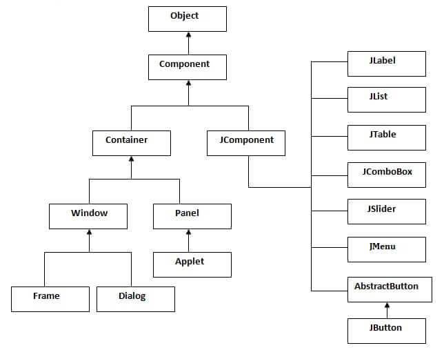

# Componentes básicos de Swing

- [Componentes básicos de Swing](#componentes-básicos-de-swing)
  - [1. Los componentes principales de Swing](#1-los-componentes-principales-de-swing)
  - [2. Componentes básicos](#2-componentes-básicos)
    - [**2.1 JLabel (Etiqueta)**](#21-jlabel-etiqueta)
    - [**2.2 JButton (Botón)**](#22-jbutton-botón)
    - [**2.3 JTextField (Campo de texto)**](#23-jtextfield-campo-de-texto)
    - [**2.4 JTextArea (Área de texto)**](#24-jtextarea-área-de-texto)
      - [**`Document` en Swing**](#document-en-swing)
  - [3. Componentes avanzados](#3-componentes-avanzados)
    - [**3.1 JRadioButton (Botón de opción)**](#31-jradiobutton-botón-de-opción)
    - [**3.2 JCheckBox (Botón de selección)**](#32-jcheckbox-botón-de-selección)
    - [**3.3 JComboBox (Menú desplegable)**](#33-jcombobox-menú-desplegable)
    - [**3.4 JList (Lista)**](#34-jlist-lista)
    - [**3.5 JTable (Tabla)**](#35-jtable-tabla)
  - [4. Uso de genéricos con los componentes de Swing](#4-uso-de-genéricos-con-los-componentes-de-swing)
  - [5. Modelos y `DefaultModel`](#5-modelos-y-defaultmodel)
    - [**5.1 DefaultComboBoxModel**](#51-defaultcomboboxmodel)
    - [**5.2 DefaultListModel**](#52-defaultlistmodel)
    - [**5.3 DefaultTableModel**](#53-defaulttablemodel)
  - [6. Actividad](#6-actividad)
  - [7. Ejercicios de refuerzo](#7-ejercicios-de-refuerzo)
    - [7.1 Ejercicio 1](#71-ejercicio-1)
    - [7.2 Ejercicio 2](#72-ejercicio-2)
    - [7.3 Ejercicio 3](#73-ejercicio-3)
    - [7.4 Ejercicio 4](#74-ejercicio-4)
    - [7.5 Ejercicio 5](#75-ejercicio-5)
    - [7.6 Ejercicio 6](#76-ejercicio-6)

## 1. Los componentes principales de Swing

8 horas

Los componentes principales de la librería Swing son los siguientes:

- **JLabel:** Muestra texto o imágenes estáticas.
- **JButton:** Un botón que realiza una acción al hacer clic.
- **JTextField:** Campo de texto de una sola línea.
- **JRadioButton:** Botón de opción para seleccionar una sola opción dentro de un grupo.
- **JComboBox:** Menú desplegable.
- **JList:** Lista de elementos seleccionables.
- **JTable:** Tabla para mostrar datos en filas y columnas.

En general, la API de Swing sigue esta jerarquía:


Además de estos, existen muchos otros componentes, cada uno de ellos con su propósito específico. Consúltalos en la [documentación oficial](https://docs.oracle.com/javase/7/docs/api/javax/swing/package-summary.html).

Los componentes tienen algunas propiedades y métodos comunes, entre las que destacan:

- **Tamaño y posición:** `setBounds(x, y, width, height)`.
- **Texto y contenido:** `setText(String texto)`, `addItem(T item)` (Donde T es un tipo de datos que podemos especificar o mantener como Object).
- **Eventos:** Usar `ActionListener` o `ItemListener`.

Para poner en la práctica el uso de los diferentes componentes, antes de explicarlos en detalle, vamos a crear una ventana que incluya:

- Un campo de texto para introducir el nombre.
- Un grupo de radio buttons para seleccionar género.
- Un combo box para elegir un país.
- Una lista de intereses.
- Una tabla para mostrar la información ingresada.

Así quedaría el código en Java:

```java
import javax.swing.*;
import javax.swing.table.DefaultTableModel;

public class ComponentesBasicos extends JFrame {

    public ComponentesBasicos() {

        setTitle("Componentes Básicos en Swing");
        setSize(500, 400);
        setDefaultCloseOperation(EXIT_ON_CLOSE);
        setLayout(null);
        /*
        Etiqueta "Nombre" y campo de texto para que el usuario pueda ingresar su nombre.
        Usamos setBounds() para definir la posición y tamaño del componente.
        */
        JLabel nombreLabel = new JLabel("Nombre:");
        nombreLabel.setBounds(20, 20, 80, 30);
        add(nombreLabel);

        JTextField nombreField = new JTextField();
        nombreField.setBounds(100, 20, 200, 30);
        add(nombreField);

        /*
        Etiqueta y grupo de botones de opción (radio buttons) para seleccionar el género.
        Creamos un grupo (ButtonGroup) para que solo uno de los botones pueda ser seleccionado a la vez.
        */
        JLabel generoLabel = new JLabel("Género:");
        generoLabel.setBounds(20, 60, 80, 30);
        add(generoLabel);

        JRadioButton masculino = new JRadioButton("Masculino");
        masculino.setBounds(100, 60, 100, 30);
        JRadioButton femenino = new JRadioButton("Femenino");
        femenino.setBounds(200, 60, 100, 30);

        /*
        Agrupamos los botones de género para que sean mutuamente exclusivos.
        */
        ButtonGroup generoGroup = new ButtonGroup();
        generoGroup.add(masculino);
        generoGroup.add(femenino);

        add(masculino);
        add(femenino);

        /*
        Etiqueta y cuadro desplegable (JComboBox) para seleccionar un país.
        El JComboBox se inicializa con una lista de opciones.
        */
        JLabel paisLabel = new JLabel("País:");
        paisLabel.setBounds(20, 100, 80, 30);
        add(paisLabel);

        JComboBox<String> paisCombo = new JComboBox<>(new String[]{"España", "Portugal", "Francia", "Andorra", "Italia", "Marruecos", "Argelia", "Túnez"});
        paisCombo.setBounds(100, 100, 200, 30);
        add(paisCombo);

        /*
        Etiqueta y lista de opciones (JList) para seleccionar intereses.
        En este caso, permitimos que el usuario seleccione varios intereses.
        */
        JLabel interesesLabel = new JLabel("Intereses:");
        interesesLabel.setBounds(20, 140, 80, 30);
        add(interesesLabel);

        JList<String> interesesList = new JList<>(new String[]{"Deportes", "Música", "Lectura", "Viajes"});
        interesesList.setBounds(100, 140, 200, 60);
        interesesList.setSelectionMode(ListSelectionModel.MULTIPLE_INTERVAL_SELECTION); // Permite seleccionar múltiples elementos.
        add(interesesList);

        /*
        Botón "Mostrar" que recogerá los datos introducidos en los componentes anteriores y los mostrará en una tabla.
        */
        JButton mostrarButton = new JButton("Mostrar");
        mostrarButton.setBounds(20, 220, 100, 30);
        add(mostrarButton);

        /*
        Tabla para mostrar los datos recopilados. La tabla utiliza un modelo de datos (DefaultTableModel)
        que nos facilita la gestión de filas y columnas. Creamos un JScrollPane para que la tabla tenga
        barra de desplazamiento en caso de ser necesario.
        */
        String[] columnas = {"Nombre", "Género", "País", "Intereses"};
        JTable tabla = new JTable();
        DefaultTableModel model = new DefaultTableModel();

        /*
        Añadimos las columnas al modelo de la tabla.
        */
        for (String columna : columnas) {
            model.addColumn(columna);
        }
        tabla.setModel(model);

        JScrollPane scrollPane = new JScrollPane(tabla); // La tabla se agrega al JScrollPane.
        scrollPane.setBounds(20, 260, 450, 100);
        add(scrollPane);

        /*
        Definimos la acción del botón "Mostrar". Cuando el botón sea pulsado, recogeremos los valores de
        los componentes (campo de texto, botones, comboBox y lista), los formatearemos y los añadiremos
        como una nueva fila a la tabla.
        */
        mostrarButton.addActionListener(e -> {
            String nombre = nombreField.getText().trim();
            String genero = masculino.isSelected() ? "Masculino" : femenino.isSelected() ? "Femenino" : "No especificado";
            String pais = (String) paisCombo.getSelectedItem();
            String intereses = String.join(", ", interesesList.getSelectedValuesList());

            /*
            Validamos si el nombre está vacío para evitar filas incompletas. Si está vacío, muestra un
            aviso en una ventana modal (un diálogo). Si no, añade la fila.
            */
            if (nombre.isEmpty()) {
                JOptionPane.showMessageDialog(this, "Por favor, ingresa un nombre.", "Error", JOptionPane.ERROR_MESSAGE);
            }else {
                model.addRow(new Object[]{nombre, genero, pais, intereses});
            }
        });
    }

    public static void main(String[] args) {
        SwingUtilities.invokeLater(() -> {
            ComponentesBasicos ventana = new ComponentesBasicos();
            ventana.setVisible(true);
        });
    }
}

```

Con este código empleamos todos los componentes básicos de Swing, y nos sirve para comprender cómo funcionan. A continuación, los desgranamos uno a uno.

## 2. Componentes básicos

### **2.1 JLabel (Etiqueta)**

`JLabel` se usa para mostrar texto o imágenes estáticas. No puede recibir interacción del usuario. Sus propiedades y métodos más comunes son:

- `setText(String texto)`: Cambia el texto mostrado.
- `setIcon(Icon icono)`: Muestra una imagen.
- `setHorizontalAlignment(int align)`: Alinea el contenido horizontalmente (`SwingConstants.LEFT`, `CENTER`, `RIGHT`).
- `setForeground(Color color)`: Cambia el color del texto.
- `setFont(Font fuente)`: Cambia la fuente del texto.

```java
JLabel etiqueta = new JLabel("¡Hola, Swing!");
etiqueta.setBounds(20, 20, 200, 30);
etiqueta.setForeground(Color.BLUE);
etiqueta.setFont(new Font("Arial", Font.BOLD, 16));
```

### **2.2 JButton (Botón)**

`JButton` es un botón que realiza una acción cuando el usuario hace clic. Aparte de las propiedades de las etiquetas, cuenta con las siguientes:

- `setEnabled(boolean estado)`: Activa/desactiva el botón.
- `addActionListener(ActionListener listener)`: Detecta el clic.

El evento más común es el clic, manejado con un `ActionListener`.

```java
JButton boton = new JButton("Aceptar");
boton.setBounds(50, 50, 100, 30);
boton.setBackground(Color.GREEN);
boton.setForeground(Color.WHITE);
boton.addActionListener(e -> System.out.println("¡Botón presionado!"));
```

### **2.3 JTextField (Campo de texto)**

`JTextField` permite al usuario ingresar texto en una sola línea. Sus propiedades y métodos más habituales son:

- `setText(String texto)`: Establece el texto inicial.
- `getText()`: Recupera el texto ingresado.
- `setEditable(boolean estado)`: Define si se puede editar.
- `setColumns(int columnas)`: Define el ancho en términos de caracteres (usado en Layouts).
- `setToolTipText(String texto)`: Muestra una descripción emergente.

Como alternativa a JTextField podemos usar JTextArea, que en lugar de una línea recoge un espacio más grande de texto.

### **2.4 JTextArea (Área de texto)**

`JTextArea` es un componente de Swing que permite la entrada y edición de múltiples líneas de texto. Es ideal para capturar grandes cantidades de texto o mostrar información extensa en una interfaz gráfica.

- **`setText(String texto)`**: Establece el texto inicial.
- **`getText()`**: Recupera el texto ingresado.
- **`setEditable(boolean estado)`**: Define si el área de texto es editable.
- **`setRows(int filas)`**: Establece el número de filas visibles.
- **`setColumns(int columnas)`**: Establece el número de columnas visibles.
- **`append(String texto)`**: Añade texto al final del área existente.
- **`setLineWrap(boolean estado)`**: Define si las líneas de texto se ajustan automáticamente al ancho del área.
- **`setWrapStyleWord(boolean estado)`**: Ajusta el texto al borde de la palabra completa (en lugar de cortar palabras).
- El salto automático de línea es útil para evitar que el texto se salga de los límites del componente. Esto se logra mediante los métodos `setLineWrap(true)` y `setWrapStyleWord(true)`.

```java
import javax.swing.*;
import java.awt.*;

public class JTextAreaDemo {
    public static void main(String[] args) {
        JFrame frame = new JFrame("Ejemplo de JTextArea");
        frame.setDefaultCloseOperation(JFrame.EXIT_ON_CLOSE);
        frame.setSize(400, 300);
        frame.setLayout(new BorderLayout());

        // Crear JTextArea
        JTextArea textArea = new JTextArea();
        textArea.setRows(10);
        textArea.setColumns(30);
        textArea.setLineWrap(true); // Activar salto de línea automático
        textArea.setWrapStyleWord(true); // Ajustar por palabra completa
        textArea.setToolTipText("Escribe texto aquí");

        // Añadir JScrollPane para soporte de scroll
        JScrollPane scrollPane = new JScrollPane(textArea);
        frame.add(scrollPane, BorderLayout.CENTER);

        // Mostrar ventana
        frame.setVisible(true);
    }
}
```

1. **Conexión con `Document`:** Al igual que con `JTextField`, puedes escuchar cambios en el texto utilizando un `DocumentListener`. Esto permite validar el texto en tiempo real.
2. **Usar JScrollPane:** Para textos largos, se recomienda encapsular el `JTextArea` dentro de un `JScrollPane`, como se muestra en el ejemplo.

Este ejemplo muestra cómo implementar un área de texto que ajusta automáticamente las líneas y permite desplazarse cómodamente cuando el texto excede el área visible.

#### **`Document` en Swing**

En Swing, la clase `Document` representa el modelo subyacente de texto para componentes como `JTextField` o `JTextArea`. Es particularmente útil cuando necesitas manejar o interceptar cambios en el texto. Usaremos `Document` en los siguientes casos:

- Para validar o procesar el texto en tiempo real (por ejemplo, validación de entrada o autocompletado).
- Para mantener sincronizados los datos entre varios componentes.

Para detectar los cambios en un JTextField o JTextArea, tenemos que obtener el documento del campo y añadirle un objeto que implemente la interfaz `DocumentListener`. Si usamos IntelliJ, nos añadirá los métodos que debemos sobreescribir para que funcione.

```java
JTextField nombreField = new JTextField();
        nombreField.setBounds(100, 20, 200, 30);
        nombreField.setToolTipText("Introduce tu nombre aquí");

        nombreField.getDocument().addDocumentListener(new DocumentListener() {
            @Override
            public void insertUpdate(DocumentEvent e) {
                System.out.println("inserto");
            }

            @Override
            public void removeUpdate(DocumentEvent e) {
                System.out.println("borro");
            }

            @Override
            public void changedUpdate(DocumentEvent e) {
                System.out.println("Cambio");
            }
        });
        add(nombreField);

```

## 3. Componentes avanzados

### **3.1 JRadioButton (Botón de opción)**

`JRadioButton` permite elegir una opción entre varias. Para agruparlos, se usa `ButtonGroup`. Las propiedades y métodos más comunes son:

- `setText(String texto)`: Define el texto del botón.
- `isSelected()`: Retorna si el botón está seleccionado.
- `setEnabled(boolean estado)`: Activa o desactiva el botón.

Podemos detectar un cambio en la selección del botón con un `ItemListener`.

```java
JRadioButton masculino = new JRadioButton("Masculino");
masculino.setBounds(50, 150, 100, 30);

JRadioButton femenino = new JRadioButton("Femenino");
femenino.setBounds(150, 150, 100, 30);

ButtonGroup generoGroup = new ButtonGroup();
generoGroup.add(masculino);
generoGroup.add(femenino);
masculino.addItemListener(e->{
    if (masculino.isSelected()) System.out.println("Masculino");
});
femenino.addItemListener(e->{
    if(femenino.isSelected()) System.out.println("Femenino");
});
add(masculino);
add(femenino);
```

### **3.2 JCheckBox (Botón de selección)**

`JCheckBox` permite seleccionar una opción con una casilla de verificado. Aunque no es habitual. Aunque `JCheckBox` normalmente permite múltiples selecciones, puedes agruparlos en un **`ButtonGroup`** si quieres que el usuario seleccione solo una opción. Sin embargo, para opciones exclusivas se recomienda usar `JRadioButton`. Las propiedades y métodos más comunes son:

- Un **`JCheckBox`** puede estar en uno de los dos estados: seleccionado (`true`) o no seleccionado (`false`).
- Permite asociar un **evento de acción** para realizar acciones cuando el usuario cambia su estado.
- Puede incluir un texto o ícono asociado.
- Es posible agrupar varios `JCheckBox` para permitir múltiples selecciones independientes.
- **`setSelected(boolean estado)`**: Selecciona (`true`) o deselecciona (`false`) la casilla.
- **`isSelected()`**: Retorna el estado actual (`true` si está seleccionado).
- **`setText(String texto)`**: Establece el texto asociado a la casilla.
- **`addActionListener(ActionListener l)`**: Permite capturar eventos cuando cambia el estado de la casilla.

```java
import javax.swing.*;
import java.awt.event.ActionEvent;
import java.awt.event.ActionListener;

public class JCheckBoxDemo {
    public static void main(String[] args) {
        // Crear la ventana
        JFrame frame = new JFrame("Ejemplo de JCheckBox");
        frame.setDefaultCloseOperation(JFrame.EXIT_ON_CLOSE);
        frame.setSize(300, 200);
        frame.setLayout(null); // Usar diseño nulo para posicionamiento manual

        // Crear un JCheckBox
        JCheckBox checkBox = new JCheckBox("Aceptar términos y condiciones");
        checkBox.setBounds(50, 50, 200, 30);

        // Añadir un ActionListener para capturar eventos
        checkBox.addActionListener(new ActionListener() {
            @Override
            public void actionPerformed(ActionEvent e) {
                if (checkBox.isSelected()) {
                    System.out.println("Seleccionado");
                } else {
                    System.out.println("Deseleccionado");
                }
            }
        });

        // Añadir el JCheckBox a la ventana
        frame.add(checkBox);
        frame.setVisible(true);
    }
}
```

```java
import javax.swing.*;
import java.awt.event.ActionEvent;
import java.awt.event.ActionListener;

public class MultiCheckBoxDemo {
    public static void main(String[] args) {
        // Crear ventana
        JFrame frame = new JFrame("Ejemplo con varios JCheckBox");
        frame.setDefaultCloseOperation(JFrame.EXIT_ON_CLOSE);
        frame.setSize(300, 200);
        frame.setLayout(null);

        // Crear varios JCheckBox
        JCheckBox opcion1 = new JCheckBox("Opción 1");
        opcion1.setBounds(50, 30, 100, 30);

        JCheckBox opcion2 = new JCheckBox("Opción 2");
        opcion2.setBounds(50, 60, 100, 30);

        JCheckBox opcion3 = new JCheckBox("Opción 3");
        opcion3.setBounds(50, 90, 100, 30);

        // Añadir ActionListener para capturar eventos
        opcion1.addActionListener(e -> System.out.println("Opción 1: " + opcion1.isSelected()));
        opcion2.addActionListener(e -> System.out.println("Opción 2: " + opcion2.isSelected()));
        opcion3.addActionListener(e -> System.out.println("Opción 3: " + opcion3.isSelected()));

        // Añadir JCheckBox a la ventana
        frame.add(opcion1);
        frame.add(opcion2);
        frame.add(opcion3);

        frame.setVisible(true);
    }
}
```


### **3.3 JComboBox (Menú desplegable)**

`JComboBox` permite al usuario seleccionar una opción de un menú desplegable. Admite genéricos. Sus propiedades y métodos más comunes son:

- `addItem(T item)`: Añade un elemento al menú.
- `getSelectedItem()`: Obtiene el elemento seleccionado.
- `removeItem(T item)`: Elimina un elemento.
- `setEditable(boolean estado)`: Define si el usuario puede escribir en el campo.

Como sucede con el RadioButton, podemos detectar un cambio en la selección con un `ActionListener` o `ItemListener`.

```java
JComboBox<String> comboBox = new JComboBox<>(new String[]{"Opción 1", "Opción 2", "Opción 3"});
comboBox.setBounds(50, 200, 150, 30);
comboBox.addActionListener(e -> System.out.println("Seleccionado: " + comboBox.getSelectedItem()));
```

### **3.4 JList (Lista)**

`JList` permite mostrar una lista de elementos y seleccionar uno o varios. Como sucede con el comboBox, admite genéricos. Sus propiedades y métodos más comunes son:

- `setListData(T[] datos)`: Establece los elementos de la lista.
- `getSelectedValuesList()`: Retorna los elementos seleccionados.
- `setSelectionMode(int modo)`: Define si se pueden seleccionar uno o varios elementos (`SINGLE_SELECTION`, `MULTIPLE_INTERVAL_SELECTION`).

Permite detectar la selección de uno o más elementos con un `ListSelectionListener`.

```java
JList<String> lista = new JList<>(new String[]{"Elemento 1", "Elemento 2", "Elemento 3"});
lista.setBounds(50, 250, 150, 60);
lista.setSelectionMode(ListSelectionModel.MULTIPLE_INTERVAL_SELECTION);
lista.addListSelectionListener(e->System.out.println("Elemento seleccionado"));
```

### **3.5 JTable (Tabla)**

`JTable` muestra datos en filas y columnas. Sus propiedades más usadas son:

- `setValueAt(Object value, int row, int column)`: Cambia el valor de una celda.
- `getValueAt(int row, int column)`: Obtiene el valor de una celda.
- `setEnabled(boolean estado)`: Permite o no editar celdas.
- `setRowHeight(int altura)`: Define la altura de las filas.

Comparte el ListSelectionListener de las listas.

```java
String[] columnas = {"Columna 1", "Columna 2"};
Object[][] datos = {
    {"Dato 1", "Dato 2"},
    {"Dato 3", "Dato 4"}
};
JTable tabla = new JTable(datos, columnas);
tabla.setBounds(50, 330, 300, 80);
```

## 4. Uso de genéricos con los componentes de Swing

Swing permite el uso de genéricos en ciertos componentes como `JComboBox` y `JList`, lo que garantiza la seguridad de tipos en tiempo de compilación. Esto reduce la necesidad de realizar conversiones explícitas y previene errores comunes.

Por ejemplo, en lugar de usar un `JComboBox` sin especificar el tipo de datos:

```java
JComboBox comboBox = new JComboBox();
comboBox.addItem("Opción 1");
```

Es preferible usar genéricos para indicar que manejará `String`:

```java
JComboBox<String> comboBox = new JComboBox<>(new String[]{"Opción 1", "Opción 2"});
comboBox.addItem("Opción 3"); // Ahora solo permite añadir Strings.
```

Esto aplica también a `JList`:

```java
JList<String> lista = new JList<>(new String[]{"Elemento 1", "Elemento 2"});
```

No es obligatorio usar genéricos, podemos usar `Object` ya que en Java todas las clases heredan de esta. Sin embargo, nos va a venir bien para tener más pulcro el código o para usar funcionalidades específicas de determinados tipos de datos.

## 5. Modelos y `DefaultModel`

En Swing, los componentes como `JTable`, `JList` y `JComboBox` separan los datos (modelo) de la vista (componente visual). Esto permite actualizar los datos dinámicamente sin alterar la interfaz gráfica directamente.

### **5.1 DefaultComboBoxModel**

De manera similar, `DefaultComboBoxModel` facilita la gestión de datos dinámicos en un `JComboBox`:

```java
DefaultComboBoxModel<String> comboBoxModel = new DefaultComboBoxModel<>();
comboBoxModel.addElement("Elemento 1");
comboBoxModel.addElement("Elemento 2");

JComboBox<String> comboBox = new JComboBox<>(comboBoxModel);

```

### **5.2 DefaultListModel**

`DefaultListModel` se utiliza con `JList` para gestionar listas dinámicas:

```java
DefaultListModel<String> listModel = new DefaultListModel<>();
listModel.addElement("Opción 1");
listModel.addElement("Opción 2");

JList<String> lista = new JList<>(listModel);
```

### **5.3 DefaultTableModel**

`DefaultTableModel` se utiliza con `JTable` para gestionar datos tabulares. Te permite añadir, eliminar y actualizar filas o columnas dinámicamente:

```java
String[] columnas = {"Nombre", "Edad"};
DefaultTableModel modelo = new DefaultTableModel(columnas, 0); // Sin filas iniciales

// Añadir filas
modelo.addRow(new Object[]{"Juan", 25});
modelo.addRow(new Object[]{"María", 30});

// Asignar el modelo a una tabla
JTable tabla = new JTable(modelo);
```

Si necesitáramos un control más avanzado sobre la manipulación de datos o un comportamiento específico, podríamos crear un modelo personalizado implementando las interfaces correspondientes (por ejemplo, `TableModel`).

## 6. Actividad

> DISEÑO DE UNA VISTA de la aplicación de gestión de turnos de un hospital

## 7. Ejercicios de refuerzo

### 7.1 Ejercicio 1

Crea una interfaz gráfica usando Swing que contenga dos JTextArea. Lo que escribamos en una se debe de copiar en la otra. Añade una etiqueta que cuente el número de caracteres cada vez que se haga algún cambio.

### 7.2 Ejercicio 2

Haz un formulario en el que tengas los siguientes apartados:

- Un texfield con tu nombre.
- Un radioButton con las opciones `masculino`, `femenino` y `no especificado`. Selecciona `no especificado` por defecto.
- Una etiqueta que ponga "Matriculado en:"
- Un checkbox con las asignaturas de primer curso (PROG, EDE, SIN, ING, IPE, LMGSI, BD, PYI)
- Un botón que al pulsarlo haga aparecer un diálogo con la información seleccionada de la siguiente forma:
  - "Hola [nombre], tu sexo es [sexo] y te has matriculado en [lo que te hayas matriculado, separado por comas]".

### 7.3 Ejercicio 3

Completa el ejercicio anterior con un Combobox en el que puedas elegir un curso (por ejemplo, "2024-2025"), una lista donde puedas elegir tus estudios previos ("Ciclo formativo medio", "Ciclo formativo superior", "Bachillerato", "Carrera universitaria", "Master universitario") y visualiza toda la información en la tabla en lugar de usar un JDialog. Se debe quedar algo similar al primer ejemplo, pero con otras características.

### 7.4 Ejercicio 4

Cambia el ejercicio 3 y emplea genéricos siempre que puedas.

### 7.5 Ejercicio 5

Crea una interfaz gráfica en la cual tengamos un TextField, un TextArea, un ComboBox y varios botones. Su función será almacenar conceptos y sus respectivas descripciones, pudiendo consultarlas seleccionando la opción adecuada en el ComboBox. Añade un botón Añadir que haga lo siguiente:

- Cada vez que se le pulse, si el TextField y el TextArea están rellenados, añade en un `HashMap<String, String>` el texto del TextField como clave y el del TextArea como valor.
- Cada vez que eso sucede, se actualiza el modelo del Combobox añadiendo un elemento nuevo al combo, que será la clave. En general, las opciones del combobox deben equivaler a las claves del mapa.
- Cuando seleccionamos una opción en el combobox, se deben rellenar el TextField y el TextArea con sus valores correspondientes.
- Crea dos botones más, Actualizar y Borrar. Solo se pueden pulsar si hay un combobox seleccionado. Si pulsamos Actualizar, se elimina el elemento del mapa y se reemplaza por el que esté escrito en ese momento. Si pulsamos Borrar, se elimina el elemento del mapa y se limpian los campos del programa.
- Al pulsar cualquier botón, la seleccion del combobox se debe borrar. En el caso del botón Añadir, la clave del nuevo par debe ser lo que se quede seleccionado.

### 7.6 Ejercicio 6

Crea una interfaz gráfica con un TextField y tres RadioButton con los valores "Rojo, Verde, Azul". Añade un Label. En el label indicaremos el color del fondo.

En el TextField podemos escribir números entre el 0 y el 255. Cuando pongamos un número, cambiará el parámetro RGB del color que esté seleccionado en el RadioButton (por defecto, Rojo). Ese color se aplicará al fondo y se verá en la etiqueta.

Añade otro textfield, un botón y una tabla. Al pulsar el botón, guardaremos el contenido del textfield como nombre del color, y sus valores RGB (uno por cada columna) en la tabla.

Al hacer click en el nombre de un color, cambiaremos el fondo a ese color.