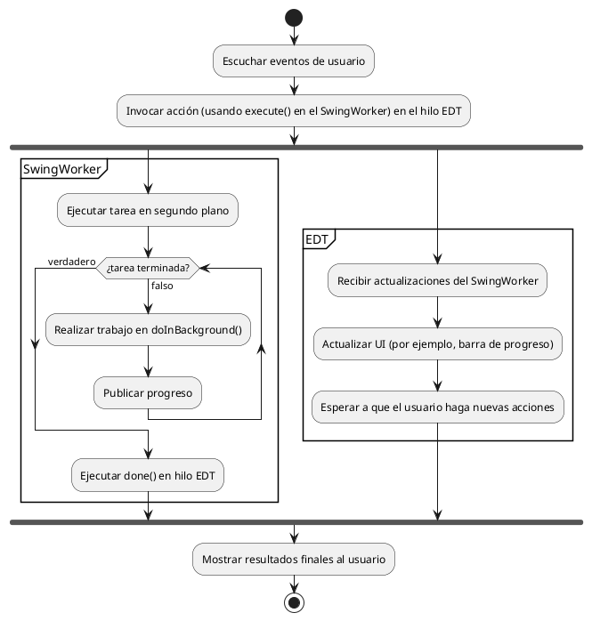

# Concurrencia y gráficos personalizados en Java Swing
- [Concurrencia y gráficos personalizados en Java Swing](#concurrencia-y-gráficos-personalizados-en-java-swing)
  - [**1. Gestión de Concurrencia en Swing**](#1-gestión-de-concurrencia-en-swing)
    - [1.1 La clase `SwingWorker`](#11-la-clase-swingworker)
    - [1.3 Sincronización. Uso de la palabra clave synchronized](#13-sincronización-uso-de-la-palabra-clave-synchronized)
    - [1.4 Sincronización. Bloques de código sincronizados](#14-sincronización-bloques-de-código-sincronizados)
  - [**2. Gráficos y Visualizaciones**](#2-gráficos-y-visualizaciones)
    - [**2.1 Dibujar Gráficos Personalizados con `Graphics2D`**](#21-dibujar-gráficos-personalizados-con-graphics2d)
  - [3. Actividad](#3-actividad)
  - [4. Ejercicios de refuerzo](#4-ejercicios-de-refuerzo)
    - [4.1 Ejercicio 1](#41-ejercicio-1)
    - [4.2 Ejercicio 2](#42-ejercicio-2)
    - [4.3 Ejercicio 3](#43-ejercicio-3)
    - [4.4 Ejercicio 4](#44-ejercicio-4)

## **1. Gestión de Concurrencia en Swing**

10 horas

Swing utiliza un solo hilo para actualizar la interfaz gráfica: el **Event Dispatch Thread (EDT)**. Si ejecutamos tareas pesadas (como cálculos intensivos o consultas a bases de datos) en este hilo, la interfaz se bloqueará. Para evitar esto, usamos `SwingWorker`.

### 1.1 La clase `SwingWorker`

`SwingWorker` es una clase que permite ejecutar tareas en segundo plano sin bloquear la interfaz gráfica. Tiene dos métodos clave:

1. **`doInBackground()`**, donde definimosla tarea en segundo plano.
2. **`done()`**, que se ejecuta al terminar la tarea, normalmente para actualizar la interfaz gráfica.

El flujo de actividad de un SwingWorker con respecto al EDT es así:



A continuación, vamos a ver un código en el que simulamos una tarea que actualiza una barra de progreso:

```java
import javax.swing.*;
import java.awt.*;

public class BarraDeProgreso extends JFrame {
    private JProgressBar barraProgreso;

    public BarraDeProgreso() {
        setTitle("Concurrencia con SwingWorker");
        setSize(400, 150);
        setDefaultCloseOperation(EXIT_ON_CLOSE);
        setLayout(new BorderLayout());

        /* 
        Código para crear una barra de progreso, que es otro componente de Swing.
        */
        barraProgreso = new JProgressBar(0, 100);
        barraProgreso.setStringPainted(true);
        add(barraProgreso, BorderLayout.CENTER);

        /* Botón para iniciar la tarea. La clase TareaLarga hereda de SwingWorker y la vemos más adelante. El método execute() es el que hace que se cree un hilo en el que la tarea va haciendo cosas, mientras el proceso principal sigue trabajando de forma independiente. 
        */
        JButton iniciarButton = new JButton("Iniciar");
        iniciarButton.addActionListener(e -> {
            TareaLarga tarea = new TareaLarga();
            tarea.execute();
        });
        add(iniciarButton, BorderLayout.SOUTH);
    }

    /*
    Esta clase privada es la que se encarga de manejar la tarea pesada. Esta tarea podría ser la descarga de un archivo, la consulta a una base de datos o cualquier cosa susceptible de bloquear nuestra interfaz. Al crear un SwingWorker, debemos indicarle dos tipos que tiene genéricos. El primero representa lo que devuelve el método doInBackground y el segundo lo que devuelve el método publish. Los resultados del método publish son procesados en el método process.
    */
    private class TareaLarga extends SwingWorker<Void, Integer> {
        /*
        La función doInBackground devuelve Void (de ahí el return null del final) y simula un trabajo pesado haciendo dormir al hilo 50 milisegundos y luego publicando un número del 0 al 99.
        */
        @Override
        protected Void doInBackground() throws Exception {
            for (int i = 0; i <= 100; i++) {
                Thread.sleep(50); 
                publish(i);
            }
            return null;
        }
        /*
        El método process se procesa dentro del EDT y recibe como parámetro la lista de los valores publicados. En lugar de usar List, utilizamos java.util.List porque la librería java.awt.* tiene su propia interfaz List, que no queremos usar. De esta forma, evitamos la ambigüedad.
        El parámetro se llama chunks, que significa "trozos". Cogemos el último de los trozos y le damos a la barra de progreso el valor de ese trozo. En este caso, los trozos son simplemente números del 0 al 99 en orden ascendente.
        */
        @Override
        protected void process(java.util.List<Integer> chunks) {
            // Actualiza la barra de progreso
            int progreso = chunks.get(chunks.size() - 1);
            barraProgreso.setValue(progreso);
        }
        /*
        Cuando la función doInBackground() llega al final se ejecuta la función done(), que en este caso simplemente abre una ventana modal con un aviso.
        */
        @Override
        protected void done() {
            JOptionPane.showMessageDialog(null, "Tarea completada");
        }
    }

    public static void main(String[] args) {
        SwingUtilities.invokeLater(() -> {
            BarraDeProgreso ventana = new BarraDeProgreso();
            ventana.setVisible(true);
        });
    }
}
```

En definitiva, ten en cuenta las siguientes cosas:

1. **No bloquees el EDT**: Nunca realices tareas pesadas directamente en los manejadores de eventos, ya que podrían congelar el programa. Usa `SwingWorker` para ello.
2. **Usa `SwingUtilities.invokeLater()`**: Para actualizar la interfaz desde otros hilos. La interfaz se actualizará cuando el EDT disponga de tiempo (si no lo haces así, se bloqueará hasta que se haya actualizado).

### 1.3 Sincronización. Uso de la palabra clave synchronized

En ocasiones, cuando usamos la concurrencia dos hilos distintos pueden tratar de acceder al mismo recurso simultáneamente. Si tenemos el siguiente método:

```java
public class Contador {
    private int contador = 0;

    public void incrementar() {
            contador++;
    }
}
```

Al acceder dos hilos al método incremento al mismo tiempo, ambos hilos podrían leer el valor del contador antes de que uno de ellos lo actualice. Ambos hilos sumarían 1 al contador de forma independiente, pero el valor final solo se incrementaría en 1, en lugar de 2, como sería esperado.

Esto se debe a que los dos hilos "interfieren" entre sí, provocando que se pierda la actualización de uno de los hilos. A esto se lo conoce como **condición de carrera**. Para evitarlo, usamos la palabra clave synchronized antes del método:

```java
public class Contador {
    private int contador = 0;

    public synchronized void incrementar() {
            contador++;
    }
}
```

Un método `synchronized` solamente puede ser accedido por un hilo a la vez, mientras que los demás se quedan a la cola esperando su turno. Siempre que necesites que varios hilos accedan a la vez a un recurso, debes usar algún método de sincronización como este. Sin embargo, `synchronized` resta eficiencia al programa, por lo que no debes usarlo a la ligera.

Llamamos **bloque crítico** a la parte del código susceptible de ser accedido de forma concurrente y que necesita un control de acceso sincronizado.

### 1.4 Sincronización. Bloques de código sincronizados

Otra forma de sincronizar el código es a través de bloques de código sincronizado a través de un objeto específico:

```java
synchronized (objeto) {
    // Código que necesita ser ejecutado de manera exclusiva por un hilo a la vez
}
```

En este caso, tenemos los siguientes componentes:

1. **`synchronized`**: Es una palabra clave que asegura la exclusividad del acceso.
2. **`objeto`**: Es el monitor o bloqueo (mutex) que se utiliza para controlar el acceso. Puede ser cualquier objeto, pero típicamente es un objeto compartido o la instancia de la propia clase (`this`).
3. **Código dentro del bloque**: El bloque de código dentro de `synchronized` será ejecutado por un solo hilo a la vez mientras los demás hilos esperan a que se libere el monitor.

Por ejemplo, la clase contador de antes con esta técnica quedaría de la siguiente manera:

```java
public class Contador {
    private int contador = 0;

    public void incrementar() {
        synchronized (this) { // El monitor es el objeto actual (this)
            contador++;
        }
    }
}
```

Aparte del propio objeto de la clase, podemos usar objetos específicos (candados) que funcionen para el bloqueo:

```java
public class EjemploSincronizado {
    private final Object lock = new Object(); // Objeto para sincronización

    public void metodoSincronizado() {
        synchronized (lock) {
            // Bloque crítico
            System.out.println("Acceso exclusivo al bloque sincronizado.");
        }
    }
}
```

Aquí, la sincronización está vinculada al objeto `lock`, lo que permite más flexibilidad que sincronizar con `this`. Solo los hilos que intenten ejecutar bloques sincronizados con el mismo monitor (`lock`) estarán bloqueados entre sí.

Si comparamos el método de usar funciones sincronizadas frente a los bloques de código sincronizados, vemos que los bloques de código otorgan las siguientes ventajas:

1. **Mayor control**: Puedes sincronizar solo una parte del código crítico en lugar de todo el método.
2. **Mejor rendimiento**: Reducir la sección de código sincronizado minimiza el impacto en el rendimiento, ya que menos tiempo se pasa bloqueando el monitor.

Sin embargo, pueden ser más complejos a la hora del diseño. La sincronización debe ser tratada con cuidado porque merma el rendimiento del programa y puede provocar bloqueos si se diseña de forma errónea.

## **2. Gráficos y Visualizaciones**

Para emplear gráficos en nuestras aplicaciones de Swing, podemos usar bibliotecas externas como **JFreeChart** o componentes personalizados en Swing.

### **2.1 Dibujar Gráficos Personalizados con `Graphics2D`**

Podemos usar la clase `Graphics2D` para dibujar gráficos en Swing. Veamos un ejemplo de gráfico de barras:

```java
import javax.swing.*;
import java.awt.*;

public class GraficoBarras extends JPanel {
    /*
    En primer lugar, preparamos los datos que vamos a representar y sus etiquetas
    */
    private int[] valores = {50, 80, 40, 90, 60};
    private String[] etiquetas = {"A", "B", "C", "D", "E"};
    /*
    Después, sobreescribimos el método paintComponent, que recibe unos gráficos como parámetro.
    En esta función, vamos llamar a la función base paintComponent y luego vamos a añadirle un comportamiento nuevo, por lo que más que sobreescribir, lo que estamos haciendo es técnicamente ampliar el método.
    Lo que hacemos es castear los gráficos como Graphics2D. Después hacemos los cálculos necesarios para representar cada barra y, la pintamos de la siguiente manera.
    Primero pintamos la barra, eligiendo un color y rellenando un rectángulo en las posiciones apropiadas y del tamaño calculado.
    Después, dibujamos la etiqueta, que es un String.
    Repetimos esto por cada uno de los valores. Por supuesto, es necesario que valores y etiquetas tengan el mismo tamaño. Podríamos haber usado un Map<String, Integer> donde la clave hubiera sido la etiqueta y el valor el valor, valga la redundancia.
    */
    @Override
    protected void paintComponent(Graphics g) {
        super.paintComponent(g);
        Graphics2D g2 = (Graphics2D) g;

        int ancho = getWidth();
        int alto = getHeight();
        int margen = 40;
        int espacio = 10;

        // Calcular ancho de cada barra
        int anchoBarra = (ancho - 2 * margen - (valores.length - 1) * espacio) / valores.length;
        int maxValor = 100;

        for (int i = 0; i < valores.length; i++) {
            int alturaBarra = (valores[i] * (alto - 2 * margen)) / maxValor;

            // Dibujar barra
            int x = margen + i * (anchoBarra + espacio);
            int y = alto - margen - alturaBarra;
            g2.setColor(Color.BLUE);
            g2.fillRect(x, y, anchoBarra, alturaBarra);

            // Dibujar etiqueta
            g2.setColor(Color.BLACK);
            g2.drawString(etiquetas[i], x + anchoBarra / 4, alto - margen + 15);
        }
    }
/*
La ejecución de este ejemplo es un poco diferente a los otros porque la clase desde la que extiende GraficoBarras es JPanel y no JFrame como hasta ahora. Por lo tanto, lo que hacemos es crear un frame de forma manual y añadirle nuestro gráfico de barras.
*/
    public static void main(String[] args) {
        SwingUtilities.invokeLater(() -> {
            JFrame ventana = new JFrame("Gráfico de Barras");
            ventana.setDefaultCloseOperation(JFrame.EXIT_ON_CLOSE);
            ventana.setSize(500, 400);
            ventana.add(new GraficoBarras());
            ventana.setVisible(true);
        });
    }
}
```

Usando librerías externas, como *JFreeChart*, podemos conseguir resultados más profesionales. Sin embargo, estas librerías requieren una mayor configuración al no estar incluidas en el JDK de Java, por lo que no vamos a trabajarlas dentro de nuestro curso. Es más, en caso de requerir ese tipo de visualizaciones, podría ser más apropiado escribir nuestra interfaz directamente en JavaFX.

## 3. Actividad

> Conexión de las vistas y funcionalidades. Aplicación de la concurrencia en la lectura y escritura de datos.

## 4. Ejercicios de refuerzo

### 4.1 Ejercicio 1

Realiza una interfaz con un botón para cada mes. Cuando cliques el botón, se debe abrir una ventana modal con un gráfico de barras que represente la temperatura máxima del mes, la temperatura media del mes y la temperatura mínima del mes.

Sin embargo, este gráfico no se cargará de forma instantánea, sino que emplearás un SwingWorker para dibujarlo simulando una animación que tarde 2 segundos. Al usar SwingWorker, debes ser capaz de cerrar la ventana modal sin esperar a que haya terminado de dibujarse el gráfico de barras.

Puedes usar estos datos ficticios:

| Mes          | Temp. Media (°C) | Temp. Máxima (°C) | Temp. Mínima (°C) |
|--------------|------------------|-------------------|-------------------|
| Enero        | 6.5              | 12.0              | 1.0               |
| Febrero      | 7.0              | 13.0              | 2.0               |
| Marzo        | 10.5             | 17.0              | 4.0               |
| Abril        | 13.5             | 20.0              | 7.0               |
| Mayo         | 17.5             | 25.0              | 10.0              |
| Junio        | 22.0             | 30.0              | 14.0              |
| Julio        | 25.5             | 35.0              | 18.0              |
| Agosto       | 25.0             | 34.5              | 17.5              |
| Septiembre   | 21.0             | 30.0              | 14.0              |
| Octubre      | 16.5             | 24.0              | 9.0               |
| Noviembre    | 11.0             | 17.5              | 4.5               |
| Diciembre    | 7.5              | 13.0              | 2.5               |

### 4.2 Ejercicio 2

Realiza una interfaz similar a la del ejemplo, pero con varias barras de progreso. Al pulsar el botón, las barras se van a rellenar a una velocidad aleatoria (le pondremos a sleep un valor entre 10 y 50). Se tienen que cumplir estas dos condiciones:

1. El botón para iniciar la barra debe quedar deshabilitado hasta que todas las barras completen su progreso.
2. La ventana de `carga finalizada` solo debe aparecer cuando todas las barras hayan completado su progreso.

### 4.3 Ejercicio 3

Queremos una interfaz que tenga varias barras de progreso que podremos activar de forma manual. Al lado izquierdo de cada barra vamos a colorcar un textfield y una etiqueta que indique la velocidad. La velocidad es un número positivo y entero entre 10 y 50. Al introducir el número, si el valor es válido el color de letra debe ser verde, mientras que si no lo es debe ser rojo.

También añadiremos un botón `disparar`. El botón hará que su barra asociada empiece su progreso con la velocidad introducida, siempre y cuando el valor sea válido. Si el valor no es válido o no ha sido introducido, el botón debe estar desactivado.

Mientras una barra está lanzándose, podemos editar otra barra y lanzarla. Eso sí, las barras que estén activas no deben poder ser editadas hasta que no lleguen al final. Una vez lleguen al final, se deben reiniciar solas (progreso a 0 y vaciar el texfield).

Por último, añade una etiqueta en la parte inferior del programa que indique cuántas barras han llegado al final. Esto puede dar problemas de concurrencia si dos barras llegan al final al mismo tiempo, por lo que debes crear un método para editar el contador con la palabra clave `synchronized`, como el que sigue:

```java
public synchronized void incremento() {
        contador++;
    }
```

### 4.4 Ejercicio 4

Vamos a hacer una aplicación que mida nuestra velocidad para mecanografiar. La interfaz consta de una etiqueta desde la que mostraremos información, una barra de progreso, un botón para comenzar el juego y dos textarea, uno de ellos no será editable, mientras que la otra será editable solo a partir de cierto punto.

Al pulsar el botón, la etiqueta hará una cuenta atrás de tres segundos (3, 2, 1, YA) y en ese momento empezará la barra de carga, que durará 30 segundos. Mientras la carga esté activa, podremos usar uno de los textarea. En el otro, aparecerá un texto de tipo Lore Ipsum generado aleatoriamente (podemos precargarlos en la aplicación).

El usuario debe escribir el texto Lore Ipsum en el textarea de abajo. Al finalizar la barra, ya no se podrá escribir y en la etiqueta se mostrarán las siguientes estadísticas:

- Velocidad de tecleo (numero de caracteres escritos, incluyendo espacios, dividido entre el tiempo transcurrido -30 segundos-)
- Precisión de tecleo. Se comparará el texto original con el texto escrito por el usuario caracter a caracter y se dividirán los fallos entre el total de caracteres escrito por el usuario. Para hacerlo más bonito, se mostrará en porcentaje (multiplicado por 100).
